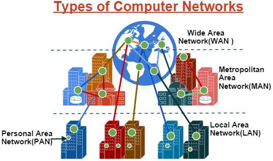

Computer networks are groups of hardware and software devices that are connected to share data, resources, and information. The main purpose of computer networks is to enable communication and collaboration between various devices, both locally (within a single physical location) and globally (over the Internet). Computer networks allow users to access data and services from other devices on the network, such as computers, servers, printers, and other devices.

## PAN ( Personal Area Network )

A Personal Area Network (PAN) is a computer network used for communication between computing devices (including phones and digital personal assistants) that are near one person. The devices may or may not belong to that person. The range of a PAN is usually a few tens of meters. A PAN can be used for communication between a person's own devices (intrapersonal communication), or to connect to a higher-level network and the Internet (an uplink).

Advantages of PAN networks:

1. Network maintenance is relatively easy.
2. Various errors and faults in the network can be detected easily and quickly.
3. It does not require many additional costs.
4. It supports various smart devices today, such as smartphones, headsets, and so on.

Disadvantages of PAN networks:

1. It cannot be applied to large-scale networks.
2. It can only connect a few devices and cannot support many devices at once.
3. Its coverage area is quite limited, only able to reach a few meters.

Uses of a Personal Area Network

1. Connecting computer devices.
2. Serving as a communication medium between one’s own devices (personal communication).

Examples of PAN usage

1. Connecting a phone with a laptop using Bluetooth.
2. Connecting a mouse with a laptop using Bluetooth.
3. Connecting a printer with a laptop using Bluetooth.

How it works: by linking local computers / sharing data or information over a shorter distance compared to LAN.

## LAN (Local Area Network)

LAN, which stands for Local Area Network, is a computer network with a small coverage area such as a network within a building, campus, office, school, home, or single room. Most LANs today are based on IEEE 802.3 technology, Ethernet, and use switches with data transfer speeds of 10, 100, or 1000 Mbit/s. Today the technology also uses 802.11b or WiFi to create LANs. Usually, places that provide LAN via WiFi are often called hotspots.

In a LAN, each computer or node has its own computing power. This is not the same as the dumb terminal concept. Each computer can also access LAN resources according to configured access rights. These resources can include devices or data such as printers. On a LAN, users can also communicate with other users using suitable applications.

Unlike WAN or Wide Area Networks, LANs have characteristics such as high data centralization, narrow geographic coverage, and no need for leased telecommunications lines from telecom operators. One computer in the network is usually used as a server that manages the entire system on that network.

LAN has the following characteristics:

1. It has higher data speed.
2. It covers a narrower geographic area.
3. It does not require leased telecommunications lines from telecom operators.

Equipment to build a LAN network

1. Router.
2. Switch.
3. Ethernet card.
4. Ethernet cable.
5. Modem.
6. Equipment.
7. Crimping tool.
8. LAN tester.
9. Scissors.
10. Multimeter.

Advantages of LAN:

1. File transfer through a server that manages incoming and outgoing information is possible.
2. Resources can be used together.
3. Using a LAN can make work more effective and efficient.
4. Data confidentiality and investment security are assured because LANs have password management systems.
5. They do not require a lot of cable usage.
6. The user interface used is standardized.
7. They can create network connections between systems and various brands.
8. More systems can be connected to terminals.
9. A LAN makes copying data between computers faster, saving time.

Disadvantages of LAN:

1. If many PCs are connected, the LAN will slow down.
2. Software must be designed for multi-user use.
3. LAN is very slow at modem speeds.
4. Because all computers/PCs are connected in one network or topology, when one is infected by a virus, other computers can also become infected.
5. The system uses one network, so there is still a possibility the network can be hacked.
6. In terms of location, LAN can only connect computers within one building, for example within a campus or in one room by connecting minicomputers. Actually, a LAN can span more than one building, but the network connection is usually not adequate.

## MAN (Metropolitan Area Network)

MAN, which stands for Metropolitan Area Network, is a network within a city that transmits high-speed data connecting several locations such as offices, campuses, government institutions, and others. A MAN is a combination of several LANs. The range of a MAN is between 10 and 50 km. MAN is a network suitable for building connections between offices within one city, between institutions/factories and the headquarters that remain within its coverage.

Advantages of MAN:

1. The headquarters server can function as the data center for branch offices.
2. Real-time transactions (data on the central server is updated immediately, for example bank ATMs for a national area).
3. Communication between offices can use email and chat.
4. And video conferencing (ViCon).

Disadvantages of MAN:

1. Operational costs are high.
2. Infrastructure installation is not easy.
3. Network troubleshooting is complicated.

How it works: by connecting more than one gateway over a distance of 10 km or more, usually used in cities/offices.

Here are the characteristics of MAN:

1. It covers an area of between 5 and 50 km.
2. A MAN (like a WAN) is generally not owned by a single organization.
3. MAN often acts as a high-speed network to enable local resource sharing.
4. MAN is larger and usually uses the same technology as LAN.
5. It has only one or two cables and does not have switching elements that route packets through multiple cable outputs.

## WAN (Wide Area Network)

WAN, which stands for Wide Area Network, is a computer network that covers a wider area, such as networks between regions, cities, or countries. So WAN is a computer network that requires public communication lines and routers. WAN is used to connect local networks to one another so that users in one location can communicate with users in other locations.

Advantages of WAN:

1. Everyone on this network can use the same data.
2. It can share software and resources with workstation connections.
3. Updating or collecting data can be done at any time.
4. A WAN can connect computers over a wider geographic area.
5. It can send messages in the form of images, recordings, and attached data to others quickly.
6. It has a large coverage network.

Disadvantages of WAN:

1. Operational costs are certainly high due to the very far and wide distances.
2. Network installation is complicated.
   It requires a good firewall/protection.
3. With long distances, not all protections on a WAN network are effective against hacker attacks.
4. It requires high costs to build a WAN network.
5. Network maintenance is full time.

These networks have a very wide range because they use many servers and can be accessed through other countries around the world. Another name for WAN is the Internet.
