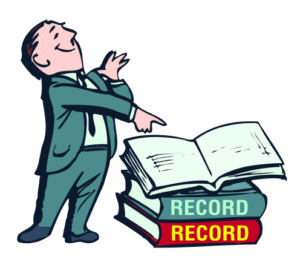

## Knowing Yourself

")
{style="width:25%;"}

Knowing yourself is the beginning of knowing the truth. Socrates called it GNOTHI SEAUTON, (know yourself). A person needs to know who they truly are, so they can know the truth.

{style="width:25%;"}

The truth is the glasses or frame that enables people to communicate with others authentically, without fakeness, without masks.

{style="width:25%;"}

A person who has known themselves will easily know others. Because they are able to understand others, they can adapt themselves to the various styles of different people. Thus becoming a personally intelligent person (PQ).

### Knowing yourself means:

Understanding well the fundamental and important things about yourself which include: physical characteristics, personality, character, temperament, and recognizing talents as well as a clear concept of yourself with all its strengths and weaknesses.

### Benefits and goals of knowing yourself:

1. A person can know their reality, and at the same time their possibilities, and is expected to know what role they must play to realize it.
2. Conversely, a person who does not know themselves, does not know what they should do and develop.
3. Not understanding one's position will make it difficult to direct oneself to one's life goals, thus failing in life's struggles.

#### Ways to Know Yourself:

1. Being open-minded towards criticism, suggestions from others, and willing to accept things as they are for one's own development; not defensive.
2. Through exploring talents and personality.
3. Through everyday experiences.
4. Through togetherness with others.
5. Through personal reflection and contemplation to formulate one's own portrait.

## Physically Disabled People Can Succeed

Some examples:

- Nick Vujicic (see video clip)
- Forrest Gump (see video clip)
- Tony Melendez (see video clip)

### Forrest Gump, A Successful Disabled Person

## Conclusion

1. Physical awareness makes one conscious to accept oneself as one is.
2. With self-acceptance, one can succeed because they are willing to develop themselves starting from what they have, not blaming their physical condition.
3. Becoming confident, able to make an effort, becoming a blessing to others.

## Understanding Temperament

There are 4 (four) types of temperaments:

1. Sanguine
2. Choleric
3. Melancholic
4. Phlegmatic

---

1. In reality, people do not only have one temperament, there is often a combination: san-chol, san-mel, san-phleg, chol-san, chol-mel, chol-phleg, mel-san, mel-phleg, phleg-san, phleg-chol, and phleg-mel.
2. It could also be a combination of more than that.
3. (Can be continued with MBTI-style personality type recognition exercises)

---

## Personality/Character/Temperament

1. Personality

   Is the dynamic organization within the individual of those psychophysical systems that determine their characteristic behavior and thought in adjusting to their environment (**G. Allport**).

2. Character

   Is the totality of conditions and the soul's ways of reacting to stimuli. (**G. Ewald**) Theoretically, character is divided into (**G. Ewald**):

   a. Innate character

   b. Acquired character

3. Temperament

   Is the characteristic phenomena of an individual's emotional nature, including their susceptibility to emotional stimulation, their customary strength and speed of response, the quality of their prevailing mood, and all the peculiarities of fluctuation and intensity of mood. These phenomena are dependent on constitutional make-up, and are therefore largely hereditary in origin (**Allport**).

Knowing Talents

Definition of Talent

1. Talent is a potential possessed by a person as innate since birth.
2. Talent is a special ability that enables a person to obtain benefits from the results of their training to a high degree.
3. Talent still needs to be realized by how we explore and develop it.
4. Talent is a unique characteristic of an individual.

Things that affect talent

1. Genetic factors
2. Training
3. Body structure

Intelligence As Talent

Types of intelligence according to Howard Gardner:

1. Linguistic intelligence
2. Logical-mathematical intelligence
3. Spatial intelligence
4. Musical intelligence
5. Bodily-kinesthetic intelligence
6. Interpersonal intelligence
7. Intrapersonal intelligence
8. Naturalist intelligence

Developing strengths and overcoming personal weaknesses:

1. Introspection
2. Self-control
3. Building self-confidence
4. Knowing and taking inspiration from role models
5. Thinking positively & optimistically about oneself
