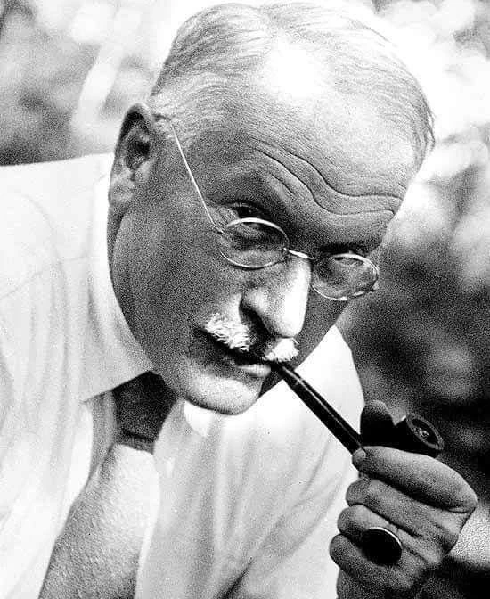
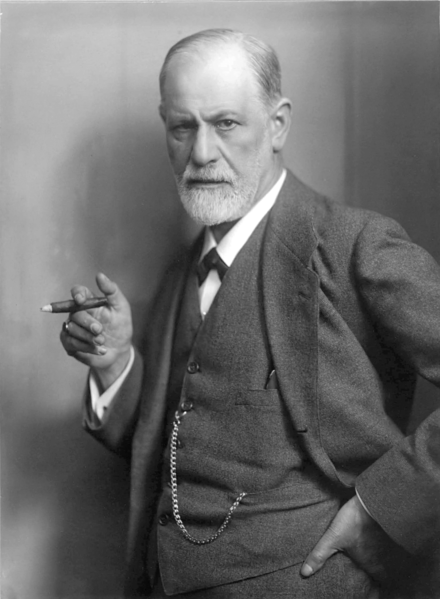
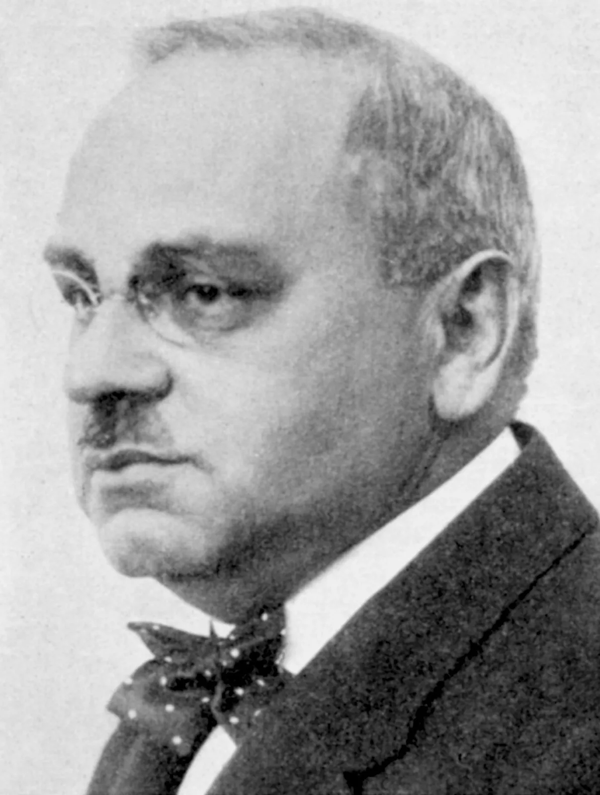
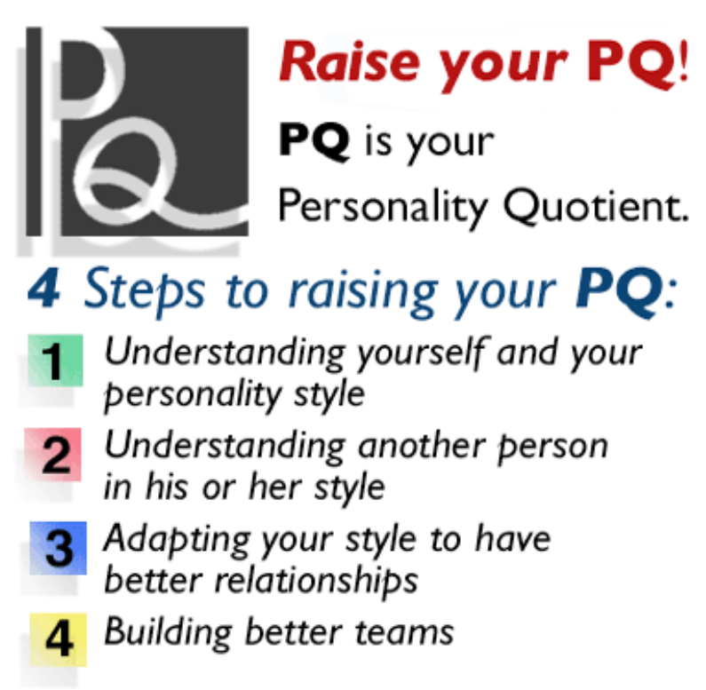
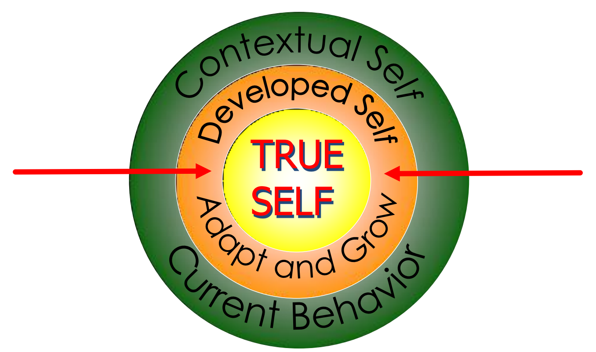

## Accepting Yourself

")
{style="width:25%;"}

Wanted to know how to help humans to "know themselves" accurately, more objectively, and deeply.

")
{style="width:25%;"}

At that time, Jung already knew Sigmund Freud's opinion, which stated that human behavior is caused by objects.

")
{style="width:25%;"}

Jung also already knew Alfred Adler's opinion about human behavior which stated that "the determinant agent of human behavior is within the subject itself".





Jung saw that what Freud and Adler proposed was actually the same, just one looking from the "extrovert" angle (Freud) and the other from the "introvert" angle (Adler).

Jung conducted research and observation on various human personality traits for more than 20 years, until finally, he proposed the classification of humans into personality types: Extrovert, Introvert, Thinking, Feeling.

 with her mother Katharyn Briggs (1875 – 1968)")
{style="width:50%;"}

studied Jung's theory and spent 40 years making observations on human personality types based on Jung's theory.

They finally created a psychological test that can classify humans into personality types, according to Jung's theory. Thus the test was born: Myers-Briggs Type Indicator (MBTI).

Myers and Briggs strengthened and expanded Carl Gustav Jung's findings regarding: extrovert-introvert, sensing-intuitive, thinking-feeling, and judging-perceiving.

The combination of the four preferences above produces 16 human personality types, which contain potential, aptitude, and talent, as well as the weaknesses contained within them.

Have you ever compared yourself to others, for example, why am I not as pretty as my sister, or why am I not as smart as my friend, etc.

Have you ever wished, for example, if only I were as pretty as her, if only I were as smart as him, how happy I would be.

Generally, people who compare themselves with others tend to see themselves as the unfortunate party, while the other person is seen as the lucky, fortunate, happy party, etc.

### Definition of Accepting Yourself

Accepting Yourself is where we accept all our weaknesses and strengths or accept everything that is within us, accepting everything that has happened in our lives and to ourselves. So that our attitude is to see ourselves as we are and treat ourselves well accompanied by gratitude, joy, and pride while continuing to strive for progress.

### The Danger of Rejecting Oneself

The result of comparing ourselves to others makes us forget to look at ourselves.

Disappointed in oneself and hopeless.

> We are as we are, but we don't stay that way, we have to grow.

### Ways to Accept Yourself

1. Use a new paradigm glasses
2. Set realistic standards or targets
3. Spend time with positive people
4. Read self-development books
5. Do something that makes you like yourself more.
6. Use positive words to yourself.
7. Be grateful for what you have.

### Benefits of Being Yourself

- The mind becomes clear
- Enjoying life
- Knowing your potential easily
- Achieving success

{style="width:50%;"}

RAISING YOUR PERSONALITY QUOTIENT, INDIVIDUALS, TEAMS and ORGANIZATIONS

### How to Understand Yourself

### Preference Differences


flowchart LR
%% Category 1: E vs I
E([<u>E</u>xtravert]) -.- I([<u>I</u>ntrovert])

    %% Category 2: S vs N
    S([<u>S</u>ensing]) -.- N([i<u>N</u>tuition])

    %% Category 3: T vs F
    T([<u>T</u>hinking]) -.- F([<u>F</u>eeling])

    %% Category 4: J vs P
    J([<u>J</u>udging]) -.- P([<u>P</u>erceiving])

    %% Styling Colors (matching image)
    classDef extra fill:#fbc02d,stroke:#f57f17,stroke-width:1px,color:black,font-size:18px;
    classDef intro fill:#f57c00,stroke:#e65100,stroke-width:1px,color:white,font-size:18px;

    classDef sens fill:#c8e6c9,stroke:#81c784,stroke-width:1px,color:black,font-size:24px,font-weight:bold;
    classDef intu fill:#00e676,stroke:#00c853,stroke-width:1px,color:black,font-size:24px,font-weight:bold;

    classDef thin fill:#90caf9,stroke:#42a5f5,stroke-width:1px,color:black,font-size:24px,font-weight:bold;
    classDef feel fill:#2979ff,stroke:#2962ff,stroke-width:1px,color:black,font-size:24px,font-weight:bold;

    classDef judg fill:#f48fb1,stroke:#d81b60,stroke-width:1px,color:black,font-size:18px;
    classDef perc fill:#880e4f,stroke:#4a148c,stroke-width:1px,color:white,font-size:24px,font-weight:bold;

    %% Applying Style
    class E extra;
    class I intro;
    class S sens;
    class N intu;
    class T thin;
    class F feel;
    class J judg;
    class P perc;



### 16 Type Descriptions


block-beta
columns 4

    %% Row 1
    ISTJ ISFJ INFJ INTJ

    %% Row 2
    ISTP ISFP INFP INTP

    %% Row 3
    ESTP ESFP ENFP ENTP

    %% Row 4
    ESTJ ESFJ ENFJ ENTJ

    %% Block color styling according to personality group
    %% SJ (Yellow)
    classDef sj fill:#d6d688,stroke:#f5f5f5,stroke-width:3px,color:black,font-size:20px,font-weight:bold;
    %% SP (Bronze/Light Brown)
    classDef sp fill:#c79a52,stroke:#f5f5f5,stroke-width:3px,color:black,font-size:20px,font-weight:bold;
    %% NF (Blue)
    classDef nf fill:#79a2db,stroke:#f5f5f5,stroke-width:3px,color:black,font-size:20px,font-weight:bold;
    %% NT (Mint Green)
    classDef nt fill:#9ad3a5,stroke:#f5f5f5,stroke-width:3px,color:black,font-size:20px,font-weight:bold;

    %% Apply style to each box
    class ISTJ,ISFJ,ESTJ,ESFJ sj;
    class ISTP,ISFP,ESTP,ESFP sp;
    class INFJ,INFP,ENFP,ENFJ nf;
    class INTJ,INTP,ENTP,ENTJ nt;



Types do not rigidly box someone's personality

### Things to Remember

- Every type is unique and special; there is no right or wrong.
- Everyone uses all preferences to some degree.
- Type does not explain everything.
- MBTI does not measure skills or abilities.
- It should not limit you in considering a career, activities, or a relationship.
- Be aware of the bias of your type to avoid negative stereotyping.

## ISTJ

### Introverted Sensing With Thinking As Auxiliary

- Serious and quiet, likes quiet and secure situations.
- Very careful, systematic, responsible and reliable.
- Has high concentration, holds firmly to tradition.
- Organized, hard worker, focuses on the target to be achieved.
- If already prepared, can directly complete the task.

## ISTP

### Introverted Thinking With Sensing As Auxiliary

1. Quiet, prefers to be alone, interested in 'how' and 'why' something can happen.
2. Skilled at mechanical - practical things.
3. Dares to take short-term risks.
4. Usually likes sports that involve danger.
5. Loyal to the group and the prevailing 'value system'.
6. Less concerned about rules in getting things done.
7. Good at finding solutions to practical problems.

## ISFJ

### Introverted Sensing With Feeling as Auxiliary

- Kind-hearted, hard-working and reliable.
- Prioritizes the needs of others.
- Responsible, values tradition and stability.
- Likes practical and definite things.
- Aware of their position and role/function.
- Likes to observe others.
- Very sensitive to others' feelings and likes to serve.

## ISFP

### Introverted Feeling With Sensing As Auxiliary

1. Quiet, serious, sensitive and kind.
2. Dislikes conflict.
3. Loyal, honest and realistic.
4. Likes beauty and aesthetics.
5. Not interested in playing a role as a leader/boss.
6. Flexible and 'open-minded'.
7. Natural and creative.
8. Enjoys the 'present moment'.

## INFJ

### Introverted Intuition With Feeling As Auxiliary

1. Thinker, full of ideas and dynamic.
2. Tends to stick to one thing until it is completely finished.
3. Very sensitive to others and cares about their feelings.
4. Holds firmly to the 'value system' they believe in.
5. Always wants to do things right.
6. Tends to work alone rather than taking the role of a leader or follower.

## INFP

### Introverted Feeling With Intuition As Auxiliary

1. Quiet, thoughtful, and idealistic.
2. Interested in humanitarian issues, always wants to help.
3. Has a strong 'value system'.
4. Very loyal.
5. Easily adaptable, unless it conflicts with their adopted 'value system'.
6. Usually has a talent for writing.
7. Quick to see many possibilities.

## INTJ

### Introverted Intuition With Thinking As Auxiliary

1. Independent, 'original', analytical and firm.
2. Expert in translating a concept/theory into real action.
3. Highly values knowledge, competence and structure.
4. Thinks long-term.
5. Sets high standards, both for oneself and others.
6. Spontaneously appears as a leader, but will obey a leader they respect.

## INTP

### Introverted Thinking With Intuition As Auxiliary

1. Logical, 'original' and creative thinker.
2. Can be very useful regarding theories and ideas.
3. Expert in explaining a theory so it is easy to understand.
4. Highly values knowledge, competence and logic.
5. Tends to be quiet, prefers to be alone, rather difficult to get close to.
6. Less interested in becoming a leader or follower.

## ESTP

### Extraverted Sensing With Thinking As Auxiliary

1. Friendly, adaptable and quick to act.
2. 'Doer', focuses on real results.
3. Lives for the here and now, dares to take risks in a short time.
4. Impatient with lengthy and theoretical explanations.
5. Very loyal to their group, but doesn't really care about rules if they want to do something.
6. Good at getting along and socializing.

## ESTJ

### Extraverted Thinking With Sensing As Auxiliary

1. Practical, organized, and values tradition.
2. Not interested in theories or abstract things unless they can be applied.
3. Has a clear picture of how to do things.
4. Loyal and a hard worker.
5. Responsible.
6. Expert in organizing and running things.
7. A good 'citizen', values a safe and quiet life.

## ESFP

### Extraverted Sensing With Feeling As Auxiliary

1. People-oriented, enjoys life, makes everything more exciting and 'alive'.
2. Lives for the moment, likes new experiences.
3. Dislikes impersonal theory and analysis.
4. Likes to serve and help others.
5. Likes to be the center of attention.
6. Has good 'common sense'.

## ESFJ

### Extraverted Feeling With Sensing As Auxiliary

1. Warm, popular and careful.
2. Prioritizes the needs of others.
3. Has a great sense of responsibility. Values tradition.
4. Likes to serve others.
5. Needs positive support from others.
6. Aware of their role and function.

## ENFP

### Extraverted Intuition With Feeling As Auxiliary

1. Enthusiastic, idealistic and creative.
2. Versatile.
3. Good at getting along and socializing.
4. Lives life according to the adopted 'value system'.
5. Very excited about new ideas, but gets easily bored with minor details.
6. 'Open-minded' and flexible with broad abilities and interests.

## ENFJ

### Extraverted Feeling With Intuition As Auxiliary

1. Popular and sensitive, easy to get along with and socialize.
2. Focuses on the external world, really cares about what others feel and think.
3. Sees things from a human perspective, dislikes impersonal analysis.
4. Effective in solving problems related to humans.
5. Likes to serve others, and prioritizes the needs of others.

## ENTP

### Extraverted Intuition With Thinking As Auxiliary

1. Creative, can think quickly, imaginative.
2. Versatile.
3. Likes to debate.
4. Very excited about new ideas and projects, but tends to ignore routine matters.
5. Honest, open and assertive.
6. Expert in understanding concepts and applying logic in finding solutions.

## ENTJ

### Extraverted Thinking With Intuition As Auxiliary

1. Assertive and honest, driven to lead.
2. Expert in understanding difficult organizational problems, and providing solid solutions.
3. 'Smart' and has a lot of knowledge, usually good at public speaking.
4. Highly values knowledge and competence, usually impatient with something inefficient or poorly organized.

## ISTJ/SYSTEMATIC

God, help me to begin to relax about the details of my work tomorrow at 11:41:32.

## ISFJ/CAREFUL

God, help me to be calmer and more relaxed, and help me to be able to do it right.

## INFJ/PERFECTIONIST

God, help me not to be a perfectionist. Did I spell the "term" correctly?

## INTJ/INDEPENDENT

God, help me to be open to others' ideas, even though they might be wrong.

## ISTP/Critical

God, help me to pay attention to others' feelings, even if their feelings are hyperactive.

## ISFP/GENTLE

God, help me to stand up for my "rights", if You don't mind me asking for that.

## INFP/FLEXIBLE

God, help me to finish everything I have started.

## INTP/INDEPENDENT

God, help me to be a little less independent, but let me do it my own way.

## ESTP/PRAGMATIC

God, help me to take responsibility for my actions even for things I didn't mean to do.

## ESFP/Friendly

God, help me to handle things more seriously, especially parties and celebrations.

## ENFP/ENTHUSIASTIC

God, help me to keep my attention focused on one thing. Oh, but look, there's a bird flying.

## ENTP/INNOVATIVE

God, help me establish my work procedures today. But wait a minute, let me adjust it just for a few minutes.

## ESTJ/ANALYTICAL

God, help me not to try to do everything. But, if You need my help, just ask, I'll try to help.

## ESFJ/HELPER

God, give me patience, and I really need it right now.

## ENFJ/TOLERANT

God, help me do what I can, and entrust the rest to You. Would You mind putting this agreement in writing?

## ENTJ/Organize

God, help me to be able to run things slowly, and not always rush and hurry. Amen.
