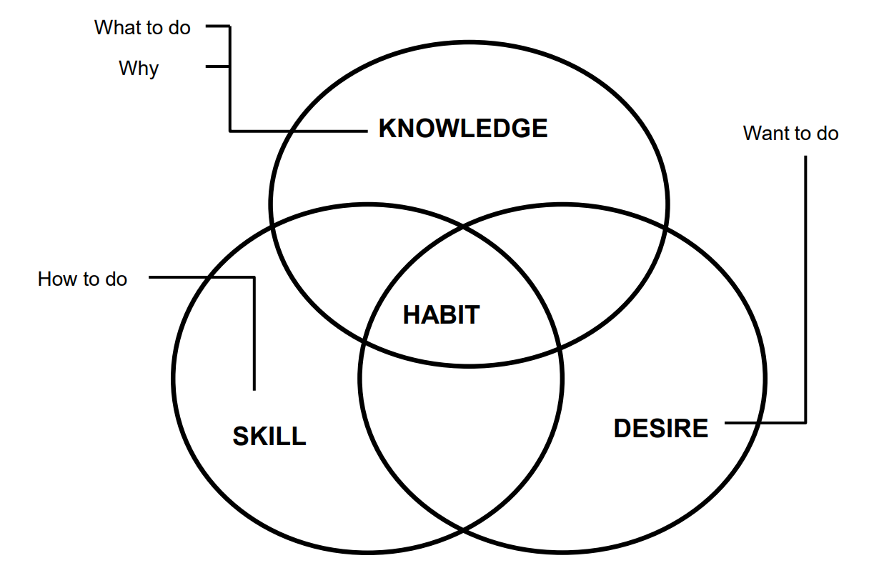
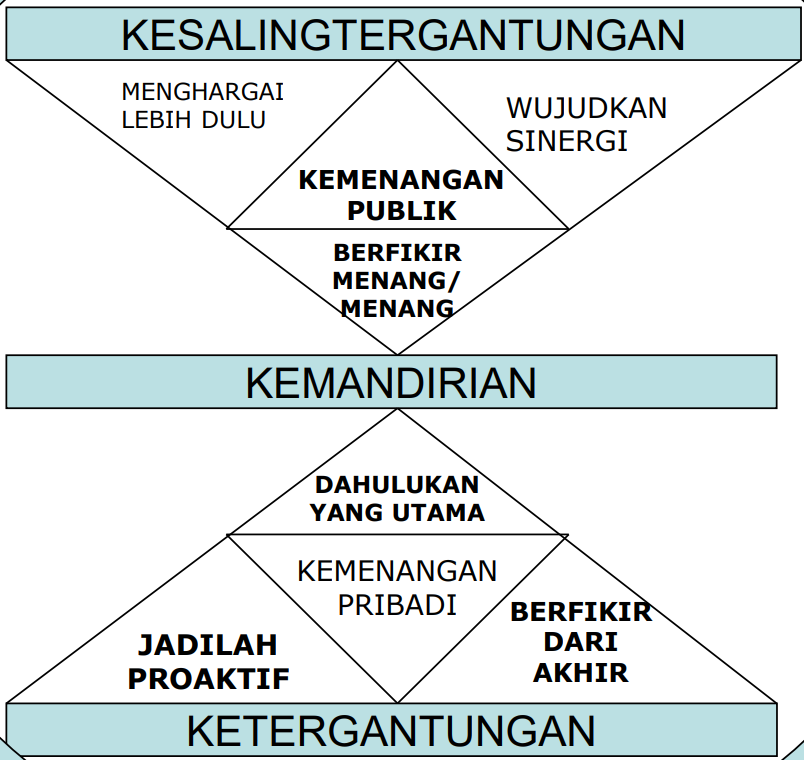
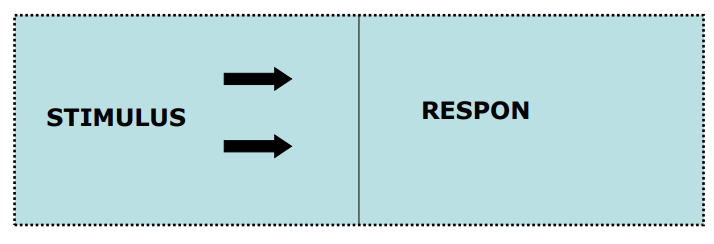
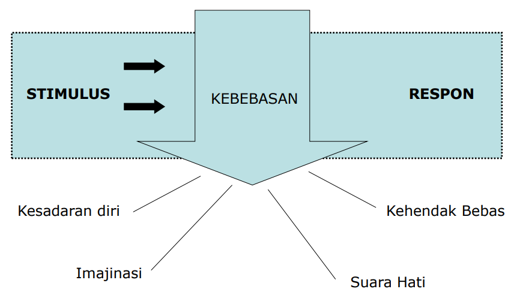
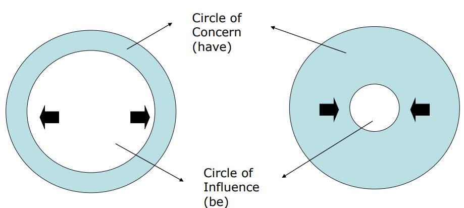
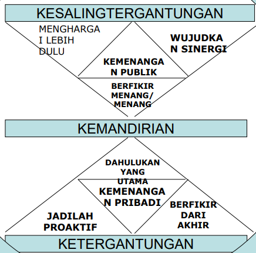

## Self Development

### Meaning and Goals of Self Development

The meaning of self-development is:

A deliberate, continuous, and unceasing effort, carried out in various ways and forms, to enable the realization of one's physical and spiritual potential in a good and optimal way, leading a person to true maturity. This great endeavor is a consequence of one's position as a human being endowed with reason.

The goals to be achieved through this self-development effort are:

The optimal realization of one's physical and spiritual potential towards the good, leading a person to a mature level, enabling them to build better relationships with themselves, the world, others, and God.

This effort involves the human being entirely and uses the available support systems.

Ways to Develop Oneself

1. Knowing and accepting oneself
2. Having a strong will to develop oneself
3. Utilizing open possibilities
4. Learning from mistakes

Important aspects that need to be developed as concrete forms of self-development are:

1. Healthy mental state
2. Personal integrity
3. Independent, creative, and innovative
4. Self-motivation

### Mental Strength and Resilience

The following exposition is taken from the book Adversity Quotient, Turning Obstacles into Opportunities, written by Paul G. Stoltz, 2000.

1. Adversity Quotient (AQ): The primary determinant for success
2. Quitters, Campers, and Climbers
3. Adversity Response Profile (ARP): The ability to face problems and respond to and deal with every issue.

### Definition of Adversity Quotient (AQ)

After 19 years of extensive research and reviewing over 500 references, Paul G. Stoltz proposed a new intelligence besides IQ, EQ, and SQ, namely AQ.

According to him, AQ is the intelligence to overcome adversity. It's about how to turn obstacles into opportunities. In other words, a person with a high AQ will be more capable of realizing their goals compared to someone with a low AQ.

As an illustration, Stoltz uses the terminology of mountain climbers. In this regard, Stoltz divides mountain climbers into three categories:

1. Quitters (those who give up). Quitters are those who merely survive. They easily despair and give up halfway.
2. Campers (camping halfway). They dare to take on jobs with risks, but the risks are safe and measurable. They are easily satisfied and stop halfway.
3. Climbers (climbers who reach the top). They dare to face risks and complete their tasks.

For the world of work and life, it is very clear. Many workers with low intellectual intelligence (IQ) can defeat those with high IQs who lack the spirit and courage to face problems and take action. With AQ, we can analyze how employees/workers are able to turn challenges into opportunities that will increase productivity and company profits.

That was a brief overview of the Adversity Quotient. What about you?

**“winner never quits and quitter never wins”** 
“A winner never quits and a quitter never wins"

David Campbell Ph.D states that creativity is an activity that produces results containing the characteristics of being:

1. innovative
2. useful
3. understandable

## Developing Oneself into a Resilient Person with the 7 Habits of Highly Effective People

{style="width:75%;"}

### Character is a Collection of Various Habits

#### What is an effective person?


flowchart LR
%% Node Induk
PRIBADI["PERSON"]

    %% Node Watak (Kotak biru muda, teks list di bawahnya)
    WATAK["
CHARACTER

✓ Individual quality ✓ Collection of habits ✓ Long-term oriented
"]

    %% Node Penampilan (Kotak teal kehijauan, teks list di bawahnya)
    PENAMPILAN["
APPEARANCE

✓ Behavior : public image ✓ Dress code ✓ Socializing techniques ✓ Short-term oriented
"]

    %% Hubungan Panah
    PRIBADI --> WATAK
    PRIBADI --> PENAMPILAN

    %% Styling: Menghilangkan kotak bawaan Mermaid supaya desain HTML-nya yang muncul
    classDef rootNode fill:none,stroke:none,font-size:28px,font-weight:bold;
    classDef clearNode fill:none,stroke:none;

    class PRIBADI rootNode;
    class WATAK,PENAMPILAN clearNode;



### Effectiveness (The Goose and the Golden Eggs)

- Effective Person, If P/PC is Balanced
- P = Product (Golden Eggs)
- PC = Production Capability (The Goose)

### Effective

- Achieving Results
- Growing and Developing

#### What is developing? Our assets

- Physical: house, vehicle, furniture, etc.
- Financial: money, savings, etc.
- Human: Body, mind, emotions

#### How to do it?

Balancing between:

Production and Production Capacity 
_(Aesop: The goose and the golden eggs)_

### Shifting Paradigms

- Changing perspective from ordinary to more complete and useful
- Changing behavior and attitude in line with the new perspective
- Stopping old habits
- Aligning the map (value system) with the compass (correct principles)

#### Salary Philosophy

{style="width:75%;"}

## Habit 1 - Be Proactive

Principles of Personal Vision

### Reactive Model

### Proactive Model

### Being Proactive

- Take initiative # be aggressive, don't wait, do something
- Act, don't wait to be told to act
- Be part of the solution, not part of the problem
- Don't say: can't, must, if only, 
  but say: I choose, prefer, will

### Proactive = Responsible

- Not blaming circumstances
- Not blaming the environment

---

- **Result of conscious choice**
- **Based on value systems (values)**

---

### Circle of Influence

Circle of Influence Vs Circle of Concern

### Proactive Person

- Actions are Controlled
- Responsible
- Focus on the “Circle Of Influence”
- Complete tasks thoroughly
- Not Defensive

## Habit 2 - Begin with the End in Mind

Principles of Personal Leadership

### Personal Leadership


flowchart BT
%% Node Bawah
I["imagination"]
S["conscience"]

    %% Node Atas
    T["All Things are Created Twice (Segala Sesuatu Diciptakan Dua Kali)"]

    %% Alur Panah
    I --> T
    S --> T

    %% Styling Text Only (Tanpa Kotak)
    classDef textOnly fill:none,stroke:none,color:#fff;
    classDef topText fill:none,stroke:none,font-weight:bold,color:#fff;

    class I,S textOnly;
    class T topText;



### Results of Habit 2

- Having Direction in Life
- Planning Every Activity
- Maintaining Long-Term Focus
- Providing Direction for Work Groups

### Discovering Personal Mission

Personal Mission Statement:

- What is My Purpose in Life?
- What is Most Valuable in My Life?
- What Talents Do I Possess?
- What Do I Want to Achieve at the End of My Life?

The Importance of Understanding Our Roles

- PMS is made by outlining Roles
- Roles are the key to creating a balanced life
- Within each Role, there are Goals
- Goals: Short-term, medium, long-term
- Goals must align with the PMS

### How to Create a Personal Mission Statement (PMS)

- Determine who/what influences our lives
- Determine Your Life Roles (in family, school/office, society)
- Are you satisfied with these realities?
- Determine who you want to be?
- Write a PMS draft (then revise, evaluate)

## Habit 3 - Put First Things First

Principles of Personal Management


block-beta
columns 7

    %% Label Header Atas
    space:1
    Col1["Urgent"]:3
    Col2["Not Urgent"]:3

    %% Baris Pertama (Penting)
    Row1["Important"]:1
    Q1["I. CRISIS Pressing problems Deadline-driven projects"]:3
    Q2["II. PLANNING ACTIVITIES Relationship building Preparation Crisis prevention"]:3

    %% Baris Kedua (Tidak Penting)
    Row2["Not Important"]:1
    Q3["III. Meetings Urgent matters Regular activities"]:3
    Q4["IV. TIME WASTERS Irrelevant mail and phone calls Watching TV"]:3

    %% Styling
    classDef noBox fill:none,stroke:none,font-weight:bold,font-size:18px,color:#000;
    classDef gridBox fill:#e0f7fa,stroke:#000,stroke-width:2px,color:#000,font-weight:bold,font-size:16px,line-height:1.5;

    class Col1,Col2,Row1,Row2 noBox;
    class Q1,Q2,Q3,Q4 gridBox;



---


block-beta
columns 4

    %% Baris Pertama
    Q1["
<b>I. Results</b>  ♦ Stress ♦ Burnout ♦ Crisis ♦ Easily angered
"]:3
    Q2["
<b>II</b>      
"]:1

    %% Baris Kedua
    Q3["
<b>III</b>     
"]:3
    Q4["
<b>IV</b>     
"]:1

    %% Styling
    classDef box fill:#ffffff,stroke:#000,stroke-width:2px,color:#000,font-size:18px;
    class Q1,Q2,Q3,Q4 box;



---


block-beta
columns 2

    %% Baris Pertama
    Q1["
<b>I</b>     
"]
    Q2["
<b>II</b>     
"]

    %% Baris Kedua
    Q3["
<b>III. Results</b>  ♦ Short-term focus ♦ Crisis ♦ Chameleon
"]
    Q4["
<b>IV</b>     
"]

    %% Styling
    classDef box fill:#ffffff,stroke:#000,stroke-width:2px,color:#000,font-size:18px;
    class Q1,Q2,Q3,Q4 box;



---


block-beta
columns 2

    %% Baris Pertama
    Q1["
<b>I</b>       
"]
    Q2["
<b>II</b>       
"]

    %% Baris Kedua
    Q3["
<b>III</b>       
"]
    Q4["
<b>IV</b>  
<b>Results</b> ♦ Lack of responsibility ♦ Fired from jobs ♦ Highly dependent on others &nbsp;&nbsp;or institutions

"]

    %% Styling
    classDef box fill:#ffffff,stroke:#000,stroke-width:2px,color:#000,font-size:18px;
    class Q1,Q2,Q3,Q4 box;



---


block-beta
columns 2

    %% Baris Pertama
    Q1["
      
"]
    Q2["
<b>II. Results</b>  ♦ Vision perspective ♦ Balance ♦ Discipline  
"]

    %% Baris Kedua
    Q3["
      
"]
    Q4["
      
"]

    %% Styling
    classDef box fill:#ffffff,stroke:#000,stroke-width:2px,font-size:18px;
    class Q1,Q2,Q3,Q4 box;



---

### Results of Habit 3

- Focus on priority issues
- Discipline
- Avoiding Crises
- Delegating Tasks
- Coordinating effort in task execution

### Summary of Habits 1, 2, 3

- To be Proactive, Values Need to be Clearly Defined
- Writing a PMS Focuses on Values
- Achieving P-M Depends on the Chosen Roles and Goals and the Effectiveness of their Achievement
- Evaluate Roles and Goals According to their Priorities

### Salary Philosophy

### Emotional Bank Account (EBA) (Paradigm II)

- As You Sow, So Shall You Reap
- Emotional Account With Oneself And Others
- Grows When There is "Trust", Dies When Betrayed
- Must Be "Sincere" \_ Genuine
- Expected to Always Sow Kindness – Charity – Love
- He Who Sows the Wind Will Reap the Whirlwind

### Emotional Bank Account

Deposits-debit vs Withdrawals-credit

EBA is filled little by little every day

- Love vs jealousy, envy, spite
- Keeping promises vs breaking promises
- Meeting expectations vs disappointing
- Honest vs Lying
- Loyal vs Betrayal
- Apologizing vs Pride

The law of love and the law of life: Unconditional love brings life

### 6 Behaviors that Build EBA

- Understanding Others
- Attending to the Little Things
- Keeping Commitments
- Clarifying Expectations
- Showing Personal Integrity
- Apologizing Sincerely

## Habit 4 - Think Win/Win

Principles of Personal Leadership

### 6 Basic Paradigms of Human Interaction

- W-W : Seeking mutually beneficial and satisfying agreements; not my way or your way but the best way
- W-L : Being a winner or star tends to be authoritarian, showing power. This is the most frequently used attitude
- L-W : Being a good child; saying yes but not executing, suffering inside
- L-L : Egoistic, conflict, divorce, the attitude of a dependent or quiet person
- Win : Self-centered, not caring about others, the important thing is to win
- No deal: agreeing to disagree, no expectations whatsoever

### 6 Paradigms of Interpersonal Interaction:

| Paradigm           | Description                |
| :----------------- | :------------------------- |
| **Win-Win**        | Mutual benefit cooperation |
| **Win-Lose**       | Competition                |
| **Lose-Win**       | Competition                |
| **Lose-Lose**      | War                        |
| **Win**            | Survival from disaster     |
| **Lose**           | Victim of disaster         |
| **Win or No Deal** | Postponing transaction     |

### 5 Dimensions of Win-Win Interaction

1. CHARACTER (integrity, maturity, abundance mentality)
2. RELATIONSHIPS
3. AGREEMENTS
4. SUPPORTIVE SYSTEMS
5. PROCESSES


block-beta
columns 3

    %% Header Kolom (Sumbu Keberanian)
    space:1
    C1["Low Courage"]:1
    C2["High Courage"]:1

    %% Baris Pertama (Pertimbangan Tinggi)
    R1["High Consideration"]:1
    Q1["Lose / Win"]:1
    Q2["Win / Win"]:1

    %% Baris Kedua (Pertimbangan Rendah)
    R2["Low Consideration"]:1
    Q3["Lose / Lose"]:1
    Q4["Win / Lose"]:1

    %% Styling Matrix
    classDef labelBox fill:none,stroke:none,font-weight:bold,font-size:16px,color:#000;
    classDef gridBox fill:#ffffff,stroke:#000,stroke-width:2px,color:#000,font-weight:bold,font-size:18px;

    class C1,C2,R1,R2 labelBox;
    class Q1,Q2,Q3,Q4 gridBox;



### Think Win-Win

- Have an abundance mentality
- Share credit for successes
- Balance courage with consideration
- Set up win-win agreements

## Habit 5 - Seek First to Understand, Then to be Understood

Principles of Emphatic Communication

### Communication Process Model


flowchart LR
Umpan["Feedback"]
Gangguan["Interference (Noise)"]

    subgraph Pengirim[" "]
        direction LR
        Pikiran["Thought"] --> Encoding["Encoding"]
    end

    Saluran["Channel"]

    subgraph Penerima[" "]
        direction LR
        Pesan["Receiving message"] --> Decoding["Decoding"] --> Dipahami["Understood"]
    end

    %% Alur Utama
    Encoding --> Saluran --> Pesan

    %% Alur Umpan Balik (Atas)
    Encoding --> Umpan
    Decoding --> Umpan

    %% Alur Gangguan (Bawah)
    Gangguan --> Pengirim
    Gangguan --> Saluran
    Gangguan --> Penerima

    %% Styling Kotak Transparan & Putus-putus
    style Pengirim fill:none,stroke:#fff,stroke-width:1.5px,stroke-dasharray: 4 4
    style Penerima fill:none,stroke:#fff,stroke-width:1.5px,stroke-dasharray: 4 4

    %% Styling Node Warna Biru Muda Sesuai Gambar
    classDef boxStyle fill:#e0f7fa,stroke:#000,stroke-width:1px,color:#000,font-size:15px;
    class Umpan,Gangguan,Pikiran,Encoding,Saluran,Pesan,Decoding,Dipahami boxStyle;



### 4 Types of Communication

- Reading
- Writing
- Speaking
- Listening

### 5 Levels of Listening

- Ignoring
- Pretending
- Selective
- Attentive
- Empathic

### Autobiographical Responses

- Evaluating
- Probing (Asking)
- Advising
- Interpreting

### Stages of Empathic Listening

- Mimicking Content
- Rephrasing the Content
- Reflecting Feeling
- Rephrasing the Content and Reflecting the Feeling

### Seek First To Understand, Then To Be Understood

- Do not interrupt others
- Be sensitive to others' feelings
- Seek to fully understand issues
- Understand work group concerns
- Communicate clearly

## Habit 6 - Synergize

Principles of Creative Cooperation

### Synergy?

The whole is greater than the sum of its parts

### Synergy Principles of Creative Cooperation

- The Whole Is Greater Than The Sum Of Its Parts 1+1 = 14
- Synergy Is The Process Of Seeking The Best Alternative
- Synergy Values Differences
- Creating Synergy = Creating Conditions That
  Support Towards It Namely W-W Attitude, Seeking 
  To Understand And Believing That Combined 
  Capabilities Will Obtain The Best Alternative

### Essence of Synergy

- Valuing differences (not protective, not selfish)
- Respecting differences (not defensive, not politicizing)
- Building strengths (Not judgmental, not dictating)
- Compensating for weaknesses (giving more, trusting more)


type: 'line',
data: {
labels: [
'Defensive (win/lose or lose/win)',
'Respectful (compromise)',
'Synergistic (win/win)'
],
datasets: [{
label: 'Paradigm relationship point',
data: [1, 2, 3],
backgroundColor: 'rgba(59, 130, 246, 0.1)',
borderColor: 'rgb(59, 130, 246)',
borderWidth: 3,
pointBackgroundColor: 'rgb(15, 23, 42)',
pointBorderColor: 'rgb(59, 130, 246)',
pointRadius: 6,
tension: 0
}]
},
options: {
scales: {
y: {
title: {
display: true,
text: 'Trust axis'
},
min: 0,
max: 4
},
x: {
title: {
display: true,
text: 'Cooperation axis'
}
}
}
}


### Synergize

- Support Responsible Risk Taking
- Use Other People’s Viewpoints
- Build Team Unity
- Search for Alternative Solutions
- Value other's opinion

## Habit 7 - Sharpen the Saw

Principles of Balanced Self-Renewal

### 4 Areas of Renewal


flowchart TD
%% Node dengan teks terbungkus tanda kutip agar aman di versi 11.14.0
Physical["<b>Physical</b> Exercise, nutrition, stress management"]
Social["<b>Social / emotional</b> Service, empathy, synergy, intrinsic security"]
Spiritual["<b>Spiritual</b> Value clarifications, commitment study & meditation"]
Mental["<b>Mental</b> Reading, visualising, planning, writing"]

    %% Alur siklus lingkaran
    Physical --- Social
    Social --- Spiritual
    Spiritual --- Mental
    Mental --- Physical

    %% Styling warna kotak (slate-purple) dan teks putih agar kontras
    classDef dimensi fill:#6b729c,stroke:#4b5177,stroke-width:1px,color:#ffffff,font-size:15px,padding:15px;
    class Physical,Social,Spiritual,Mental dimensi;



### Sharpening the Physical

- Regular meals and balanced nutrition
- Adequate rest (6-8 hours a day)
- Sufficient exercise (endurance, flexibility, strength, skill)
- Routine health checks

### Sharpening the Spiritual

- Learning from nature: observing, listening to nature
- Reading good spiritual books
- Praying, meditating
- Enjoying music and art

### Sharpening the Mental

- Improving education quality:
  - Watching quality TV programs
  - Reading quality books
  - Keeping a diary/journal
  - Scientific writing/authoring
  - Developing specific hobbies

### Sharpening the Social/Emotional Aspects

- Making deposits into the emotional bank account
  - Helping/serving others
  - Giving attention
  - Being friendly
  - Going out together (having a picnic together)
  - Sharing experiences with peers


flowchart LR
%% Komponen Bentuk (Kiri)
S1[" "]
S2{" "}
S3{{ }}
S4([ ])

    %% Komponen Keterangan Teks (Kanan)
    T1["This person is intellectual, objective, rational, and a reliable decision-maker"]
    T2["This person tends to be neat, dependent, conservative, and steadfast"]
    T3["This person is not easily satisfied with their position, highly realistic, and a great risk-taker"]
    T4["This person is intellectual, objective, rational, and a reliable decision-maker"]

    %% Menghubungkan bentuk dengan teks secara horizontal
    S1 --> T1
    S2 --> T2
    S3 --> T3
    S4 --> T4

    %% Mengunci posisi vertikal agar tetap sejajar dan tidak berantakan
    S1 ~~~ S2 ~~~ S3 ~~~ S4
    T1 ~~~ T2 ~~~ T3 ~~~ T4

    %% Pengaturan gaya visual (Styling)
    classDef shapeStyle fill:#ccf2f4,stroke:#333,stroke-width:1.5px;
    classDef textStyle fill:none,stroke:none,font-size:16px,color:#fff;

    class S1,S2,S3,S4 shapeStyle;
    class T1,T2,T3,T4 textStyle;


