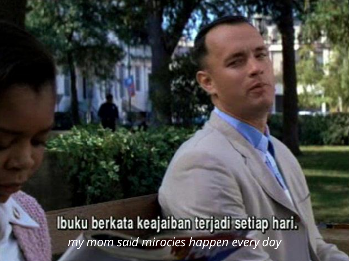

## Understanding Motivation

The strength or driving force that moves and directs a person's will and behavior, along with all their power, to achieve their desired goals, which arises from the desire to fulfill their needs.

### Maslow's Hierarchy of Needs:

1. Physiological needs
2. Safety and security needs
3. Love and belonging needs
4. Esteem needs
5. Self-actualization needs

### How to Motivate Yourself

1. Motivate yourself through self-confidence: 
   a. Avoid making excuses 
   b. Use your imagination 
   c. Don't be afraid to fail 
   d. Pay attention to your appearance
2. Motivate yourself by setting goals
3. Motivate yourself by compiling a record of past successes

## 5 Basic Human Psychological Needs

- Secure
  - Valuable
    - Worthy
      - Understood
        - Loved

These needs are required by everyone at all times and everywhere.

What happens when

- A child feels **secure**
- A teenager feels **secure**
- An adult feels **secure**

### When Feeling Insecure

| Age Category | EFFECT                                                                                                                          | CAUSE                                                                                  | SOLUTION                                                                  |
| :----------- | :------------------------------------------------------------------------------------------------------------------------------ | :------------------------------------------------------------------------------------- | :------------------------------------------------------------------------ |
| **CHILD**    | - Anxious & restless - Becomes fearful - Crying                                                                           | - Lack of parents' attention - Domestic conflict                                    | - Needs affection - Adequate attention                                 |
| **TEENAGER** | - Becomes rebellious - Despair - Lacks self-confidence - Aloof, quiet - Falls into drugs - Aggressive, emotional | - Lack of parents' attention - Negative environment - Parents showing favoritism | - Needs affection - Attention - Needs appreciation                  |
| **ADULT**    | - Becomes quick-tempered - Brutal, aggressive - Lack of self-control                                                      | - Economic pressure - Lots of debt - Family conflict - Conflict with parents  | - Needs attention - Needs appreciation - Needs a religious attitude |

What happens when

- A child feels **valuable**
- A teenager feels **valuable**
- An adult feels **valuable**

### When Feeling Worthless

| Age Category | EFFECT                                                                                                               | CAUSE                                                                         | SOLUTION                                                   |
| :----------- | :------------------------------------------------------------------------------------------------------------------- | :---------------------------------------------------------------------------- | :--------------------------------------------------------- |
| **CHILD**    | - Crying - Aloof                                                                                                  | - Lack of attention - Desires unmet                                        | - Needs affection - Adequate attention - Give praise |
| **TEENAGER** | - Aloof - Refuses to communicate - Runs away from home - Lacks self-confidence - Tends to act negatively | - Desires unmet - Negative environment                                     | - Needs affection - Attention - Needs appreciation   |
| **ADULT**    | - Indifferent - Envious - Quick-tempered                                                                       | - Lack of appreciation - Family pressure - Inability to control oneself | - Needs attention - Mutual respect                      |

What happens when

- A child feels **appreciated**
- A teenager feels **appreciated**
- An adult feels **appreciated**

### When Not Appreciated

| Age Category | EFFECT                                                                                                   | CAUSE                                                                         | SOLUTION                                  |
| :----------- | :------------------------------------------------------------------------------------------------------- | :---------------------------------------------------------------------------- | :---------------------------------------- |
| **CHILD**    | - Disappointed - Shy, insecure, quiet - Disobedient, sad - Rebellious                           | - Not listened to - Not praised - Ignored                               | - Express opinions - Loving dialogue   |
| **TEENAGER** | - Dissatisfied, indifferent - Passive and stressed - Seeking an escape - Running away from home | - Not involved - Always scolded - Constantly nagged                     | - Motivate - Praise - Communication |
| **ADULT**    | - Getting drunk - Pessimistic - Quick-tempered                                                     | - Lack of appreciation - Family pressure - Inability to control oneself | - Needs attention - Mutual respect     |

#### The Power of Feeling Worthy

**VALUABLE**, for who they are. They feel valuable because of their existence as a human being, not because of their LABEL.

**WORTHY**, the feeling someone gets from receiving appreciation for what they have done (their work).

**DIFFERENCE**: a person feels worthy because their work is accepted (appreciated) by others; whereas feeling VALUABLE is felt by a person because of their own intrinsic value, not because of what they do.

{style="width:75%;"}

Jane encourages Forrest Gump through her greetings, her companionship, and her motivation...

What happens when

- A child feels **understood**
- A teenager feels **understood**
- An adult feels **understood**

### When Not Understood

| Age Category | EFFECT                                                                                                                                 | CAUSE                                                                   | SOLUTION                                |
| :----------- | :------------------------------------------------------------------------------------------------------------------------------------- | :---------------------------------------------------------------------- | :-------------------------------------- |
| **CHILD**    | - Disappointed - Crying - Lonely - Refusing to study                                                                          | - Lack of attention - Ignored                                        | - Listening - Communication          |
| **TEENAGER** | - Dissatisfied, indifferent - Passive and stressed - Disappointed, rebellious - Smoking, getting drunk - Refusing to study | - Excessive demands - Blamed - Constantly cornered                | - Listening - Fair - Open         |
| **ADULT**    | - Domestic quarrels - Lack of self-confidence - Emotional, indifferent - Cheating - Mutual suspicion                       | - Large number of children - Customs & culture - Mutual suspicion | - Mutual respect - Loving each other |

#### The Burnt Toast Case

**A Reflection on Experience**

An education expert asked three mothers chosen from the participants of a training session.

> "Suppose one morning you are preparing toast for your husband's breakfast, suddenly the phone rings, your child cries, and the toast gets burnt. Then your husband comments: 'When will you learn to toast bread without burning it?' : Education Expert (EE)

How do you think you would react?"

> "I would throw the bread right in his face!" : First Mother

> "I would tell him, 'Get up and toast the bread yourself!'" : Second Mother

> "I think I would cry." : Third Mother

> "Then how would you feel towards your husband?" : Education Expert (EE)

> "Angry, hateful, and feeling mistreated." : All Mothers

> "And if your husband goes to work, would it be easy for you to tidy up the house and shop for daily necessities with an open heart?" : Education Expert (EE)

> "No. I would feel completely stifled all day." : First Mother

> "I wouldn't buy anything for the house that day." : Second Mother

> "Let's say the toast was indeed burnt. But your husband said to you, 'You look tired this morning... honey, the phone rang, our child cried, and now the toast is burnt.' What do you think your reaction would be?" : Education Expert (EE)

> "I wouldn't believe it was my husband speaking." : First Mother

> "I would feel happy." : Second Mother

> "I would feel glad, and I think I would hug him." : Third Mother

> "Why are you glad? Doesn't the child still cry, the phone ring, and the toast is burnt...?" : Education Expert (EE)

> ”We wouldn't care about any of that." : All Mothers

> "So what is different this time?" : Education Expert (EE)

> "I feel my husband is very kind because he didn't blame me, but instead understood my feelings. He is on my side, not against me." : First Mother

> "If your husband goes to work, would it be easy for you to do household chores?" : Education Expert (EE)

> "I would carry out my chores happily." : Second Mother

> "Now, let's talk about the third type of husband. After the toast burnt, he looked at his wife and said, 'Here, let me teach you how to toast bread!'" : Education Expert (EE)

> "No. That kind of husband is even worse than the first one because he thinks I'm stupid." : All Mothers

At that moment, the education expert said:

> "What if what your husband did to you, you did to your children and your students?" : Education Expert (EE)

> "Now I understand your purpose for opening this dialogue. I do always criticize my children, my students, without realizing it. I always say, ”You're grown up, you should know that what you did was wrong.” I now know why they get angry at my words." : First Mother

> "I also always tell my children, my students 'Let me show you how to do this and that.' And often they get angry when they hear it." : Second Mother

> "I often criticize my children & my students. It has become normal for me. And I often repeat the sentences that my parents and teachers used to say to me. Back then, I also really disliked hearing them say it." : Third Mother

> "If so, let's find out what we can learn from this burnt toast case. What helped change your feelings from hate to gladness towards your husband?" : Education Expert (EE)

> "I believe the reason is that my husband DID NOT BLAME me, but he UNDERSTOOD my feelings." : First Mother

- basic human needs: Secure, valuable, **<u>understood</u>**, appreciated, and loved

> "Without criticizing me." : Second Mother

- basic human needs: Secure, valuable, understood, **<u>appreciated</u>** and loved

> "Without dictating me." : Third Mother

- basic human needs: Secure, **<u>valuable</u>**, understood, appreciated and loved

> "Now you all understand that what you want from your husbands is also what OUR CHILDREN, our students, our husbands, our wives, and our colleagues want from us, namely: understanding and empathy." : Education Expert (EE)

### Empathy



graph TD
Root((EMPATHY))
Root --> A[Secure]
Root --> B[Valuable]
Root --> C[Appreciated]
Root --> D[Understood]
Root --> E[Loved]



Listening with the heart, looking with eyes of love. Purely accepting, trying to absorb and not analyzing with the mind.

Here lies the difference between SMART AND WISE people

### Smart and Wise People

EMPATHY means listening with the heart, full of love. Until understanding others as they are: what they think, what they feel, and why they act that way.

It is different when listening with the mind: analyzing, looking for weaknesses, arguing, judging, and ultimately wanting to prove that the other is wrong, and their own opinion is right.


Smartness and Wisdom.


Like stones, crashing when put together, whereas water actually unites, mutually absorbing each other.

---

**Living Above the Line**

SECURE,
WORTHY,
VALUABLE,
UNDERSTOOD,
LOVE

---



graph TD
classDef pusat fill:#f9aa33,stroke:#333,stroke-width:3px,font-weight:bold,color:black;
classDef atas fill:#d4edda,stroke:#28a745,stroke-width:2px,color:black;
classDef bawah fill:#f8d7da,stroke:#dc3545,stroke-width:2px,color:black;

    %% Titik Tengah
    Center([R E S P O N S I B I L I T Y]):::pusat

    %% Elemen Atas (Positif)
    A1(Responsible):::atas
    A2(Choice):::atas
    A3(Freedom):::atas
    A4(Solution):::atas
    A5(Willingness):::atas

    A1 --- Center
    A2 --- Center
    A3 --- Center
    A4 --- Center
    A5 --- Center

    %% Elemen Bawah (Negatif)
    Center --- B1(Blaming):::bawah
    Center --- B2(Making Excuses):::bawah
    Center --- B3(Justifying):::bawah
    Center --- B4(Denying):::bawah
    Center --- B5(Giving Up):::bawah



---

AFRAID,
INCAPABLE,
NOBODY,
FEELING ALONE,
HATE & REVENGE

**Living Below the Line**

---
