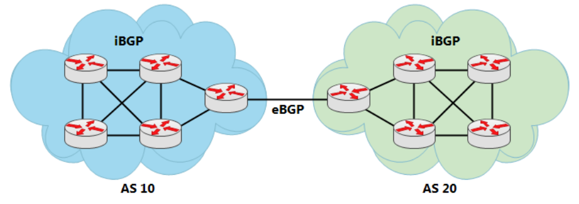
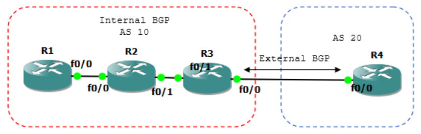
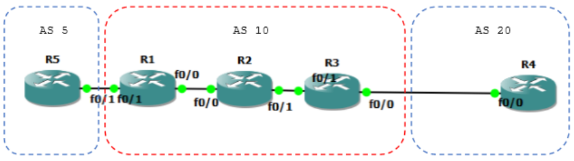
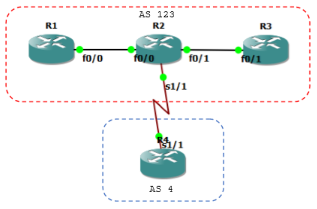
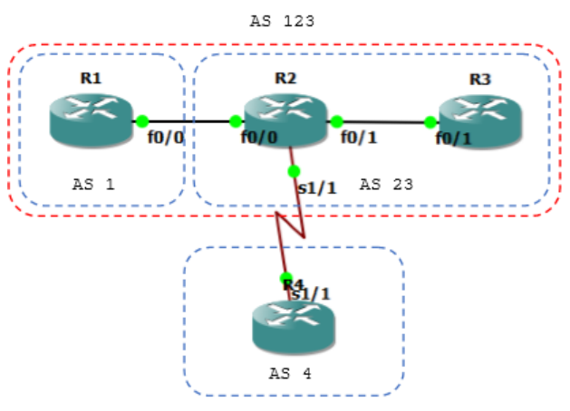
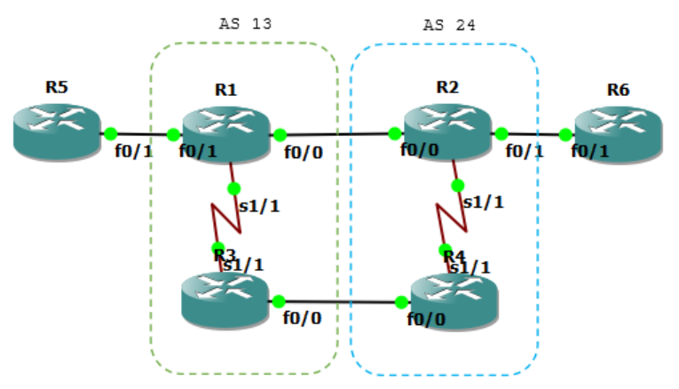
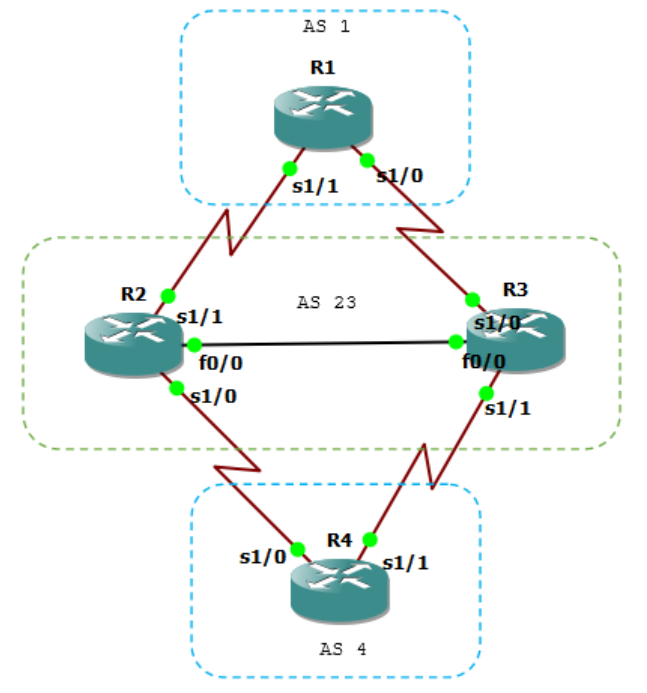

## BGP

### (Border Gateaway Protocol)

Border Router Gateway (BGP) adalah protocol yang membentuk jaringan internet. BGP termasuk Exterior Gateway Protocol (EGP) atau bisa dikatakan satu-satunya protocol EGP. EGP menghubungkan Autonomous System (AS) yang satu dengan yang lain. Autonomous System sendiri adalah kumpulan router yang berada dibawah satu administrative domain.

BGP menggunakan TCP port 179 untuk transport protocol. Agar 2 router BGP saling peer atau saling menjadi neighbor, harus dibangun TCP connection terlebih dahulu, setelah itu baru dapat dilakukan pertukaran informasi routing BGP antara 2 router.

BGP menentukan route berdasarkan kebijakan AS yang dilewati (Policy Based). Berbeda dengan protocol IGP yang menentukan route berdasarkan shortest path.

Setiap router BGP mempunyai Router ID, IP loopback tertinggi akan menjadi router ID, jika tidak ada loopback maka akan dipilih IP interface tertinggi.

### eBGP dan iBGP

Ketika BGP berjalan didalam router-router dalam 1 AS, disebut iBGP. BGP yang berjalan antar AS disebut eBGP. eBGP harus direct connected antara 2 router, namun iBGP tidak harus direct connected selama ada IGP baik itu EIGRP, OSPF, atau static routing yang berjalan dan menjadikan 2 router BGP tadi reachable satu sama lain.



iBGP juga digunakan ketika suatu AS menjadi transit AS menuju AS lain. Pertanyaannya, Kenapa tidak menggunakan IGP saja? RIP, EIGRP atau OSPF lalu diredistribute? Hal ini karena iBGP lebih efisien dan fleksibel untuk pertukaran routing information dalam suatu AS.

iBGP memberikan kebebasan untuk menentukan pintu keluar atau exit point suatu route dengan kesediaan attribute yang banyak. Alasan lainnya, banyak prefix akan memenuhi tabel routing jika dilakukan redistribute IGB dan BGP. Bayangkan saja, ada berapa ribu prefix di internet?

iBGP harus full mesh atau route reflector.

### Source Update via Loopback

Ketika interface yang dijadikan source update down, maka adjency BGP juga ajan down. Karena physical interface bisa down kapan saja, maka digunakan source update via loopback karena interface loopback tidak akan down. Umumnya digunakan dalam iBGP.

### Route MAP

Dalam BGP, route map digunakan untuk mengontrol dan memodifikasi informasi routing untuk incoming routes dan outcoming routes.

### Attribute BGP

Attribute dalam BGP juga sering disebut path attribute. Ada beberapa jenis attribute dalam BGP:

WELL KNOWN = ada pada setiap BGP

- Mandatory = ter-include pada setiap route BGP, jika attribute ini tidak ada akan muncul error message. Harus disertakan dalam setiap update.
  - AS Path
  - Origin
  - Next Hop

- Discreationay = setiap BGP … namun tidak tampil pada setiap route entry.
  - local preference
  - Atomic Aggregate

OPTIONAL

- Transitive
  - Community
  - Aggregator

- Non-Transitive
  - Multi Exit Discriminator (MED)

### AS Path

Ketika packet update route dikirim melewati suatu AS, maka AS Number tersebut akan ditambahkan ke dalam packet update. Jadi AS Path adalah urutan AS Number yang dilewati suatu route untuk sampai ke destination. Karena hal ini juga, BGP disebut juga path-vector protocol.

AS Path digunakan untuk loop detection.

### Origin

Origin mendefinisikan asal dari suatu path information. Ada 3 value dari origin attribute.

- IGP (i) = berasal dari BGP baik iBGP atau eBGP dengan perintah network x.x.x.x mask x.x.x.x
- EGP (e) = berasal dari protocol EGP, saat ini sudah tidak ada.
- INCOMPLETE (?) = berasal dari protocol lain(RIP, EIGRP, OSPF, Static) yang diredistribute ke BGP.

### BGP Route Selection Process

- Step 1: Prefer highest weight (local to router)
- Step 2: Prefer highest local preference (global within AS)
- Step 3: Prefer route originated by the local router
- Step 4: Prefer shortest AS path
- Step 5: Prefer lowest origin code (IGP < EGP < incomplete)
- Step 6: Prefer lowest MED (from other AS)
- Step 7: Prefer EBGP path over IBGP path
- Step 8: Prefer the path through the closest IGP neighbor
- Step 9: Prefer oldest route for EBGP paths
- Step 10: Prefer the path with the lowest neighbor BGP router ID

## BGP - iBGP Configuration



Ketikkan konfigurasi interface berikut.

```
R1(config)#int fa0/0
R1(config-if)#ip add 12.12.12.1 255.255.255.0
R1(config-if)#no sh
R1(config-if)#router ospf 1
R1(config-router)#net 0.0.0.0 255.255.255.255 area 0

R2(config)#int fa0/0
R2(config-if)#ip add 12.12.12.2 255.255.255.0
R2(config-if)#no sh
R2(config-if)#int f0/1
R2(config-if)#ip add 23.23.23.2 255.255.255.0
R2(config-if)#no sh
R2(config-if)#router ospf 1
R2(config-router)#net 0.0.0.0 255.255.255.255 area 0

R3(config)#int fa0/1
R3(config-if)#ip add 23.23.23.3 255.255.255.0
R3(config-if)#no sh
R3(config-if)#int fa0/0
R3(config-if)#ip add 34.34.34.3 255.255.255.0
R3(config-if)#no sh
R3(config-if)#router ospf 1
R3(config-router)#net 0.0.0.0 255.255.255.255 area 0
R3(config-router)#passive-interface fa0/0

R4(config)#int fa0/0
R4(config-if)#ip add 34.34.34.4 255.255.255.0
R4(config-if)#no sh
```

Oke pastikan R1 dapat mengeping R3.

```
R1(config-router)#do ping 23.23.23.3

Type escape sequence to abort.
Sending 5, 100-byte ICMP Echos to 23.23.23.3, timeout is 2 seconds:
!!!!!
Success rate is 100 percent (5/5), round-trip min/avg/max = 20/63/120 ms
R1(config-router)#
```

Konfigurasi iBGP antara R1 dengan R3 terlebih dahulu.

```
R1(config)#router bgp 10
R1(config-router)#neighbor 23.23.23.3 remote-as 10

R3(config)#router bgp 10
R3(config-router)#neighbor 12.12.12.1 remote-as 10

Cek show ip bgp summary pastikan sudah neighbornya sudah ada.

R1(config-router)#do sh ip bgp sum
BGP router identifier 12.12.12.1, local AS number 10
BGP table version is 1, main routing table version 1

Neighbor        V       AS  MsgRcvd MsgSent      TblVer  InQ OutQ Up/Down
State/PfxRcd
23.23.23.3      4       10        6       6           1    0    0 00:03:24          0
R1(config-router)#

R3(config-router)#do sh ip bgp sum
BGP router identifier 34.34.34.3, local AS number 10
BGP table version is 1, main routing table version 1

Neighbor        V       AS  MsgRcvd MsgSent      TblVer  InQ OutQ Up/Down
State/PfxRcd
12.12.12.1      4       10        6       6           1    0    0 00:03:43          0
R3(config-router)#
```

Oke sekarang buat interface loopback yang akan di advertise ke iBGP.

```
R1(config-router)#int lo11
R1(config-if)#ip add 11.11.11.11 255.255.255.255

R1(config-if)#router bgp 10
R1(config-router)#network 11.11.11.11 mask 255.255.255.255
```

Sekarang cek di R3, pastikan State/PfxRcd sudah tidak 0 lagi.

```
R3(config-router)#do sh ip bgp sum
BGP router identifier 34.34.34.3, local AS number 10
BGP table version is 3, main routing table version 3
1 network entries using 120 bytes of memory
1 path entries using 52 bytes of memory
2/1 BGP path/bestpath attribute entries using 248 bytes of memory
0 BGP route-map cache entries using 0 bytes of memory
0 BGP filter-list cache entries using 0 bytes of memory
BGP using 420 total bytes of memory
BGP activity 1/0 prefixes, 1/0 paths, scan interval 60 secs

Neighbor        V   AS MsgRcvd MsgSent  TblVer  InQ OutQ Up/Down State/PfxRcd
12.12.12.1      4   10      10       9       3    0    0 00:06:07       1
```

Cek network yang diadvertise.

```
R3(config-router)#do sh ip bgp
BGP table version is 3, local router ID is 34.34.34.3
Status codes: s suppressed, d damped, h history, * valid, > best, i -
internal,
                r RIB-failure, S Stale
Origin codes: i - IGP, e - EGP, ? - incomplete
    Network         Next Hop            Metric LocPrf Weight Path
r>i11.11.11.11/32   12.12.12.1               0    100      0 i
```

Cek ping dan sukses.

```
R3(config-router)#do ping 11.11.11.11

Type escape sequence to abort.
Sending 5, 100-byte ICMP Echos to 11.11.11.11, timeout is 2 seconds:
!!!!!
Success rate is 100 percent (5/5), round-trip min/avg/max = 56/72/96 ms
R3(config-router)#
```

## BGP - iBGP Update via Loopback


Interface fisik bisa down sewaktu-waktu sehingga adjency BGP juga bisa drop. Karena itu adjency BGP dilakukan melalui loopback.

Buat dulu interface loopback nya.

```
R1(config)#int lo0
R1(config-if)#ip add 1.1.1.1 255.255.255.255

R3(config)#int lo0
R3(config-if)#ip add 3.3.3.3 255.255.255.255
```

Sekarang konfigurasikan loopback sebagai neighbor.

```
R1(config-if)#router bgp 10
R1(config-router)#neighbor 3.3.3.3 remote-as 10

R3(config-if)#router bgp 10
R3(config-router)#neighbor 1.1.1.1 remote-as 10
```

Oke sekarang cek neighbor BGP nya.

```
R3(config-router)#do sh ip bgp sum
BGP router identifier 34.34.34.3, local AS number 10
BGP table version is 3, main routing table version 3
1 network entries using 120 bytes of memory
1 path entries using 52 bytes of memory
2/1 BGP path/bestpath attribute entries using 248 bytes of memory
0 BGP route-map cache entries using 0 bytes of memory
0 BGP filter-list cache entries using 0 bytes of memory
BGP using 420 total bytes of memory
BGP activity 1/0 prefixes, 1/0 paths, scan interval 60 secs

Neighbor        V   AS MsgRcvd MsgSent  TblVer  InQ OutQ Up/Down    State/PfxRcd
1.1.1.1         4   10       0       0       0    0    0 never      Active
12.12.12.1      4   10       8       7       3    0    0 00:04:20       1
```

Ups... ternyata adjency melalui loopback belum berhasil, walau state sudah active tapi PfxRcd masih belum ada. Tambahkan perintah berikut.

```
R3(config-router)#neighbor 1.1.1.1 update-source loopback0
*Mar 1 00:06:33.639: %BGP-5-ADJCHANGE: neighbor 1.1.1.1 Up

R1(config-router)#neighbor 3.3.3.3 update-source loopback0
*Mar 1 00:06:20.067: %BGP-5-ADJCHANGE: neighbor 3.3.3.3 Up
```

Oke cek lagi.

```
R3(config-router)#do sh ip bgp sum
BGP router identifier 34.34.34.3, local AS number 10
BGP table version is 3, main routing table version 3
1 network entries using 120 bytes of memory
2 path entries using 104 bytes of memory
2/1 BGP path/bestpath attribute entries using 248 bytes of memory
0 BGP route-map cache entries using 0 bytes of memory
0 BGP filter-list cache entries using 0 bytes of memory
BGP using 472 total bytes of memory
BGP activity 1/0 prefixes, 2/0 paths, scan interval 60 secs

Neighbor        V   AS MsgRcvd MsgSent  TblVer  InQ OutQ Up/Down
State/PfxRcd
1.1.1.1         4   10      11      10       3    0    0 00:06:02       1
12.12.12.1      4   10      15      14       3    0    0 00:11:08       1
R3(config-router)#
```

Sip... sudah berubah. Hapus dulu adjency 12.12.12.1 dan 23.23.23.3.

```
R3(config-router)#no neighbor 12.12.12.1
*Mar 1 00:14:47.347: %BGP-5-ADJCHANGE: neighbor 12.12.12.1 Down Neighbor
deleted

R1(config-router)#
*Mar 1 00:14:33.951: %BGP-5-ADJCHANGE: neighbor 23.23.23.3 Down Peer closed
the session
R1(config-router)#no neighbor 23.23.23.3
```

Oke cek lagi dan neighbor nya hanya ada 1.

```
R3(config-router)#do sh ip bgp sum
BGP router identifier 34.34.34.3, local AS number 10
BGP table version is 4, main routing table version 4
1 network entries using 120 bytes of memory
1 path entries using 52 bytes of memory
2/1 BGP path/bestpath attribute entries using 248 bytes of memory
0 BGP route-map cache entries using 0 bytes of memory
0 BGP filter-list cache entries using 0 bytes of memory
BGP using 420 total bytes of memory
BGP activity 1/0 prefixes, 2/1 paths, scan interval 60 secs

Neighbor        V   AS MsgRcvd MsgSent  TblVer  InQ OutQ Up/Down
State/PfxRcd
1.1.1.1         4   10      14      13       4    0    0 00:09:13       1
R3(config-router)#
```

Dan yang terakhir, tes ping.

```
R3(config-router)#do ping 11.11.11.11

Type escape sequence to abort.
Sending 5, 100-byte ICMP Echos to 11.11.11.11, timeout is 2 seconds:
!!!!!
Success rate is 100 percent (5/5), round-trip min/avg/max = 44/87/140 ms
R3(config-router)#
```

Siipp... berhasil.

## BGP – eBGP Configuration


Konfigurasi eBGP pada R3 dan R4.

```
R3(config)#router bgp 10
R3(config-router)#neighbor 34.34.34.4 remote-as 20
*Mar 1 00:03:03.087: %BGP-5-ADJCHANGE: neighbor 34.34.34.4 Up

R4(config)#router bgp 20
R4(config-router)#neighbor 34.34.34.3 remote-as 10
*Mar 1 00:02:03.487: %BGP-5-ADJCHANGE: neighbor 34.34.34.3 Up
```

Cek neighbor.

```
R4(config-router)#do sh ip bgp sum
Neighbor        V   AS MsgRcvd MsgSent  TblVer  InQ OutQ Up/Down
State/PfxRcd
34.34.34.3      4   10       5       4       2    0    0 00:00:02       1
R4(config-router)#

R3(config-router)#do sh ip bgp sum
Neighbor        V   AS MsgRcvd MsgSent  TblVer  InQ OutQ Up/Down
State/PfxRcd
1.1.1.1         4   10       7       6       3    0    0 00:03:49       1
34.34.34.4      4   20       6       7       3    0    0 00:02:06       0
```

Oke sekarang cek tabek bgp dan tes ping.

```
R4#sh ip bgp
BGP table version is 2, local router ID is 34.34.34.4
Status codes: s suppressed, d damped, h history, * valid, > best, i -
internal,
            r RIB-failure, S Stale

Origin codes: i - IGP, e - EGP, ? - incomplete

    Network         Next Hop        Metric LocPrf Weight Path
*>  11.11.11.11/32  34.34.34.3                         0 10 i
R4(config-router)#do ping 11.11.11.11

Type escape sequence to abort.
Sending 5, 100-byte ICMP Echos to 11.11.11.11, timeout is 2 seconds:
!!!!!
Success rate is 100 percent (5/5), round-trip min/avg/max = 68/94/148 ms
R4(config-router)#
```

Berhasil. Path menunjukkan bahwa network 11.11.11.11 diadvertise ke dalam iBGP (ditandai dengan i) dari AS 10.

Oke fix.

## BGP – eBGP Configuration 2


Oke lanjutan lab sebelumnya. Buatlah interface loopback di R4 dan advertise ke BGP 20.

```
R4(config)#int lo44
*Mar 1 00:18:42.419: %LINEPROTO-5-UPDOWN: Line protocol on Interface
Loopback44, changed state to up
R4(config-if)#ip add 44.44.44.44 255.255.255.255
R4(config-if)#router bgp 20
R4(config-router)#network 44.44.44.44 mask 255.255.255.255
R4(config-router)#do sh ip bgp
BGP table version is 3, local router ID is 34.34.34.4
Status codes: s suppressed, d damped, h history, * valid, > best, i -
internal,
            r RIB-failure, S Stale
Origin codes: i - IGP, e - EGP, ? - incomplete

    Network         Next Hop        Metric LocPrf Weight Path
*> 11.11.11.11/32   34.34.34.3                         0 10 i
*> 44.44.44.44/32   0.0.0.0              0         32768 i
R4(config-router)#
```

Sekarang coba ping dari R3.

```
R3#ping 44.44.44.44

Type escape sequence to abort.
Sending 5, 100-byte ICMP Echos to 44.44.44.44, timeout is 2 seconds:
!!!!!
Succes
```

Klo dari R1?

```
Type escape sequence to abort.
Sending 5, 100-byte ICMP Echos to 44.44.44.44, timeout is 2 seconds:
UUUUU
Success rate is 0 percent (0/5)

R1#sh ip route
Gateway of last resort is not set

    34.0.0.0/24 is subnetted, 1 subnets
O       34.34.34.0 [110/30] via 12.12.12.2, 00:23:17, FastEthernet0/0
    1.0.0.0/32 is subnetted, 1 subnets
C       1.1.1.1 is directly connected, Loopback0
    3.0.0.0/32 is subnetted, 1 subnets
O       3.3.3.3 [110/21] via 12.12.12.2, 00:23:17, FastEthernet0/0
    23.0.0.0/24 is subnetted, 1 subnets
O       23.23.23.0 [110/20] via 12.12.12.2, 00:23:17, FastEthernet0/0
    11.0.0.0/32 is subnetted, 1 subnets
C       11.11.11.11 is directly connected, Loopback11
    12.0.0.0/24 is subnetted, 1 subnets
C       12.12.12.0 is directly connected, FastEthernet0/0
    44.0.0.0/32 is subnetted, 1 subnets
B       44.44.44.44 [200/0] via 34.34.34.4, 00:04:24
R1#
```

Upsss... unreachable. Padahal network 44.44.44.44 sudah ada di tabel routing. Coba di traceroute dulu ah.

```
R1#traceroute 44.44.44.44

Type escape sequence to abort.
Tracing the route to 44.44.44.44

    1 12.12.12.2 76 msec 80 msec 44 msec
    2 12.12.12.2 !H !H !H
R1#
```

Ternyata berhenti di R2. Lalu bagaimana solusinya? Cek tabel routing pada R4.

```
R4#sh ip ro
Codes:  C - connected, S - static, R - RIP, M - mobile, B - BGP
        D - EIGRP, EX - EIGRP external, O - OSPF, IA - OSPF inter area
        N1 - OSPF NSSA external type 1, N2 - OSPF NSSA external type 2
        E1 - OSPF external type 1, E2 - OSPF external type 2
        i - IS-IS, su - IS-IS summary, L1 - IS-IS level-1, L2 - IS-IS level-2
        ia - IS-IS inter area, * - candidate default, U - per-user static
route
        o - ODR, P - periodic downloaded static route

Gateway of last resort is not set

    34.0.0.0/24 is subnetted, 1 subnets
C       34.34.34.0 is directly connected, FastEthernet0/0
    23.0.0.0/24 is subnetted, 1 subnets
B       23.23.23.0 [20/0] via 34.34.34.3, 00:01:22
    11.0.0.0/32 is subnetted, 1 subnets
B       11.11.11.11 [20/0] via 34.34.34.3, 00:02:38
    44.0.0.0/32 is subnetted, 1 subnets
C       44.44.44.44 is directly connected, Loopback44
R4#
```

Ternyata hanya ada IP 11.11.11.11 yang dikenali. Gunakan IP tersebut sebagai source.

```
R1#ping
Protocol [ip]:
Target IP address: 44.44.44.44
Repeat count [5]:
Datagram size [100]:
Timeout in seconds [2]:
Extended commands [n]: y
Source address or interface: 11.11.11.11
Type of service [0]:
Set DF bit in IP header? [no]:
Validate reply data? [no]:
Data pattern [0xABCD]:
Loose, Strict, Record, Timestamp, Verbose[none]:
Sweep range of sizes [n]:
Type escape sequence to abort.
Sending 5, 100-byte ICMP Echos to 44.44.44.44, timeout is 2 seconds:
Packet sent with a source address of 11.11.11.11
UUUUU
Success rate is 0 percent (0/5)
R1#
```

Upss... ternyata masih belum bisa. Disitu kadang saya merasa sedih...

Caranya... angkat R2 menjadi iBGP juga. Syarat iBGP adalah full mesh atau bisa juga route reflector. Klo full mesh berarti setiap router harus punya satu link ke setiap router lain.

```
R2(config)#int lo0
R2(config-if)#ip add 2.2.2.2 255.255.255.255
R2(config-if)#router bgp 10
R2(config-router)#neighbor 1.1.1.1 remote-as 10
R2(config-router)#neighbor 1.1.1.1 up lo0
R2(config-router)#neighbor 3.3.3.3 remote-as 10
R2(config-router)#neighbor 3.3.3.3 up lo0

R1(config)#router bgp 10
R1(config-router)#neighbor 2.2.2.2 remote-as 10
R1(config-router)#neighbor 2.2.2.2 up lo0

R3(config)#router bgp 10
R3(config-router)#neighbor 2.2.2.2 remot 10
R3(config-router)#neighbor 2.2.2.2 up lo0
```

Oke cek lagi.

```
R1#ping
Protocol [ip]:
Target IP address: 44.44.44.44
Repeat count [5]:
Datagram size [100]:
Timeout in seconds [2]:
Extended commands [n]: y
Source address or interface: 11.11.11.11
Type of service [0]:
Set DF bit in IP header? [no]:
Validate reply data? [no]:
Data pattern [0xABCD]:
Loose, Strict, Record, Timestamp, Verbose[none]:
Sweep range of sizes [n]:
Type escape sequence to abort.
Sending 5, 100-byte ICMP Echos to 44.44.44.44, timeout is 2 seconds:
Packet sent with a source address of 11.11.11.11
!!!!!
Success rate is 100 percent (5/5), round-trip min/avg/max = 144/196/264 ms
R1#
```

Hal ini dikarenakan secara default source yang dipakai untuk ping adalah interface phisicalnya. Jadi tinggal advertise network interfacenya ke dalam BGP.

```
R1(config)#router bgp 10
R1(config-router)#network 12.12.12.0 mask 255.255.255.0
R1(config-router)#do ping 44.44.44.44

Type escape sequence to abort.
Sending 5, 100-byte ICMP Echos to 44.44.44.44, timeout is 2 seconds:
!!!!!
Success rate is 100 percent (5/5), round-trip min/avg/max = 64/150/204 ms
R1(config-router)#
```

Oke sekarang coba ping 44.44.44.44 dari R2.

```
R2#ping 44.44.44.44

Type escape sequence to abort.
Sending 5, 100-byte ICMP Echos to 44.44.44.44, timeout is 2 seconds:
.....
Success rate is 0 percent (0/5)
R2#tra
R2#traceroute 44.44.44.44

Type escape sequence to abort.
Tracing the route to 44.44.44.44

  1 23.23.23.3 72 msec 72 msec 68 msec
  2 * * *
  3
R2#
```

Gagal ya? Trace nya berakhir di R3. Klo begitu advertise network 23.23.23.0 pada
R3 ke BGP.

```
R3(config)#router bgp 10
R3(config-router)#net 23.23.23.0 mask 255.255.255.0

R2#ping 44.44.44.44

Type escape sequence to abort.
Sending 5, 100-byte ICMP Echos to 44.44.44.44, timeout is 2 seconds:
!!!!!
Success rate is 100 percent (5/5), round-trip min/avg/max = 68/102/144 ms
R2#
```

Good Job...

## BGP – eBGP Configuration 3



Masih pake topologi sebelumnya cuma tambahin R5 disebelah kiri.

```
R1(config)#int fa0/1
R1(config-if)#ip add 15.15.15.1 255.255.255.0
R1(config-if)#no sh
R1(config-if)#router bgp 10
R1(config-router)#nei 15.15.15.5 remot 5

R5(config)#int fa0/1
R5(config-if)#ip add 15.15.15.5 255.255.255.0
R5(config-if)#no sh
R5(config-if)#router bgp 5
R5(config-router)#neighbor 15.15.15.1 remot 10

R5(config-router)#do sh ip bgp
BGP table version is 4, local router ID is 15.15.15.5
Status codes: s suppressed, d damped, h history, * valid, > best, i -
internal,
            r RIB-failure, S Stale
Origin codes: i - IGP, e - EGP, ? - incomplete
    Network         Next Hop        Metric LocPrf Weight Path
*> 11.11.11.11/32   15.15.15.1           0             0 10 i
*> 12.12.12.0/24    15.15.15.1           0             0 10 i
*> 44.44.44.44/32   15.15.15.1                         0 10 20 i
R5(config-router)#
```

Sekarang ping dan trace ke R4 pada AS 20.

```
R5#ping 44.44.44.44

Type escape sequence to abort.
Sending 5, 100-byte ICMP Echos to 44.44.44.44, timeout is 2 seconds:
.....
Success rate is 0 percent (0/5)
R5#trac 44.44.44.44

Type escape sequence to abort.
Tracing the route to 44.44.44.44

  1 15.15.15.1 92 msec 76 msec 92 msec
  2 12.12.12.2 [AS 10] 96 msec 60 msec 60 msec
  3 23.23.23.3 152 msec 156 msec 88 msec
  4
R5#
```

Ups gagal... solusinya R5 harus mengadvertise source network nya.

```
R5(config)#router bgp 5
R5(config-router)#network 15.15.15.0 mask 255.255.255.0
R5#ping 44.44.44.44

Type escape sequence to abort.
Sending 5, 100-byte ICMP Echos to 44.44.44.44, timeout is 2 seconds:
!!!!!
Success rate is 100 percent (5/5), round-trip min/avg/max = 188/251/304 ms
R5#
```

Sekarang kita lakukan sedikit percobaan. Hapus bgp 10 pada R2. Sebelumnya copy dulu konfigurasi BGP nya ke notepad.

```
R2#sh run | s r b
router bgp 10
    no synchronization
    bgp log-neighbor-changes
    neighbor 1.1.1.1 remote-as 10
    neighbor 1.1.1.1 update-source Loopback0
    neighbor 3.3.3.3 remote-as 10
    neighbor 3.3.3.3 update-source Loopback0
    no auto-summary

R2(config)#no router bgp 10
*Mar 1 00:10:49.335: %BGP-5-ADJCHANGE: neighbor 1.1.1.1 Down BGP protocol
initialization
*Mar 1 00:10:49.335: %BGP-5-ADJCHANGE: neighbor 3.3.3.3 Down BGP protocol
initialization
```

Cek ping R5 ke R4.

```
R5#ping 44.44.44.44

Type escape sequence to abort.
Sending 5, 100-byte ICMP Echos to 44.44.44.44, timeout is 2 seconds:
UUUUU
Success rate is 0 percent (0/5)
R5#
```

Sekarang balikin lagi konfigurasi BGP 10 ke R2 dan cek lagi.

```
R5#ping 44.44.44.44

Type escape sequence to abort.
Sending 5, 100-byte ICMP Echos to 44.44.44.44, timeout is 2 seconds:
!!!!!
Success rate is 100 percent (5/5), round-trip min/avg/max = 156/218/276 ms
R5#
```

Oke sip. Kesimpulannya? ... Tulis sendiri ya.

## BGP – Next Hop Self


Lanjutin lab 4 yang lebih simpel dan enteng.

```
R2#sh ip route
Gateway of last resort is not set

    34.0.0.0/24 is subnetted, 1 subnets
O       34.34.34.0 [110/20] via 23.23.23.3, 00:01:53, FastEthernet0/1
    1.0.0.0/32 is subnetted, 1 subnets
O       1.1.1.1 [110/11] via 12.12.12.1, 00:01:53, FastEthernet0/0
    2.0.0.0/32 is subnetted, 1 subnets
C       2.2.2.2 is directly connected, Loopback0
    3.0.0.0/32 is subnetted, 1 subnets
O       3.3.3.3 [110/11] via 23.23.23.3, 00:01:53, FastEthernet0/1
    23.0.0.0/24 is subnetted, 1 subnets
C       23.23.23.0 is directly connected, FastEthernet0/1
    11.0.0.0/32 is subnetted, 1 subnets
O       11.11.11.11 [110/11] via 12.12.12.1, 00:01:54, FastEthernet0/0
    12.0.0.0/24 is subnetted, 1 subnets
C       12.12.12.0 is directly connected, FastEthernet0/0
    44.0.0.0/32 is subnetted, 1 subnets
B       44.44.44.44 [200/0] via 34.34.34.4, 00:01:06
R2#sh ip bgp
BGP table version is 8, local router ID is 2.2.2.2
Status codes: s suppressed, d damped, h history, * valid, > best, i -
internal,
            r RIB-failure, S Stale
Origin codes: i - IGP, e - EGP, ? - incomplete
    Network         Next Hop        Metric LocPrf Weight Path
r>i11.11.11.11/32   1.1.1.1              0    100      0 i
r>i12.12.12.0/24    1.1.1.1              0    100      0 i
r>i23.23.23.0/24    3.3.3.3              0    100      0 i
*>i44.44.44.44/32   34.34.34.4           0    100      0 20 i
R2#
```

Ketika default network ospf R3 dihapus, maka route nya hilang.

```
R3(config)#router ospf 1
R3(config-router)#no network 0.0.0.0 255.255.255.255 area 0
Gateway of last resort is not set

    1.0.0.0/32 is subnetted, 1 subnets
O       1.1.1.1 [110/11] via 12.12.12.1, 00:05:18, FastEthernet0/0
    2.0.0.0/32 is subnetted, 1 subnets
C       2.2.2.2 is directly connected, Loopback0
    23.0.0.0/24 is subnetted, 1 subnets
C       23.23.23.0 is directly connected, FastEthernet0/1
    11.0.0.0/32 is subnetted, 1 subnets
O       11.11.11.11 [110/11] via 12.12.12.1, 00:05:18, FastEthernet0/0
    12.0.0.0/24 is subnetted, 1 subnets
C       12.12.12.0 is directly connected, FastEthernet0/0
R2#sh ip bgp
BGP table version is 10, local router ID is 2.2.2.2
Status codes: s suppressed, d damped, h history, * valid, > best, i -
internal,
            r RIB-failure, S Stale
Origin codes: i - IGP, e - EGP, ? - incomplete
    Network         Next Hop        Metric LocPrf Weight Path
r>i11.11.11.11/32   1.1.1.1              0    100      0 i
r>i12.12.12.0/24    1.1.1.1              0    100      0 i
* i23.23.23.0/24    3.3.3.3              0    100      0 i
* i44.44.44.44/32   34.34.34.4           0    100      0 20 i
R2#
```

iBGP tidak memilih next-hop nya sendiri, dalam hal ini dia numpang sama OSPF. Karena OSPF dihapus, maka route BGP tidak muncul dalam tabel routing. Namun, kita bisa mengkonfigurasi next-hop secara manual pada iBGP.

```
R2(config-router)#router bgp 10
R2(config-router)#neighbor 23.23.23.3 remot 10

R3(config-router)#router bgp 10
R3(config-router)#neighbor 23.23.23.2 remot 10
R3(config-router)#neighbor 23.23.23.2 next-hop-self
```

Sekarang cek lagi.

```
R2#sh ip bgp sum
BGP router identifier 2.2.2.2, local AS number 10
BGP table version is 13, main routing table version 13
4 network entries using 480 bytes of memory
4 path entries using 208 bytes of memory
3/2 BGP path/bestpath attribute entries using 372 bytes of memory
1 BGP AS-PATH entries using 24 bytes of memory
0 BGP route-map cache entries using 0 bytes of memory
0 BGP filter-list cache entries using 0 bytes of memory
BGP using 1084 total bytes of memory
BGP activity 6/2 prefixes, 6/2 paths, scan interval 60 secs

Neighbor        V       AS MsgRcvd MsgSent  TblVer  InQ OutQ Up/Down
State/PfxRcd
1.1.1.1         4       10      18      16      13    0    0 00:13:04        2
3.3.3.3         4       10      10      12       0    0    0 00:06:10 Active
23.23.23.3      4       10      8        6      13    0    0 00:02:33        2
R2#sh ip bgp
BGP table version is 13, local router ID is 2.2.2.2
Status codes: s suppressed, d damped, h history, * valid, > best, i -
internal,
            r RIB-failure, S Stale
Origin codes: i - IGP, e - EGP, ? - incomplete

    Network         Next Hop        Metric LocPrf Weight Path
r>i11.11.11.11/32   1.1.1.1              0    100      0 i
r>i12.12.12.0/24    1.1.1.1              0    100      0 i
r>i23.23.23.0/24    23.23.23.3           0    100      0 i
*>i44.44.44.44/32   23.23.23.3           0    100      0 20 i
R2#sh ip route
Codes:  C - connected, S - static, R - RIP, M - mobile, B - BGP
        D - EIGRP, EX - EIGRP external, O - OSPF, IA - OSPF inter area
        N1 - OSPF NSSA external type 1, N2 - OSPF NSSA external type 2
        E1 - OSPF external type 1, E2 - OSPF external type 2
        i - IS-IS, su - IS-IS summary, L1 - IS-IS level-1, L2 - IS-IS level-2
        ia - IS-IS inter area, * - candidate default, U - per-user static
route
        o - ODR, P - periodic downloaded static route

Gateway of last resort is not set

    1.0.0.0/32 is subnetted, 1 subnets
O       1.1.1.1 [110/11] via 12.12.12.1, 00:13:39, FastEthernet0/0
    2.0.0.0/32 is subnetted, 1 subnets
C       2.2.2.2 is directly connected, Loopback0
    23.0.0.0/24 is subnetted, 1 subnets
C       23.23.23.0 is directly connected, FastEthernet0/1
    11.0.0.0/32 is subnetted, 1 subnets
O       11.11.11.11 [110/11] via 12.12.12.1, 00:13:39, FastEthernet0/0
    12.0.0.0/24 is subnetted, 1 subnets
C       12.12.12.0 is directly connected, FastEthernet0/0
    44.0.0.0/32 is subnetted, 1 subnets
B       44.44.44.44 [200/0] via 23.23.23.3, 00:02:49
R2#ping 44.44.44.44

Type escape sequence to abort.
Sending 5, 100-byte ICMP Echos to 44.44.44.44, timeout is 2 seconds:
!!!!!
Success rate is 100 percent (5/5), round-trip min/avg/max = 48/78/112 ms
R2#
```

Sip dah.

## BGP – Authentication


```
R2(config)#router bgp 10
R2(config-router)#neighbor 1.1.1.1 password ?
    <0-7> Encryption type (0 to disable encryption, 7 for proprietary)

R2(config-router)#neighbor 1.1.1.1 password 0 HAHAHA

R1(config)#router bgp 10
R1(config-router)#neighbor 2.2.2.2 password 0 HAHAHA
*Mar 1 00:05:09.383: %BGP-3-NOTIFICATION: received from neighbor 2.2.2.2
4/0 (hold time expired) 0 bytes
R1(config)#
*Mar 1 00:05:09.383: %BGP-5-ADJCHANGE: neighbor 2.2.2.2 Down BGP
Notification received
*Mar 1 00:05:36.667: %BGP-5-ADJCHANGE: neighbor 2.2.2.2 Up
```

Oke selesai. Gampangkan.

## BGP Route Reflector


Balik lagi ke topologi lab 5. Pada iBGP, peers nya harus full mesh. Masalah terjadi ketika ada router baru yang tersambung. Artinya harus dikonfigurasi peer yang baru satu per satu.

Solusinya adalah menjadikan salah saru router menjadi Route Reflector(RR) sehingga hanya RR yang full mesh ke semua router sedang router lain hanya perlu peer ke RR.

Yang mau kita konfigurasi adalah iBGP AS 10. R1 akan kita jadikan RR.

```
R1#sh run | s r b
router bgp 10
 no synchronization
 bgp log-neighbor-changes
 network 11.11.11.11 mask 255.255.255.255
 network 12.12.12.0 mask 255.255.255.0
 neighbor 2.2.2.2 remote-as 10
 neighbor 2.2.2.2 update-source Loopback0
 neighbor 3.3.3.3 remote-as 10
 neighbor 3.3.3.3 update-source Loopback0
 neighbor 15.15.15.5 remote-as 5
 no auto-summary
R1#
```

Karena sudah dikonfigurasi sebelumnya, tinggal mengeset route-reflector-client aja.

```
R1(config)#router bgp 10
R1(config-router)#neighbor 2.2.2.2 route-reflector-client
R1(config-router)#neighbor 3.3.3.3 route-reflector-client
*Mar 1 00:11:20.291: %BGP-5-ADJCHANGE: neighbor 2.2.2.2 Down RR client
config change
R1(config-router)#neighbor 2.2.2.2 route-reflector-client
*Mar 1 00:11:22.543: %BGP-5-ADJCHANGE: neighbor 2.2.2.2 Up
*Mar 1 00:11:30.891: %BGP-5-ADJCHANGE: neighbor 3.3.3.3 Down RR client
config change
*Mar 1 00:11:33.275: %BGP-5-ADJCHANGE: neighbor 3.3.3.3 Up
```

Sekarang hapus peer pada R2 dan R3 yang tidak mengarah ke R1.

```
R2(config-router)#no neighbor 3.3.3.3 remot 10
R3(config-router)#no neighbor 2.2.2.2 remot 10
```

Untuk pengecekan, buat interface loopback dan advertise ke iBGP.

```
R2(config)#int lo22
R2(config-if)#ip add 22.22.22.22 255.255.255.255
R2(config-if)#router bgp 10
R2(config-router)#net 22.22.22.22 mask 255.255.255.255
```

Pastikan R1 dan R3 bisa ping.

```
R1#ping 22.22.22.22

Type escape sequence to abort.
Sending 5, 100-byte ICMP Echos to 22.22.22.22, timeout is 2 seconds:
!!!!!
Success rate is 100 percent (5/5), round-trip min/avg/max = 16/52/80 ms
R1#
R3#ping 22.22.22.22

Type escape sequence to abort.
Sending 5, 100-byte ICMP Echos to 22.22.22.22, timeout is 2 seconds:
!!!!!
Success rate is 100 percent (5/5), round-trip min/avg/max = 20/53/88 ms
R3#
```

Dan ketika dicek, peer atau networknya hanya ada satu.

```
R2#sh ip bgp sum
BGP router identifier 2.2.2.2, local AS number 10
BGP table version is 19, main routing table version 19
5 network entries using 600 bytes of memory
5 path entries using 260 bytes of memory
5/4 BGP path/bestpath attribute entries using 620 bytes of memory
1 BGP rrinfo entries using 24 bytes of memory
2 BGP AS-PATH entries using 48 bytes of memory
0 BGP route-map cache entries using 0 bytes of memory
0 BGP filter-list cache entries using 0 bytes of memory
Bitfield cache entries: current 1 (at peak 1) using 32 bytes of memory
BGP using 1584 total bytes of memory
BGP activity 5/0 prefixes, 10/5 paths, scan interval 60 secs

Neighbor        V       AS MsgRcvd MsgSent  TblVer  InQ OutQ Up/Down
State/PfxRcd
1.1.1.1         4       10      35      28      19    0    0 00:10:28   4
R2#
```

Oke fix.

## BGP Attribute - Origin


Buat interface loopback untuk diredistribute ke BGP.

```
R2(config)#int lo222
R2(config-if)#ip add 222.222.222.222 255.255.255.255
R2(config-if)#router rip
R2(config-router)#net 222.222.222.0
R2(config-router)#router bgp 10
R2(config-router)#redistribute rip

R5#sh ip bgp
BGP table version is 8, local router ID is 15.15.15.5
Status codes: s suppressed, d damped, h history, * valid, > best, i -
internal,
            r RIB-failure, S Stale
Origin codes: i - IGP, e - EGP, ? - incomplete

    Network             Next Hop        Metric LocPrf Weight Path
*>  11.11.11.11/32 1    5.15.15.1       0                  0 10 i
*>  12.12.12.0/24       15.15.15.1      0                  0 10 i
*>  15.15.15.0/24       0.0.0.0         0              32768 i
*>  22.22.22.22/32      15.15.15.1                         0 10 i
*>  23.23.23.0/24       15.15.15.1                         0 10 i
*>  44.44.44.44/32      15.15.15.1                         0 10 20 i
*>  222.222.222.222/32  15.15.15.1                         0 10 ?
R5#ping 222.222.222.222

Type escape sequence to abort.
Sending 5, 100-byte ICMP Echos to 222.222.222.222, timeout is 2 seconds:
!!!!!
Success rate is 100 percent (5/5), round-trip min/avg/max = 32/80/108 ms
R5#
```

Pada path ada beberapa keterangan origin code:

i = berasal dari BGP baik iBGP atau eBGP dengan perintah network x.x.x.x mask x.x.x.x

e = berasal dari protocol EGP, saat ini sudah tidak ada.

? = berasal dari protocol lain(RIP, EIGRP, OSPF, Static) yang diredistribute ke BGP.

R5 menuju 222.222.222.222/32 melalui 15.15.15.1 dengan path 10 ?. Artinya Next AS Path nya adalah 200 dengan origin code adalah ? artinya terjadi melalui redistribute protocol lain ke BGP.

## BGP Attribute - Community



```
R1(config)#int lo0
R1(config-if)#ip add 1.1.1.1 255.255.255.255
R1(config-if)#int lo11
R1(config-if)#ip add 11.11.11.11 255.255.255.255
R1(config-if)#int fa0/0
R1(config-if)#ip add 12.12.12.1 255.255.255.0
R1(config-if)#router ospf 1
R1(config-router)#net 1.1.1.1 0.0.0.0 area 0
R1(config-router)#net 12.12.12.0 0.0.0.255 area 0

R2(config)#int lo0
R2(config-if)#ip add 2.2.2.2 255.255.255.255
R2(config-if)#int lo22
R2(config-if)#ip add 22.22.22.22 255.255.255.255
R2(config-if)#int fa0/0
R2(config-if)#no sh
R2(config-if)#ip add 12.12.12.2 255.255.255.0
R2(config-if)#int fa0/1
R2(config-if)#ip add 23.23.23.2 255.255.255.0
R2(config-if)#no sh
R2(config-if)#int s1/1
R2(config-if)#ip add 24.24.24.2 255.255.255.0
R2(config-if)#no sh
R2(config)#router ospf 1
R2(config-router)#net 2.2.2.2 0.0.0.0 area 0

R2(config-router)#net 12.12.12.0 0.0.0.255 area 0
R2(config-router)#net 24.24.24.0 0.0.0.255 area 0
R2(config-router)#net 23.23.23.0 0.0.0.255 area 0
R3(config)#int lo0
R3(config-if)#ip add 3.3.3.3 255.255.255.255
R3(config-if)#int lo33
R3(config-if)#ip add 33.33.33.33 255.255.255.255
R3(config-if)#int fa0/1
R3(config-if)#no sh
R3(config-if)#ip add 23.23.23.
R3(config-if)#ip add 23.23.23.3 255.255.255.0
R3(config-if)#router ospf 1
R3(config-router)#net 3.3.3.3 0.0.0.0 area 0
R3(config-router)#net 23.23.23.0 0.0.0.255 area 0

R4(config-if)#int lo0
R4(config-if)#ip add 4.4.4.4 255.255.255.255
R4(config-if)#int s1/1
R4(config-if)#ip add 24.24.24.24 255.255.255.0
R4(config-if)#no sh
```

Konfigurasi BGP. R1 sebagai RR.

```
R1(config-router)#router bgp 123
R1(config-router)#neighbor 2.2.2.2 remote-as 123
R1(config-router)#neighbor 2.2.2.2 update-source loopback0
R1(config-router)#network 11.11.11.11 mask 255.255.255.255

R2(config-router)#router bgp 123
R2(config-router)#neighbor 1.1.1.1 remote-as 123
R2(config-router)#neighbor 3.3.3.3 remote-as 123
R2(config-router)#neighbor 24.24.24.4 remote-as 4
R2(config-router)#neighbor 1.1.1.1 update-source loopback 0
R2(config-router)#neighbor 3.3.3.3 update-source loopback 0
R2(config-router)#neighbor 1.1.1.1 route-reflector-client
R2(config-router)#neighbor 3.3.3.3 route-reflector-client
R2(config-router)#network 22.22.22.22 mask 255.255.255.255

R3(config)#router bgp 123
R3(config-router)#neighbor 2.2.2.2 remote-as 123
R3(config-router)#neighbor 2.2.2.2 up lo0
R3(config-router)#network 33.33.33.33 mask 255.255.255.255

R4(config-if)#router bgp 4
R4(config-router)#neighbor 24.24.24.2 remot 123
R4(config-router)#network 4.4.4.4 mask 255.255.255.255
```

Sekarang cek bgp route di R1 dan R4.

```
R1#sh ip bgp
BGP table version is 4, local router ID is 11.11.11.11
Status codes: s suppressed, d damped, h history, * valid, > best, i -
internal,
            r RIB-failure, S Stale
Origin codes: i - IGP, e - EGP, ? - incomplete

    Network             Next Hop        Metric LocPrf Weight Path
* i4.4.4.4/32           24.24.24.4           0    100      0 4 i
*>  11.11.11.11/32       0.0.0.0              0         32768 i
*>i22.22.22.22/32       2.2.2.2              0    100      0 i
*>i33.33.33.33/32       3.3.3.3              0    100      0 i
R1#

R4#sh ip bgp
BGP table version is 5, local router ID is 4.4.4.4
Status codes: s suppressed, d damped, h history, * valid, > best, i -
internal,
            r RIB-failure, S Stale
Origin codes: i - IGP, e - EGP, ? - incomplete

    Network             Next Hop        Metric LocPrf Weight Path
*>  4.4.4.4/32          0.0.0.0              0         32768 i
*>  11.11.11.11/32      24.24.24.2                         0 123 i
*>  22.22.22.22/32      24.24.24.2           0             0 123 i
*>  33.33.33.33/32      24.24.24.2                         0 123 i
R4#
```

Ada beberapa set-community dalam BGP:<br>
no-export = network tidak diadvertise ke eBGP.<br>
no-advertise = network tidak diadvertise ke iBGP/eBGP.<br>
local-as = network hanya diadvertise ke iBGP Confederation(ada AS didalam AS).

Set comunity no-export di R1.

```
R1(config)#access-list 10 permit host 11.11.11.11
R1(config)#route-map NO-EXPORT
R1(config-route-map)#match ip address ?
    <1-199>         IP access-list number
    <1300-2699>     IP access-list number (expanded range)
    WORD            IP access-list name
    prefix-list     Match entries of prefix-lists
    <cr>

R1(config-route-map)#match ip address 10
R1(config-route-map)#set community ?
    <1-4294967295>  community number
    aa:nn           community number in aa:nn format
    additive        Add to the existing community
    internet        Internet (well-known community)
    local-AS        Do not send outside local AS (well-known community)
    no-advertise    Do not advertise to any peer (well-known community)
    no-export       Do not export to next AS (well-known community)
    none            No community attribute
    <cr>

R1(config-route-map)#set community no-export
R1(config-route-map)#router bgp 123
R1(config-router)#neighbor 2.2.2.2 route-map NO-EXPORT out
R1(config-router)#neighbor 2.2.2.2 send-community
```

Cek bgp di R4 pastikan network 11.11.11.11 tidak ada.

```
R4#sh ip bgp
BGP table version is 6, local router ID is 4.4.4.4
Status codes: s suppressed, d damped, h history, * valid, > best, i -
internal,
            r RIB-failure, S Stale
Origin codes: i - IGP, e - EGP, ? - incomplete

    Network         Next Hop        Metric LocPrf Weight Path
*>  4.4.4.4/32      0.0.0.0              0         32768 i
*>  22.22.22.22/32  24.24.24.2           0             0 123 i
*>  33.33.33.33/32  24.24.24.2                         0 123 i
R4#

R2#sh ip bgp 11.11.11.11
BGP routing table entry for 11.11.11.11/32, version 3
Paths: (1 available, best #1, table Default-IP-Routing-Table, not advertised
to EBGP peer)
Flag: 0x820
    Advertised to update-groups:
        2
    Local, (Received from a RR-client)
        1.1.1.1 (metric 11) from 1.1.1.1 (11.11.11.11)
            Origin IGP, metric 0, localpref 100, valid, internal, best
            Community: no-export
R2#
```

Set community no-advertise di R3.

```
R3(config)#access-list 10 permit host 33.33.33.33
R3(config)#route-map NO-ADVERTISE
R3(config-route-map)#match ip address 10
R3(config-route-map)#set community no-advertise
R3(config-route-map)#router bgp 123
R3(config-router)#neighbor 2.2.2.2 route-map NO-ADVERTISE out
R3(config-router)#neighbor 2.2.2.2 send-community
```

Cek di R1 dan R4 pastikan network 33.33.33.33 sudah tidak ada.

```
R1#sh ip bgp
BGP table version is 5, local router ID is 11.11.11.11
Status codes: s suppressed, d damped, h history, * valid, > best, i -
internal,
            r RIB-failure, S Stale
Origin codes: i - IGP, e - EGP, ? - incomplete

    Network         Next Hop        Metric LocPrf Weight Path
* i4.4.4.4/32       24.24.24.4           0    100      0 4 i
*>  11.11.11.11/32   0.0.0.0              0         32768 i
*>i22.22.22.22/32   2.2.2.2              0    100      0 i
R1#

R4#sh ip bgp
BGP table version is 7, local router ID is 4.4.4.4
Status codes: s suppressed, d damped, h history, * valid, > best, i -
internal,
            r RIB-failure, S Stale
Origin codes: i - IGP, e - EGP, ? - incomplete

    Network         Next Hop        Metric LocPrf Weight Path
*>  4.4.4.4/32      0.0.0.0         0              32768 i
*>  22.22.22.22/32  4.24.24.2       0                  0 123 i
R4#

R2#sh ip bgp 33.33.33.33
BGP routing table entry for 33.33.33.33/32, version 5
Paths: (1 available, best #1, table Default-IP-Routing-Table, not advertised
to any peer)
Flag: 0x820
    Not advertised to any peer
    Local, (Received from a RR-client)
        3.3.3.3 (metric 11) from 3.3.3.3 (33.33.33.33)
            Origin IGP, metric 0, localpref 100, valid, internal, best
            Community: no-advertise
R2#
```

Oke sip.

## BGP Attribute - Community Local-AS and Configuring Confederation



Oke konfigurasi BGP Confederation, sebelumnya hapus dulu BGP 123.

```
R1(config)#no router bgp 123
R1(config)#router bgp 1
R1(config-router)# bgp confederation identifier 123
R1(config-router)# bgp confederation peers 23
R1(config-router)# network 11.11.11.11 mask 255.255.255.255
R1(config-router)# neighbor 12.12.12.2 remote-as 23

R2(config)#no router bgp 123
R2(config)#router bgp 23
R2(config-router)# bgp confederation identifier 123
R2(config-router)# bgp confederation peers 1
R2(config-router)# network 22.22.22.22 mask 255.255.255.255
R2(config-router)# neighbor 12.12.12.1 remote-as 1
R2(config-router)# neighbor 12.12.12.1 next-hop-self
R2(config-router)# neighbor 23.23.23.3 remote-as 23
R2(config-router)# neighbor 23.23.23.3 next-hop-self
R2(config-router)# neighbor 24.24.24.4 remote-as 4

R3(config)#no router bgp 123
R3(config)#router bgp 23
R3(config-router)# bgp confederation identifier 123
R3(config-router)# network 33.33.33.33 mask 255.255.255.255
R3(config-router)# neighbor 23.23.23.2 remote-as 23
```

Oke cek dulu.

```
R2(config-router)#do sh ip bgp sum
BGP router identifier 22.22.22.22, local AS number 23
BGP table version is 5, main routing table version 5
4 network entries using 480 bytes of memory
4 path entries using 208 bytes of memory
5/4 BGP path/bestpath attribute entries using 620 bytes of memory
2 BGP AS-PATH entries using 48 bytes of memory
0 BGP route-map cache entries using 0 bytes of memory
0 BGP filter-list cache entries using 0 bytes of memory
Bitfield cache entries: current 4 (at peak 4) using 128 bytes of memory
BGP using 1484 total bytes of memory
BGP activity 4/0 prefixes, 4/0 paths, scan interval 60 secs

Neighbor        V       AS MsgRcvd MsgSent  TblVer  InQ OutQ Up/Down
State/PfxRcd
12.12.12.1      4        1       6       8       5    0    0 00:02:13       1
23.23.23.3      4       23       6       8       5    0    0 00:02:03       1
24.24.24.4      4        4       7       9       5    0    0 00:02:08       1
R2(config-router)#do sh ip bgp
BGP table version is 5, local router ID is 22.22.22.22
Status codes: s suppressed, d damped, h history, * valid, > best, i -
internal,
            r RIB-failure, S Stale
Origin codes: i - IGP, e - EGP, ? - incomplete

    Network         Next Hop        Metric LocPrf Weight Path
*>  4.4.4.4/32      24.24.24.4           0             0 4 i
*>  11.11.11.11/32  12.12.12.1           0    100      0 (1) i
*>  22.22.22.22/32  0.0.0.0              0         32768 i
*>i33.33.33.33/32   23.23.23.3           0    100      0 i
R2(config-router)#

R1(config-router)#do sh ip bgp
BGP table version is 5, local router ID is 11.11.11.11
Status codes: s suppressed, d damped, h history, * valid, > best, i -
internal,
            r RIB-failure, S Stale
Origin codes: i - IGP, e - EGP, ? - incomplete

    Network         Next Hop        Metric LocPrf Weight Path
*>  4.4.4.4/32      12.12.12.2           0    100      0 (23) 4 i
*>  11.11.11.11/32  0.0.0.0              0         32768 i
*>  22.22.22.22/32  12.12.12.2           0    100      0 (23) i
*>  33.33.33.33/32  12.12.12.2           0    100      0 (23) i
R1(config-router)#
```

Sekarang set community local-as pada R3.

```
R3(config)#access-list 20 permit host 33.33.33.33
R3(config)#route-map LOCAL-AS
R3(config-route-map)#match ip address 20
R3(config-route-map)#set community local-AS
R3(config-route-map)#router bgp 23
R3(config-router)#neighbor 23.23.23.2 route-map LOCAL-AS out
R3(config-router)#neighbor 23.23.23.2 send-community
```

Cek di R1 dan R2. Harusnya network 33.33.33.33 hanya diadvertise ke Confederation iBGP(R2) saja.

```
R1#sh ip bgp
BGP table version is 4, local router ID is 11.11.11.11
Status codes: s suppressed, d damped, h history, * valid, > best, i -
internal,
            r RIB-failure, S Stale
Origin codes: i - IGP, e - EGP, ? - incomplete

    Network         Next Hop        Metric LocPrf Weight Path
*>  4.4.4.4/32      12.12.12.2           0    100      0 (23) 4 i
*>  11.11.11.11/32  0.0.0.0              0         32768 i
*>  22.22.22.22/32  12.12.12.2           0    100      0 (23) i
R1#

R2#sh ip bgp
BGP table version is 5, local router ID is 22.22.22.22
Status codes: s suppressed, d damped, h history, * valid, > best, i -
internal,
            r RIB-failure, S Stale
Origin codes: i - IGP, e - EGP, ? - incomplete

    Network         Next Hop        Metric LocPrf Weight Path
*>  4.4.4.4/32      24.24.24.4           0             0 4 i
*>  11.11.11.11/32  12.12.12.1           0    100      0 (1) i
*>  22.22.22.22/32  0.0.0.0              0         32768 i
*>i33.33.33.33/32 23.23.23.3             0    100      0 i
R2#sh ip bgp 33.33.33.33
BGP routing table entry for 33.33.33.33/32, version 4
Paths: (1 available, best #1, table Default-IP-Routing-Table, not advertised
outside local AS)
    Not advertised to any peer
    Local
        23.23.23.3 from 23.23.23.3 (33.33.33.33)
            Origin IGP, metric 0, localpref 100, valid, confed-internal, best
            Community: local-AS
R2#
```

## BGP Aggregator


Aggregator ini sama dengan summary.

```
R4(config)#int lo1
R4(config-if)#ip add 44.1.1.1 255.255.255.255
R4(config-if)#int lo2
R4(config-if)#ip add 44.2.1.1 255.255.255.255
R4(config-if)#int lo3
R4(config-if)#ip add 44.3.1.1 255.255.255.255
R4(config-if)#int lo4
R4(config-if)#ip add 44.4.1.1 255.255.255.255
R4(config-if)#int lo5
R4(config-if)#ip add 44.5.1.1 255.255.255.255
R4(config-if)#int lo6
R4(config-if)#ip add 44.6.1.1 255.255.255.255
```

Advertise ke BGP.

```
R4(config-if)#router bgp 4
R4(config-router)#network 44.1.1.1 mask 255.255.255.255
R4(config-router)#network 44.2.1.1 mask 255.255.255.255
R4(config-router)#network 44.3.1.1 mask 255.255.255.255
R4(config-router)#network 44.4.1.1 mask 255.255.255.255
R4(config-router)#network 44.5.1.1 mask 255.255.255.255
R4(config-router)#network 44.6.1.1 mask 255.255.255.255
```

Cek di R1.

```
R1#sh ip bgp
BGP table version is 10, local router ID is 11.11.11.11
Status codes: s suppressed, d damped, h history, * valid, > best, i -
internal,
            r RIB-failure, S Stale
Origin codes: i - IGP, e - EGP, ? - incomplete

    Network         Next Hop        Metric LocPrf Weight Path
*>  4.4.4.4/32      12.12.12.2           0    100      0 (23) 4 i
*>  11.11.11.11/32  0.0.0.0              0         32768 i
*>  22.22.22.22/32  12.12.12.2           0    100      0 (23) i
*>  44.1.1.1/32     12.12.12.2           0    100      0 (23) 4 i
*>  44.2.1.1/32     12.12.12.2           0    100      0 (23) 4 i
*>  44.3.1.1/32     12.12.12.2           0    100      0 (23) 4 i
*>  44.4.1.1/32     12.12.12.2           0    100      0 (23) 4 i
*>  44.5.1.1/32     12.12.12.2           0    100      0 (23) 4 i
*>  44.6.1.1/32     12.12.12.2           0    100      0 (23) 4 i
R1#
```

Lakukan aggregate di R4 lalu cek kembali di R1.

```
R4(config-router)#aggregate-address 44.0.0.0 255.248.0.0

R1#sh ip bgp
BGP table version is 11, local router ID is 11.11.11.11
Status codes: s suppressed, d damped, h history, * valid, > best, i -
internal,
            r RIB-failure, S Stale
Origin codes: i - IGP, e - EGP, ? - incomplete

    Network         Next Hop        Metric LocPrf Weight Path
*>  4.4.4.4/32      12.12.12.2           0    100      0 (23) 4 i
*>  11.11.11.11/32  0.0.0.0              0         32768 i
*>  22.22.22.22/32  12.12.12.2           0    100      0 (23) i
*>  44.0.0.0/13     12.12.12.2           0    100      0 (23) 4 i
*>  44.1.1.1/32     12.12.12.2           0    100      0 (23) 4 i
*>  44.2.1.1/32     12.12.12.2           0    100      0 (23) 4 i
*>  44.3.1.1/32     12.12.12.2           0    100      0 (23) 4 i
*>  44.4.1.1/32     12.12.12.2           0    100      0 (23) 4 i
*>  44.5.1.1/32     12.12.12.2           0    100      0 (23) 4 i
*>  44.6.1.1/32     12.12.12.2           0    100      0 (23) 4 i
R1#sh ip bgp 44.0.0.0
BGP routing table entry for 44.0.0.0/13, version 11
Paths: (1 available, best #1, table Default-IP-Routing-Table)
Flag: 0x820
    Not advertised to any peer
    (23) 4, (aggregated by 4 4.4.4.4)
        12.12.12.2 from 12.12.12.2 (22.22.22.22)
            Origin IGP, metric 0, localpref 100, valid, confed-external, atomicaggregate, best
R1#
```

Aggregate single route.

```
R4(config-router)#aggregate-address 44.0.0.0 255.248.0.0 summary-only

R1#sh ip bgp
BGP table version is 17, local router ID is 11.11.11.11
Status codes: s suppressed, d damped, h history, * valid, > best, i -
internal,
            r RIB-failure, S Stale
Origin codes: i - IGP, e - EGP, ? - incomplete

    Network         Next Hop        Metric LocPrf Weight Path
*>  4.4.4.4/32      12.12.12.2           0    100      0 (23) 4 i
*>  11.11.11.11/32  0.0.0.0              0         32768 i
*>  22.22.22.22/32  12.12.12.2           0    100      0 (23) i
*>  44.0.0.0/13     12.12.12.2           0    100      0 (23) 4 i
R1#
```

Aggregate suppress map.

```
R4(config)#access-list 1 permit host 44.1.1.1
R4(config)#access-list 1 permit host 44.2.1.1
R4(config)#access-list 1 permit host 44.3.1.1
R4(config)#access-list 1 deny any
R4(config)#route-map BLOK
R4(config-route-map)#match ip address 1
R4(config-route-map)#router bgp 4
R4(config-router)#aggregate-address 44.0.0.0 255.248.0.0 suppress-map BLOK
R4(config-router)#do sh bgp
BGP table version is 26, local router ID is 4.4.4.4
Status codes: s suppressed, d damped, h history, * valid, > best, i -
internal,
            r RIB-failure, S Stale
Origin codes: i - IGP, e - EGP, ? - incomplete

    Network         Next Hop        Metric LocPrf Weight Path
*>  4.4.4.4/32      0.0.0.0              0         32768 i
*>  11.11.11.11/32  24.24.24.2                         0 123 i
*>  22.22.22.22/32  24.24.24.2           0             0 123 i
*>  44.0.0.0/13     0.0.0.0                        32768 i
s>  44.1.1.1/32     0.0.0.0              0         32768 i
s>  44.2.1.1/32     0.0.0.0              0         32768 i
s>  44.3.1.1/32     0.0.0.0              0         32768 i
*>  44.4.1.1/32     0.0.0.0              0         32768 i
*>  44.5.1.1/32     0.0.0.0              0         32768 i
*>  44.6.1.1/32     0.0.0.0              0         32768 i
R4(config-router)#
```

Cek di R1.

```
R1#sh ip bgp
BGP table version is 26, local router ID is 11.11.11.11
Status codes: s suppressed, d damped, h history, * valid, > best, i -
internal,
            r RIB-failure, S Stale
Origin codes: i - IGP, e - EGP, ? - incomplete

    Network         Next Hop        Metric LocPrf Weight Path
*>  4.4.4.4/32      12.12.12.2           0    100      0 (23) 4 i
*>  11.11.11.11/32  0.0.0.0              0         32768 i
*>  22.22.22.22/32  12.12.12.2           0    100      0 (23) i
*>  44.0.0.0/13     12.12.12.2           0    100      0 (23) 4 i
*>  44.4.1.1/32     12.12.12.2           0    100      0 (23) 4 i
*>  44.5.1.1/32     12.12.12.2           0    100      0 (23) 4 i
*>  44.6.1.1/32     12.12.12.2           0    100      0 (23) 4 i
R1#
```

Oke sip.

## BGP Attribute - Weight



```
R1(config)#int fa0/0
R1(config-if)#ip add 12.12.12.1 255.255.255.0
R1(config-if)#no sh
R1(config-if)#int fa0/1
R1(config-if)#ip add 15.15.15.1 255.255.255.0
R1(config-if)#no sh
R1(config-if)#int s1/1
R1(config-if)#ip add 13.13.13.1 255.255.255.0
R1(config-if)#no sh

R2(config)#int fa0/0
R2(config-if)#ip add 12.12.12.2 255.255.255.0
R2(config-if)#no sh
R2(config-if)#int s1/1
R2(config-if)#ip add 24.24.24.2 255.255.255.0
R2(config-if)#no sh
R2(config-if)#int fa0/1
R2(config-if)#ip add 26.26.26.2 255.255.255.0
R2(config-if)#no sh

R3(config)#int fa0/0
R3(config-if)#ip add 34.34.34.3 255.255.255.0
R3(config-if)#no sh
R3(config-if)#int s1/1
R3(config-if)#ip add 13.13.13.3 255.255.255.0
R3(config-if)#no sh

R4(config)#int fa0/0
R4(config-if)#ip add 34.34.34.4 255.255.255.0
R4(config-if)#no sh
R4(config-if)#int s1/1
R4(config-if)#ip add 24.24.24.4 255.255.255.0
R4(config-if)#no sh

R5(config)#int fa0/1
R5(config-if)#ip add 15.15.15.5 255.255.255.0
R5(config-if)#no sh

R6(config)#int fa0/1
R6(config-if)#ip add 26.26.26.6 255.255.255.0
R6(config-if)#no sh
```

Konfigurasi BGP.

```
R1(config)#router bgp 13
R1(config-router)# neighbor 12.12.12.2 remote-as 24
R1(config-router)# neighbor 12.12.12.2 next-hop-self
R1(config-router)# neighbor 13.13.13.3 remote-as 13
R1(config-router)# neighbor 13.13.13.3 next-hop-self

R3(config-router)#router bgp 13
R3(config-router)# neighbor 13.13.13.1 remote-as 13
R3(config-router)# neighbor 13.13.13.1 next-hop-self
R3(config-router)# neighbor 34.34.34.4 remote-as 24
R3(config-router)# neighbor 34.34.34.4 next-hop-self

R2(config)#router bgp 24
R2(config-router)# neighbor 12.12.12.1 remote-as 13
R2(config-router)# neighbor 12.12.12.1 next-hop-self
R2(config-router)# neighbor 24.24.24.4 remote-as 24
R2(config-router)# neighbor 24.24.24.4 next-hop-self

R4(config-if)#router bgp 24
R4(config-router)# network 45.45.45.0 mask 255.255.255.0
R4(config-router)# neighbor 24.24.24.2 remote-as 24
R4(config-router)# neighbor 34.34.34.3 remote-as 13
R4(config-router)# neighbor 24.24.24.2 next-hop-self
R4(config-router)# neighbor 34.34.34.3 next-hop-self
```

Default route pada R5 dan R6. Advertise dulu network R2 ke BGP.

```
R1(config-router)#network 15.15.15.0 mask 255.255.255.0
R2(config-router)# network 26.26.26.0 mask 255.255.255.0

R1(config-router)#do sh ip bgp
BGP table version is 8, local router ID is 15.15.15.1
Status codes: s suppressed, d damped, h history, * valid, > best, i -
internal,
            r RIB-failure, S Stale
Origin codes: i - IGP, e - EGP, ? - incomplete

    Network         Next Hop        Metric LocPrf Weight Path
*>  15.15.15.0/24   0.0.0.0              0         32768 i
* i26.26.26.0/24    13.13.13.3           0    100      0 24 i
*>                  12.12.12.2           0           100 24 i
R1(config-router)#do sh ip bgp 26.26.26.0
BGP routing table entry for 26.26.26.0/24, version 2
Paths: (2 available, best #2, table Default-IP-Routing-Table)
    Advertised to update-groups:
        2
    24
        12.12.12.2 from 12.12.12.2 (26.26.26.2)
            Origin IGP, metric 0, localpref 100, valid, external
    24
        13.13.13.3 from 13.13.13.3 (34.34.34.3)
            Origin IGP, metric 0, localpref 100, valid, internal, best
R1(config-router)#
```

Ternyata ada 2 jalur menuju network 26.26.26.0, namun yang digunakan sekarang adalah melalui 12.12.12.2. Sekarang masukkan default routing ke R5 dan R6.

```
R5(config-if)#ip route 0.0.0.0 0.0.0.0 15.15.15.1
R6(config-if)#ip route 0.0.0.0 0.0.0.0 26.26.26.2
```

Trace dari R5 ke R6.

```
R5#trace 26.26.26.6
Type escape sequence to abort.
Tracing the route to 26.26.26.6

  1 15.15.15.1 68 msec 96 msec 68 msec
  2 12.12.12.2 88 msec 76 msec 80 msec
  3 26.26.26.6 200 msec 148 msec 56 msec
R5#
```

Sekarang kita belokkan jalurnya agar melalui 13.13.13.3 dengan konfigurasi weight attribute.

```
R1(config)#route-map WEIGHT permit 10
R1(config-route-map)#set weight 100
R1(config-route-map)#router bgp 13
R1(config-router)#neighbor 13.13.13.3 route-map WEIGHT in
R1(config-router)#do clear ip bgp *
```

Sekarang kita cek lagi.

```
R1(config-router)#do sh ip bgp 26.26.26.0
BGP routing table entry for 26.26.26.0/24, version 2
Paths: (2 available, best #2, table Default-IP-Routing-Table)
    Advertised to update-groups:
        2
    24
        12.12.12.2 from 12.12.12.2 (26.26.26.2)
            Origin IGP, metric 0, localpref 100, valid, external
    24
        13.13.13.3 from 13.13.13.3 (34.34.34.3)
            Origin IGP, metric 0, localpref 100, weight 100, valid, internal, best
R1(config-router)#

R5#trace 26.26.26.6

Type escape sequence to abort.
Tracing the route to 26.26.26.6

  1 15.15.15.1 112 msec 72 msec 60 msec
  2 13.13.13.3 140 msec 112 msec 88 msec
  3 34.34.34.4 232 msec 172 msec 88 msec
  4 24.24.24.2 112 msec 140 msec 156 msec
  5 26.26.26.6 220 msec 240 msec 152 msec
R5#
```

## BGP Dualhoming – Load Balance



Konfigurasi interface.

```
R1(config)#int s1/1
R1(config-if)#ip add 12.12.12.1 255.255.255.0
R1(config-if)#no sh
R1(config-if)#int s1/0
R1(config-if)#ip add 13.13.13.1 255.255.255.0
R1(config-if)#no sh

R2(config)#int s1/1
R2(config-if)#ip add 12.12.12.2 255.255.255.0
R2(config-if)#no sh
R2(config-if)#int s1/0
R2(config-if)#ip add 24.24.24.2 255.255.255.0
R2(config-if)#no sh
R2(config-if)#int fa0/0
R2(config-if)#ip add 23.23.23.2 255.255.255.0
R2(config-if)#no sh

R3(config)#int s1/1
R3(config-if)#ip add 34.34.34.3 255.255.255.0
R3(config-if)#no sh
R3(config-if)#int s1/0
R3(config-if)#ip add 13.13.13.3 255.255.255.0
R3(config-if)#no sh
R3(config-if)#int fa0/0
R3(config-if)#ip add 23.23.23.3 255.255.255.0
R3(config-if)#no sh

R4(config)#int s1/1
R4(config-if)#ip add 34.34.34.4 255.255.255.0
R4(config-if)#no sh
R4(config-if)#int s1/0
R4(config-if)#ip add 24.24.24.4 255.255.255.0
R4(config-if)#no sh
```

Konfigurasi BGP.

```
R1(config)#router bgp 1
R1(config-router)#neighbor 12.12.12.2 remote-as 23
R1(config-router)#neighbor 13.13.13.3 remote-as 23

R2(config)#router bgp 23
R2(config-router)#neighbor 12.12.12.1 remote-as 1
R2(config-router)#neighbor 24.24.24.4 remote-as 4
R2(config-router)#neighbor 23.23.23.3 remote-as 23
R2(config-router)#neighbor 23.23.23.3 next-hop-self

R3(config)#router bgp 23
R3(config-router)#neighbor 34.34.34.4 remote-as 4
R3(config-router)#neighbor 13.13.13.1 remote-as 1
R3(config-router)#neighbor 23.23.23.2 remote-as 23
R2(config-router)#neighbor 23.23.23.2 next-hop-self

R4(config)#router bgp 4
R4(config-router)#neighbor 24.24.24.2 remote-as 23
R4(config-router)#neighbor 34.34.34.3 remote-as 23
```

Buat loopback di R1 dan R4 lalu advertise ke BGP..

```
R1(config)#int lo0
R1(config-if)#ip add 1.1.1.1 255.255.255.255
R1(config-if)#router bgp 1
R1(config-router)#network 1.1.1.1 mask 255.255.255.255

R4(config)#int lo0
R4(config-if)#ip add 4.4.4.4 255.255.255.255
R4(config-if)#router bgp 4
R4(config-router)#net 4.4.4.4 mask 255.255.255.255

R1(config-router)#do sh ip bgp
BGP table version is 15, local router ID is 1.1.1.1
Status codes: s suppressed, d damped, h history, * valid, > best, i -
internal,
            r RIB-failure, S Stale
Origin codes: i - IGP, e - EGP, ? - incomplete

    Network         Next Hop        Metric LocPrf Weight Path
*>  1.1.1.1/32      0.0.0.0              0         32768 i
*>  4.4.4.4/32      12.12.12.2                       100 23 4 i
*                   13.13.13.3                         0 23 4 i
```

Walau ada 2 link, yang dipakai hanya 1, dilihat dari tanda “>” nya hanya satu. Informasi diatas menunjukkan yang dipakai sebagai next hop ke 4.4.4.4 adalah 12.12.12.2.

Coba ping dari R1 ke R4.

```
R1(config-router)#do ping 4.4.4.4
Type escape sequence to abort.
Sending 5, 100-byte ICMP Echos to 4.4.4.4, timeout is 2 seconds:
.....
Success rate is 0 percent (0/5)
R1(config-router)#do trace 4.4.4.4

Type escape sequence to abort.
Tracing the route to 4.4.4.4
  1 12.12.12.2 84 msec 60 msec 64 msec
  2 * * *
  3 *
R1(config)#
```

Ternyata gagal. Hal ini dikarenakan network belum diadvertise ke BGP.

```
R1(config-router)#network 12.12.12.0 mask 255.255.255.0
R1(config-router)#network 13.13.13.0 mask 255.255.255.0

R4(config-router)#network 24.24.24.0 mask 255.255.255.0
R4(config-router)#network 34.34.34.0 mask 255.255.255.0
```

Oke cek lagi.

```
R1(config-router)#do ping 4.4.4.4

Type escape sequence to abort.
Sending 5, 100-byte ICMP Echos to 4.4.4.4, timeout is 2 seconds:
!!!!!
Success rate is 100 percent (5/5), round-trip min/avg/max = 44/88/152 ms
R1(config-router)#do trace 4.4.4.4

Type escape sequence to abort.
Tracing the route to 4.4.4.4

  1 12.12.12.2 52 msec 44 msec 32 msec
  2 24.24.24.4 [AS 4] 96 msec 108 msec 64 msec
R1(config-router)#
```

Sekarang konfigurasikan agar load-balance.

```
R1(config-router)#maximum-paths 2

R1(config-router)#do sh ip bgp
BGP table version is 21, local router ID is 1.1.1.1
Status codes: s suppressed, d damped, h history, * valid, > best, i -
internal,
            r RIB-failure, S Stale
Origin codes: i - IGP, e - EGP, ? - incomplete

    Network         Next Hop        Metric LocPrf Weight Path
*>  1.1.1.1/32      0.0.0.0              0         32768 i
*>  4.4.4.4/32      12.12.12.2                       100 23 4 i
*                   13.13.13.3                         0 23 4 i
*>  12.12.12.0/24   0.0.0.0              0         32768 i
*>  13.13.13.0/24   0.0.0.0              0         32768 i
*>  24.24.24.0/24   12.12.12.2                       100 23 4 i
*                   13.13.13.3                         0 23 4 i
*>  34.34.34.0/24   12.12.12.2                       100 23 4 i
*                   13.13.13.3                         0 23 4 i
R1(config-router)#do trace 4.4.4.4

Type escape sequence to abort.
Tracing the route to 4.4.4.4

  1 13.13.13.3 80 msec
    12.12.12.2 64 msec
    13.13.13.3 60 msec
  2 24.24.24.4 [AS 4] 188 msec
    34.34.34.4 [AS 4] 152 msec
    24.24.24.4 [AS 4] 168 msec
R1(config-router)#
```

Walau pada show ip bgp tanda “>” hanya 1, tapi ketika dicek sudah load balance. Oke sip.

## BGP Dualhoming – Set Weight


Oke hapus dulu konfigurasi load balancenya.

```
R1(config)#router bgp 1
R1(config-router)#no maximum-paths 2
```

Sekarang coba ping ke 4.4.4.4.

```
R1#sh ip bgp
BGP table version is 8, local router ID is 1.1.1.1
Status codes: s suppressed, d damped, h history, * valid, > best, i -
internal,
            r RIB-failure, S Stale
Origin codes: i - IGP, e - EGP, ? - incomplete

    Network         Next Hop        Metric LocPrf Weight Path
*>  1.1.1.1/32      0.0.0.0              0         32768 i
*>  4.4.4.4/32      12.12.12.2                         0 23 4 i
*                   13.13.13.3                         0 23 4 i
*>  12.12.12.0/24   0.0.0.0              0         32768 i
*>  13.13.13.0/24   0.0.0.0              0         32768 i
*   23.23.23.0/24   12.12.12.2           0             0 23 i
*>                  13.13.13.3           0             0 23 i
*   24.24.24.0/24   12.12.12.2                         0 23 4 i
*>                  13.13.13.3                         0 23 4 i
*   34.34.34.0/24   12.12.12.2                         0 23 4 i
*>                  13.13.13.3                         0 23 4 i
R1#trace 4.4.4.4

Type escape sequence to abort.
Tracing the route to 4.4.4.4

  1 12.12.12.2 40 msec 108 msec 60 msec
  2 24.24.24.4 [AS 4] 88 msec 100 msec 96 msec
R1#
```

Untuk menuju 4.4.4.4, melewati 12.12.12.2. Sekarang coba matikan interface 12.12.12.1.

```
R1(config-if)#int s1/1
R1(config-if)#shutdown
*Mar 1 00:07:37.387: %BGP-5-ADJCHANGE: neighbor 12.12.12.2 Down Interface
flap

R1(config-if)#do sh ip bgp
BGP table version is 23, local router ID is 1.1.1.1
Status codes: s suppressed, d damped, h history, * valid, > best, i -
internal,
            r RIB-failure, S Stale
Origin codes: i - IGP, e - EGP, ? - incomplete

    Network         Next Hop        Metric LocPrf Weight Path
*>  1.1.1.1/32      0.0.0.0              0 32768 i
*>  4.4.4.4/32      13.13.13.3                         0 23 4 i
*>  13.13.13.0/24   0.0.0.0              0 32768 i
*>  23.23.23.0/24   13.13.13.3           0 0 23 i
*>  24.24.24.0/24   13.13.13.3                         0 23 4 i
*>  34.34.34.0/24   13.13.13.3                         0 23 4 i
R1(config-if)#
```

Maka sekarang akan untuk menuju 4.4.4.4 akan melewati 13.13.13.3. Coba hidupkan interface nya lagi. Ternyata walau sudah dihidupkan, main link nya tidak kembali ke 12.12.12.2 tapi tetap menggunakan 13.13.13.3.

```
R1(config-if)#int s1/1
R1(config-if)#no sh
R1(config-if)#do sh ip bgp
BGP table version is 24, local router ID is 1.1.1.1
Status codes: s suppressed, d damped, h history, * valid, > best, i -
internal,
            r RIB-failure, S Stale
Origin codes: i - IGP, e - EGP, ? - incomplete

    Network         Next Hop        Metric LocPrf Weight Path
*>  1.1.1.1/32      0.0.0.0              0         32768 i
*   4.4.4.4/32      12.12.12.2                         0 23 4 i
*>                  13.13.13.3                         0 23 4 i
*>  12.12.12.0/24   0.0.0.0              0         32768 i
*>  13.13.13.0/24   0.0.0.0              0         32768 i
*   23.23.23.0/24   12.12.12.2           0             0 23 i
*>                  13.13.13.3           0             0 23 i
*   24.24.24.0/24   12.12.12.2                         0 23 4 i
*>                  13.13.13.3                         0 23 4 i
*   34.34.34.0/24   12.12.12.2                         0 23 4 i
*>                  13.13.13.3                         0 23 4 i
R1(config-if)#
```

Untuk mengatasinya, konfigurasikan attribute weight.

```
R1(config)#route-map WEIGHT
R1(config-route-map)#set ?
  as-path           Prepend string for a BGP AS-path attribute
  automatic-tag     Automatically compute TAG value
  clns              OSI summary address
  comm-list         set BGP community list (for deletion)
  community         BGP community attribute
  dampening         Set BGP route flap dampening parameters
  default           Set default information
  extcommunity      BGP extended community attribute
  interface         Output interface
  ip                IP specific information
  ipv6              IPv6 specific information
  level             Where to import route
  local-preference  BGP local preference path attribute
  metric            Metric value for destination routing protocol
  metric-type       Type of metric for destination routing protocol
  mpls-label        Set MPLS label for prefix
  origin            BGP origin code
  tag               Tag value for destination routing protocol
  traffic-index     BGP traffic classification number for accounting
  vrf               Define VRF name
  weight            BGP weight for routing table

R1(config-route-map)#set weight 100
R1(config-route-map)#router bgp 1
R1(config-router)#nei
R1(config-router)#neighbor 12.12.12.2 route-map WEIGHT in
R1(config-router)#do clear ip bgp *

R1(config-router)#do sh ip bgp
BGP table version is 5, local router ID is 1.1.1.1
Status codes: s suppressed, d damped, h history, * valid, > best, i -
internal,
            r RIB-failure, S Stale
Origin codes: i - IGP, e - EGP, ? - incomplete

    Network         Next Hop        Metric LocPrf Weight Path
*   4.4.4.4/32      13.13.13.3                         0 23 4 i
*>                  12.12.12.2                       100 23 4 i
*   23.23.23.0/24   13.13.13.3           0             0 23 i
*>                  12.12.12.2           0           100 23 i
*   24.24.24.0/24   13.13.13.3                         0 23 4 i
*>                  12.12.12.2                       100 23 4 i
*   34.34.34.0/24   13.13.13.3                         0 23 4 i
*>                  12.12.12.2                       100 23 4 i
R1(config-router)#
```

Sekarang hidupin lagi. Tunggu agak lama baru cek show ip bgp.

```
R1(config-if)#no sh
R1(config-if)#
*Mar 1 00:15:52.047: %LINK-3-UPDOWN: Interface Serial1/1, changed state to
up
R1(config-if)#
*Mar 1 00:15:53.051: %LINEPROTO-5-UPDOWN: Line protocol on Interface
Serial1/1, changed state to up
*Mar 1 00:16:19.355: %BGP-5-ADJCHANGE: neighbor 12.12.12.2 Up
R1(config-if)#do sh ip bgp
BGP table version is 18, local router ID is 1.1.1.1
Status codes: s suppressed, d damped, h history, * valid, > best, i -
internal,
            r RIB-failure, S Stale
Origin codes: i - IGP, e - EGP, ? - incomplete

    Network         Next Hop        Metric LocPrf Weight Path
*>  1.1.1.1/32      0.0.0.0              0         32768 i
*>  4.4.4.4/32      12.12.12.2                       100 23 4 i
*                   13.13.13.3                         0 23 4 i
*>  12.12.12.0/24   0.0.0.0              0         32768 i
*>  13.13.13.0/24   0.0.0.0              0         32768 i
*>  23.23.23.0/24   12.12.12.2           0           100 23 i
*                   13.13.13.3           0             0 23 i
*>  24.24.24.0/24   12.12.12.2                       100 23 4 i
*                   13.13.13.3                         0 23 4 i
*>  34.34.34.0/24   12.12.12.2                       100 23 4 i
*                   13.13.13.3                         0 23 4 i
R1(config-if)#
```

Oke sip.

## BGP Dualhoming – Set MED


Selain mengatur traffic yang keluar dari R1, juga bisa mengatur traffic yang menuju R1 salah satunya dengan MED atau metric.

```
R1(config)#ip access-list standard LAN
R1(config-std-nacl)#permit 1.1.1.1
R1(config-std-nacl)#route-map R2MED permit 10
R1(config-route-map)#match ip address LAN
R1(config-route-map)#set metric 110
R1(config-route-map)#route-map R3MED permit 10
R1(config-route-map)#match ip address LAN
R1(config-route-map)#set metric 100
R1(config-route-map)#
R1(config-route-map)#router bgp 1
R1(config-router)#neighbor 12.12.12.2 route-map R2MED out
R1(config-router)#neighbor 13.13.13.3 route-map R3MED out
R1(config-router)#do clear ip bgp *
```

Cek di R2. Sekarang untuk menuju ke 1.1.1.1, akan dilewatkan 23.23.23.3 lalu ke 13.13.13.1 terlebih dahulu.

```
R2(config-router)#do sh ip bgp
BGP table version is 23, local router ID is 24.24.24.2
Status codes: s suppressed, d damped, h history, * valid, > best, i -
internal,
            r RIB-failure, S Stale
Origin codes: i - IGP, e - EGP, ? - incomplete
    Network         Next Hop        Metric LocPrf Weight Path
*>i1.1.1.1/32       23.23.23.3         100    100      0 1 i
*                   12.12.12.1         110             0 1 i
* i4.4.4.4/32       23.23.23.3           0    100      0 4 i
*>                  24.24.24.4           0      0        4 i
*> 23.23.23.0/24    0.0.0.0              0           32768 i
* i                 23.23.23.3           0    100      0 i
r i24.24.24.0/24    23.23.23.3           0    100      0 4 i
r>                  24.24.24.4           0             0 4 i
* i34.34.34.0/24    23.23.23.3           0    100      0 4 i
*>                  24.24.24.4           0             0 4 i
R2(config-router)#do trace 1.1.1.1

Type escape sequence to abort.
Tracing the route to 1.1.1.1

  1 23.23.23.3 56 msec 100 msec 64 msec
  2 13.13.13.1 112 msec 84 msec 72 msec
R2(config-router)#
```

## BGP Dualhoming – Set AS Path


Mengatur traffic yang menuju R1 selain menggunakan metric juga bisa menggunakan AS Path. Hapus dulu MED nya.

```
R1(config-router)#no neighbor 12.12.12.2 route-map R2MED out
R1(config-router)#no neighbor 13.13.13.3 route-map R3MED out
```

Sekarang set as-path pada route-map.

```
R1(config)#route-map AS-PREPEND
R1(config-route-map)#set as-path prepend 1 1 1
R1(config-route-map)#router bgp 1
R1(config-router)#neighbor 12.12.12.2 route-map AS-PREPEND out
R1(config-router)#do clear ip bgp *
```

Cek.

```
R2#traceroute 1.1.1.1

Type escape sequence to abort.
Tracing the route to 1.1.1.1

  1 23.23.23.3 60 msec 96 msec 44 msec
  2 13.13.13.1 [AS 1] 80 msec 92 msec 80 msec
R2#
```

## BGP Multihoming – Equal Load Balance


Tujuannya agar dapat load balance melalui 2 AS atau 2 ISP. Hapus AS 23 dan ubah menjadi masing-masing AS 2 dan AS 3. Hapus juga routemap sebelumnya.

```
R1(config)#router bgp 1
R1(config-router)#no neighbor 12.12.12.2 remote-as 23
R1(config-router)#neighbor 12.12.12.2 remote-as 2
R1(config-router)#no neighbor 12.12.12.2 route-map AS-PREPEND out
R1(config-router)#no neighbor 13.13.13.3 remote-as 23
R1(config-router)#neighbor 13.13.13.3 remote-as 3

R2(config)#no router bgp 23
R2(config)#router bgp 2
R2(config-router)#neighbor 12.12.12.1 remote-as 1
R2(config-router)#neighbor 24.24.24.4 remote-as 4
R2(config-router)#neighbor 23.23.23.3 remote-as 3

R3(config)#no router bgp 23
R3(config)#router bgp 3
R3(config-router)#neighbor 34.34.34.4 remote-as 4
R3(config-router)#neighbor 13.13.13.1 remote-as 1
R3(config-router)#neighbor 23.23.23.2 remote-as 2

R4(config)#router bgp 4
R4(config-router)#no neighbor 24.24.24.2 remote-as 23
R4(config-router)#neighbor 24.24.24.2 remote-as 2
R4(config-router)#no neighbor 34.34.34.3 remote-as 23
R4(config-router)#neighbor 34.34.34.3 remote-as 3
```

Konfigurasikan load balance pada R1.

```
R1(config)#router bgp 1
R1(config-router)#maximum-paths 2
R1#trace 4.4.4.4

Type escape sequence to abort.
Tracing the route to 4.4.4.4

  1 12.12.12.2 104 msec 72 msec 48 msec
  2 24.24.24.4 [AS 4] 140 msec 92 msec 64 msec
R1#
```

Ternyata walau sudah dikonfigurasi maximum-path, tetap saja belum loadbalance. Tambahkan konfigurasi dibawah.

```
R1(config)#router bgp 1
R1(config-router)#bgp bestpath as-path multipath-relax
R1(config-router)#do clear ip bgp *
```

Oke tunggu bentar dan sekarang cek lagi.

```
R1(config-router)#do trace 4.4.4.4

Type escape sequence to abort.
Tracing the route to 4.4.4.4

  1 13.13.13.3 116 msec
    12.12.12.2 108 msec
    13.13.13.3 88 msec
  2 24.24.24.4 [AS 4] 204 msec
    34.34.34.4 [AS 4] 44 msec
    24.24.24.4 [AS 4] 92 msec
R1(config-router)#
```

Sip sudah load-balance.

```
R1(config)#router bgp 1
R1(config-router)#maximum-paths 2
R1#trace 4.4.4.4

Type escape sequence to abort.
Tracing the route to 4.4.4.4

  1 12.12.12.2 104 msec 72 msec 48 msec
  2 24.24.24.4 [AS 4] 140 msec 92 msec 64 msec
R1#
```

## BGP Multihoming – Unequal Load Balance


Permasalahan terjadi ketika link ke AS 4 melalui AS 2 dan AS 3 berbeda bandwidth.

```
R1(config)#int s1/0
R1(config-if)#bandwidth 100
R1(config-if)#int s1/1
R1(config-if)#bandwidth 200
R1(config-if)#do clear ip bgp *

R1(config-if)#do sh ip bgp
BGP table version is 7, local router ID is 1.1.1.1
Status codes: s suppressed, d damped, h history, * valid, > best, i -
internal,
            r RIB-failure, S Stale
Origin codes: i - IGP, e - EGP, ? - incomplete

    Network         Next Hop        Metric LocPrf Weight Path
*>  1.1.1.1/32      0.0.0.0              0         32768 i
*   4.4.4.4/32      13.13.13.3                         0 3 4 i
*>                  12.12.12.2                         0 2 4 i
*>  12.12.12.0/24   0.0.0.0              0         32768 i
*>  13.13.13.0/24   0.0.0.0              0         32768 i
*   24.24.24.0/24   13.13.13.3                         0 3 4 i
*>                  12.12.12.2                         0 2 4 i
*   34.34.34.0/24   13.13.13.3                         0 3 4 i
*>                  12.12.12.2                         0 2 4 i

R1(config-if)#do sh ip route 4.4.4.4
Routing entry for 4.4.4.4/32
    Known via "bgp 1", distance 20, metric 0
    Tag 2, type external
    Last update from 12.12.12.2 00:00:16 ago
    Routing Descriptor Blocks:
    * 13.13.13.3, from 13.13.13.3, 00:00:16 ago
        Route metric is 0, traffic share count is 1
        AS Hops 2
        Route tag 2
      12.12.12.2, from 12.12.12.2, 00:00:16 ago
        Route metric is 0, traffic share count is 1
        AS Hops 2
        Route tag 2

R1(config-if)#
```

Maka akan didapati perbandingan bandwidthnya masih 1:1. Bagaimana jika perbedaan bandwidthnya jauh?

```
R1(config-if)#router bgp 1
R1(config-router)#bgp dmzlink-bw
R1(config-router)#neighbor 12.12.12.2 dmzlink-bw
R1(config-router)#neighbor 13.13.13.3 dmzlink-bw
R1(config-router)#do clear ip bgp *
```

Oke cek lagi.

```
R1(config-router)#do sh ip route 4.4.4.4
Routing entry for 4.4.4.4/32
    Known via "bgp 1", distance 20, metric 0
    Tag 2, type external
    Last update from 13.13.13.3 00:00:15 ago
    Routing Descriptor Blocks:
        13.13.13.3, from 13.13.13.3, 00:00:15 ago
            Route metric is 0, traffic share count is 23
            AS Hops 2
            Route tag 2
      * 12.12.12.2, from 12.12.12.2, 00:00:15 ago
            Route metric is 0, traffic share count is 48
            AS Hops 2
            Route tag 2

R1(config-router)#
```

Oke sudah berhasil.
