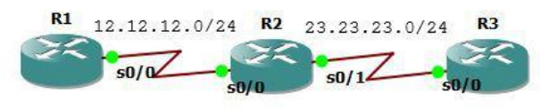
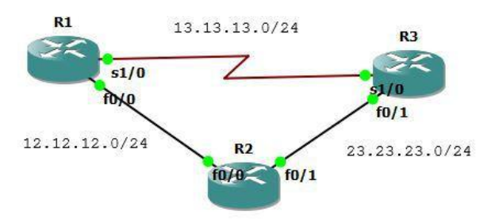
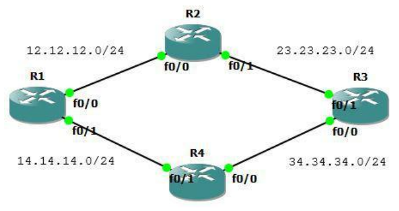
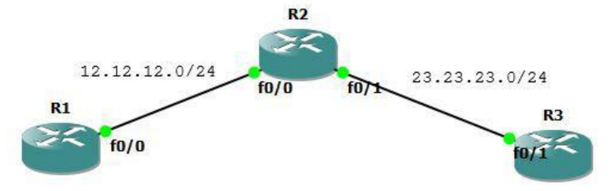

EIGRP merupakan distance vector protocol dan cisco proprietary. Menggunakan algoritma DUAL (Diffusing Update Algorithm).

- Advanced distance vector/hybrid routing protocol
- Multicast or unicast for exchange information use port 88
- Administrative distance 90
- Classless routing protocol support VLSM/CIDR.
- Support IPv6
- Rich metric (bandwidth, delay, load and reliability)
- Very fast convergence
- Equal and Unequal Load balancing
- 100% loop-free

Dinamakan advanced distance vector atau hybrid routing protocol karena EIGRP tidak seperti RIP yang:

- No neighbor discovery
- Periodic updates
- Vulnerable to loops
- Simple metric (hop count)

Cisco menambahkan fitur-fitur dari link state pada EIGRP sehingga dapat mengatasi masalah-masalah RIP. Pada router yang menjalankan EIGRP akan mempunyai 3 database(tabel):

EIGRP neighbor table

- List semua directly connected neighbor
- Next-hop router
- Interface

EIGRP topology table

- List semua route yang dipelajari dari semua EIGRP neighbor
- Destination
- Metric

Routing table

- Best route dari EIGRP topology table

Successor and Feasible Successor

- Successor = best path to destination
- Feasible Successor = backup link to destination

EIGRP Packets

Hello Packet

- Untuk discover dan recovery neighbor serta membentuk adjency.
- Jika penerima membalas dengan hello packet maka terjadi adjency. Jika penerima tidak mengirim hello packet dalam X waktu (hold time), maka adjency akan didrop.
- Setelah adjency terbentuk, akan melakukan exchange routing information yang akan disimpan di topology table. Best path dari topology table akan disave di routing table.
- Reliable

Update Packet

- Berisi informasi routing
- Dapat dikirim secara unicast atau multicast
- Reliable

Query Packet

- Dikirim jika suatu router EIGRP kehilangan informasi tentang suatu network, maka query akan dikirim ke neighbor untuk mendapat informasi tentang neighbor yang hilang tadi.

Reply Packet

- Response dari query packet

ACK Packet

- Dikirim sebagai pemberitahuan bahwa telah menerima update packet.
- Dikirim secara unicast.

No Auto-Summary<br>
Digunakan untuk menyertakan subnetmask dalam advertise network.

## EIGRP Basic Configuration



Ketikkan konfigurasi interface berikut. Pastikan dapat ping antar interface yang directly connect.

```
R1
interface Loopback0
ip address 1.1.1.1 255.255.255.255
!
interface Serial0/0
ip address 12.12.12.1 255.255.255.0
!

R2
interface Loopback0
ip address 2.2.2.2 255.255.255.255
!
interface Serial0/0
ip address 12.12.12.2 255.255.255.0
!
interface Serial0/1
ip address 23.23.23.2 255.255.255.0
!

R3
interface Loopback0
ip address 3.3.3.3 255.255.255.255
!
interface Serial0/0
ip address 23.23.23.3 255.255.255.0
!
```

Konfigurasi EIGRP. Advertise network ke dalam routing EIGRP. Autonomous Number (AS Number) harus sama pada setiap router.

```
R1
 router eigrp 10
 network 1.1.1.1 0.0.0.0
 network 12.12.12.1 0.0.0.0
 no auto-summary

R2
 router eigrp 10
 network 2.2.2.2 0.0.0.0
 network 12.12.12.2 0.0.0.0
 network 23.23.23.2 0.0.0.0
 no auto-summary

R3
 router eigrp 10
 network 3.3.3.3 0.0.0.0
 network 23.23.23.3 0.0.0.0
 no auto-summary
```

Cek routing tabel dan tes ping.

```
R1#show ip route

Gateway of last resort is not set

    1.0.0.0/32 is subnetted, 1 subnets
C       1.1.1.1 is directly connected, Loopback0
    2.0.0.0/32 is subnetted, 1 subnets
D       2.2.2.2 [90/2297856] via 12.12.12.2, 00:06:56, Serial0/0
    3.0.0.0/32 is subnetted, 1 subnets
D       3.3.3.3 [90/2809856] via 12.12.12.2, 00:06:56, Serial0/0
    23.0.0.0/24 is subnetted, 1 subnets
D       23.23.23.0 [90/2681856] via 12.12.12.2, 00:06:56, Serial0/0
    12.0.0.0/24 is subnetted, 1 subnets
C       12.12.12.0 is directly connected, Serial0/0
R1#ping 2.2.2.2

Type escape sequence to abort.
Sending 5, 100-byte ICMP Echos to 2.2.2.2, timeout is 2 seconds:
!!!!!
Success rate is 100 percent (5/5), round-trip min/avg/max = 60/75/128 ms
R1#ping 3.3.3.3

Type escape sequence to abort.
Sending 5, 100-byte ICMP Echos to 3.3.3.3, timeout is 2 seconds:
!!!!!
Success rate is 100 percent (5/5), round-trip min/avg/max = 60/88/116 ms
```

## EIGRP FIltering - Distribute List

Diguanakn untuk memfilter network berdasarkan route network yang masuk dan keluar interface. Pada topologi dibawah, tujuannya agar ip loopback 2.2.2.2 tidak ada dalam routing tabel R1.

Cara pertama: filter network menggunakan access list pada R1 dengan distribute IN.


Masih menggunakan lab sebelumnya.

```
access-list 10 deny 2.2.2.2
access-list 10 permit any
router eigrp 10
distribute-list 10 in Serial0/0
```

Cek ip route.

```
R1#sh ip route

Gateway of last resort is not set

    1.0.0.0/32 is subnetted, 1 subnets
C       1.1.1.1 is directly connected, Loopback0
    3.0.0.0/32 is subnetted, 1 subnets
D       3.3.3.3 [90/2809856] via 12.12.12.2, 00:00:39, Serial0/0
    23.0.0.0/24 is subnetted, 1 subnets
D       23.23.23.0 [90/2681856] via 12.12.12.2, 00:00:39, Serial0/0
    12.0.0.0/24 is subnetted, 1 subnets
C       12.12.12.0 is directly connected, Serial0/0
R1#
```

Cara kedua: filter network menggunakan access list pada R2 dengan distribute OUT. Pastikan ip loopback 2.2.2.2 ada lagi dalam tabel routing R1 lalu pada R2 ketik perintah dibawah.

```
router eigrp 10
access-list 10 deny 2.2.2.2
access-list 10 permit any
distribute-list 10 out Serial0/0
```

Cek routing tabel pastikan ip loopback 2.2.2.2 tidak ada.

## EIGRP FIltering - Prefix List

Memfilter network berdasarkan prefix. Ketika dimasukkan prefix list IN pada R2, maka network R3 yang dideny oleh R2 tidak akan diadvertise ke R1.


Masih menggunakan lab sebelumnya. Tujuannya agar network pada R3 dengan prefix 24 sampai 28 diblok, selain itu ditampilkan.

```
R1
interface Loopback0
ip address 1.1.1.1 255.255.255.255
!
interface Serial0/0
ip address 12.12.12.1 255.255.255.0
!
router eigrp 10
network 0.0.0.0
no auto-summary
!

R2
interface Loopback0
ip address 2.2.2.2 255.255.255.255
!
interface Serial0/0
ip address 12.12.12.2 255.255.255.0
!
interface Serial0/1
ip address 23.23.23.2 255.255.255.0
!
router eigrp 10
network 0.0.0.0
no auto-summary
!

R3
interface Loopback0
ip address 3.3.3.3 255.255.255.255
!
interface Serial0/0
ip address 23.23.23.3 255.255.255.0
!
router eigrp 10
network 0.0.0.0
no auto-summary
!
```

Pada R1, buat ip loopback yang bervariatif untuk difilter.

```
interface Loopback1
 ip address 3.3.3.17 255.255.255.240
!
interface Loopback2
 ip address 3.3.3.33 255.255.255.248
!
interface Loopback3
 ip address 3.3.3.150 255.255.255.252
!
interface Loopback4
 ip address 3.3.3.200 255.255.255.240
!
interface Loopback5
 ip address 3.3.3.100 255.255.255.224
!
```

Cek tabel routing R1.

```
R1#sh ip route

Gateway of last resort is not set

    1.0.0.0/32 is subnetted, 1 subnets
C       1.1.1.1 is directly connected, Loopback0
    2.0.0.0/32 is subnetted, 1 subnets
D       2.2.2.2 [90/2297856] via 12.12.12.2, 00:04:45, Serial0/0
    3.0.0.0/8 is variably subnetted, 6 subnets, 5 masks
D       3.3.3.3/32 [90/2809856] via 12.12.12.2, 00:04:44, Serial0/0
D       3.3.3.16/28 [90/2809856] via 12.12.12.2, 00:00:02, Serial0/0
D       3.3.3.32/29 [90/2809856] via 12.12.12.2, 00:04:44, Serial0/0
D       3.3.3.96/27 [90/2809856] via 12.12.12.2, 00:00:05, Serial0/0
D       3.3.3.148/30 [90/2809856] via 12.12.12.2, 00:04:46, Serial0/0
D       3.3.3.192/28 [90/2809856] via 12.12.12.2, 00:00:05, Serial0/0
    23.0.0.0/24 is subnetted, 1 subnets
D       23.23.23.0 [90/2681856] via 12.12.12.2, 00:04:47, Serial0/0
    12.0.0.0/24 is subnetted, 1 subnets
C       12.12.12.0 is directly connected, Serial0/0
R1#
```

Konfigurasi prefix list filtering pada R2 dan cek tabel routing. Route dengan prefix antara 24 sampai 28 sudah tidak ada.

```
R2(config-router)#ip prefix-list EIGRP_IN seq 5 deny 3.3.3.0/24 le 28
R2(config)#ip prefix-list EIGRP_IN seq 10 permit 0.0.0.0/0 le 32
R2(config)#router eigrp 10
R2(config-router)#distribute-list prefix EIGRP_IN in
R2(config-router)#
*Mar 1 00:07:32.647: %DUAL-5-NBRCHANGE: IP-EIGRP(0) 10: Neighbor 12.12.12.1
(Serial0/0) is resync: route configuration changed
*Mar 1 00:07:32.647: %DUAL-5-NBRCHANGE: IP-EIGRP(0) 10: Neighbor 23.23.23.3
(Serial0/1) is resync: route configuration changed

R2#sh ip route

Gateway of last resort is not set

    1.0.0.0/32 is subnetted, 1 subnets
D       1.1.1.1 [90/2297856] via 12.12.12.1, 00:10:55, Serial0/0
    2.0.0.0/32 is subnetted, 1 subnets
C       2.2.2.2 is directly connected, Loopback0
    3.0.0.0/8 is variably subnetted, 3 subnets, 3 masks
D       3.3.3.3/32 [90/2297856] via 23.23.23.3, 00:02:51, Serial0/1
D       3.3.3.32/29 [90/2297856] via 23.23.23.3, 00:02:51, Serial0/1
D       3.3.3.148/30 [90/2297856] via 23.23.23.3, 00:02:51, Serial0/1
    23.0.0.0/24 is subnetted, 1 subnets
C       23.23.23.0 is directly connected, Serial0/1
    12.0.0.0/24 is subnetted, 1 subnets
C       12.12.12.0 is directly connected, Serial0/0
R2#
```

Begitu juga pada R1.

```
R1#sh ip route

Gateway of last resort is not set

    1.0.0.0/32 is subnetted, 1 subnets
C       1.1.1.1 is directly connected, Loopback0
    2.0.0.0/32 is subnetted, 1 subnets
D       2.2.2.2 [90/2297856] via 12.12.12.2, 00:11:45, Serial0/0
    3.0.0.0/8 is variably subnetted, 3 subnets, 3 masks
D       3.3.3.3/32 [90/2809856] via 12.12.12.2, 00:03:22, Serial0/0
D       3.3.3.32/29 [90/2809856] via 12.12.12.2, 00:03:22, Serial0/0
D       3.3.3.148/30 [90/2809856] via 12.12.12.2, 00:03:22, Serial0/0
    23.0.0.0/24 is subnetted, 1 subnets
D       23.23.23.0 [90/2681856] via 12.12.12.2, 00:11:47, Serial0/0
    12.0.0.0/24 is subnetted, 1 subnets
C       12.12.12.0 is directly connected, Serial0/0
R1#
```

Masih menggunakan lab sebelumnya. Tujuannya agar network pada R3 dengan prefix 24 sampai 28 diblok, selain itu ditampilkan.

Jika sebelumnya memakai prefix IN, sekarang menggunakan OUT. Tujuannya agar network pada R3 dengan prefix 28 sampai 30 diblok, selain itu ditampilkan. Hapus konfigurasi prefix list IN sebelumnya.

```
R2(config)#router eigrp 10
R2(config-router)#no distribute-list prefix EIGRP_IN in
```

Pastikan semua network muncul pada tabel routing.

```
R1#sh ip route

Gateway of last resort is not set

    1.0.0.0/32 is subnetted, 1 subnets
C       1.1.1.1 is directly connected, Loopback0
    2.0.0.0/32 is subnetted, 1 subnets
D       2.2.2.2 [90/2297856] via 12.12.12.2, 00:04:45, Serial0/0
    3.0.0.0/8 is variably subnetted, 6 subnets, 5 masks
D       3.3.3.3/32 [90/2809856] via 12.12.12.2, 00:04:44, Serial0/0
D       3.3.3.16/28 [90/2809856] via 12.12.12.2, 00:00:02, Serial0/0
D       3.3.3.32/29 [90/2809856] via 12.12.12.2, 00:04:44, Serial0/0
D       3.3.3.96/27 [90/2809856] via 12.12.12.2, 00:00:05, Serial0/0
D       3.3.3.148/30 [90/2809856] via 12.12.12.2, 00:04:46, Serial0/0
D       3.3.3.192/28 [90/2809856] via 12.12.12.2, 00:00:05, Serial0/0
    23.0.0.0/24 is subnetted, 1 subnets
D       23.23.23.0 [90/2681856] via 12.12.12.2, 00:04:47, Serial0/0
    12.0.0.0/24 is subnetted, 1 subnets
C       12.12.12.0 is directly connected, Serial0/0
R1#
```

Konfigurasi prefix list filtering OUT pada R2.

```
R2(config-router)# ip prefix-list EIGRP_OUT seq 5 deny 3.3.3.0/24 ge 28 le
30
R2(config)# ip prefix-list EIGRP_OUT seq 10 permit 0.0.0.0/0 ge 24
R2(config)#router eigrp 10
R2(config-router)#distribute-list prefix EIGRP_OUT out
```

Cek tabel routing pada R1 dan R2.

```
R2#sh ip route

Gateway of last resort is not set

    1.0.0.0/32 is subnetted, 1 subnets
D       1.1.1.1 [90/2297856] via 12.12.12.1, 00:10:55, Serial0/0
    2.0.0.0/32 is subnetted, 1 subnets
C       2.2.2.2 is directly connected, Loopback0
    3.0.0.0/8 is variably subnetted, 3 subnets, 3 masks
D       3.3.3.3/32 [90/2297856] via 23.23.23.3, 00:02:51, Serial0/1
D       3.3.3.32/29 [90/2297856] via 23.23.23.3, 00:02:51, Serial0/1
D       3.3.3.148/30 [90/2297856] via 23.23.23.3, 00:02:51, Serial0/1
    23.0.0.0/24 is subnetted, 1 subnets
C       23.23.23.0 is directly connected, Serial0/1
    12.0.0.0/24 is subnetted, 1 subnets
C       12.12.12.0 is directly connected, Serial0/0
R2#

R1#sh ip route

Gateway of last resort is not set

    1.0.0.0/32 is subnetted, 1 subnets
C       1.1.1.1 is directly connected, Loopback0
    2.0.0.0/32 is subnetted, 1 subnets
D       2.2.2.2 [90/2297856] via 12.12.12.2, 00:03:29, Serial0/0
    3.0.0.0/8 is variably subnetted, 2 subnets, 2 masks
D       3.3.3.3/32 [90/2809856] via 12.12.12.2, 00:03:28, Serial0/0
D       3.3.3.96/27 [90/2809856] via 12.12.12.2, 00:03:28, Serial0/0
    23.0.0.0/24 is subnetted, 1 subnets
D       23.23.23.0 [90/2681856] via 12.12.12.2, 00:03:29, Serial0/0
    12.0.0.0/24 is subnetted, 1 subnets
C       12.12.12.0 is directly connected, Serial0/0
R1#

R2#sh ip route

Gateway of last resort is not set

    1.0.0.0/32 is subnetted, 1 subnets
D       1.1.1.1 [90/2297856] via 12.12.12.1, 00:03:15, Serial0/0
    2.0.0.0/32 is subnetted, 1 subnets
C       2.2.2.2 is directly connected, Loopback0
    3.0.0.0/8 is variably subnetted, 2 subnets, 2 masks
D       3.3.3.3/32 [90/2297856] via 23.23.23.3, 00:03:15, Serial0/1
D       3.3.3.96/27 [90/2297856] via 23.23.23.3, 00:03:15, Serial0/1
    23.0.0.0/24 is subnetted, 1 subnets
C       23.23.23.0 is directly connected, Serial0/1
    12.0.0.0/24 is subnetted, 1 subnets
C       12.12.12.0 is directly connected, Serial0/0
R2#
```

## EIGRP FIltering - Access List

Access list juga dapat digunakan untuk filtering. Tujuan lab kali ini adalah memfilter route yang genap dan ganjil pada tabel routing.


Buat ip loopback ganjil dan genap lalu advertise ke EIGRP.

```
R1(config)#interface Loopback1
R1(config-if)# ip address 11.11.11.1 255.255.255.255
R1(config-if)#!
R1(config-if)#interface Loopback2
R1(config-if)# ip address 11.11.11.2 255.255.255.255
R1(config-if)#!
R1(config-if)#interface Loopback3
R1(config-if)# ip address 11.11.11.3 255.255.255.255
R1(config-if)#!
R1(config-if)#interface Loopback4
R1(config-if)# ip address 11.11.11.4 255.255.255.255
R1(config-if)#!
R1(config-if)#interface Loopback5
R1(config-if)# ip address 11.11.11.5 255.255.255.255
R1(config-if)#!
R1(config-if)#interface Loopback6
R1(config-if)# ip address 11.11.11.6 255.255.255.255
R1(config-if)#!
R1(config-if)#interface Loopback7
R1(config-if)# ip address 11.11.11.7 255.255.255.255
R1(config-if)#!
R1(config-if)#interface Loopback8
R1(config-if)# ip address 11.11.11.8 255.255.255.255
R1(config-if)#!

***Advertise ke EIGRP***
R1(config)#router eigrp 10
R1(config-router)# network 11.11.11.1 0.0.0.0
R1(config-router)# network 11.11.11.2 0.0.0.0
R1(config-router)# network 11.11.11.3 0.0.0.0
R1(config-router)# network 11.11.11.4 0.0.0.0
R1(config-router)# network 11.11.11.5 0.0.0.0
R1(config-router)# network 11.11.11.6 0.0.0.0
R1(config-router)# network 11.11.11.7 0.0.0.0
R1(config-router)# network 11.11.11.8 0.0.0.0

***Cek tabel routing***
R3(config)#do sh ip route

Gateway of last resort is not set

    1.0.0.0/32 is subnetted, 1 subnets
D       1.1.1.1 [90/2809856] via 23.23.23.2, 00:05:40, Serial0/0
    2.0.0.0/32 is subnetted, 1 subnets
D       2.2.2.2 [90/2297856] via 23.23.23.2, 00:00:03, Serial0/0
    3.0.0.0/32 is subnetted, 1 subnets
C       3.3.3.3 is directly connected, Loopback0
    23.0.0.0/24 is subnetted, 1 subnets
C       23.23.23.0 is directly connected, Serial0/0
    11.0.0.0/32 is subnetted, 8 subnets
D       11.11.11.8 [90/2809856] via 23.23.23.2, 00:00:03, Serial0/0
D       11.11.11.3 [90/2809856] via 23.23.23.2, 00:03:29, Serial0/0
D       11.11.11.2 [90/2809856] via 23.23.23.2, 00:00:04, Serial0/0
D       11.11.11.1 [90/2809856] via 23.23.23.2, 00:03:29, Serial0/0
D       11.11.11.7 [90/2809856] via 23.23.23.2, 00:03:29, Serial0/0
D       11.11.11.6 [90/2809856] via 23.23.23.2, 00:00:06, Serial0/0
D       11.11.11.5 [90/2809856] via 23.23.23.2, 00:03:30, Serial0/0
D       11.11.11.4 [90/2809856] via 23.23.23.2, 00:00:06, Serial0/0
    12.0.0.0/24 is subnetted, 1 subnets
D       12.12.12.0 [90/2681856] via 23.23.23.2, 00:00:06, Serial0/0
R3(config)#
```

Filter route yang ganjil aja.

```
R3(config)#access-list 10 permit 0.0.0.1 255.255.255.254
R3(config)#router eigrp 10
R3(config-router)#distribute-list 10 in s0/0

Gateway of last resort is not set

    1.0.0.0/32 is subnetted, 1 subnets
D       1.1.1.1 [90/2809856] via 23.23.23.2, 00:07:25, Serial0/0
    3.0.0.0/32 is subnetted, 1 subnets
C       3.3.3.3 is directly connected, Loopback0
    23.0.0.0/24 is subnetted, 1 subnets
C       23.23.23.0 is directly connected, Serial0/0
    11.0.0.0/32 is subnetted, 4 subnets
D       11.11.11.3 [90/2809856] via 23.23.23.2, 00:05:12, Serial0/0
D       11.11.11.1 [90/2809856] via 23.23.23.2, 00:05:13, Serial0/0
D       11.11.11.7 [90/2809856] via 23.23.23.2, 00:05:14, Serial0/0
D       11.11.11.5 [90/2809856] via 23.23.23.2, 00:05:14, Serial0/0
R3(config)#
```

Filter route yang genap aja.

```
R3(config)#access-list 10 permit 0.0.0.0 255.255.255.254
R3(config)#router eigrp 10
R3(config-router)#distribute-list 10 in s0/0
R3(config)#
*Mar 1 00:14:41.751: %DUAL-5-NBRCHANGE: IP-EIGRP(0) 10: Neighbor 23.23.23.2
(Serial0/0) is resync: route configuration changed

R3(config)#do sh ip route

Gateway of last resort is not set

    2.0.0.0/32 is subnetted, 1 subnets
D       2.2.2.2 [90/2297856] via 23.23.23.2, 00:02:26, Serial0/0
    3.0.0.0/32 is subnetted, 1 subnets
C       3.3.3.3 is directly connected, Loopback0
    23.0.0.0/24 is subnetted, 1 subnets
C       23.23.23.0 is directly connected, Serial0/0
    11.0.0.0/32 is subnetted, 4 subnets
D       11.11.11.8 [90/2809856] via 23.23.23.2, 00:02:26, Serial0/0
D       11.11.11.2 [90/2809856] via 23.23.23.2, 00:02:26, Serial0/0
D       11.11.11.6 [90/2809856] via 23.23.23.2, 00:02:28, Serial0/0
D       11.11.11.4 [90/2809856] via 23.23.23.2, 00:02:28, Serial0/0
    12.0.0.0/24 is subnetted, 1 subnets
D       12.12.12.0 [90/2681856] via 23.23.23.2, 00:02:28, Serial0/0
R3(config)#
```

## EIGRP FIltering - Administrative Distance

Untuk memfilter route dengan mengeset Administrative Distance (AD) menjadi 255. Maka route tidak akan masuk tabel routing.


Buat interface loopback dan advertise ke nertwork.

```
R3(config)#int lo1
R3(config-if)#ip add 33.33.33.33 255.255.255.255

R3(config-if)#router eigrp 10
R3(config-router)#network 33.33.33.33 0.0.0.0
```

Pastikan sudah ter-advertise.

```
R2#sh ip route
Codes:  C - connected, S - static, R - RIP, M - mobile, B - BGP
        D - EIGRP, EX - EIGRP external, O - OSPF, IA - OSPF inter area
        N1 - OSPF NSSA external type 1, N2 - OSPF NSSA external type 2
        E1 - OSPF external type 1, E2 - OSPF external type 2
        i - IS-IS, su - IS-IS summary, L1 - IS-IS level-1, L2 - IS-IS level-2
        ia - IS-IS inter area, * - candidate default, U - per-user static
route
        o - ODR, P - periodic downloaded static route

Gateway of last resort is not set

    1.0.0.0/32 is subnetted, 1 subnets
D       1.1.1.1 [90/2297856] via 12.12.12.1, 00:04:36, Serial0/0
    2.0.0.0/32 is subnetted, 1 subnets
C       2.2.2.2 is directly connected, Loopback0
    33.0.0.0/32 is subnetted, 1 subnets
D       33.33.33.33 [90/2297856] via 23.23.23.3, 00:00:12, Serial0/1
    3.0.0.0/32 is subnetted, 1 subnets
D       3.3.3.3 [90/2297856] via 23.23.23.3, 00:00:12, Serial0/1
    23.0.0.0/24 is subnetted, 1 subnets
C       23.23.23.0 is directly connected, Serial0/1
    11.0.0.0/32 is subnetted, 8 subnets
D       11.11.11.8 [90/2297856] via 12.12.12.1, 00:02:56, Serial0/0
D       11.11.11.3 [90/2297856] via 12.12.12.1, 00:02:56, Serial0/0
D       11.11.11.2 [90/2297856] via 12.12.12.1, 00:02:58, Serial0/0
D       11.11.11.1 [90/2297856] via 12.12.12.1, 00:02:58, Serial0/0
D       11.11.11.7 [90/2297856] via 12.12.12.1, 00:02:57, Serial0/0
D       11.11.11.6 [90/2297856] via 12.12.12.1, 00:02:58, Serial0/0
D       11.11.11.5 [90/2297856] via 12.12.12.1, 00:02:58, Serial0/0
D       11.11.11.4 [90/2297856] via 12.12.12.1, 00:02:58, Serial0/0
    12.0.0.0/24 is subnetted, 1 subnets
C       12.12.12.0 is directly connected, Serial0/0
R2#ping 3.3.3.3

Type escape sequence to abort.
Sending 5, 100-byte ICMP Echos to 3.3.3.3, timeout is 2 seconds:
!!!!!
Success rate is 100 percent (5/5), round-trip min/avg/max = 64/82/96 ms
R2#
```

Dengan mengeset distance 255 pada network 33.33.33.33 di R2, maka network 33.33.33.33 tidak akan muncul pada tabel routing R2. Ketika dicek, network 33.33.33.33 sudah tidak ada.

```
R2(config)#access-list 33 permit 33.33.33.33
R2(config)#router eigrp 10
R2(config-router)#distance 255 0.0.0.0 255.255.255.255 33

R2(config-router)#do sh ip route

Gateway of last resort is not set

    1.0.0.0/32 is subnetted, 1 subnets
D       1.1.1.1 [90/2297856] via 12.12.12.1, 00:00:13, Serial0/0
    2.0.0.0/32 is subnetted, 1 subnets
C       2.2.2.2 is directly connected, Loopback0
    3.0.0.0/32 is subnetted, 1 subnets
D       3.3.3.3 [90/2297856] via 23.23.23.3, 00:00:13, Serial0/1
    23.0.0.0/24 is subnetted, 1 subnets
C       23.23.23.0 is directly connected, Serial0/1
    11.0.0.0/32 is subnetted, 8 subnets
D       11.11.11.8 [90/2297856] via 12.12.12.1, 00:00:13, Serial0/0
D       11.11.11.3 [90/2297856] via 12.12.12.1, 00:00:15, Serial0/0
D       11.11.11.2 [90/2297856] via 12.12.12.1, 00:00:15, Serial0/0
D       11.11.11.1 [90/2297856] via 12.12.12.1, 00:00:15, Serial0/0
D       11.11.11.7 [90/2297856] via 12.12.12.1, 00:00:18, Serial0/0
D       11.11.11.6 [90/2297856] via 12.12.12.1, 00:00:18, Serial0/0
D       11.11.11.5 [90/2297856] via 12.12.12.1, 00:00:18, Serial0/0
D       11.11.11.4 [90/2297856] via 12.12.12.1, 00:00:18, Serial0/0
    12.0.0.0/24 is subnetted, 1 subnets
C       12.12.12.0 is directly connected, Serial0/0
R2(config-router)#do ping 33.33.33.33

Type escape sequence to abort.
Sending 5, 100-byte ICMP Echos to 33.33.33.33, timeout is 2 seconds:
.....
Success rate is 0 percent (0/5)
R2(config-router)#
```

## EIGRP Authentication

Untuk memberikan authentikasi pada EIGRP dengan mengeset password, Authentication akan mencegah router untuk menerima update packet dari sembarang router EIGRP.


Set authentication pada R1 dan R2.

```
R1(config)#key chain EIGRP
R1(config-keychain)#key 1
R1(config-keychain-key)#key-string CISCO
R1(config-keychain-key)#int s0/0
R1(config-if)#ip authentication mode eigrp 10 md5
R1(config-if)#ip authentication key-chain eigrp 10 EIGRP
*Mar 1 00:00:31.507: %DUAL-5-NBRCHANGE: IP-EIGRP(0) 10: Neighbor 12.12.12.2
(Serial0/0) is down: authentication mode changed
```

```
R2(config)#key chain EIGRP
R2(config-keychain)#key 1
R2(config-keychain-key)#key-string CISCO
R2(config-keychain-key)#int s0/0
R2(config-if)#ip authentication mode eigrp 10 md5
R2(config-if)#ip authentication key-chain eigrp 10 EIGRP
R2(config-if)#
*Mar 1 00:00:31.911: %DUAL-5-NBRCHANGE: IP-EIGRP(0) 10: Neighbor 12.12.12.1
(Serial0/0) is down: authentication mode changed
```

Lakukan debug untuk pengecekan.

```
R1#debug eigrp packets
EIGRP Packets debugging is on
    (UPDATE, REQUEST, QUERY, REPLY, HELLO, IPXSAP, PROBE, ACK, STUB,
SIAQUERY, SIAREPLY)
R1#
*Mar 1 00:01:15.211: EIGRP: received packet with MD5 authentication, key id
= 1
*Mar 1 00:01:15.215: EIGRP: Received HELLO on Serial0/0 nbr 12.12.12.2
*Mar 1 00:01:15.215: AS 10, Flags 0x0, Seq 0/0 idbQ 0/0 iidbQ un/rely 0/0
peerQ un/rely 0/0
R1#
*Mar 1 00:01:18.395: EIGRP: Sending HELLO on Serial0/0
*Mar 1 00:01:18.395: AS 10, Flags 0x0, Seq 0/0 idbQ 0/0 iidbQ un/rely 0/0
*Mar 1 00:01:18.419: EIGRP: Sending HELLO on Loopback0
*Mar 1 00:01:18.419: AS 10, Flags 0x0, Seq 0/0 idbQ 0/0 iidbQ un/rely 0/0
*Mar 1 00:01:18.423: EIGRP: Received HELLO on Loopback0 nbr 1.1.1.1
*Mar 1 00:01:18.423: AS 10, Flags 0x0, Seq 0/0 idbQ 0/0
*Mar 1 00:01:18.427: EIGRP: Packet from ourselves ignored
R1#
*Mar 1 00:01:27.315: EIGRP: Sending HELLO on Serial0/0
*Mar 1 00:01:27.315: AS 10, Flags 0x0, Seq 0/0 idbQ 0/0 iidbQ un/rely 0/0
*Mar 1 00:01:27.655: EIGRP: Sending HELLO on Loopback0
*Mar 1 00:01:27.655: AS 10, Flags 0x0, Seq 0/0 idbQ 0/0 iidbQ un/rely 0/0
*Mar 1 00:01:27.659: EIGRP: Received HELLO on Loopback0 nbr 1.1.1.1
*Mar 1 00:01:27.663: AS 10, Flags 0x0, Seq 0/0 idbQ 0/0
```

Matikan debug EIGRP.

```
R1#undebug eigrp packets
EIGRP Packets debugging is off
```

Cek adjency EIGRP.

```
R1#sh ip eigrp neighbors
IP-EIGRP neighbors for process 10
H   Address         Interface       Hold Uptime     SRTT    RTO  Q   Seq
                                    (sec)           (ms)         Cnt Num
0   12.12.12.2      Se0/0           11 00:02:43     27      200  0   8
R1#
```

## EIGRP Summarization

Summarization digunakan untuk meringkas beberapa route menjadi satu route. Fungsinya untuk mengurangi size dari routing table dan mengurangi update routing.


Buat interface loopback pada R2 untuk diadvertise ke EIGRP.

```
R2(config)#interface Loopback1
R2(config-if)# ip address 22.22.22.1 255.255.255.255
R2(config-if)#!
R2(config-if)#interface Loopback2
R2(config-if)# ip address 22.22.22.2 255.255.255.255
R2(config-if)#!
R2(config-if)#interface Loopback3
R2(config-if)# ip address 22.22.22.3 255.255.255.255
R2(config-if)#!
R2(config-if)#interface Loopback4
R2(config-if)# ip address 22.22.22.4 255.255.255.255
R2(config-if)#!
R2(config-if)#interface Loopback5
R2(config-if)# ip address 22.22.22.5 255.255.255.255
R2(config-if)#!
R2(config-if)#interface Loopback6
R2(config-if)# ip address 22.22.22.6 255.255.255.255
R2(config-if)#!
R2(config-if)#interface Loopback7
R2(config-if)# ip address 22.22.22.7 255.255.255.255
R2(config-if)#!
R2(config-if)#interface Loopback8
R2(config-if)# ip address 22.22.22.8 255.255.255.255
R2(config-if)#!

R2(config-if)#router eigrp 10
R2(config-router)# network 22.22.22.1 0.0.0.0
R2(config-router)# network 22.22.22.2 0.0.0.0
R2(config-router)# network 22.22.22.3 0.0.0.0
R2(config-router)# network 22.22.22.4 0.0.0.0
R2(config-router)# network 22.22.22.5 0.0.0.0
R2(config-router)# network 22.22.22.6 0.0.0.0
R2(config-router)# network 22.22.22.7 0.0.0.0
R2(config-router)# network 22.22.22.8 0.0.0.0
```

Cek di R1 dan R3.

```
R3#show ip route

Gateway of last resort is not set

    1.0.0.0/32 is subnetted, 1 subnets
D       1.1.1.1 [90/2809856] via 23.23.23.2, 00:07:53, Serial0/0
    2.0.0.0/32 is subnetted, 1 subnets
D       2.2.2.2 [90/2297856] via 23.23.23.2, 00:07:53, Serial0/0
    3.0.0.0/32 is subnetted, 1 subnets
C       3.3.3.3 is directly connected, Loopback0
    23.0.0.0/24 is subnetted, 1 subnets
C       23.23.23.0 is directly connected, Serial0/0
    22.0.0.0/32 is subnetted, 8 subnets
D       22.22.22.6 [90/2297856] via 23.23.23.2, 00:00:28, Serial0/0
D       22.22.22.7 [90/2297856] via 23.23.23.2, 00:00:31, Serial0/0
D       22.22.22.4 [90/2297856] via 23.23.23.2, 00:00:31, Serial0/0
D       22.22.22.5 [90/2297856] via 23.23.23.2, 00:00:31, Serial0/0
D       22.22.22.2 [90/2297856] via 23.23.23.2, 00:00:32, Serial0/0
D       22.22.22.3 [90/2297856] via 23.23.23.2, 00:00:32, Serial0/0
D       22.22.22.1 [90/2297856] via 23.23.23.2, 00:00:32, Serial0/0
D       22.22.22.8 [90/2297856] via 23.23.23.2, 00:00:31, Serial0/0
    12.0.0.0/24 is subnetted, 1 subnets
D       12.12.12.0 [90/2681856] via 23.23.23.2, 00:07:57, Serial0/0
R3#
```

Konfigurasi summarization di interface s0/1 pada R2.

```
R2(config-router)# int s0/1
R2(config-if)#ip summary-address eigrp 10 22.22.22.0 255.255.255.248
R2(config-if)#
*Mar 1 00:13:09.727: %DUAL-5-NBRCHANGE: IP-EIGRP(0) 10: Neighbor 23.23.23.3
(Serial0/1) is resync: summary configured
```

Cek di R3.

```
R3#sh ip route


Gateway of last resort is not set

    1.0.0.0/32 is subnetted, 1 subnets
D       1.1.1.1 [90/2809856] via 23.23.23.2, 00:13:36, Serial0/0
    2.0.0.0/32 is subnetted, 1 subnets
D       2.2.2.2 [90/2297856] via 23.23.23.2, 00:13:36, Serial0/0
    3.0.0.0/32 is subnetted, 1 subnets
C       3.3.3.3 is directly connected, Loopback0
    23.0.0.0/24 is subnetted, 1 subnets
C       23.23.23.0 is directly connected, Serial0/0
    22.0.0.0/8 is variably subnetted, 2 subnets, 2 masks
D       22.22.22.0/29 [90/2297856] via 23.23.23.2, 00:00:38, Serial0/0
D       22.22.22.8/32 [90/2297856] via 23.23.23.2, 00:06:13, Serial0/0
    12.0.0.0/24 is subnetted, 1 subnets
D       12.12.12.0 [90/2681856] via 23.23.23.2, 00:13:39, Serial0/0
R3#ping 22.22.22.1

Type escape sequence to abort.
Sending 5, 100-byte ICMP Echos to 22.22.22.1, timeout is 2 seconds:
!!!!!
Success rate is 100 percent (5/5), round-trip min/avg/max = 60/96/152 ms
R3#ping 22.22.22.8

Type escape sequence to abort.
Sending 5, 100-byte ICMP Echos to 22.22.22.8, timeout is 2 seconds:
!!!!!
Success rate is 100 percent (5/5), round-trip min/avg/max = 32/52/92 ms
R3#
```

## EIGRP Unicast Update

Secara default EIGRP melakukan update melalui ip multicast 224.0.0.10, unicast update mengganti update dari multicast ke unicast neighbornya.


Cek bahwa EIGRP mengirim update secara multicast. IP multicast adalah 244.0.0.10

```
R1#debug ip packet detail
IP packet debugging is on (detailed)
R1#
*Mar 1 00:00:57.331: IP: s=12.12.12.2 (Serial0/0), d=224.0.0.10, len 60,
rcvd 2, proto=88
*Mar 1 00:00:58.079: IP: s=1.1.1.1 (local), d=224.0.0.10 (Loopback0), len
60, sending broad/multicast, proto=88
*Mar 1 00:00:58.083: IP: s=1.1.1.1 (Loopback0), d=224.0.0.10, len 60, rcvd
2, proto=88
R1#
*Mar 1 00:01:00.271: IP: s=12.12.12.1 (local), d=224.0.0.10 (Serial0/0),
len 60, sending broad/multicast, proto=88
R1#
*Mar 1 00:01:03.019: IP: s=1.1.1.1 (local), d=224.0.0.10 (Loopback0), len
60, sending broad/multicast, proto=88
*Mar 1 00:01:03.023: IP: s=1.1.1.1 (Loopback0), d=224.0.0.10, len 60, rcvd
2, proto=88
R1#undebug ip packet detail
IP packet debugging is off (detailed)
```

Konfigurasi link R1 ke R2 menjadi unicast.

```
R1(config)#router eigrp 10
R1(config-router)#neighbor 12.12.12.2 s0/0
R1(config-router)#
*Mar 1 00:09:36.483: %DUAL-5-NBRCHANGE: IP-EIGRP(0) 10: Neighbor 12.12.12.2
(Serial0/0) is down: Static peer configured
R1(config-router)#
R2(config)#router eigrp 10
R2(config-router)#neighbor 12.12.12.1 s0/0
```

Cek debug lagi harusnya sudah ganti unicast.

```
R1#debug ip packet detail
IP packet debugging is on (detailed)
R1#
*Mar 1 00:15:51.467: IP: tableid=0, s=12.12.12.2 (Serial0/0), d=12.12.12.1
(Serial0/0), routed via RIB
*Mar 1 00:15:51.471: IP: s=12.12.12.2 (Serial0/0), d=12.12.12.1
(Serial0/0), len 60, rcvd 3, proto=88
R1#
R1#undebug ip packet detail
IP packet debugging is off (detailed)
R1#
```

## EIGRP Default Route – Summary Address

Agar setiap router tidak perlu membuat konfigurasi default route satu persatu secara manual.


```
R1(config)#int s0/0
R1(config-if)#ip sum
R1(config-if)#ip summary-address eig
R1(config-if)#ip summary-address eigrp 10 0.0.0.0 0.0.0.0
R1(config-if)#
*Mar 1 00:01:20.419: %DUAL-5-NBRCHANGE: IP-EIGRP(0) 10: Neighbor 12.12.12.2
(Serial0/0) is resync: summary configured
```

Cek di R1.

```
R1(config-if)#do sh ip route

Gateway of last resort is 0.0.0.0 to network 0.0.0.0

    1.0.0.0/32 is subnetted, 1 subnets
C       1.1.1.1 is directly connected, Loopback0
    2.0.0.0/32 is subnetted, 1 subnets
D       2.2.2.2 [90/2297856] via 12.12.12.2, 00:01:15, Serial0/0
    3.0.0.0/32 is subnetted, 1 subnets
D       3.3.3.3 [90/2809856] via 12.12.12.2, 00:01:14, Serial0/0
    23.0.0.0/24 is subnetted, 1 subnets
D       23.23.23.0 [90/2681856] via 12.12.12.2, 00:01:15, Serial0/0
    22.0.0.0/32 is subnetted, 8 subnets
D       22.22.22.6 [90/2297856] via 12.12.12.2, 00:01:17, Serial0/0
D       22.22.22.7 [90/2297856] via 12.12.12.2, 00:01:17, Serial0/0
D       22.22.22.4 [90/2297856] via 12.12.12.2, 00:01:17, Serial0/0
D       22.22.22.5 [90/2297856] via 12.12.12.2, 00:01:17, Serial0/0
D       22.22.22.2 [90/2297856] via 12.12.12.2, 00:01:18, Serial0/0
D       22.22.22.3 [90/2297856] via 12.12.12.2, 00:01:18, Serial0/0
D       22.22.22.1 [90/2297856] via 12.12.12.2, 00:01:18, Serial0/0
D       22.22.22.8 [90/2297856] via 12.12.12.2, 00:01:18, Serial0/0
    12.0.0.0/24 is subnetted, 1 subnets
C       12.12.12.0 is directly connected, Serial0/0
D*  0.0.0.0/0 is a summary, 00:00:17, Null0
```

Pada default route aka nada Null0. Null0 berfungsi mendrop packet yang tidak ditemukan tujuannya karena default route.

## EIGRP Redistribution - RIP

Untuk meredistribute RIP ke dalam EIGRP.


Buat interface loopback di R1 dan advertise ke dalam RIP.

```
R1(config-if)#int lo1
R1(config-if)#ip add 111.111.111.111 255.255.255.255

R1(config-if)#router rip
R1(config-router)#version 2
R1(config-router)#network 111.111.111.0
R1(config-router)#no auto-summary
```

Redistribute RIP ke EIGRP.

```
R2(config)#ipv6 unicast-routing
R2(config)#int fa0/0
R2(config-if)#ipv6 rip 17 enable
R2(config-if)#int fa0/1
R2(config-if)#ipv6 rip 17 enable
```

Redistribute RIP ke EIGRP.

```
R1(config)#router eigrp 10
R1(config-router)#redistribute rip metric 1 1 1 1 1
```

Cek tabel routing dan tes ping.

```
R1#sh ip route

Gateway of last resort is not set

    1.0.0.0/32 is subnetted, 1 subnets
C       1.1.1.1 is directly connected, Loopback0
    2.0.0.0/32 is subnetted, 1 subnets
D       2.2.2.2 [90/2297856] via 12.12.12.2, 00:25:20, Serial0/0
    3.0.0.0/32 is subnetted, 1 subnets
D       3.3.3.3 [90/2809856] via 12.12.12.2, 00:25:20, Serial0/0
    23.0.0.0/24 is subnetted, 1 subnets
D       23.23.23.0 [90/2681856] via 12.12.12.2, 00:25:20, Serial0/0
    111.0.0.0/32 is subnetted, 1 subnets
C       111.111.111.111 is directly connected, Loopback1
    12.0.0.0/24 is subnetted, 1 subnets
C       12.12.12.0 is directly connected, Serial0/0
R1#

R3#sh ip route

Gateway of last resort is not set

    1.0.0.0/32 is subnetted, 1 subnets
D       1.1.1.1 [90/2809856] via 23.23.23.2, 00:13:37, Serial0/0
    2.0.0.0/32 is subnetted, 1 subnets
D       2.2.2.2 [90/2297856] via 23.23.23.2, 00:13:38, Serial0/0
    3.0.0.0/32 is subnetted, 1 subnets
C       3.3.3.3 is directly connected, Loopback0
    23.0.0.0/24 is subnetted, 1 subnets
C       23.23.23.0 is directly connected, Serial0/0
    111.0.0.0/32 is subnetted, 1 subnets
D       EX 111.111.111.111 [170/2561024256] via 23.23.23.2, 00:00:06, Serial0/0
    12.0.0.0/24 is subnetted, 1 subnets
D       12.12.12.0 [90/2681856] via 23.23.23.2, 00:13:40, Serial0/0
R3#ping 111.111.111.111

Type escape sequence to abort.
Sending 5, 100-byte ICMP Echos to 111.111.111.111, timeout is 2 seconds:
!!!!!
Success rate is 100 percent (5/5), round-trip min/avg/max = 52/98/248 ms
R3#
```

Tanda EX menunjukkan bahwa route dihasilkan dengan proses redistribute.

## EIGRP Redistribution - OSPF

Untuk meredistribute OSPF ke dalam EIGRP.


Buat interface loopback di R2 dan advertise ke dalam OSPF.

```
R2(config)#int lo1
R2(config-if)#ip add 22
R2(config-if)#ip add 222.222.222.222 255.255.255.255

R2(config-if)#router ospf 11
R2(config-router)#net 222.222.222.222 0.0.0.0 area 0
```

Redistribute OSPF ke EIGRP.

```
R2(config)#router eigrp 10
R2(config-router)#redistribute ospf 11 metric 1 1 1 1 1
```

Cek tabel routing dan tes ping.

```
R1#sh ip route

Gateway of last resort is not set

    222.222.222.0/32 is subnetted, 1 subnets
D       EX 222.222.222.222 [170/2560512256] via 12.12.12.2, 00:00:52, Serial0/0
    1.0.0.0/32 is subnetted, 1 subnets
C       1.1.1.1 is directly connected, Loopback0
    2.0.0.0/32 is subnetted, 1 subnets
D       2.2.2.2 [90/2297856] via 12.12.12.2, 00:05:14, Serial0/0
    3.0.0.0/32 is subnetted, 1 subnets
D       3.3.3.3 [90/2809856] via 12.12.12.2, 00:05:14, Serial0/0
    23.0.0.0/24 is subnetted, 1 subnets
D       23.23.23.0 [90/2681856] via 12.12.12.2, 00:05:17, Serial0/0
    111.0.0.0/32 is subnetted, 1 subnets
C       111.111.111.111 is directly connected, Loopback1
    12.0.0.0/24 is subnetted, 1 subnets
C       12.12.12.0 is directly connected, Serial0/0
R1#ping 222.222.222.222

Type escape sequence to abort.
Sending 5, 100-byte ICMP Echos to 222.222.222.222, timeout is 2 seconds:
!!!!!
Success rate is 100 percent (5/5), round-trip min/avg/max = 40/64/92 ms
R1#
```

## EIGRP Path Selection - Delay



Buatlah toplogi seperti diatas dan lakukan konfigurasi interface dan EIGRP.

```
R1(config)#int lo0
R1(config-if)#ip add 1.1.1.1 255.255.255.255
R1(config-if)#int s1/0
R1(config-if)#ip add 13.13.13.1 255.255.255.0
R1(config-if)#no sh
R1(config-if)#int f0/0
R1(config-if)#ip add 12.12.12.1 255.255.255.0
R1(config-if)#no sh
R1(config-if)#router eigrp 13
R1(config-router)#net 1.1.1.1 0.0.0.0
R1(config-router)#net 13.13.13.1 0.0.0.0
R1(config-router)#net 12.12.12.1 0.0.0.0
R1(config-router)#no au

R2(config)#int lo0
R2(config-if)#ip add 2.2.2.2 255.255.255.255
R2(config-if)#int f0/0
R2(config-if)#ip add 12.12.12.2 255.255.255.0
R2(config-if)#no sh
R2(config-if)#int fa0/1
R2(config-if)#ip add 23.23.23.2 255.255.255.0
R2(config-if)#no sh
R2(config-if)#router eigrp 13
R2(config-router)#net 2.2.2.2 0.0.0.0
R2(config-router)#net 12.12.12.2 0.0.0.0
R2(config-router)#net 23.23.23.2 0.0.0.0
R2(config-router)#no au

R3(config)#int lo0
R3(config-if)#ip add 3.3.3.3 255.255.255.255
R3(config-if)#int s1/0
R3(config-if)#ip add 13.13.13.3 255.255.255.0
R3(config-if)#no sh
R3(config-if)#int f0/1
R3(config-if)#ip add 23.23.23.3 255.255.255.0
R3(config-if)#router eigrp 13
R3(config-router)#net 3.3.3.3 0.0.0.0
R3(config-router)#net 13.13.13.3 0.0.0.0
R3(config-router)#net 23.23.23.3 0.0.0.0
R3(config-router)#no au

R2(config)#ipv6 router eigrp 13
R2(config-rtr)#router-id 2.2.2.2
R2(config-rtr)#no shut
*Mar 1 00:33:55.991: %DUAL-5-NBRCHANGE: IPv6-EIGRP(0) 13: Neighbor
FE80::C203:3FF:FEA8:1 (FastEthernet0/1) is up: new adjacency
*Mar 1 00:34:25.179: %DUAL-5-NBRCHANGE: IPv6-EIGRP(0) 13: Neighbor
FE80::C201:9FF:FED0:0 (FastEthernet0/0) is up: new adjacency
R2(config-rtr)#int lo0
R2(config-if)#ipv6 eigrp 13
R2(config-rtr)#int fa0/0
R2(config-if)#ipv6 eigrp 13
R2(config-rtr)#int fa0/1
R2(config-if)#ipv6 eigrp 13
```

Mengetahui route yang digunakan ke 3.3.3.3.

```
R1# sh ip route 3.3.3.3
Routing entry for 3.3.3.3/32
    Known via "eigrp 13", distance 90, metric 435200, type internal
    Redistributing via eigrp 13
    Last update from 12.12.12.2 on FastEthernet0/0, 00:04:36 ago
    Routing Descriptor Blocks:
    * 12.12.12.2, from 12.12.12.2, 00:04:36 ago, via FastEthernet0/0
        Route metric is 435200, traffic share count is 1
        Total delay is 7000 microseconds, minimum bandwidth is 10000 Kbit
        Reliability 255/255, minimum MTU 1500 bytes
        Loading 1/255, Hops 2
```

Mengetahui semua route yang digunakan ke 3.3.3.3 dengan EIGRP.

```
R1#sh ip eigrp top 3.3.3.3 255.255.255.255
IP-EIGRP (AS 13): Topology entry for 3.3.3.3/32
    State is Passive, Query origin flag is 1, 1 Successor(s), FD is 435200
    Routing Descriptor Blocks:
    12.12.12.2 (FastEthernet0/0), from 12.12.12.2, Send flag is 0x0
        Composite metric is (435200/409600), Route is Internal
        Vector metric:
            Minimum bandwidth is 10000 Kbit
            Total delay is 7000 microseconds
            Reliability is 255/255
            Load is 1/255
            Minimum MTU is 1500
            Hop count is 2
    13.13.13.3 (Serial1/0), from 13.13.13.3, Send flag is 0x0
        Composite metric is (2297856/128256), Route is Internal
        Vector metric:
            Minimum bandwidth is 1544 Kbit
            Total delay is 25000 microseconds
            Reliability is 255/255
            Load is 1/255
            Minimum MTU is 1500
            Hop count is 1
```

Ternyata EIGRP lebih memilih FastEthernet daripada Serial. Hal ini dikarenakan bandwidth FastEthernet lebih besar. Untuk menjadikan Serial menjadi link utama dapat dilakukan dengan mengubah delay.

```
R1(config)#int fa0/0
R1(config-if)#delay 100000
R1(config-if)#do clear ip eigrp neighbor

*Mar 1 00:22:45.311: %DUAL-5-NBRCHANGE: IP-EIGRP(0) 13: Neighbor 13.13.13.3
(Serial1/0) is down: manually cleared
*Mar 1 00:22:45.327: %DUAL-5-NBRCHANGE: IP-EIGRP(0) 13: Neighbor 12.12.12.2
(FastEthernet0/0) is down: manually cleared
*Mar 1 00:22:45.863: %DUAL-5-NBRCHANGE: IP-EIGRP(0) 13: Neighbor 12.12.12.2
(FastEthernet0/0) is up: new adjacency
*Mar 1 00:22:46.551: %DUAL-5-NBRCHANGE: IP-EIGRP(0) 13: Neighbor 13.13.13.3
(Serial1/0) is up: new adjacency
*Mar 1 00:23:01.507: %SYS-5-CONFIG_I: Configured from console by console
```

Sekarang cek lagi dan jalur sudah berpindah melalui Serial1/0.

```
R1#sh ip eigrp top 3.3.3.3 255.255.255.255
IP-EIGRP (AS 13): Topology entry for 3.3.3.3/32
    State is Passive, Query origin flag is 1, 1 Successor(s), FD is 2297856
    Routing Descriptor Blocks:
    13.13.13.3 (Serial1/0), from 13.13.13.3, Send flag is 0x0
        Composite metric is (2297856/128256), Route is Internal
        Vector metric:
            Minimum bandwidth is 1544 Kbit
            Total delay is 25000 microseconds
            Reliability is 255/255
            Load is 1/255
            Minimum MTU is 1500
            Hop count is 1
    12.12.12.2 (FastEthernet0/0), from 12.12.12.2, Send flag is 0x0
        Composite metric is (26009600/409600), Route is Internal
        Vector metric:
            Minimum bandwidth is 10000 Kbit
            Total delay is 1006000 microseconds
            Reliability is 255/255
            Load is 1/255
            Minimum MTU is 1500
            Hop count is 2
R1#sh ip route 3.3.3.3
Routing entry for 3.3.3.3/32
    Known via "eigrp 13", distance 90, metric 2297856, type internal
    Redistributing via eigrp 13
    Last update from 13.13.13.3 on Serial1/0, 00:00:43 ago
    Routing Descriptor Blocks:
    * 13.13.13.3, from 13.13.13.3, 00:00:43 ago, via Serial1/0
        Route metric is 2297856, traffic share count is 1
        Total delay is 25000 microseconds, minimum bandwidth is 1544 Kbit
        Reliability 255/255, minimum MTU 1500 bytes
        Loading 1/255, Hops 1

R1#traceroute 3.3.3.3

Type escape sequence to abort.
Tracing the route to 3.3.3.3

 1 13.13.13.3 140 msec 4 msec 68 msec
R1#traceroute 2.2.2.2

Type escape sequence to abort.
Tracing the route to 2.2.2.2

 1 13.13.13.3 172 msec 72 msec 72 msec
 2 23.23.23.2 140 msec 144 msec 72 msec
R1#
```

## EIGRP Path Selection - Bandwidth


Selain menggunakan delay, dapat juga menggunakan bandwidth. Hapus dulu konfigurasi delay sebelumnya sehingga route berubah seperti semula.

```
R1(config)#int f0/0
R1(config-if)#no delay 100000
R1(config-if)#do sh ip eigrp top 3.3.3.3 255.255.255.255
IP-EIGRP (AS 13): Topology entry for 3.3.3.3/32
    State is Passive, Query origin flag is 1, 1 Successor(s), FD is 435200
    Routing Descriptor Blocks:
    12.12.12.2 (FastEthernet0/0), from 12.12.12.2, Send flag is 0x0
        Composite metric is (435200/409600), Route is Internal
        Vector metric:
            Minimum bandwidth is 10000 Kbit
            Total delay is 7000 microseconds
            Reliability is 255/255
            Load is 1/255
            Minimum MTU is 1500
            Hop count is 2
    13.13.13.3 (Serial1/0), from 13.13.13.3, Send flag is 0x0
        Composite metric is (2297856/128256), Route is Internal
        Vector metric:
            Minimum bandwidth is 1544 Kbit
            Total delay is 25000 microseconds
            Reliability is 255/255
            Load is 1/255
            Minimum MTU is 1500
            Hop count is 1
```

Ubah bandwidth.

```
R1(config-if)#bandwidth 1000
R1(config-if)#do clear ip eigrp neighbor
```

Sekarang cek lagi.

```
R1(config-if)#do sh ip eigrp top 3.3.3.3 255.255.255.255
IP-EIGRP (AS 13): Topology entry for 3.3.3.3/32
    State is Passive, Query origin flag is 1, 1 Successor(s), FD is 2297856
    Routing Descriptor Blocks:
    13.13.13.3 (Serial1/0), from 13.13.13.3, Send flag is 0x0
        Composite metric is (2297856/128256), Route is Internal
        Vector metric:
            Minimum bandwidth is 1544 Kbit
            Total delay is 25000 microseconds
            Reliability is 255/255
            Load is 1/255
            Minimum MTU is 1500
            Hop count is 1
    12.12.12.2 (FastEthernet0/0), from 12.12.12.2, Send flag is 0x0
        Composite metric is (2739200/409600), Route is Internal
        Vector metric:
            Minimum bandwidth is 1000 Kbit
            Total delay is 7000 microseconds
            Reliability is 255/255
            Load is 1/255
            Minimum MTU is 1500
            Hop count is 2
R1(config-if)#

R1#sh ip route

Gateway of last resort is not set

    1.0.0.0/32 is subnetted, 1 subnets
C       1.1.1.1 is directly connected, Loopback0
    2.0.0.0/32 is subnetted, 1 subnets
D       2.2.2.2 [90/2323456] via 13.13.13.3, 00:00:27, Serial1/0
    3.0.0.0/32 is subnetted, 1 subnets
D       3.3.3.3 [90/2297856] via 13.13.13.3, 00:00:27, Serial1/0
    23.0.0.0/24 is subnetted, 1 subnets
D       23.23.23.0 [90/2195456] via 13.13.13.3, 00:00:27, Serial1/0
    12.0.0.0/24 is subnetted, 1 subnets
C       12.12.12.0 is directly connected, FastEthernet0/0
    13.0.0.0/24 is subnetted, 1 subnets
C       13.13.13.0 is directly connected, Serial1/0
R1#traceroute 3.3.3.3

Type escape sequence to abort.
Tracing the route to 3.3.3.3

 1 13.13.13.3 152 msec 140 msec 72 msec
R1#traceroute 2.2.2.2

Type escape sequence to abort.
Tracing the route to 2.2.2.2

 1 13.13.13.3 184 msec 44 msec 16 msec
 2 23.23.23.2 140 msec 96 msec 36 msec
```

## EIGRP Equal Load Balancing

Secara default EIGRP akan menerapkan load balancing pada link yang equal. Pada topologi dibawah dari R1 menuju R3 dapat menggunakan 2 jalur dan semuanya FastEthernet.



Buat topologi diatas dan lakukan konfigurasi berikut.

```
R1(config)#int lo0
R1(config-if)#ip add 1.1.1.1 255.255.255.255
R1(config-if)#int f0/0
R1(config-if)#ip add 12.12.12.1 255.255.255.0
R1(config-if)#no sh
R1(config-if)#int fa0/1
R1(config-if)#ip add 14.14.14.1 255.255.255.0
R1(config-if)#no sh
R1(config-if)#router eigrp 16
R1(config-router)#net 0.0.0.0
R1(config-router)#no au

R2(config)#int lo0
R2(config-if)#ip add 2.2.2.2 255.255.255.255
R2(config-if)#int fa0/0
R2(config-if)#ip add 12.12.12.2 255.255.255.0
R2(config-if)#no sh
R2(config-if)#int f0/1
R2(config-if)#ip add 23.23.23.2 255.255.255.0
R2(config-if)#no sh
R2(config-if)#router eigrp 16
R2(config-router)#net 0.0.0.0
R2(config-router)#no au

R3(config)#int lo0
R3(config-if)#ip add 3.3.3.3 255.255.255.255
R3(config-if)#int f0/1
R3(config-if)#ip add 23.23.23.3 255.255.255.0
R3(config-if)#no sh
R3(config-if)#int fa0/0
R3(config-if)#ip add 34.34.34.3 255.255.255.0
R3(config-if)#no sh
R3(config-if)#router eigrp 16
R3(config-router)#net 0.0.0.0
R3(config-router)#no au

R4(config)#int lo0
R4(config-if)#ip add 4.4.4.4 255.255.255.255
R4(config-if)#int f0/1
R4(config-if)#ip add 14.14.14.4 255.255.255.0
R4(config-if)#no sh
R4(config-if)#int fa0/0
R4(config-if)#ip add 34.34.34.4 255.255.255.0
R4(config-if)#no sh
R4(config-if)#router eigrp 16
R4(config-router)#net 0.0.0.0
R4(config-router)#no au
```

Cek routing tabel dan route menuju 3.3.3.3 dari R1.

```
R1#sh ip route

Gateway of last resort is not set

    34.0.0.0/24 is subnetted, 1 subnets
D       34.34.34.0 [90/307200] via 14.14.14.4, 00:01:13, FastEthernet0/1
    1.0.0.0/32 is subnetted, 1 subnets
C       1.1.1.1 is directly connected, Loopback0
    2.0.0.0/32 is subnetted, 1 subnets
D       2.2.2.2 [90/409600] via 12.12.12.2, 00:01:17, FastEthernet0/0
    3.0.0.0/32 is subnetted, 1 subnets
D       3.3.3.3 [90/435200] via 14.14.14.4, 00:01:16, FastEthernet0/1
                [90/435200] via 12.12.12.2, 00:01:16, FastEthernet0/0
    4.0.0.0/32 is subnetted, 1 subnets
D       4.4.4.4 [90/409600] via 14.14.14.4, 00:01:15, FastEthernet0/1
    23.0.0.0/24 is subnetted, 1 subnets
D       23.23.23.0 [90/307200] via 12.12.12.2, 00:01:18, FastEthernet0/0
    12.0.0.0/24 is subnetted, 1 subnets
C       12.12.12.0 is directly connected, FastEthernet0/0
    14.0.0.0/24 is subnetted, 1 subnets
C       14.14.14.0 is directly connected, FastEthernet0/1
R1#sh ip route 3.3.3.3
Routing entry for 3.3.3.3/32
    Known via "eigrp 16", distance 90, metric 435200, type internal
    Redistributing via eigrp 16
    Last update from 12.12.12.2 on FastEthernet0/0, 00:01:42 ago
    Routing Descriptor Blocks:
    * 14.14.14.4, from 14.14.14.4, 00:01:42 ago, via FastEthernet0/1
        Route metric is 435200, traffic share count is 1
        Total delay is 7000 microseconds, minimum bandwidth is 10000 Kbit
        Reliability 255/255, minimum MTU 1500 bytes
        Loading 1/255, Hops 2
    12.12.12.2, from 12.12.12.2, 00:01:42 ago, via FastEthernet0/0
        Route metric is 435200, traffic share count is 1
        Total delay is 7000 microseconds, minimum bandwidth is 10000 Kbit
        Reliability 255/255, minimum MTU 1500 bytes
        Loading 1/255, Hops 2
```

Didapat bahwa 2 jalur digunakan secara bersamaan (load balancing) menuju ke 3.3.3.3. Sekarang lakukan traceroute ke 3.3.3.3.

```
R1#traceroute 3.3.3.3

Type escape sequence to abort.
Tracing the route to 3.3.3.3

    1 14.14.14.4 160 msec
        12.12.12.2 172 msec
        14.14.14.4 188 msec
    2 23.23.23.3 312 msec
        34.34.34.3 216 msec
        23.23.23.3 188 msec
R1#
```

## EIGRP Unequal Load Balancing

Pada link yang unequal, maka load balancing tidak aktif dan hanya akan menggunakan satu link.


Masih memakai topologi sebelumnya. Sebelumnya ubah bandwidth interface fa0/0 menjadi 1000Kbit agar tidak equal dengan fa0/1.

```
R1(config)#int fa0/0
R1(config-if)#bandwidth 1000
```

Sekarang cek route ke 3.3.3.3 dan hanya melalui satu link.

```
R1(config-if) R1(config-if)#do clear ip route *
R1(config-if)#do sh ip route 3.3.3.3
Routing entry for 3.3.3.3/32
    Known via "eigrp 16", distance 90, metric 435200, type internal
    Redistributing via eigrp 16
    Last update from 14.14.14.4 on FastEthernet0/1, 00:00:22 ago
    Routing Descriptor Blocks:
    * 14.14.14.4, from 14.14.14.4, 00:00:22 ago, via FastEthernet0/1
        Route metric is 435200, traffic share count is 1
        Total delay is 7000 microseconds, minimum bandwidth is 10000 Kbit
        Reliability 255/255, minimum MTU 1500 bytes
        Loading 1/255, Hops 2

R1(config-if)#do sh ip eigrp top 3.3.3.3/32
IP-EIGRP (AS 16): Topology entry for 3.3.3.3/32
    State is Passive, Query origin flag is 1, 1 Successor(s), FD is 435200
    Routing Descriptor Blocks:
    14.14.14.4 (FastEthernet0/1), from 14.14.14.4, Send flag is 0x0
        Composite metric is (435200/409600), Route is Internal
        Vector metric:
            Minimum bandwidth is 10000 Kbit
            Total delay is 7000 microseconds
            Reliability is 255/255
            Load is 1/255
            Minimum MTU is 1500
            Hop count is 2
    12.12.12.2 (FastEthernet0/0), from 12.12.12.2, Send flag is 0x0
        Composite metric is (2739200/409600), Route is Internal
        Vector metric:
            Minimum bandwidth is 1000 Kbit
            Total delay is 7000 microseconds
            Reliability is 255/255
            Load is 1/255
            Minimum MTU is 1500
            Hop count is 2
R1(config-if)# #do clear ip route
```

Untuk mengaktifkan load balancing, harus dicari nilai variencenya. Varience adalah 2739200 : 435200 = 6.29412, berapapun komanya bulatkan kebawah sehingga menjadi 7.

Dengan nilai varience 7, artinya setiap 7 packet dikirimkan melalui link pertama dan 1 packet melalui link kedua.

Sekarang set nilai variencenya.

```
R1(config-if)#router eigrp 16
R1(config-router)#variance 7
```

Cek apakah sudah load balancing.

```
R1(config-router)#do sh ip route

Gateway of last resort is not set

    34.0.0.0/24 is subnetted, 1 subnets
D       34.34.34.0 [90/307200] via 14.14.14.4, 00:00:17, FastEthernet0/1
    1.0.0.0/32 is subnetted, 1 subnets
C       1.1.1.1 is directly connected, Loopback0
    2.0.0.0/32 is subnetted, 1 subnets
D       2.2.2.2 [90/460800] via 14.14.14.4, 00:00:17, FastEthernet0/1
                [90/2713600] via 12.12.12.2, 00:00:17, FastEthernet0/0
    3.0.0.0/32 is subnetted, 1 subnets
D       3.3.3.3 [90/435200] via 14.14.14.4, 00:00:17, FastEthernet0/1
                [90/2739200] via 12.12.12.2, 00:00:19, FastEthernet0/0
    4.0.0.0/32 is subnetted, 1 subnets
D       4.4.4.4 [90/409600] via 14.14.14.4, 00:00:19, FastEthernet0/1
    23.0.0.0/24 is subnetted, 1 subnets
D       23.23.23.0 [90/332800] via 14.14.14.4, 00:00:20, FastEthernet0/1
    12.0.0.0/24 is subnetted, 1 subnets
C       12.12.12.0 is directly connected, FastEthernet0/0
    14.0.0.0/24 is subnetted, 1 subnets
C       14.14.14.0 is directly connected, FastEthernet0/1
R1(config-router)#do sh ip route 3.3.3.3
Routing entry for 3.3.3.3/32
    Known via "eigrp 16", distance 90, metric 435200, type internal
    Redistributing via eigrp 16
    Last update from 12.12.12.2 on FastEthernet0/0, 00:00:42 ago
    Routing Descriptor Blocks:
    * 14.14.14.4, from 14.14.14.4, 00:00:42 ago, via FastEthernet0/1
        Route metric is 435200, traffic share count is 120
        Total delay is 7000 microseconds, minimum bandwidth is 10000 Kbit
        Reliability 255/255, minimum MTU 1500 bytes
        Loading 1/255, Hops 2
    12.12.12.2, from 12.12.12.2, 00:00:42 ago, via FastEthernet0/0
        Route metric is 2739200, traffic share count is 19
        Total delay is 7000 microseconds, minimum bandwidth is 1000 Kbit
        Reliability 255/255, minimum MTU 1500 bytes
        Loading 1/255, Hops 2

R1(config-router)#
```

## EIGRP Stub – Connected + Summary

Router stub akan mengadvertise directly connected dan summary route.



Lakukan konfigurasi berikut.

```
R1
interface Loopback0
    ip address 1.1.1.1 255.255.255.255
!
interface FastEthernet0/0
    ip address 12.12.12.1 255.255.255.0
!
router eigrp 10
    redistribute static
    network 12.12.12.1 0.0.0.0
    no auto-summary
!

R2
interface Loopback0
    ip address 2.2.2.2 255.255.255.255
!
interface Loopback1
    ip address 22.22.21.1 255.255.255.0
!
interface Loopback2
    ip address 22.22.22.1 255.255.255.0
!
interface Loopback3
    ip address 22.22.23.1 255.255.255.0
!
interface Loopback4
    ip address 22.22.24.1 255.255.255.0
!
interface Loopback5
    ip address 22.22.25.1 255.255.255.0
!
interface FastEthernet0/0
    ip address 12.12.12.2 255.255.255.0
!
interface FastEthernet0/1
    ip address 23.23.23.2 255.255.255.0
    ip summary-address eigrp 10 22.22.0.0 255.255.0.0 5
!
router eigrp 10
    redistribute static
    redistribute rip metric 1 1 1 1 1
    network 2.2.2.2 0.0.0.0
    network 12.12.12.2 0.0.0.0
    network 22.22.0.0 0.0.0.0
    network 23.23.23.2 0.0.0.0
    no auto-summary
!
router rip
    network 22.0.0.0
!
ip route 1.1.1.1 255.255.255.255 FastEthernet0/0

R3
interface Loopback0
    ip address 3.3.3.3 255.255.255.255
!
interface FastEthernet0/1
    ip address 23.23.23.3 255.255.255.0
!
router eigrp 10
    network 3.3.3.3 0.0.0.0
    network 23.23.23.3 0.0.0.0
    no auto-summary
!
```

Cek tabel routing di R3.

```
R3#sh ip route

Gateway of last resort is not set

    1.0.0.0/32 is subnetted, 1 subnets
D EX    1.1.1.1 [170/307200] via 23.23.23.2, 00:00:01, FastEthernet0/1
    2.0.0.0/32 is subnetted, 1 subnets
D       2.2.2.2 [90/409600] via 23.23.23.2, 00:00:01, FastEthernet0/1
    3.0.0.0/32 is subnetted, 1 subnets
C       3.3.3.3 is directly connected, Loopback0
    23.0.0.0/24 is subnetted, 1 subnets
C       23.23.23.0 is directly connected, FastEthernet0/1
    22.0.0.0/16 is subnetted, 1 subnets
D       22.22.0.0 [90/2560025856] via 23.23.23.2, 00:00:04, FastEthernet0/1
    12.0.0.0/24 is subnetted, 1 subnets
D       12.12.12.0 [90/307200] via 23.23.23.2, 00:00:04, FastEthernet0/1
R3#
```

Sekarang tes masukkan perintah eigrp stub.

```
R2(config-router)#eigrp stub
```

Cek ip route dan bandingkan dengan sebelumnya. Hanya ada route connected dan summary sedang redistribute sudah terhapus.

```
R3#sh ip route

Gateway of last resort is not set

    2.0.0.0/32 is subnetted, 1 subnets
D       2.2.2.2 [90/409600] via 23.23.23.2, 00:00:06, FastEthernet0/1
    3.0.0.0/32 is subnetted, 1 subnets
C       3.3.3.3 is directly connected, Loopback0
    23.0.0.0/24 is subnetted, 1 subnets
C       23.23.23.0 is directly connected, FastEthernet0/1
    22.0.0.0/16 is subnetted, 1 subnets
D       22.22.0.0 [90/2560025856] via 23.23.23.2, 00:00:06, FastEthernet0/1
    12.0.0.0/24 is subnetted, 1 subnets
D       12.12.12.0 [90/307200] via 23.23.23.2, 00:00:09, FastEthernet0/1
R3#
```

## EIGRP Stub – Connected

Router stub hanya akan mengadvertise directly connected route.


Lanjutan lab sebelumnya. Hapus dulu perintah eigrp stub sebelumnya.

```
R2(config)#router eigrp 10
R2(config-router)#no eigrp stub
```

Cek ip route dan tabel routing sudah kembali seperti semua. Masukkan eigrp stub connected.

```
R3#sh ip route

Gateway of last resort is not set

    1.0.0.0/32 is subnetted, 1 subnets
D EX    1.1.1.1 [170/307200] via 23.23.23.2, 00:00:46, FastEthernet0/1
    2.0.0.0/32 is subnetted, 1 subnets
D       2.2.2.2 [90/409600] via 23.23.23.2, 00:00:46, FastEthernet0/1
    3.0.0.0/32 is subnetted, 1 subnets
C       3.3.3.3 is directly connected, Loopback0
    23.0.0.0/24 is subnetted, 1 subnets
C       23.23.23.0 is directly connected, FastEthernet0/1
    22.0.0.0/16 is subnetted, 1 subnets
D       22.22.0.0 [90/2560025856] via 23.23.23.2, 00:00:46, FastEthernet0/1
    12.0.0.0/24 is subnetted, 1 subnets
D       12.12.12.0 [90/307200] via 23.23.23.2, 00:00:48, FastEthernet0/1

R3#
R2(config-router)# eigrp stub connected
*Mar 1 00:06:02.587: %DUAL-5-NBRCHANGE: IP-EIGRP(0) 10: Neighbor 12.12.12.1
(FastEthernet0/0) is down: peer info changed
*Mar 1 00:06:02.599: %DUAL-5-NBRCHANGE: IP-EIGRP(0) 10: Neighbor 23.23.23.3
(FastEthernet0/1) is down: peer info changed
```

Cek lagi ip route.

```
R3#sh ip route

Gateway of last resort is not set

    2.0.0.0/32 is subnetted, 1 subnets
D       2.2.2.2 [90/409600] via 23.23.23.2, 00:00:12, FastEthernet0/1
    3.0.0.0/32 is subnetted, 1 subnets
C       3.3.3.3 is directly connected, Loopback0
    23.0.0.0/24 is subnetted, 1 subnets
C       23.23.23.0 is directly connected, FastEthernet0/1
    12.0.0.0/24 is subnetted, 1 subnets
D       12.12.12.0 [90/307200] via 23.23.23.2, 00:00:12, FastEthernet0/1
R3#
```

## EIGRP Stub – Summary

Router stub hanya akan mengadvertise summary route.


```
R2(config)#router eigrp 10
R2(config-router)#no eigrp stub
R2(config-router)# eigrp stub summary
```

```
R3#sh ip route

Gateway of last resort is not set

    3.0.0.0/32 is subnetted, 1 subnets
C       3.3.3.3 is directly connected, Loopback0
    23.0.0.0/24 is subnetted, 1 subnets
C       23.23.23.0 is directly connected, FastEthernet0/1
    22.0.0.0/16 is subnetted, 1 subnets
D       22.22.0.0 [90/2560025856] via 23.23.23.2, 00:00:27, FastEthernet0/1
R3#
```

## EIGRP Stub – Static

Router stub akan mengadvertise static route.


```
R2(config)#router eigrp 10
R2(config-router)#no eigrp stub
R2(config-router)#eigrp stub static
```

```
R3#sh ip route

Gateway of last resort is not set

    1.0.0.0/32 is subnetted, 1 subnets
D EX    1.1.1.1 [170/307200] via 23.23.23.2, 00:00:28, FastEthernet0/1
    3.0.0.0/32 is subnetted, 1 subnets
C       3.3.3.3 is directly connected, Loopback0
    23.0.0.0/24 is subnetted, 1 subnets
C       23.23.23.0 is directly connected, FastEthernet0/1
R3#
```

## EIGRP Stub – Redistributed

Router stub akan mengadvertise redistributed route.


```
R2(config)#router eigrp 10
R2(config-router)#no eigrp stub
R2(config-router)#eigrp stub redistributed
```

```
R3#sh ip route

Gateway of last resort is not set

    1.0.0.0/32 is subnetted, 1 subnets
D EX    1.1.1.1 [170/307200] via 23.23.23.2, 00:00:02, FastEthernet0/1
    2.0.0.0/32 is subnetted, 1 subnets
D       2.2.2.2 [90/409600] via 23.23.23.2, 00:00:02, FastEthernet0/1
    3.0.0.0/32 is subnetted, 1 subnets
C       3.3.3.3 is directly connected, Loopback0
    23.0.0.0/24 is subnetted, 1 subnets
C       23.23.23.0 is directly connected, FastEthernet0/1
    22.0.0.0/16 is subnetted, 1 subnets
D       22.22.0.0 [90/2560025856] via 23.23.23.2, 00:00:02, FastEthernet0/1
    12.0.0.0/24 is subnetted, 1 subnets
D       12.12.12.0 [90/307200] via 23.23.23.2, 00:00:05, FastEthernet0/1
R3#
```

## EIGRP Stub – Receive Only


Lanjutan lab sebelumnya. Hapus dulu perintah eigrp stub sebelumnya.

```
R2(config)#router eigrp 10
R2(config-router)#no eigrp stub
R2(config-router)#eigrp stub receive-only
```

```
Gateway of last resort is not set

    3.0.0.0/32 is subnetted, 1 subnets
C       3.3.3.3 is directly connected, Loopback0
    23.0.0.0/24 is subnetted, 1 subnets
C       23.23.23.0 is directly connected, FastEthernet0/1
R3#
R1#sh ip route

Gateway of last resort is not set

    1.0.0.0/32 is subnetted, 1 subnets
C       1.1.1.1 is directly connected, Loopback0
    12.0.0.0/24 is subnetted, 1 subnets
C       12.12.12.0 is directly connected, FastEthernet0/0
```
