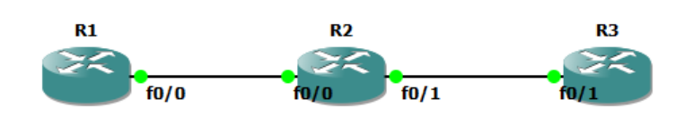
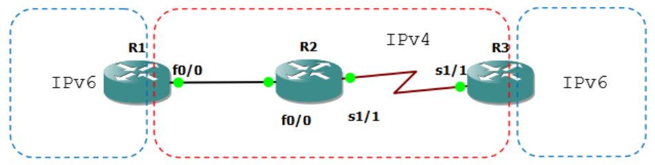

**IPv6 Overview**

Pengguna internet berkembang sangat pesat sehingga space IPv4 yang tersedia juga semakin sedikit. Apalagi dengan banyaknya perangkat seperti telepon dan tablet yang butuh koneksi internet juga turut mengurangi space IPv4. Solusinya adalah dengan IPv6 yang mempunyai space ip yang jauh lebih banyak.

Masalahnya adalah IPv4 berbeda dengan IPv6 sehingga banyak protocol yang tidak compatible satu sama lain. Migrasi dari IPv4 ke IPv6 sudah banyak dilakukan.

Berikut perbandingan jumlah IPv4 dan IPv6.

IPv4 32bit = 2^3 = 4.294.967.296

IPv6 128bit = 2^128 = 340.282.366.920.938.463.463.374.607.431.768.211.456

- Dengan banyaknya space yang disediakan IPv6 maka tidak perlu lagi menggunakan Network Address Translation (NAT) dan Port Address Translation (PAT).
- Dari segi size header, IPv6 mempunyai header yang lebih kecil dibanding IPv4.
- IPv6 terdiri dari 16bit hexadecimal dan case-insensitive yang terbagi menjadi 8 field, tidak seperti IPv4 yang terdiri dari 12bit dan terbagi menjadi 4 oktet.
- Jika dalam IPv4 ada namanya oktet, di IPv6 ada namanya field. Pada IPv6 prefixnya sampai 128. Contohnya: 0000:360B:0000:0000:0020:875B:131B/64.

**Meringkas IPv6**

Aslinya : 2541:0000:360B:<span style="color:red">0000:0000</span>:0020:875B:131B/64

Jika ada 0000 baik berjejer atau tidak, dapat diwakili tanda colon 2 (::). Syaratnya semua harus 0, tidak boleh ada angka selain 0.

Diringkas : 2541:<span style="color:green">0000</span>:360B<span style="color:red">::</span><span style="color:purple">0020</span>:875B:131B/64

Klo sudah ada :: maka jika ada 0000 tidak bisa diwakili :: lagi karena hanya ada satu :: dalam satu IPv6. 0000 bisa diwakili hanya dengan 0 saja.

Selain itu jika ada field yang depannya (sisi kirinya) adalah 0, maka 0 bisa dihilangkan.

Diringkas lagi : 2541:<span style="color:green">0</span>:360B::<span style="color:purple">20</span>:875B:131B/64

Dalam IPv6 tidak ada broadcast. Adanya unicast, multicast dan anycast.

**Unicast**, unicast dalam IPv6 sama dengan IPv4. Kelebihannya, IPv6 dapat memberikan lebih dari 1 alamat pada 1 interface. Keren kan?

**Multicast**, pada IPv6, broadcast digantikan oleh multicast karena memang tidak ada broadcast dalam IPv6.

**Anycast**, dalam IPv6 beberapa host dan router dapat diberi ip yang sama. Misalkan kita punya beberapa web server dengan ip anycast yang sama. Dengan cara tersebut, kita bisa mengarahkan host yang mengakses web server tadi untuk di route ke web server terdekat.

**Jenis-Jenis IP IPv6**

**Unique Local**, sama dengan IP private pada IPv4. IP private digunakan untuk network local dan bukan untuk internet. IP network yang digunakan adalah FD00::/8.

**Link Local**, digunakan untuk mengirim dan menerima packet IPv6 dalam sebuah single subnet. Tiap perangkat yang memakai IPv6 akan mempunyai alamat link local secara otomatis pada interfacenya dan mempunyai link local scope atau jangkauan link local, artinya packet tidak akan meninggalkan link local. Packet yang dikirim ke destination tertentu akan tetap berada dalam link local dan tidak diforward ke subnet lain oleh router. Link Local menggunakan IP network FE80::/10.

Link Local digunakan sebagai RS (Router Solicitation) and RA (Router Advertisement), untuk network discovery (sama seperti ARP) dan digunakan sebagai next-hop untuk ip route.

**Global Unicast**, sama seperti ip publik untuk internet. IP network yang digunakan adalah 2000::/3.

**Unspecified**, alamat ini digunakan ketika host tidak bisa menggunakan IPv6, menggunakan ::/128

**Loopback** yang digunakan untuk software testing seperti 127.0.0.1. Loopback menggunakan ip ::1/128.

**Site Local**. Site local dulunya digunakan sebagai ip private, sekarang sudah tidak digunakan. IP site local adalah FECO::/10.

## IPv6 Basic Link-Local



Secara default IPv6 tidak aktif, untuk mengaktifkan ketikkan perintah unicastrouting.

```
R1(config)#ipv6 unicast-routing
```

Setiap kali mengkonfigurasi IPv6 pada interface, link-local akan otomatis terbuat.

```
R1(config-if)#do sh ipv6 int fa0/0
FastEthernet0/0 is administratively down, line protocol is down
    IPv6 is enabled, link-local address is FE80::C201:9FF:FED0:0 [TEN]
    No Virtual link-local address(es):
    No global unicast address is configured
    Joined group address(es):
        FF02::1
        FF02::2
    MTU is 1500 bytes
    ICMP error messages limited to one every 100 milliseconds
    ICMP redirects are enabled
    ICMP unreachables are sent
    ND DAD is enabled, number of DAD attempts: 1
    ND reachable time is 30000 milliseconds
    ND advertised reachable time is 0 milliseconds
    ND advertised retransmit interval is 0 milliseconds
    ND router advertisements are sent every 200 seconds
    ND router advertisements live for 1800 seconds
    ND advertised default router preference is Medium
    Hosts use stateless autoconfig for addresses.
R1(config-if)#
```

Bisa juga dengan perintah berikut.

```
R2(config)#int fa0/0
R2(config-if)#ipv6 address autoconfig

R2(config)#do show ipv6 int fa0/0
FastEthernet0/0 is administratively down, line protocol is down
    IPv6 is enabled, link-local address is FE80::C202:CFF:FED8:0 [TEN]
    No Virtual link-local address(es):
    No global unicast address is configured
    Joined group address(es):
        FF02::1
        FF02::2
    MTU is 1500 bytes
    ICMP error messages limited to one every 100 milliseconds
    ICMP redirects are enabled
    ICMP unreachables are sent
    ND DAD is enabled, number of DAD attempts: 1
    ND reachable time is 30000 milliseconds
    ND advertised reachable time is 0 milliseconds
    ND advertised retransmit interval is 0 milliseconds
    ND router advertisements are sent every 200 seconds
    ND router advertisements live for 1800 seconds
    ND advertised default router preference is Medium
    Hosts use stateless autoconfig for addresses.
R2(config)#
```

## IPv6 Basic Global Unicast


```
R1(config)#int fa0/0
R1(config-if)#ipv6 address 12::1/126
RR1(config-if)#no sh
*Mar 1 00:22:30.687: %LINK-3-UPDOWN: Interface FastEthernet0/0, changed
state to up
*Mar 1 00:22:31.687: %LINEPROTO-5-UPDOWN: Line protocol on Interface
FastEthernet0/0, changed state to up
```

```
R2(config)#int fa0/0
R2(config-if)#ipv6 add 12::2/126
R2(config-if)#no sh
*Mar 1 00:21:23.063: %LINK-3-UPDOWN: Interface FastEthernet0/0, changed
state to up
*Mar 1 00:21:24.063: %LINEPROTO-5-UPDOWN: Line protocol on Interface
FastEthernet0/0, changed state to up
```

Cek ping.

```
R2(config-if)#do ping 12::1
Type escape sequence to abort.
Sending 5, 100-byte ICMP Echos to 12::1, timeout is 2 seconds:
!!!!!
Success rate is 100 percent (5/5), round-trip min/avg/max = 32/54/104 ms
R2(config-if)#
```

## IPv6 Basic EUI-64


Untuk konfigurasi otomatis.

```
R2(config-if)#int fa0/1
R2(config-if)#ipv6 address 23::/64 eui-64
R2(config-if)#no sh
*Mar 1 00:25:46.951: %LINK-3-UPDOWN: Interface FastEthernet0/1, changed
state to up
*Mar 1 00:25:47.951: %LINEPROTO-5-UPDOWN: Line protocol on Interface
FastEthernet0/1, changed state to up
```

```
R3(config)#int fa0/1
R3(config-if)#ipv6 address 23::/64 eui-64
R3(config-if)#no sh
*Mar 1 00:24:13.739: %LINK-3-UPDOWN: Interface FastEthernet0/1, changed
state to up
*Mar 1 00:24:14.739: %LINEPROTO-5-UPDOWN: Line protocol on Interface
FastEthernet0/1, changed state to up
```

Cek interface R2 dan R3.

```
R2(config-if)#do sh ipv6 int br
FastEthernet0/0             [up/up]
    FE80::C202:CFF:FED8:0
    12::2
FastEthernet0/1             [up/up]
    FE80::C202:CFF:FED8:1
    23::C202:CFF:FED8:1
Serial1/0                   [administratively down/down]
Serial1/1                   [administratively down/down]
Serial1/2                   [administratively down/down]
Serial1/3                   [administratively down/down]
R2(config-if)#
```

```
R3(config-if)#do sh ipv6 int br
FastEthernet0/0             [administratively down/down]
FastEthernet0/1             [up/up]
    FE80::C203:3FF:FEA8:1
    23::C203:3FF:FEA8:1
Serial1/0                   [administratively down/down]
Serial1/1                   [administratively down/down]
Serial1/2                   [administratively down/down]
Serial1/3                   [administratively down/down]
R3(config-if)#
```

Cek ping ke R2.

```
Type escape sequence to abort.
Sending 5, 100-byte ICMP Echos to 23::C202:CFF:FED8:1, timeout is 2 seconds:
!!!!!
Success rate is 100 percent (5/5), round-trip min/avg/max = 28/56/104 ms
R3(config-if)#
```

### IPv6 Routing


flowchart TD
%% Node Utama
IPv6[IPv6 Routing]

    %% Kategori Utama
    IGP[IGP]
    EGP[EGP]

    IPv6 --- IGP
    IPv6 --- EGP

    %% Sub-kategori IGP
    RIPNG[RIPNG]
    EIGRP[EIGRP]
    OSPF[OSPFv3]

    IGP --- RIPNG
    IGP --- EIGRP
    IGP --- OSPF

    %% Sub-kategori EGP
    BGP[BGP]

    EGP --- BGP

    %% Styling Warna Teal dengan sudut sedikit melengkung
    classDef tealBox fill:#2ba3b8,stroke:#1d8294,stroke-width:1px,color:#ffffff,rx:5px,ry:5px;
    class IPv6,IGP,EGP,RIPNG,EIGRP,OSPF,BGP tealBox;



## IPv6 Static Routing


Pakai topologi sebelumnya. Cek interface router untuk menentukan destination dan next-hop.

```
R1#sh ipv6 int br
FastEthernet0/0             [up/up]
    FE80::C201:9FF:FED0:0
    12::1
FastEthernet0/1             [administratively down/down]
Serial1/0                   [administratively down/down]
Serial1/1                   [administratively down/down]
Serial1/2                   [administratively down/down]
Serial1/3                   [administratively down/down]
R1#
```

```
R2#sh ipv6 int br
FastEthernet0/0             [up/up]
    FE80::C202:CFF:FED8:0
    12::2
FastEthernet0/1             [up/up]
    FE80::C202:CFF:FED8:1
    23::C202:CFF:FED8:1
Serial1/0                   [administratively down/down]
Serial1/1                   [administratively down/down]
Serial1/2                   [administratively down/down]
Serial1/3                   [administratively down/down]
R2#
```

```
R3#sh ipv6 int br
FastEthernet0/0             [administratively down/down]
FastEthernet0/1             [up/up]
 FE80::C203:3FF:FEA8:1
 23::C203:3FF:FEA8:1
Serial1/0                   [administratively down/down]
Serial1/1                   [administratively down/down]
Serial1/2                   [administratively down/down]
Serial1/3                   [administratively down/down]
R3#
```

Konfigurasi static routing pada IPv6 hampir sama dengan IPv4.

```
R1(config)# ipv6 route 23::/64 12::2
R3(config)#ipv6 route 12::/126 23::C202:CFF:FED8:1
```

Cek tabel routing dan tes ping.

```
R1#sh ipv6 route
IPv6 Routing Table - 4 entries
Codes:  C - Connected, L - Local, S - Static, R - RIP, B - BGP
        U - Per-user Static route, M - MIPv6
        I1 - ISIS L1, I2 - ISIS L2, IA - ISIS interarea, IS - ISIS summary
        O - OSPF intra, OI - OSPF inter, OE1 - OSPF ext 1, OE2 - OSPF ext 2
        ON1 - OSPF NSSA ext 1, ON2 - OSPF NSSA ext 2
        D - EIGRP, EX - EIGRP external
C   12::/126 [0/0]
     via ::, FastEthernet0/0
L   12::1/128 [0/0]
     via ::, FastEthernet0/0
S   23::/64 [1/0]
     via 12::2
L   FF00::/8 [0/0]
     via ::, Null0
R1#ping 23::C203:3FF:FEA8:1

Type escape sequence to abort.
Sending 5, 100-byte ICMP Echos to 23::C203:3FF:FEA8:1, timeout is 2 seconds:
!!!!!
Succes
```

```
R3(config)#do sho ipv6 route
IPv6 Routing Table - 4 entries
Codes:  C - Connected, L - Local, S - Static, R - RIP, B - BGP
        U - Per-user Static route, M - MIPv6
        I1 - ISIS L1, I2 - ISIS L2, IA - ISIS interarea, IS - ISIS summary
        O - OSPF intra, OI - OSPF inter, OE1 - OSPF ext 1, OE2 - OSPF ext 2
        ON1 - OSPF NSSA ext 1, ON2 - OSPF NSSA ext 2
        D - EIGRP, EX - EIGRP external
S   12::/126 [1/0]
     via 23::C202:CFF:FED8:1
C   23::/64 [0/0]
     via ::, FastEthernet0/1
L   23::C203:3FF:FEA8:1/128 [0/0]
     via ::, FastEthernet0/1
L   FF00::/8 [0/0]
     via ::, Null0
R3(config)#do ping 12::1

Type escape sequence to abort.
Sending 5, 100-byte ICMP Echos to 12::1, timeout is 2 seconds:
!!!!!
Success rate is 100 percent (5/5), round-trip min/avg/max = 64/74/84 ms
R3(config)#
```

Selain menggunakan ip next-hop, konfigurasi static routing juga dapat menggunakan interface next-hop. Khusus IPv6, harus disertakan link localnya. Hapus dulu static routing sebelumnya.

```
R1(config)#no ipv6 route 23::/64 12::2
R3(config)#no ipv6 route 12::/126 23::C202:CFF:FED8:1
R1(config)#ipv6 route 23::/64 FastEthernet 0/0
R1(config)#do ping 23::C203:3FF:FEA8:1

Type escape sequence to abort.
Sending 5, 100-byte ICMP Echos to 23::C203:3FF:FEA8:1, timeout is 2 seconds:
.....
Success rate is 0 percent (0/5)
R1(config)#
```

Ping gagal karena belum disertakan link local.

```
R1(config)#no ipv6 route 23::/64 FastEthernet 0/0
R1(config)#ipv6 route 23::/64 FastEthernet 0/0 FE80::C202:CFF:FED8:0
R1(config)#do ping 23::C203:3FF:FEA8:1

Type escape sequence to abort.
Sending 5, 100-byte ICMP Echos to 23::C203:3FF:FEA8:1, timeout is 2 seconds:
!!!!!
Success rate is 100 percent (5/5), round-trip min/avg/max = 72/85/108 ms
R1(config)#
```

Sekarang konfigurasi routing static pada R3.

```
R3(config)#ipv6 route 12::/126 FastEthernet 0/1 FE80::C202:CFF:FED8:1
R3(config)#do ping 12::1

Type escape sequence to abort.
Sending 5, 100-byte ICMP Echos to 12::1, timeout is 2 seconds:
!!!!!
Success rate is 100 percent (5/5), round-trip min/avg/max = 56/68/92 ms
R3(config)#
```

## IPv6 RIPnG


Masih memakai topologi sebelumnya, hapus dulu ipv6 route. Masukkan konfigurasi RIPnG.

```
R1(config)#ipv6 unicast-routing
R1(config)#int fa0/0
R1(config-if)#ipv6 rip ?
    WORD User selected string identifying this RIP process

R1(config-if)#ipv6 rip 17 ?
    default-information     Configure handling of default route
    enable                  Enable/disable RIP routing
    metric-offset           Adjust default metric increment
    summary-address         Configure address summarization

R1(config-if)#ipv6 rip 17 enable
```

```
R2(config)#ipv6 unicast-routing
R2(config)#int fa0/0
R2(config-if)#ipv6 rip 17 enable
R2(config-if)#int fa0/1
R2(config-if)#ipv6 rip 17 enable
```

```
R3(config)#ipv6 unicast-routing
R3(config)#int fa0/1
R3(config-if)#ipv6 rip 17 enable
```

Cek tabel routing dan tes ping.

```
R3#sh ipv6 route
IPv6 Routing Table - 4 entries
Codes:  C - Connected, L - Local, S - Static, R - RIP, B - BGP
        U - Per-user Static route, M - MIPv6
        I1 - ISIS L1, I2 - ISIS L2, IA - ISIS interarea, IS - ISIS summary
        O - OSPF intra, OI - OSPF inter, OE1 - OSPF ext 1, OE2 - OSPF ext 2
        ON1 - OSPF NSSA ext 1, ON2 - OSPF NSSA ext 2
        D - EIGRP, EX - EIGRP external
R   12::/126 [120/2]
     via FE80::C202:CFF:FED8:1, FastEthernet0/1
C   23::/64 [0/0]
     via ::, FastEthernet0/1
L   23::C203:3FF:FEA8:1/128 [0/0]
     via ::, FastEthernet0/1
L   FF00::/8 [0/0]
     via ::, Null0
R3#ping 12::1

Type escape sequence to abort.
Sending 5, 100-byte ICMP Echos to 12::1, timeout is 2 seconds:
!!!!!
Success rate is 100 percent (5/5), round-trip min/avg/max = 52/92/160 ms
R3#
```

Cek protocol yang sedang bekerja.

```
R1#sh ipv6 protocols
IPv6 Routing Protocol is "connected"
IPv6 Routing Protocol is "static"
IPv6 Routing Protocol is "rip 17"
    Interfaces:
        FastEthernet0/0
    Redistribution:
        None
R1#sh ipv6 rip 17
RIP process "17", port 521, multicast-group FF02::9, pid 238
     Administrative distance is 120. Maximum paths is 16
     Updates every 30 seconds, expire after 180
     Holddown lasts 0 seconds, garbage collect after 120
     Split horizon is on; poison reverse is off
     Default routes are not generated
     Periodic updates 34, trigger updates 0
 Interfaces:
    FastEthernet0/0
 Redistribution:
    None
R1#
```

## IPv6 EIGRP


Hapus dulu RIPnG nya.

```
R1(config)#no ipv6 router rip 17
R2(config)#no ipv6 router rip 17
R3(config)#no ipv6 router rip 17
```

Tambahkan interface loopback sebagai identitas dan agar lebih mudah diping.

```
R1(config-rtr)#int lo0
R1(config-if)#ipv6 address 1::1/128
R2(config-rtr)#int lo0
R2(config-if)#ipv6 address 2::2/128
R3(config-rtr)#int lo0
R3(config-if)#ipv6 address 3::3/128
```

Konfigurasi EIGRP pada ketiga router.

```
R1(config)#ipv6 router eigrp 13
R1(config-rtr)#router-id 1.1.1.1
R1(config-rtr)#no shut
*Mar 1 00:34:24.023: %DUAL-5-NBRCHANGE: IPv6-EIGRP(0) 13: Neighbor
FE80::C202:CFF:FED8:0 (FastEthernet0/0) is up: new adjacency
R2(config-rtr)#int lo0
R2(config-if)#ipv6 eigrp 13
R1(config-rtr)#int fa0/0
R1(config-if)#ipv6 eigrp 13
```

```
R2(config)#ipv6 router eigrp 13
R2(config-rtr)#router-id 2.2.2.2
R2(config-rtr)#no shut
*Mar 1 00:33:55.991: %DUAL-5-NBRCHANGE: IPv6-EIGRP(0) 13: Neighbor
FE80::C203:3FF:FEA8:1 (FastEthernet0/1) is up: new adjacency
*Mar 1 00:34:25.179: %DUAL-5-NBRCHANGE: IPv6-EIGRP(0) 13: Neighbor
FE80::C201:9FF:FED0:0 (FastEthernet0/0) is up: new adjacency
R2(config-rtr)#int lo0
```

```
R2(config-if)#ipv6 eigrp 13
R2(config-rtr)#int fa0/0
R2(config-if)#ipv6 eigrp 13
R2(config-rtr)#int fa0/1
R2(config-if)#ipv6 eigrp 13
```

```
R3(config)#ipv6 router eigrp 13
R3(config-rtr)#router-id 3.3.3.3
R3(config-rtr)#no shut
*Mar 1 00:33:56.287: %DUAL-5-NBRCHANGE: IPv6-EIGRP(0) 13: Neighbor
FE80::C202:CFF:FED8:1 (FastEthernet0/1) is up: new adjacency
R2(config-rtr)#int lo0
R2(config-if)#ipv6 eigrp 13
R3(config-rtr)#int fa0/1
R3(config-if)#ipv6 eigrp 13
```

Cek tabel routing dan tes ping.

```
R1#sh ipv6 route
IPv6 Routing Table - 7 entries
Codes:  C - Connected, L - Local, S - Static, R - RIP, B - BGP
        U - Per-user Static route, M - MIPv6
        I1 - ISIS L1, I2 - ISIS L2, IA - ISIS interarea, IS - ISIS summary
        O - OSPF intra, OI - OSPF inter, OE1 - OSPF ext 1, OE2 - OSPF ext 2
        ON1 - OSPF NSSA ext 1, ON2 - OSPF NSSA ext 2
        D - EIGRP, EX - EIGRP external
LC  1::1/128 [0/0]
     via ::, Loopback0
D   2::2/128 [90/409600]
     via FE80::C202:CFF:FED8:0, FastEthernet0/0
D   3::3/128 [90/435200]
     via FE80::C202:CFF:FED8:0, FastEthernet0/0
C   12::/126 [0/0]
     via ::, FastEthernet0/0
L   12::1/128 [0/0]
     via ::, FastEthernet0/0
D   23::/64 [90/307200]
     via FE80::C202:CFF:FED8:0, FastEthernet0/0
L   FF00::/8 [0/0]
     via ::, Null0
R1#ping 2::2

Type escape sequence to abort.
Sending 5, 100-byte ICMP Echos to 2::2, timeout is 2 seconds:
!!!!!
Success rate is 100 percent (5/5), round-trip min/avg/max = 16/44/92 ms
R1#ping 3::3

Type escape sequence to abort.
Sending 5, 100-byte ICMP Echos to 3::3, timeout is 2 seconds:
!!!!!
Success rate is 100 percent (5/5), round-trip min/avg/max = 32/57/92 ms
R1#
```

## IPv6 OSPFv3

Hapus dulu EIGRP sebelumnya.

```
R1(config)##no ipv6 router eigrp 13
R2(config)##no ipv6 router eigrp 13
R3(config)##no ipv6 router eigrp 13
```

Sekarang konfigurasi OSPFv3 nya.

```
R1(config)#ipv6 router ospf 1
*Mar 1 00:21:43.595: %OSPFv3-4-NORTRID: OSPFv3 process 2 could not pick a
router-id,
R1(config-rtr)#router-id 1.1.1.1
R1(config-rtr)#int lo0
R1(config-if)#ipv6 ospf 1 area 0
R1(config-if)#int fa0/0
R1(config-if)#ipv6 ospf 1 area 0
```

```
R2(config)#ipv6 router ospf 2
*Mar 1 00:21:43.595: %OSPFv3-4-NORTRID: OSPFv3 process 2 could not pick a
router-id,
please configure manually
R2(config-rtr)#router-id 2.2.2.2
R2(config-rtr)#int lo0
R2(config-if)#ipv6 ospf 2 area 0
R2(config-if)#int fa0/0
R2(config-if)#ipv6 ospf 2 area 0
*Mar 1 00:22:34.395: %OSPFv3-5-ADJCHG: Process 2, Nbr 1.1.1.1 on
FastEthernet0/0 from LOADING to FULL, Loading Done
R2(config-if)#int fa0/1
R2(config-if)#ipv6 ospf 2 area 0
```

```
R3(config)#ipv6 router ospf 3
*Mar 1 00:25:00.603: %OSPFv3-4-NORTRID: OSPFv3 process 3 could not pick a
router-id,
please configure manually
R3(config-rtr)#router-id 3.3.3.3
R3(config-rtr)#int fa0/1
R3(config-if)#ipv6 ospf 3 area 0
*Mar 1 00:25:23.427: %OSPFv3-5-ADJCHG: Process 3, Nbr 2.2.2.2 on
FastEthernet0/1 from LOADING to FULL, Loading Done
R3(config-if)#int lo0
R3(config-if)#ipv6 ospf 3 area 0
```

Cek neighbor.

```
R2#sh ipv6 ospf neighbor

Neighbor ID     Pri     State       Dead Time   Interface ID    Interface
3.3.3.3         1       FULL/BDR    00:00:35    5
FastEthernet0/1
1.1.1.1         1       FULL/DR     00:00:27    4
FastEthernet0/0
R2#
```

Cek tabel routing dan tes ping.

```
R1#sh ipv6 route
IPv6 Routing Table - 7 entries
Codes:  C - Connected, L - Local, S - Static, R - RIP, B - BGP
        U - Per-user Static route, M - MIPv6
        I1 - ISIS L1, I2 - ISIS L2, IA - ISIS interarea, IS - ISIS summary
        O - OSPF intra, OI - OSPF inter, OE1 - OSPF ext 1, OE2 - OSPF ext 2
        ON1 - OSPF NSSA ext 1, ON2 - OSPF NSSA ext 2
        D - EIGRP, EX - EIGRP external
LC  1::1/128 [0/0]
     via ::, Loopback0
O   2::2/128 [110/10]
     via FE80::C202:CFF:FED8:0, FastEthernet0/0
O   3::3/128 [110/20]
     via FE80::C202:CFF:FED8:0, FastEthernet0/0
C   12::/126 [0/0]
     via ::, FastEthernet0/0
L   12::1/128 [0/0]
     via ::, FastEthernet0/0
O   23::/64 [110/20]
     via FE80::C202:CFF:FED8:0, FastEthernet0/0
L   FF00::/8 [0/0]
     via ::, Null0
R1#ping 2::2

Type escape sequence to abort.
Sending 5, 100-byte ICMP Echos to 2::2, timeout is 2 seconds:
!!!!!
Success rate is 100 percent (5/5), round-trip min/avg/max = 24/48/80 ms
R1#ping 3::3

Type escape sequence to abort.
Sending 5, 100-byte ICMP Echos to 3::3, timeout is 2 seconds:
!!!!!
Success rate is 100 percent (5/5), round-trip min/avg/max = 36/70/144 ms
R1#
```

### IPv6 Tunneling

Tunneling adalah mengencapsulasi suatu packet data ke dalam packet data yang lain. Disini, packet IPv6 di encapsulasi ke dalam packet IPv4.

**Static Point-to-Point Tunnel**, digunakan untuk tunneling point-to-point dan support IGP pada IPv6. Static Point-to-Point Tunnel dibagi menjadi 2 yaitu:

- Manual Tunnel
- GRE (Generic Routing Encapsulation) Tunnel

Persamaan:

Sama-sama memforward multicast traffic.

Perbedaan:

- Untuk manual tunnel, seperti namanya, membutuhkan konfigurasi secara manual. GRE Tunnel sudah aktif secara default sehingga tidak perlu dikonfigurasi.
- GRE Tunnel mempunyai MTU yang lebih besar dibanding manual tunnel.
- Link-local GRE Tunnel dibuat secara otomatis dengan EUI-64 dan diambil dari MAC Address Interface yang paling rendah. Sedang link-local manual tunnel adalah FE80::/96 + 32 bit tunnel source IPv4.

**Dynamic Multipoint IPv6 Tunnel**, dinamakan dynamic karena tidak perlu dispesifikasikan end-point IPv4 secara manual, atau bisa dikatakan tidak perlu mengeset tunnel destination, digunakan untuk tunneling point to multipoint. Dynamic Multipoint IPv6 Tunnel ini tidak support IGP dan hanya support static routing atau BGP. Dynamic Multipoint IPv6 Tunnel ini dibagi menjadi 3:

- Automatic 6to4
- ISATAP (Intra-site Automatic Tunneling Addressing Protocol)

Automatic 6to4, menggunakan network 2002::/16. Network 2002::/16 memang disediakan khusus untuk tunneling dan bukan untuk global unicast.

ISATAP, hampir sama dengan 6to4, namun tidak menggunakan network 2002::/16 untuk tunneling namun menggunakan global unicast. ISATAP secara otomatis membuat tunnel ID menggunakan EUI-64.

## IPv6 IPv6IP Tunneling



```
R1(config)#ipv6 unicast-routing
R1(config)#int lo0
R1(config-if)#ipv6 address 1::1/128
R1(config-if)#int fa0/0
R1(config-if)#ip address 12.12.12.1 255.255.255.0
R1(config-if)#no sh
```

```
R2(config-if)#int fa0/0
R2(config-if)#ip add 12.12.12.2 255.255.255.0
R2(config-if)#no sh
R2(config-if)#int s1/1
R2(config-if)#ip add 23.23.23.2 255.255.255.0
R2(config-if)#no sh
```

```
R3(config)#ipv6 unicast-routing
R3(config)#int lo0
R3(config-if)#ipv6 add 3::3/128
R3(config-if)#int se1/1
R3(config-if)#ip add 23.23.23.3 255.255.255.0
R3(config-if)#no sh
```

Sekarang konfigurasi routing IPv4 nya, boleh pake static, EIGRP ato OSPF.

```
R1(config-if)#router ospf 1
R1(config-router)#net 12.12.12.0 0.0.0.255 area 0

R2(config-if)#router ospf 2
R2(config-router)#net 12.12.12.0 0.0.0.255 area 0
R2(config-router)#net 23.23.23.0 0.0.0.255 area 0

R3(config-if)#router ospf 3
R3(config-router)#net 23.23.23.0 0.0.0.255 area 0
```

Cek ping dulu.

```
R1#ping 23.23.23.3

Type escape sequence to abort.
Sending 5, 100-byte ICMP Echos to 23.23.23.3, timeout is 2 seconds:
!!!!!
Success rate is 100 percent (5/5), round-trip min/avg/max = 84/99/116 ms
R1#sh ip route

Gateway of last resort is not set

    23.0.0.0/24 is subnetted, 1 subnets
O       23.23.23.0 [110/74] via 12.12.12.2, 00:02:39, FastEthernet0/0
    12.0.0.0/24 is subnetted, 1 subnets
C       12.12.12.0 is directly connected, FastEthernet0/0
R1#
```

Konfigurasi tunnel IPv6IP.

```
R1(config)#int tun13
*Mar 1 00:21:38.631: %LINEPROTO-5-UPDOWN: Line protocol on Interface
Tunnel13, changed state to down
R1(config-if)#ipv6 address 13::1/64
R1(config-if)#tunnel source 12.12.12.1
R1(config-if)#tunnel destination 23.23.23.3
*Mar 1 00:22:26.331: %LINEPROTO-5-UPDOWN: Line protocol on Interface
Tunnel13, changed state to up
R1(config-if)#tunnel mode ?
    aurp    AURP TunnelTalk AppleTalk encapsulation
    cayman  Cayman TunnelTalk AppleTalk encapsulation
    dvmrp   DVMRP multicast tunnel
    eon     EON compatible CLNS tunnel
    gre     generic route encapsulation protocol
    ipip    IP over IP encapsulation
    ipsec   IPSec tunnel encapsulation
    iptalk  Apple IPTalk encapsulation
    ipv6    Generic packet tunneling in IPv6
    ipv6ip  IPv6 over IP encapsulation
    mpls    MPLS encapsulations
    nos     IP over IP encapsulation (KA9Q/NOS compatible)
    rbscp   RBSCP in IP tunnel

R1(config-if)#tunnel mode ipv6ip
```

```
R3(config)#int tun31
R3(config-if)#ipv6 add 13::3/64
R3(config-if)#tunnel source 23.23.23.3
R3(config-if)#tunnel destination 12.12.12.1
R3(config-if)#tunnel mode ipv6ip
```

```
R1#sh ipv6 int br
FastEthernet0/0 [up/up]
FastEthernet0/1 [administratively down/down]
Serial1/0 [administratively down/down]
Serial1/1 [administratively down/down]
Serial1/2 [administratively down/down]
Serial1/3 [administratively down/down]
Loopback0 [up/up]
    FE80::C201:11FF:FE04:0
    1::1
Tunnel13 [up/up]
    FE80::C0C:C01
    13::1
R1#sh ipv6 int tun13
Tunnel13 is up, line protocol is up
  IPv6 is enabled, link-local address is FE80::C0C:C01
  No Virtual link-local address(es):
  Global unicast address(es):
    13::1, subnet is 13::/64
  Joined group address(es):
    FF02::1
    FF02::2
    FF02::1:FF00:1
    FF02::1:FF0C:C01
  MTU is 1480 bytes
  ICMP error messages limited to one every 100 milliseconds
  ICMP redirects are enabled
  ICMP unreachables are sent
  ND DAD is enabled, number of DAD attempts: 1
  ND reachable time is 30000 milliseconds
  Hosts use stateless autoconfig for addresses.
R1#sh int tun13
Tunnel13 is up, line protocol is up
  Hardware is Tunnel
  MTU 1514 bytes, BW 9 Kbit, DLY 500000 usec,
    reliability 255/255, txload 1/255, rxload 1/255
  Encapsulation TUNNEL, loopback not set
  Keepalive not set
  Tunnel source 12.12.12.1, destination 23.23.23.3
  Tunnel protocol/transport IPv6/IP
  Tunnel TTL 255
  Fast tunneling enabled
  Tunnel transmit bandwidth 8000 (kbps)
  Tunnel receive bandwidth 8000 (kbps)
  Last input 00:02:22, output 00:07:11, output hang never
  Last clearing of "show interface" counters never
  Input queue: 0/75/0/0 (size/max/drops/flushes); Total output drops: 0
  Queueing strategy: fifo
  Output queue: 0/0 (size/max)
  5 minute input rate 0 bits/sec, 0 packets/sec
  5 minute output rate 0 bits/sec, 0 packets/sec
    9 packets input, 1008 bytes, 0 no buffer
    Received 0 broadcasts, 0 runts, 0 giants, 0 throttles
    0 input errors, 0 CRC, 0 frame, 0 overrun, 0 ignored, 0 abort
    23 packets output, 2152 bytes, 0 underruns
    0 output errors, 0 collisions, 0 interface resets
    0 output buffer failures, 0 output buffers swapped out
R1#
```

Sekarang tes ping.

```
R1#ping 3::3
Type escape sequence to abort.
Sending 5, 100-byte ICMP Echos to 3::3, timeout is 2 seconds:
!!!!!
Success rate is 100 percent (5/5), round-trip min/avg/max = 92/157/240 ms
R1#sh ipv6 ro
R1#sh ipv6 route
IPv6 Routing Table - 5 entries
Codes:  C - Connected, L - Local, S - Static, R - RIP, B - BGP
        U - Per-user Static route, M - MIPv6
        I1 - ISIS L1, I2 - ISIS L2, IA - ISIS interarea, IS - ISIS summary
        O - OSPF intra, OI - OSPF inter, OE1 - OSPF ext 1, OE2 - OSPF ext 2
        ON1 - OSPF NSSA ext 1, ON2 - OSPF NSSA ext 2
        D - EIGRP, EX - EIGRP external
LC  1::1/128 [0/0]
     via ::, Loopback0
S   3::3/128 [1/0]
     via 13::3
C   13::/64 [0/0]
     via ::, Tunnel13
L   13::1/128 [0/0]
     via ::, Tunnel13
L   FF00::/8 [0/0]
     via ::, Null0
R1#
```

## IPv6 GRE IP Tunneling

Dari lab sebelumnya tinggal merubah tunnel mode atau cukup menghapus tunnel mode sebelumnya karena GRE IP Tunneling secara default aktif.


Lakukan konfigurasi berikut.

```
R1(config)#int tunnel 13
R1(config-if)#tunnel mode ipv6i
R1(config-if)#no tunnel mode ipv6ip

R3(config)#int tunnel 31
R3(config-if)#tunnel mode gre ip
```

Cek interfacenya.

```
R3#show int tunnel31
Tunnel31 is up, line protocol is up
    Hardware is Tunnel
    MTU 1514 bytes, BW 9 Kbit, DLY 500000 usec,
        reliability 255/255, txload 1/255, rxload 1/255
    Encapsulation TUNNEL, loopback not set
    Keepalive not set
    Tunnel source 23.23.23.3, destination 12.12.12.1
    Tunnel protocol/transport GRE/IP
        Key disabled, sequencing disabled
        Checksumming of packets disabled
    Tunnel TTL 255
    Fast tunneling enabled
    Tunnel transmit bandwidth 8000 (kbps)
    Tunnel receive bandwidth 8000 (kbps)
    Last input 00:03:54, output 00:03:54, output hang never
    Last clearing of "show interface" counters never
    Input queue: 0/75/0/0 (size/max/drops/flushes); Total output drops: 0
    Queueing strategy: fifo
    Output queue: 0/0 (size/max)
    5 minute input rate 0 bits/sec, 0 packets/sec
    5 minute output rate 0 bits/sec, 0 packets/sec
        29 packets input, 3296 bytes, 0 no buffer
        Received 0 broadcasts, 0 runts, 0 giants, 0 throttles
        0 input errors, 0 CRC, 0 frame, 0 overrun, 0 ignored, 0 abort
        38 packets output, 3988 bytes, 0 underruns
        0 output errors, 0 collisions, 0 interface resets
        0 output buffer failures, 0 output buffers swapped out
R3#

Tes ping.
R3#ping 1::1

Type escape sequence to abort.
Sending 5, 100-byte ICMP Echos to 1::1, timeout is 2 seconds:
!!!!!
Success rate is 100 percent (5/5), round-trip min/avg/max = 76/116/152 ms
R3#
```

## IPv6 Tunnel 6to4


Masih menggunakan topologi sebelumnya. Hapus dulu interface tunnel dan ipv6 routenya.

```
R1(config)#no int tun13
R1(config)#do sh run | s i ipv6 route
ipv6 route 3::3/128 13::3
R1(config)#no ipv6 route 3::3/128 13::3

R3(config)#no int tun31
R3(config)#do sh run | s i ipv6 route
ipv6 route 1::1/128 13::1
R3(config)#no ipv6 route 1::1/128 13::1
```

Konfigurasi 6to4 tunnel.

```
R1(config)#int tunnel 103
R1(config-if)#ipv6 address 2002:0C0C:0C01::1/64
R1(config-if)#tunnel source 12.12.12.1
R1(config-if)#tunnel mode ipv6ip ?
    6to4            IPv6 automatic tunnelling using 6to4
    auto-tunnel     IPv6 automatic tunnelling using IPv4 compatible addresses
    isatap          IPv6 automatic tunnelling using ISATAP
    <cr>

R1(config-if)#tunnel mode ipv6ip 6to4

R3(config)#int tunnel 301
 Tunnel301, changed state to down
R3(config-if)#tunnel source 23.23.23.3
R3(config-if)#ipv6 address 2002:1717:1703::3/64
R3(config-if)#tunnel mode ipv6ip 6to4
```

Pengecekan.

```
R3(config-if)#do ping 2002:0C0C:0C01::1

Type escape sequence to abort.
Sending 5, 100-byte ICMP Echos to 2002:C0C:C01::1, timeout is 2 seconds:
!!!!!
Success rate is 100 percent (5/5), round-trip min/avg/max = 120/147/196 ms
R3(config-if)#

R1(config-if)#do ping 2002:1717:1703::3

Type escape sequence to abort.
Sending 5, 100-byte ICMP Echos to 2002:1717:1703::3, timeout is 2 seconds:
!!!!!
Success rate is 100 percent (5/5), round-trip min/avg/max = 124/139/168 ms
R1(config-if)#

R1#sh int tun 103
Tunnel103 is up, line protocol is up
    Hardware is Tunnel
    MTU 1514 bytes, BW 9 Kbit, DLY 500000 usec,
        reliability 255/255, txload 1/255, rxload 1/255
    Encapsulation TUNNEL, loopback not set
    Keepalive not set
    Tunnel source 12.12.12.1, destination UNKNOWN
    Tunnel protocol/transport IPv6 6to4
    Tunnel TTL 255
    Fast tunneling enabled
    Tunnel transmit bandwidth 8000 (kbps)
    Tunnel receive bandwidth 8000 (kbps)
    Last input never, output 00:01:41, output hang never
    Last clearing of "show interface" counters never
    Input queue: 0/75/0/0 (size/max/drops/flushes); Total output drops: 0
    Queueing strategy: fifo
    Output queue: 0/0 (size/max)
    5 minute input rate 0 bits/sec, 0 packets/sec
    5 minute output rate 0 bits/sec, 0 packets/sec
        0 packets input, 0 bytes, 0 no buffer
        Received 0 broadcasts, 0 runts, 0 giants, 0 throttles
        0 input errors, 0 CRC, 0 frame, 0 overrun, 0 ignored, 0 abort
        6 packets output, 576 bytes, 0 underruns
        0 output errors, 0 collisions, 0 interface resets
        0 output buffer failures, 0 output buffers swapped out
```

Hitungan IP tunnelnya sebagai berikut:

12.12.12.1 -> 01100.01100.01100.0001 -> **0C0C:0C01** -> 2002:**0C0C:0C01**::1<br>
23.23.23.3 -> 10111.10111.10111.0011 -> **1717:1703** -> 2002:**1717:1703**::3

IP tunnel 6to4 menggunakan network 2002:/64. Untuk lebih mudahnya, perhitungan diatas dapat menggunakan calculator pada os windows dengan mode programmer.

## IPv6 Tunnel ISATAP

Masih memakai topologi sebelumnya. Hapus dulu interface tunnel dan ipv6
routenya.


```
R1(config)#no int tun103
R3(config)#no int tun301
```

Konfigurasi tunnel ISATAP.

```
R1(config)#int tun 1003
R1(config-if)#ipv6 address 13::/64 eui-64
*Mar 1 00:52:50.127: %LINEPROTO-5-UPDOWN: Line protocol on Interface
Tunnel1003, changed state to down
R1(config-if)#tunnel source 12.12.12.1
R1(config-if)#tunnel mode ipv6ip isatap
R3(config)#int tun 3001
*Mar 1 00:54:17.359: %LINEPROTO-5-UPDOWN: Line protocol on Interface
Tunnel3001, changed state to down
R3(config-if)#tunnel source 23.23.23.3
R3(config-if)#ipv6 add 13::/64 eui-64
R3(config-if)#tunnel mode ipv6ip isatap
```

Tes ping.

```
R1(config-if)#do sh ipv6 int br
FastEthernet0/0             [up/up]
FastEthernet0/1             [administratively down/down]
Serial1/0                   [administratively down/down]
Serial1/1                   [administratively down/down]
Serial1/2                   [administratively down/down]
Serial1/3                   [administratively down/down]
Loopback0                   [up/up]
    FE80::C201:11FF:FE04:0
    1::1
Tunnel1003                  [up/up]
    FE80::5EFE:C0C:C01
    13::5EFE:C0C:C01
R1(config-if)#

R3(config-if)#do ping

Type escape sequence to abort.
Sending 5, 100-byte ICMP Echos to 13::5EFE:C0C:C01, timeout is 2 seconds:
!!!!!
Success rate is 100 percent (5/5), round-trip min/avg/max = 92/124/152 ms
R3(config-if)#
```

Masukkan routing static.

```
R1(config)#ipv6 route 3::3/128 13::5EFE:1717:1703
R3(config)#ipv6 route 1::1/128 13::5EFE:C0C:C01
```

Pengecekan.

```
R1(config)#do ping 3::3

Type escape sequence to abort.
Sending 5, 100-byte ICMP Echos to 3::3, timeout is 2 seconds:
!!!!!
Success rate is 100 percent (5/5), round-trip min/avg/max = 96/117/136 ms
R1(config)#

R3(config)#do ping 1::1

Type escape sequence to abort.
Sending 5, 100-byte ICMP Echos to 1::1, timeout is 2 seconds:
!!!!!
Success rate is 100 percent (5/5), round-trip min/avg/max = 92/132/168 ms
R3(config)#

R1(config)#do sh int tun1003
Tunnel1003 is up, line protocol is up
    Hardware is Tunnel
    MTU 1514 bytes, BW 9 Kbit, DLY 500000 usec,
        reliability 255/255, txload 1/255, rxload 1/255
    Encapsulation TUNNEL, loopback not set
    Keepalive not set
    Tunnel source 12.12.12.1, destination UNKNOWN
    Tunnel protocol/transport IPv6 ISATAP
    Tunnel TTL 255
    Fast tunneling enabled
    Tunnel transmit bandwidth 8000 (kbps)
    Tunnel receive bandwidth 8000 (kbps)
    Last input 00:00:53, output 00:00:53, output hang never
    Last clearing of "show interface" counters never
    Input queue: 0/75/0/0 (size/max/drops/flushes); Total output drops: 0
    Queueing strategy: fifo
    Output queue: 0/0 (size/max)
    5 minute input rate 0 bits/sec, 0 packets/sec
    5 minute output rate 0 bits/sec, 0 packets/sec
        15 packets input, 2100 bytes, 0 no buffer
        Received 0 broadcasts, 0 runts, 0 giants, 0 throttles
        0 input errors, 0 CRC, 0 frame, 0 overrun, 0 ignored, 0 abort
        19 packets output, 2184 bytes, 0 underruns
        0 output errors, 0 collisions, 0 interface resets
        0 output buffer failures, 0 output buffers swapped out
```

### IPv6 Tunnel Auto-Tunnel

Masih memakai topologi sebelumnya. Hapus dulu interface tunnel dan ipv6 routenya.


```
R1(config)#no int tun1003
R3(config)#no int tun3001
```

Konfigurasi tunnel autotunnel.

```
R1(config)#int tun10003
*Mar 1 00:03:09.163: %LINEPROTO-5-UPDOWN: Line protocol on Interface
Tunnel10003, changed state to down
R1(config-if)#tunnel source 12.12.12.1
R1(config-if)#tunnel mode ipv6ip auto-tunnel

R3(config)#int tun30001
*Mar 1 00:04:15.243: %LINEPROTO-5-UPDOWN: Line protocol on Interface
Tunnel30001, changed state to down
R3(config-if)#tunnel source 23.23.23.3
R3(config-if)#tunnel mode ipv6ip au
R3(config-if)#tunnel mode ipv6ip auto-tunnel
```

Ping tunnelnya.

```
R3(config-if)#do ping ::12.12.12.1

Type escape sequence to abort.
Sending 5, 100-byte ICMP Echos to ::12.12.12.1, timeout is 2 seconds:
!!!!!
Success rate is 100 percent (5/5), round-trip min/avg/max = 104/136/184 ms
R3(config-if)#do sh int tun30001
Tunnel30001 is up, line protocol is up
    Hardware is Tunnel
    MTU 1514 bytes, BW 9 Kbit, DLY 500000 usec,
        reliability 255/255, txload 1/255, rxload 1/255
    Encapsulation TUNNEL, loopback not set
    Keepalive not set
    Tunnel source 23.23.23.3, destination UNKNOWN
    Tunnel protocol/transport IPv6 auto-tunnel
    Tunnel TTL 255
    Fast tunneling enabled
    Tunnel transmit bandwidth 8000 (kbps)
    Tunnel receive bandwidth 8000 (kbps)
    Last input 00:00:47, output 00:00:47, output hang never
    Last clearing of "show interface" counters never
    Input queue: 0/75/0/0 (size/max/drops/flushes); Total output drops: 0
    Queueing strategy: fifo
    Output queue: 0/0 (size/max)
    5 minute input rate 0 bits/sec, 0 packets/sec
    5 minute output rate 0 bits/sec, 0 packets/sec
        5 packets input, 700 bytes, 0 no buffer
        Received 0 broadcasts, 0 runts, 0 giants, 0 throttles
        0 input errors, 0 CRC, 0 frame, 0 overrun, 0 ignored, 0 abort
        9 packets output, 984 bytes, 0 underruns
        0 output errors, 0 collisions, 0 interface resets
        0 output buffer failures, 0 output buffers swapped out
R3(config-if)#
```

Konfigurasi static routing.

```
R1(config)#ipv6 route 3::3/128 ::23.23.23.3
R3(config)#ipv6 route 1::1/128 ::12.12.12.1
```

Pengecekan.

```
R1(config)#do ping 3::3

Type escape sequence to abort.
Sending 5, 100-byte ICMP Echos to 3::3, timeout is 2 seconds:
!!!!!
Success rate is 100 percent (5/5), round-trip min/avg/max = 120/136/168 ms
R1(config)#

R3(config)#do ping 1::1
Type escape sequence to abort.
Sending 5, 100-byte ICMP Echos to 1::1, timeout is 2 seconds:
!!!!!
Success rate is 100 percent (5/5), round-trip min/avg/max = 84/131/156 ms
R3(config)#
```
