## Definition of Network

A network is a collection of network devices and end devices connected to each other that can share information and resources.

Network forming components:

- Network devices: hub, bridge, switch, and router.
- End devices: PC, laptop, mobile, etc.
- Interconnection: NIC, connectors, media (copper, fiber optic, wireless, etc.).

## Networks by Area

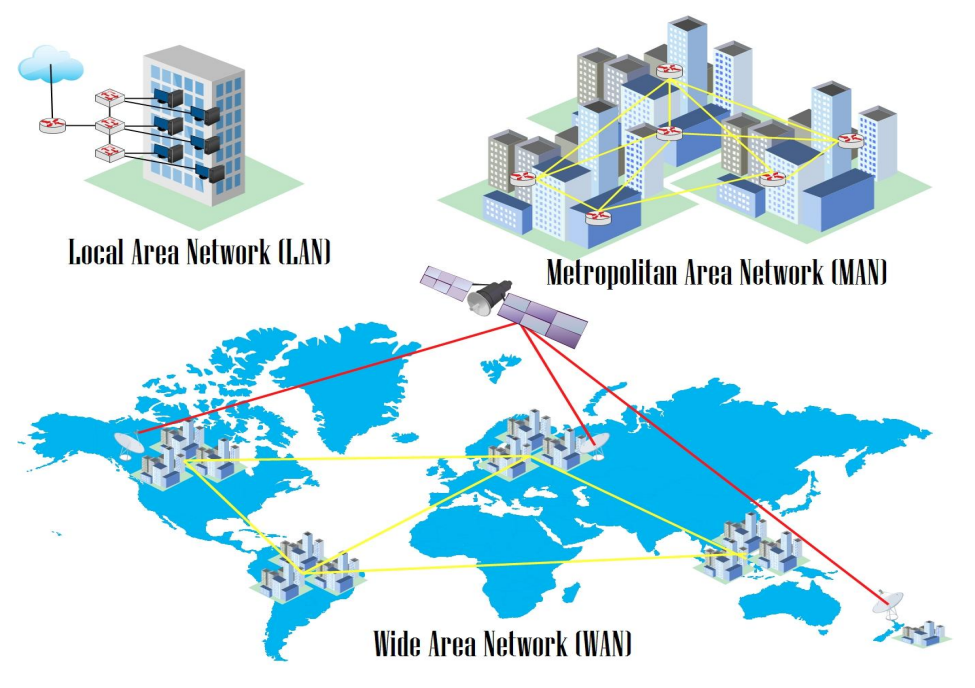

- Local Area Network (LAN) is a simple network within a building, office, home, or school. Usually uses UTP cables.
- Metropolitan Area Network (MAN) is a combination of many LANs in an area.
- Wide Area Network (WAN) is a network connecting many MANs across islands, countries, or continents. Media can be fiber optic and satellites.

## OSI Layer

It is a standard in networking devices that makes various devices compatible with each other. There are 7 layers in the OSI model, from the bottom layer 1 physical up to layer 7 application.


graph TD
A[Application] ~~~ B[Presentation]
B ~~~ C[Session]
C ~~~ D[Transport]
D ~~~ E[Network]
E ~~~ F[Data Link]
F ~~~ G[Physical]

    style A fill:#3b9cb8,stroke:#fff,stroke-width:2px,color:#fff
    style B fill:#3b9cb8,stroke:#fff,stroke-width:2px,color:#fff
    style C fill:#3b9cb8,stroke:#fff,stroke-width:2px,color:#fff
    style D fill:#3b9cb8,stroke:#fff,stroke-width:2px,color:#fff
    style E fill:#3b9cb8,stroke:#fff,stroke-width:2px,color:#fff
    style F fill:#3b9cb8,stroke:#fff,stroke-width:2px,color:#fff
    style G fill:#3b9cb8,stroke:#fff,stroke-width:2px,color:#fff



An engineer must understand layers 1 to 4 to understand the functions and workings of network devices.

| No  | Layer     | Device            | Data Unit | Addressing      |
| :-: | :-------- | :---------------- | :-------- | :-------------- |
|  1  | Physical  | Hub               | Bit       | Binary (1 or 0) |
|  2  | Data Link | Bridge and Switch | Frame     | MAC Address     |
|  3  | Network   | Router            | Packet    | IP Address      |

| No  | Layer     | Device            | Connectivity                    | Memory            |
| :-: | :-------- | :---------------- | :------------------------------ | :---------------- |
|  1  | Physical  | Hub               | Broadcast to all ports          | -                 |
|  2  | Data Link | Bridge and Switch | Broadcast based on MAC Address  | MAC Address Table |
|  3  | Network   | Router            | Based on destination IP Address | Routing Table     |

## Network Devices and Symbols

A network engineer must know the various types of network devices and their symbols to be able to read a network topology.

|                           |          |                                   |                  |
| :-----------------------: | :------: | :-------------------------------: | :--------------: |
|            |   Hub    |          |  Straight Cable  |
|      |  Switch  |            | Cross-Over Cable |
|      |  Router  |              |      Serial      |
|  | Internet |  |   EtherChannel   |

## IP Address

IP address is used for addressing within a network.

- Network IP as a network identity. If there is an IP 192.168.1.0/24, it means representing a group of IPs (network) from 192.168.1.1 – 192.168.1.254.
- Broadcast IP is the last IP in a network used to broadcast broadcast packets. For example, 192.168.1.255/24.
- Host is the IP provided for hosts. For example: 192.168.1.111/24.

There are several types of IP:

- Public IP is used to access the internet.
- Private IP is used for local networks.

## Ethernet Cable

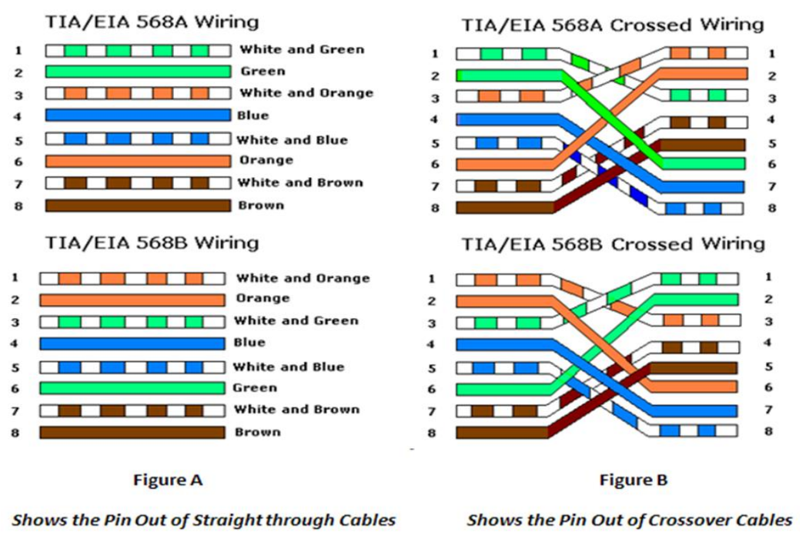

## Subnetting so Easy

Subnetting is dividing a network into smaller subnetworks. This is what's called a subnet. One aspect of a good network design is the optimization of IP addresses. Subnetting minimizes unused or wasted IP addresses.

Subnetting also makes network management and performance easier. If subnetting is analogized to real life, it would look like the picture below. With subnetting arrangements, it will be formed like small alleys to each complex, making it easier to distinguish networks and send data to the destination.

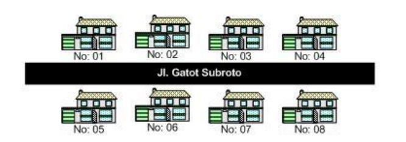

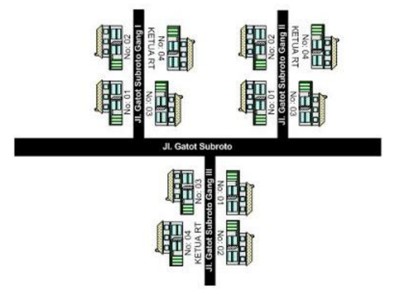

This subnetting is something that must be mastered by a network engineer. In the past, during subnet exams, we still playfully used online subnet calculators.

Hehehe... Now you must truly understand. To understand this subnetting, you first need to understand decimal and binary numbers (zero or one).

In subnetting, there are a few things that are most often sought after.

### Subnetting

For example, if there is an IP 192.168.2.172/26, the subnet mask or netmask is /26 = 11111111.11111111.11111111.11000000. The prefix /26 indicates the binary 1 (Net ID) amounts to 26 and the rest, which is Host ID, amounts to 6.

From this 11111111.11111111.11111111.11000000, when converted to decimal, the subnet mask obtained is 255.255.255.192.

### Total IPs

This Total IP is calculated from the Host ID. From the example question, we get the Host ID is 6 bits. Since IPv4 is 32 bits, so 32 - 26 leaves 6. Therefore, the maximum IP obtained is 2^6 = 64.

Formula to calculate the maximum IP: 2^Host ID

### Number of Subnets

The number of subnets is calculated from the Net ID. Because the Net ID of subnet /26 is 26, the Subnet ID is 2. How is that possible? Because Net ID 26 minus 24 because it is Class C becomes 2. The point is if it's Class C subtract 24, Class B subtract 16, Class A subtract 8. God willing, you will understand more in the discussion of the next questions, bro. It is obtained that the number of subnets is 2^2 = 4 subnets.

Formula to calculate the number of subnets: 2^Subnet ID

### Determining Network IP and Broadcast

Because the question is IP 192.168.2.172, it cannot possibly be included in the first subnet/network because 72 > 64. So which subnet does that IP go into? We just calculate the multiples of 64. The Network IP is definitely the very first and the broadcast is the very last. Simply put, the next network IP minus 1 is the broadcast.

| No  | Network IP        | Broadcast         |
| :-: | :---------------- | :---------------- |
|  1  | 192.168.2.**0**   | 192.168.2.**63**  |
|  2  | 192.168.2.**64**  | 192.168.2.**127** |
|  3  | 192.168.2.**128** | 192.168.2.**191** |
|  4  | 192.168.2.**192** | 192.168.2.**255** |

So IP 192.168.2.172 is in the 3rd subnet with network IP 192.168.2.128 and its broadcast is 192.168.2.191.

### Client IPs

And this is the easiest one, which is calculating the maximum IP that can be used by the host. The formula is total IP minus 2 because it is used for network ID and broadcast. So the Client IPs per subnet is 64 - 2 = 62.

To memorize subnets faster, we can utilize the subnet table below.

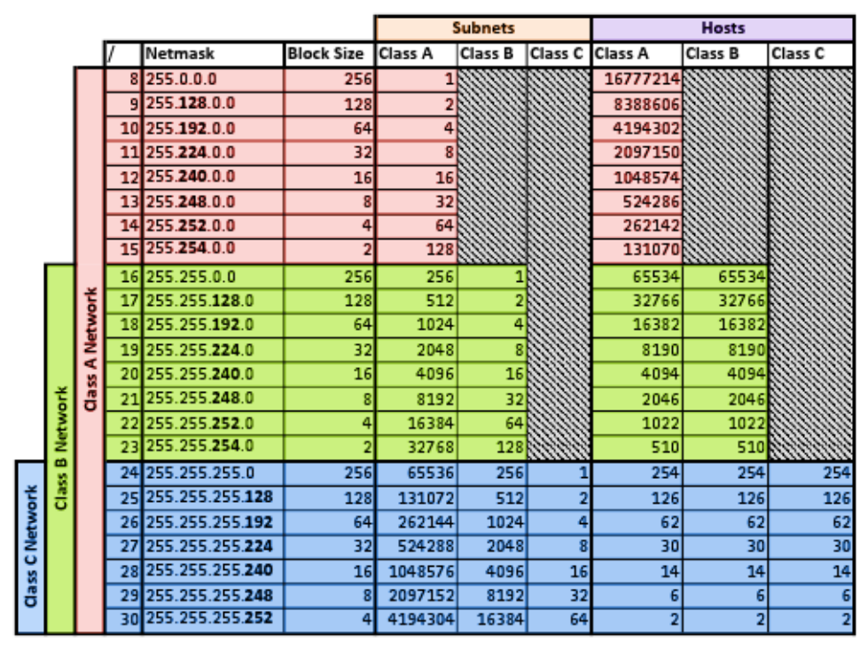

## Subnetting Example Questions

In this discussion, we will learn to work on various subnetting problem variations. The subnetting questions are as follows guys.

Find the total IPs, netmask, network IP, broadcast, and hosts for each of the IPs below:

- 192.168.10.10/25
- 10.10.10.10/13
- 20.20.20.20/23
- 11.12.13.14/20
- 50.50.50.50./15

Okay, let's discuss it together directly from the first question...

### IP 192.168.10.10/25 is a Class C

a. Total IPs : 128 
Derived from 2^7 = 128, 7 is the Host ID of subnet /25.

b. Netmask : 255.255.255.128 
Derived from 256 – Total IPs = 256 – 128 = 128 becoming 255.255.255.128.

c. Network IP : 192.168.10.0 
The number of subnets is 2^1, 1 is the Subnet ID. IP 192.168.10.10 goes into the 1st subnet because it is in the range 0-127 so the Network IP is 192.168.10.0.

d. Broadcast : 192.168.10.127 
The next Network IP minus 1 => 192.168.10.128 – 1 = 192.168.10.127.

e. Hosts : 192.168.10.1 – 192.168.10.126 
The number of IPs that can be used is 126 derived from 128 – 2 because it is used for Network IP and broadcast.

### IP 10.10.10.10/13 is a Class A

a. Total IPs : 524288 
Subnet 13 is a Class A subnet so to make it easier, change it first to a Class C subnet by adding 8 twice to become 29. The total hosts of subnet 29 is 8. Then 8 x 256 x 256 becomes 524288. Multiplied by 256 twice because previously it was added by 8 twice to become a Class C subnet.

b. Netmask : 255.248.0.0 
As usual, 248 is derived from 256 – total IPs. Because Class A is added by 8 twice to become Class C, then the subnet is advanced 2 times from 255.255.255.248 to 255.248.0.0.

c. Network IP : 10.8.0.0 
After being equated to Class C (13+8+8=29), then the number of subnets /29 is 2^5, 5 is the Subnet ID. Total IPs of subnet /29 is 8, so IP 10.10.10.10 enters its Network IP 10.8.0.0.

d. Broadcast : 10.15.255.255 
The next Network IP minus 1 => 10.16.0.0 – 1 = 10.15.255.255.

e. Hosts : 10.8.0.1 – 10.15.255.254 
The number of IPs that can be used is 524286 derived from 524288 – 2 because it is used for Network IP and broadcast.

### IP 11.12.13.14/20 is a Class B

a. Total IPs : 4096 
Subnet 20 is a Class B subnet so to make it easier, change it first to a Class C subnet by adding 8 to become 28. The total hosts of subnet 28 is 16. Then 16 x 256 = 4096. Multiplied by 256 because previously it was added by 8 once to become a Class C subnet.

b. Netmask : 255.255.252.0 
252 is derived from 256 – total IPs. Because Class B is added by 8 to become Class C, then the subnet is advanced 1 time from 255.255.255.252 to 255.255.252.0.

c. Network IP : 11.12.0.0 
After being equated to Class C (20+8=28), then the number of subnets /28 is 2^4, 4 is the Subnet ID. Total IPs of subnet /28 is 16, so IP 11.12.13.14 enters its Network IP 11.12.0.0 because it is still in the range 11.12.0.0 – 11.15.255.255.

d. Broadcast : 11.12.15.255 
The next Network IP minus 1 => 11.16.0.0 – 1 = 11.15.255.255.

e. Hosts : 11.12.0.1 – 11.12.255.254 
The number of IPs that can be used is 4096 derived from 4096 – 2 because it is used for Network IP and broadcast.

## Subnetting Challenge ^\_^

Find the total IPs, netmask, network IP, broadcast, and hosts for each of the IPs below:

- 172.16.10.111/27
- 99.99.99.99/28
- 100.100.100.100/20
- 111.222.33.44/14
- 8.8.8.8/32

## Broadcast Domain and Collision Domain

A collision domain is an area within a network where data packets can experience collisions because devices send them at the same time. On a Hub, its collision domain becomes 1 (large) and on Switches and Routers, collision domains only occur on each interface.

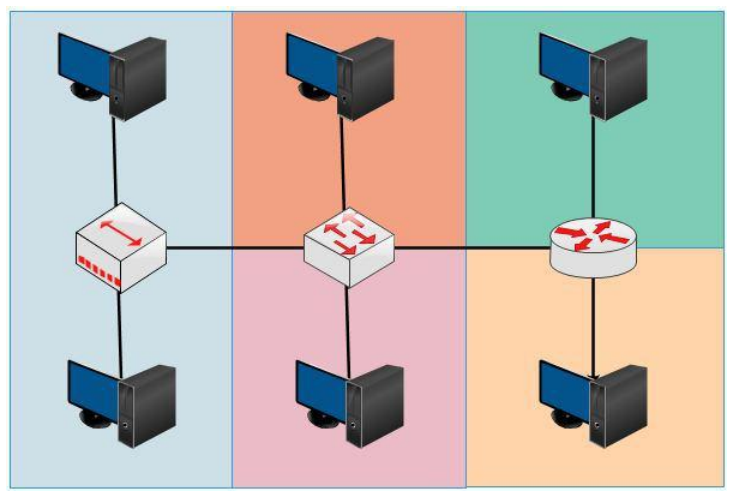

A broadcast domain is an area within a network where broadcasts are forwarded in the first place. Hubs and Switches have the same broadcast domains because both pass broadcasts, whereas Routers do not pass broadcasts.

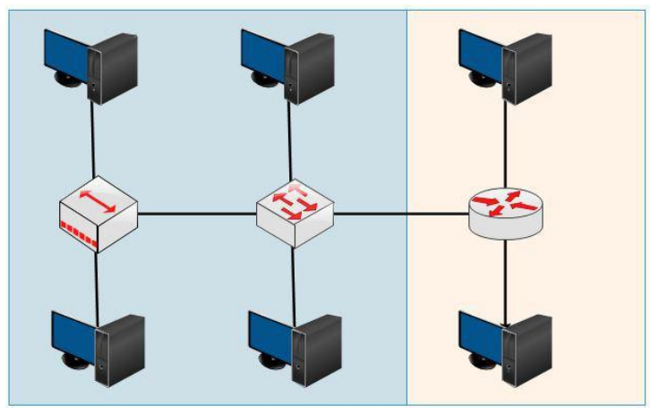

## Differences between Hub, Bridge, Switch, and Router

A Hub is no more than a physical repeater that works at layer 1 and has no intelligence. The way a hub works is by receiving an electrical signal from one interface and sending it to all interfaces except the source interface, whether needed or not.

Because it works at the physical layer with half-duplex (one sends, the others wait), collisions can occur when packets are sent at the same time. The area where collisions can occur is called a collision domain.

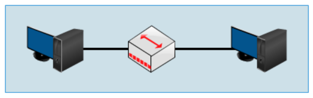

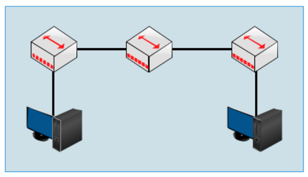

Both topologies above are single collision domains. The larger a network like the one above, the larger the collision as well, and it degrades network performance (down).

### Then what's the solution?

Replace it with a device that works at layer 2 (data link) and has intelligence, namely a bridge. Bridge characteristics:

- Decides where Ethernet frames are sent by looking at the MAC Address.
- Forwards Ethernet frames only to the ports that need them.
- Filters Ethernet frames (discard them).
- Floods Ethernet frames (send them everywhere).
- Only has a few ports.
- Slow.

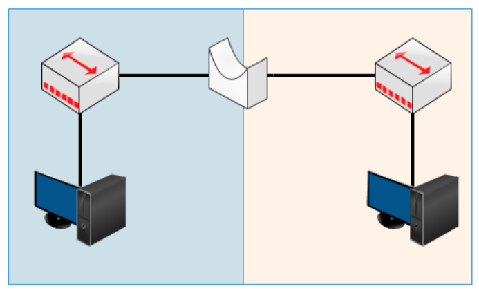

That way the collision domain is divided into 2 in the topology above. But now we don't use hubs or bridges because there are already switches.

Bridges are twins with switches... but not identical...

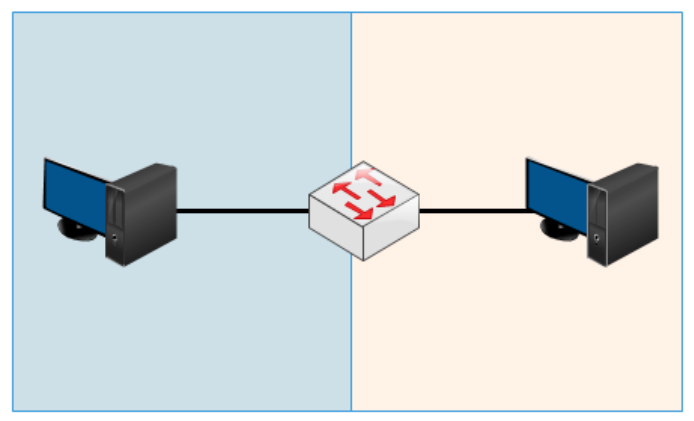

A switch is a bridge with several advantages.

- Has many ports.
- Has various ports like FastEthernet and Gigabit.
- Fast internet switching.
- Large buffers.

### How a Switch Works

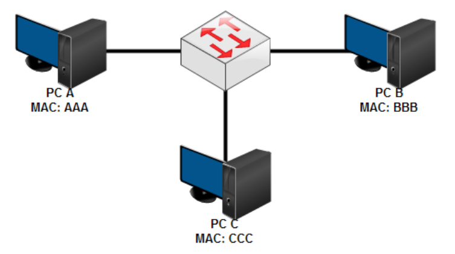

A switch has a MAC Address table that stores the MAC Addresses of PCs connected to the ports on the switch. For example, when a PC is first connected to a switch, PC A wants to send data to C.

- PC A then creates an Ethernet frame containing the IP address, MAC address, and destination, and sends it to the switch.
- The switch then broadcasts it to all ports except the source. Up to here, the switch has stored A's MAC address.
- After being broadcast, PC C will send a reply containing its MAC address and when it passes through the switch, the switch will store C's MAC address.

A broadcast is sent when there is a data packet whose destination MAC address does not exist in the switch's MAC address table.

Okay... to the point...

Hubs work at layer 1 – Physical 
Bridges and switches work at layer 2 – Data Link 
What about routers? It's different again,,, they work at layer 3 – Network 
Hubs, Bridges, and Switches pass broadcasts... Routers don't...
