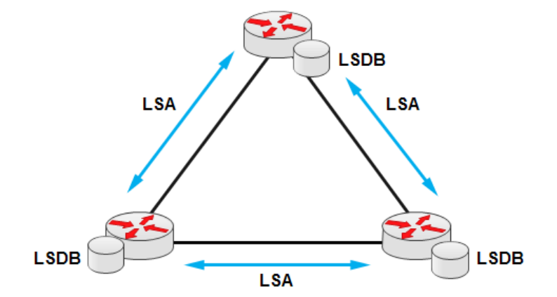
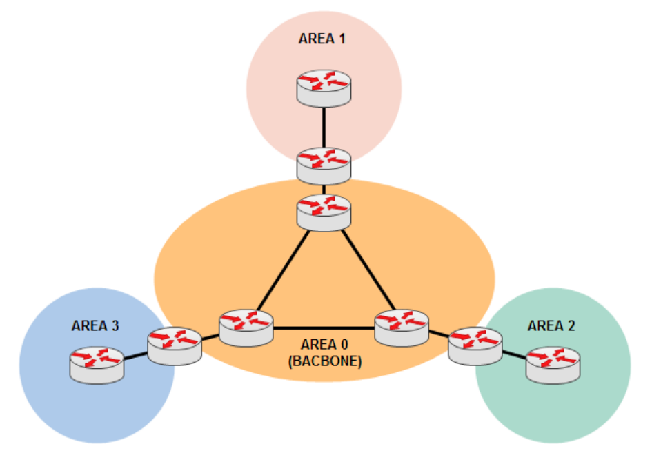
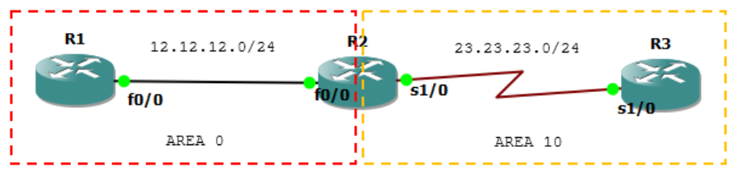
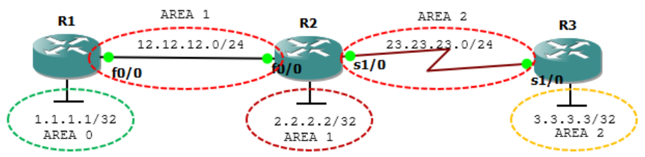
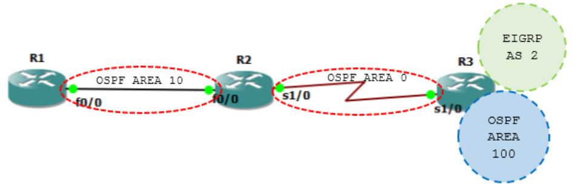
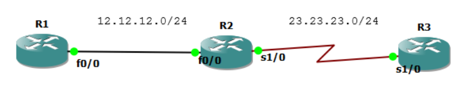
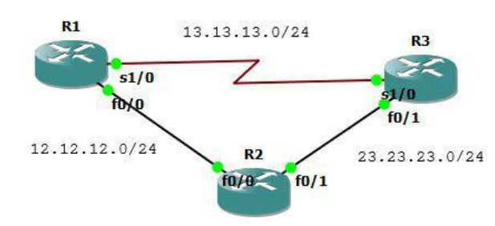

## OSPF

### (Open Shortest Path First)

- Open Standard.
- Link-State routing protocol.
- Using SPF/Dijkstra Algorithm.
- Multicast for exchange information use port 89.
- Administrative distance 110.
- Classless routing protocol support VLSM/CIDR.
- Support IPv6.
- Metric using cost.
- Fast convergence.
- Equal load balancing only.
- Using areas (backbone area and non-backbone areas).

Link-state knows the complete map (topology) of the network to determine the shortest path.



Link = router interface.

State = to which neighbor router the interface is connected.

Link-state routers work by sending link-state advertisements (LSA) to other link-state routers, which are stored in the link-state database (LSDB). LSAs are like puzzle pieces that make up the LSDB. LSDB is a comprehensive overview of the network that we call the topology. Once the LSDB is complete, OSPF calculates the shortest path.

OSPF works using the concept of areas. The area that must exist in OSPF is area 0 or the backbone area. Other areas (non-backbone areas) that want to connect must pass through the backbone area.



The purpose of dividing into areas is to manage traffic and reduce the resources used by the routers. There are several types of routers in OSPF:

Backbone router = a router within the backbone area.

Area Border Router (ABR) = a router located in 2 areas.

Autonomous System Border Router (ASBR) = a router connected to another network running a different routing protocol.

OSPF uses a metric called cost. Cost is calculated based on the bandwidth of an interface.

Cost = reference bandwidth / interface bandwidth

The default reference bandwidth is 100Mbit, but this can be changed because nowadays there are interfaces that reach gigabit speeds.

Each LSA has an aging timer, which is its validity period. By default, an LSA is valid for 30 minutes. After that, it will expire and a new LSA with a higher sequence number will be sent.

## OSPF Basic Configuration



Type the following interface configurations.

```
R1
interface Loopback0
 ip address 1.1.1.1 255.255.255.255
!
interface FastEthernet0/0
 ip address 12.12.12.1 255.255.255.0
!
router ospf 13
 router-id 1.1.1.1
 network 1.1.1.1 0.0.0.0 area 0
 network 12.12.12.0 0.0.0.255 area 0
!

R2
interface Loopback0
 ip address 2.2.2.2 255.255.255.255
!
interface FastEthernet0/0
 ip address 12.12.12.2 255.255.255.0
!
interface Serial1/0
 ip address 23.23.23.2 255.255.255.0
!
router ospf 13
 router-id 2.2.2.2
 network 2.2.2.2 0.0.0.0 area 10
 network 12.12.12.0 0.0.0.255 area 0
 network 23.23.23.0 0.0.0.255 area 10
!

R3
interface Loopback0
 ip address 3.3.3.3 255.255.255.255
!
interface Serial1/0
 ip address 23.23.23.3 255.255.255.0
!
router ospf 14
 router-id 3.3.3.3
 network 3.3.3.3 0.0.0.0 area 10
 network 23.23.23.0 0.0.0.255 area 10
!
```

Check the routing table.

```
R1#sh ip route

Gateway of last resort is not set

    1.0.0.0/32 is subnetted, 1 subnets
C       1.1.1.1 is directly connected, Loopback0
    2.0.0.0/32 is subnetted, 1 subnets
O IA    2.2.2.2 [110/11] via 12.12.12.2, 00:07:41, FastEthernet0/0
    3.0.0.0/32 is subnetted, 1 subnets
O IA    3.3.3.3 [110/75] via 12.12.12.2, 00:07:41, FastEthernet0/0
    23.0.0.0/24 is subnetted, 1 subnets
O IA    23.23.23.0 [110/74] via 12.12.12.2, 00:07:41, FastEthernet0/0
    12.0.0.0/24 is subnetted, 1 subnets
C       12.12.12.0 is directly connected, FastEthernet0/0
R1#

R2#sh ip route

Gateway of last resort is not set

    1.0.0.0/32 is subnetted, 1 subnets
O       1.1.1.1 [110/11] via 12.12.12.1, 00:08:04, FastEthernet0/0
    2.0.0.0/32 is subnetted, 1 subnets
C       2.2.2.2 is directly connected, Loopback0
    3.0.0.0/32 is subnetted, 1 subnets
O       3.3.3.3 [110/65] via 23.23.23.3, 00:08:39, Serial1/0
    23.0.0.0/24 is subnetted, 1 subnets
C       23.23.23.0 is directly connected, Serial1/0
    12.0.0.0/24 is subnetted, 1 subnets
C       12.12.12.0 is directly connected, FastEthernet0/0
R2#

R3#sh ip route

Gateway of last resort is not set

    1.0.0.0/32 is subnetted, 1 subnets
O IA    1.1.1.1 [110/75] via 23.23.23.2, 00:08:17, Serial1/0
    2.0.0.0/32 is subnetted, 1 subnets
O       2.2.2.2 [110/65] via 23.23.23.2, 00:08:52, Serial1/0
    3.0.0.0/32 is subnetted, 1 subnets
C       3.3.3.3 is directly connected, Loopback0
    23.0.0.0/24 is subnetted, 1 subnets
C       23.23.23.0 is directly connected, Serial1/0
    12.0.0.0/24 is subnetted, 1 subnets
O IA    12.12.12.0 [110/74] via 23.23.23.2, 00:08:52, Serial1/0
R3#
```

Test ping.

```
R1#ping 2.2.2.2

Type escape sequence to abort.
Sending 5, 100-byte ICMP Echos to 2.2.2.2, timeout is 2 seconds:
!!!!!
Success rate is 100 percent (5/5), round-trip min/avg/max = 8/75/144 ms

R1#ping 3.3.3.3

Type escape sequence to abort.
Sending 5, 100-byte ICMP Echos to 3.3.3.3, timeout is 2 seconds:
!!!!!
Success rate is 100 percent (5/5), round-trip min/avg/max = 12/128/288 ms
R1#
```

```
R2#sh ip ospf database
            OSPF Router with ID (2.2.2.2) (Process ID 13)

            Router Link States (Area 0)

Link ID         ADV Router      Age         Seq#        Checksum Link count
1.1.1.1         1.1.1.1         616         0x80000002  0x0015AB 2
2.2.2.2         2.2.2.2         615         0x80000002  0x00F9D1 1

            Net Link States (Area 0)

Link ID         ADV Router      Age         Seq#        Checksum
12.12.12.2      2.2.2.2         615         0x80000001  0x0014EB

            Summary Net Link States (Area 0)

Link ID         ADV Router      Age         Seq#        Checksum
2.2.2.2         2.2.2.2         656         0x80000001  0x00FA31
3.3.3.3         2.2.2.2         646         0x80000001  0x004F98
23.23.23.0      2.2.2.2         656         0x80000001  0x00901F

            Router Link States (Area 10)

Link ID         ADV Router      Age         Seq#        Checksum Link count
2.2.2.2         2.2.2.2         655         0x80000002  0x009C44 3
3.3.3.3         3.3.3.3         658         0x80000002  0x00BB1D 3

            Summary Net Link States (Area 10)

Link ID         ADV Router      Age         Seq#        Checksum
1.1.1.1         2.2.2.2         613         0x80000001  0x008D98
12.12.12.0      2.2.2.2         658         0x80000001  0x00FF07
R2#
```

## OSPF Virtual Link



```
R1
interface Loopback0
 ip address 1.1.1.1 255.255.255.255
!
interface FastEthernet0/0
 ip address 12.12.12.1 255.255.255.0
!
router ospf 13
 router-id 1.1.1.1
 network 1.1.1.1 0.0.0.0 area 0
 network 12.12.12.0 0.0.0.255 area 1
!

R2
interface Loopback0
 ip address 2.2.2.2 255.255.255.255
!
interface FastEthernet0/0
 ip address 12.12.12.2 255.255.255.0
!
interface Serial1/0
 ip address 23.23.23.2 255.255.255.0
!
router ospf 13
 router-id 2.2.2.2
 network 2.2.2.2 0.0.0.0 area 1
 network 12.12.12.0 0.0.0.255 area 1
 network 23.23.23.0 0.0.0.255 area 2
!

R3
interface Loopback0
 ip address 3.3.3.3 255.255.255.255
!
interface Serial1/0
 ip address 23.23.23.3 255.255.255.0
!
router ospf 14
 router-id 3.3.3.3
 network 3.3.3.3 0.0.0.0 area 2
 network 23.23.23.0 0.0.0.255 area 2
!
```

Check the routing table.

```
R1(config-router)#do sh ip route
Gateway of last resort is not set

    1.0.0.0/32 is subnetted, 1 subnets
C       1.1.1.1 is directly connected, Loopback0
    2.0.0.0/32 is subnetted, 1 subnets
O       2.2.2.2 [110/11] via 12.12.12.2, 00:00:21, FastEthernet0/0
    12.0.0.0/24 is subnetted, 1 subnets
C       12.12.12.0 is directly connected, FastEthernet0/0
R1(config-router)#

R2(config-router)#do sh ip route
Gateway of last resort is not set

    1.0.0.0/32 is subnetted, 1 subnets
O IA    1.1.1.1 [110/11] via 12.12.12.1, 00:01:33, FastEthernet0/0
    2.0.0.0/32 is subnetted, 1 subnets
C       2.2.2.2 is directly connected, Loopback0
    3.0.0.0/32 is subnetted, 1 subnets
O       3.3.3.3 [110/65] via 23.23.23.3, 00:01:43, Serial1/0
    23.0.0.0/24 is subnetted, 1 subnets
C       23.23.23.0 is directly connected, Serial1/0
    12.0.0.0/24 is subnetted, 1 subnets
C       12.12.12.0 is directly connected, FastEthernet0/0
R2(config-router)#

R3(config-router)#do sh ip route
Gateway of last resort is not set

    3.0.0.0/32 is subnetted, 1 subnets
C       3.3.3.3 is directly connected, Loopback0
    23.0.0.0/24 is subnetted, 1 subnets
C       23.23.23.0 is directly connected, Serial1/0
R3(config-router)#
```

Check the OSPF database.

```
R1#sh ip ospf database

            OSPF Router with ID (1.1.1.1) (Process ID 13)

            Router Link States (Area 0)
Link ID         ADV Router      Age         Seq#        Checksum Link count
1.1.1.1         1.1.1.1         261         0x80000001  0x00D351 1

            Summary Net Link States (Area 0)

Link ID         ADV Router      Age         Seq#        Checksum
2.2.2.2         1.1.1.1         189         0x80000001  0x007DA8
12.12.12.0      1.1.1.1         257         0x80000001  0x001EEC

            Router Link States (Area 1)

Link ID         ADV Router      Age         Seq#        Checksum Link count
1.1.1.1         1.1.1.1         193         0x80000002  0x00389C 1
2.2.2.2         2.2.2.2         195         0x80000002  0x00298A 2

            Net Link States (Area 1)

Link ID         ADV Router      Age         Seq#        Checksum
12.12.12.2      2.2.2.2         195         0x80000001  0x0014EB

            Summary Net Link States (Area 1)

Link ID         ADV Router      Age         Seq#        Checksum
1.1.1.1         1.1.1.1         297         0x80000001  0x0047EC
R1#

R3#sh ip ospf database

            OSPF Router with ID (3.3.3.3) (Process ID 14)

            Router Link States (Area 2)

Link ID         ADV Router      Age         Seq#                Checksum Link count
2.2.2.2         2.2.2.2         293         0x80000002          0x00D624 2
3.3.3.3         3.3.3.3         287         0x80000002          0x00BB1D 3
R3#
```

Virtual link configuration: area area-id virtual-link router-id

```
R1(config)#router ospf 13
R1(config-router)#area 1 virtual-link ?
    A.B.C.D ID (IP addr) associated with virtual link neighbor

R1(config-router)#area 1 virtual-link 2.2.2.2

R2(config-router)#area 1 virtual-link 1.1.1.1
*Mar 1 00:09:45.563: %OSPF-5-ADJCHG: Process 13, Nbr 1.1.1.1 on OSPF_VL0
from LOADING to FULL, Loading Done

R1#sh ip route
Gateway of last resort is not set

    1.0.0.0/32 is subnetted, 1 subnets
C       1.1.1.1 is directly connected, Loopback0
    2.0.0.0/32 is subnetted, 1 subnets
O       2.2.2.2 [110/11] via 12.12.12.2, 00:08:38, FastEthernet0/0
    3.0.0.0/32 is subnetted, 1 subnets
O IA    3.3.3.3 [110/75] via 12.12.12.2, 00:00:48, FastEthernet0/0
    23.0.0.0/24 is subnetted, 1 subnets
O IA    23.23.23.0 [110/74] via 12.12.12.2, 00:00:48, FastEthernet0/0
    12.0.0.0/24 is subnetted, 1 subnets
C       12.12.12.0 is directly connected, FastEthernet0/0
R1#
```

Network 3.3.3.3 is not yet in the routing table.

```
R2(config-router)#area 2 virtual-link 3.3.3.3

R3(config-router)#area 2 virtual-link 2.2.2.2
*Mar 1 00:12:26.355: %OSPF-5-ADJCHG: Process 14, Nbr 2.2.2.2 on OSPF_VL0
from LOADING to FULL, Loading Done
```

Check again.

```
R1#sh ip route
Gateway of last resort is not set

    1.0.0.0/32 is subnetted, 1 subnets
C       1.1.1.1 is directly connected, Loopback0
    2.0.0.0/32 is subnetted, 1 subnets
O       2.2.2.2 [110/11] via 12.12.12.2, 00:12:02, FastEthernet0/0
    3.0.0.0/32 is subnetted, 1 subnets
O IA    3.3.3.3 [110/75] via 12.12.12.2, 00:01:34, FastEthernet0/0
    23.0.0.0/24 is subnetted, 1 subnets
O IA    23.23.23.0 [110/74] via 12.12.12.2, 00:04:11, FastEthernet0/0
    12.0.0.0/24 is subnetted, 1 subnets
C       12.12.12.0 is directly connected, FastEthernet0/0
R1#ping 2.2.2.2

Type escape sequence to abort.
Sending 5, 100-byte ICMP Echos to 2.2.2.2, timeout is 2 seconds:
!!!!!
Success rate is 100 percent (5/5), round-trip min/avg/max = 56/100/204 ms
R1#ping 3.3.3.3

Type escape sequence to abort.
Sending 5, 100-byte ICMP Echos to 3.3.3.3, timeout is 2 seconds:
!!!!!
Success rate is 100 percent (5/5), round-trip min/avg/max = 24/148/204 ms
R1#
```

Check the virtual link.

```
R1#sh ip ospf virtual-links
Virtual Link OSPF_VL0 to router 2.2.2.2 is up
    Run as demand circuit
    DoNotAge LSA allowed.
    Transit area 1, via interface FastEthernet0/0, Cost of using 10
    Transmit Delay is 1 sec, State POINT_TO_POINT,
    Timer intervals configured, Hello 10, Dead 40, Wait 40, Retransmit 5
        Hello due in 00:00:09
        Adjacency State FULL (Hello suppressed)
        Index 1/2, retransmission queue length 0, number of retransmission 0
        First 0x0(0)/0x0(0) Next 0x0(0)/0x0(0)
        Last retransmission scan length is 0, maximum is 0
        Last retransmission scan time is 0 msec, maximum is 0 msec
R1#

2#sh ip ospf virtual-links
Virtual Link OSPF_VL1 to router 3.3.3.3 is up
    Run as demand circuit
    DoNotAge LSA allowed.
    Transit area 2, via interface Serial1/0, Cost of using 64
    Transmit Delay is 1 sec, State POINT_TO_POINT,
    Timer intervals configured, Hello 10, Dead 40, Wait 40, Retransmit 5
        Hello due in 00:00:07
        Adjacency State FULL (Hello suppressed)
        Index 2/4, retransmission queue length 0, number of retransmission 0
        First 0x0(0)/0x0(0) Next 0x0(0)/0x0(0)
        Last retransmission scan length is 0, maximum is 0
        Last retransmission scan time is 0 msec, maximum is 0 msec
Virtual Link OSPF_VL0 to router 1.1.1.1 is up
    Run as demand circuit
    DoNotAge LSA allowed.
    Transit area 1, via interface FastEthernet0/0, Cost of using 10
    Transmit Delay is 1 sec, State POINT_TO_POINT,
    Timer intervals configured, Hello 10, Dead 40, Wait 40, Retransmit 5
        Hello due in 00:00:02
        Adjacency State FULL (Hello suppressed)
        Index 1/3, retransmission queue length 0, number of retransmission 1
        First 0x0(0)/0x0(0) Next 0x0(0)/0x0(0)
        Last retransmission scan length is 1, maximum is 1
        Last retransmission scan time is 0 msec, maximum is 0 msec
R2#

R3#sh ip ospf virtual-links
Virtual Link OSPF_VL0 to router 2.2.2.2 is up
    Run as demand circuit
    DoNotAge LSA allowed.
    Transit area 2, via interface Serial1/0, Cost of using 64
    Transmit Delay is 1 sec, State POINT_TO_POINT,
    Timer intervals configured, Hello 10, Dead 40, Wait 40, Retransmit 5
        Hello due in 00:00:01
        Adjacency State FULL (Hello suppressed)
        Index 1/2, retransmission queue length 0, number of retransmission 0
        First 0x0(0)/0x0(0) Next 0x0(0)/0x0(0)
        Last retransmission scan length is 0, maximum is 0
        Last retransmission scan time is 0 msec, maximum is 0 msec
R3#
```

## OSPF GRE Tunnel


Delete the virtual link first.

```
R1(config)#router ospf 13
R1(config-router)#no area 1 virtual-link 2.2.2.2

R2(config)#router ospf 13
R2(config-router)#no area 1 virtual-link 1.1.1.1
R2(config-router)#no area 2 virtual-link 3.3.3.3

R3(config)#router ospf 14
R3(config-router)#no area 2 virtual-link 2.2.2.2
```

GRE tunnel configuration.

```
R1(config)#int tun1
R1(config-if)#ip add 102.102.102.1 255.255.255.0
R1(config-if)#tunnel source 12.12.12.1
R1(config-if)#tunnel destination 12.12.12.2
R1(config-if)#router ospf 13
R1(config-router)#net 102.102.102.1 0.0.0.0 area 0

R2(config)#int tun1
R2(config-if)#ip add 102.102.102.2 255.255.255.0
R2(config-if)#tunnel destination 12.12.12.1
R2(config-if)#tunnel source 12.12.12.2
R2(config-if)#router ospf 13
R2(config-router)#net 102.102.102.2 0.0.0.0 area 0

R1#sh ip route
Gateway of last resort is not set

    102.0.0.0/24 is subnetted, 1 subnets
C       102.102.102.0 is directly connected, Tunnel1
    1.0.0.0/32 is subnetted, 1 subnets
C       1.1.1.1 is directly connected, Loopback0
    2.0.0.0/32 is subnetted, 1 subnets
O       2.2.2.2 [110/11] via 12.12.12.2, 00:11:26, FastEthernet0/0
    3.0.0.0/32 is subnetted, 1 subnets
O IA    3.3.3.3 [110/11176] via 102.102.102.2, 00:03:52, Tunnel1
    23.0.0.0/24 is subnetted, 1 subnets
O IA    23.23.23.0 [110/11175] via 102.102.102.2, 00:03:52, Tunnel1
    12.0.0.0/24 is subnetted, 1 subnets
C       12.12.12.0 is directly connected, FastEthernet0/0
R1#ping 2.2.2.2

Type escape sequence to abort.
Sending 5, 100-byte ICMP Echos to 2.2.2.2, timeout is 2 seconds:
!!!!!
Success rate is 100 percent (5/5), round-trip min/avg/max = 32/96/284 ms
R1#ping 3.3.3.3

Type escape sequence to abort.
Sending 5, 100-byte ICMP Echos to 3.3.3.3, timeout is 2 seconds:
!!!!!
Success rate is 100 percent (5/5), round-trip min/avg/max = 92/200/312 ms
R1#

R1#sh ip int br
Interface               IP-Address      OK? Method  Status
Protocol
FastEthernet0/0         12.12.12.1      YES NVRAM   up
up
FastEthernet0/1         unassigned      YES NVRAM   administratively down
down
Serial1/0               unassigned      YES NVRAM   administratively down
down
Serial1/1               unassigned      YES NVRAM   administratively down
down
Serial1/2               unassigned      YES NVRAM   administratively down
down
Serial1/3               unassigned      YES NVRAM   administratively down
down
Loopback0               1.1.1.1         YES NVRAM   up
up
Tunnel1                 102.102.102.1   YES manual  up
up
R1#
```

## OSPF Standard Area



```
R1
interface Loopback0
 ip address 1.1.1.1 255.255.255.255
!
interface FastEthernet0/0
 ip address 12.12.12.1 255.255.255.0
!
router ospf 13
 router-id 1.1.1.1
 network 1.1.1.1 0.0.0.0 area 10
 network 12.12.12.0 0.0.0.255 area 10
!

R2
interface Loopback0
 ip address 2.2.2.2 255.255.255.255
!
interface FastEthernet0/0
 ip address 12.12.12.2 255.255.255.0
!
interface Serial1/0
 ip address 23.23.23.2 255.255.255.0
!
router ospf 13
 router-id 2.2.2.2
 network 2.2.2.2 0.0.0.0 area 0
 network 12.12.12.0 0.0.0.255 area 10
 network 23.23.23.0 0.0.0.255 area 0
!

R3
interface Loopback0
 ip address 3.3.3.3 255.255.255.255
!
interface Serial1/0
 ip address 23.23.23.3 255.255.255.0
!
router ospf 14
 router-id 3.3.3.3
 network 3.3.3.3 0.0.0.0 area 0
 network 23.23.23.0 0.0.0.255 area 0
!
```

Create loopback interfaces on R3 and add some of its interfaces to EIGRP.

```
interface Loopback1
 ip address 33.33.33.1 255.255.255.255
!
interface Loopback2
 ip address 33.33.33.2 255.255.255.255
!
interface Loopback3
 ip address 33.33.33.3 255.255.255.255
!
interface Loopback4
 ip address 33.33.33.4 255.255.255.255
!
interface Loopback5
 ip address 33.33.33.5 255.255.255.255
!
interface Loopback6
 ip address 33.33.33.6 255.255.255.255
!
interface Loopback7
 ip address 33.33.33.7 255.255.255.255
!
interface Loopback8
 ip address 33.33.33.8 255.255.255.255
!

router eigrp 2
net 33.33.33.1 0.0.0.0
net 33.33.33.2 0.0.0.0
net 33.33.33.3 0.0.0.0
net 33.33.33.4 0.0.0.0
no auto-summary
```

Add other interfaces to OSPF with area 100 and redistribute EIGRP into OSPF, then check the R1 routing table.

```
router ospf 14
net 33.33.33.5 0.0.0.0 area 100
net 33.33.33.6 0.0.0.0 area 100
net 33.33.33.7 0.0.0.0 area 100
net 33.33.33.8 0.0.0.0 area 100
redistribute eigrp 2 subnets

Cek R1.
R1(config-router)#do sh ip route
Gateway of last resort is not set

    1.0.0.0/32 is subnetted, 1 subnets
C       1.1.1.1 is directly connected, Loopback0
    2.0.0.0/32 is subnetted, 1 subnets
O IA    2.2.2.2 [110/11] via 12.12.12.2, 00:00:28, FastEthernet0/0
    33.0.0.0/32 is subnetted, 8 subnets
O E2    33.33.33.1 [110/20] via 12.12.12.2, 00:00:03, FastEthernet0/0
O E2    33.33.33.3 [110/20] via 12.12.12.2, 00:00:03, FastEthernet0/0
O E2    33.33.33.2 [110/20] via 12.12.12.2, 00:00:03, FastEthernet0/0
O IA    33.33.33.5 [110/75] via 12.12.12.2, 00:00:08, FastEthernet0/0
O E2    33.33.33.4 [110/20] via 12.12.12.2, 00:00:04, FastEthernet0/0
O IA    33.33.33.7 [110/75] via 12.12.12.2, 00:00:09, FastEthernet0/0
O IA    33.33.33.6 [110/75] via 12.12.12.2, 00:00:09, FastEthernet0/0
O IA    33.33.33.8 [110/75] via 12.12.12.2, 00:00:09, FastEthernet0/0
        3.0.0.0/32 is subnetted, 1 subnets
O IA    3.3.3.3 [110/75] via 12.12.12.2, 00:00:11, FastEthernet0/0
        23.0.0.0/24 is subnetted, 1 subnets
O IA    23.23.23.0 [110/74] via 12.12.12.2, 00:00:31, FastEthernet0/0
        12.0.0.0/24 is subnetted, 1 subnets
C       12.12.12.0 is directly connected, FastEthernet0/0
R1(config-router)#
```

```
R1(config-router)#do sh ip ospf database

            OSPF Router with ID (1.1.1.1) (Process ID 13)

            Router Link States (Area 10)
Link ID         ADV Router      Age         Seq#        Checksum Link count
1.1.1.1         1.1.1.1         127         0x80000002  0x0015AB 2
2.2.2.2         2.2.2.2         127         0x80000002  0x00F9D1 1

            Net Link States (Area 10)

Link ID         ADV Router      Age         Seq#        Checksum
12.12.12.2      2.2.2.2         127         0x80000001  0x0014EB

            Summary Net Link States (Area 10)

Link ID         ADV Router      Age         Seq#        Checksum
2.2.2.2         2.2.2.2         193         0x80000001  0x00FA31
3.3.3.3         2.2.2.2         103         0x80000001  0x004F98
23.23.23.0      2.2.2.2         193         0x80000001  0x00901F
33.33.33.5      2.2.2.2         103         0x80000001  0x00FE8C
33.33.33.6      2.2.2.2         103         0x80000001  0x00F495
33.33.33.7      2.2.2.2         103         0x80000001  0x00EA9E
33.33.33.8      2.2.2.2         103         0x80000001  0x00E0A7

            Summary ASB Link States (Area 10)

Link ID         ADV Router      Age         Seq#        Checksum
3.3.3.3         2.2.2.2         105         0x80000001  0x0037B0

            Type-5 AS External Link States

Link ID         ADV Router      Age         Seq#        Checksum Tag
33.33.33.1      3.3.3.3         433         0x80000001  0x00DA55 0
33.33.33.2      3.3.3.3         433         0x80000001  0x00D05E 0
33.33.33.3      3.3.3.3         433         0x80000001  0x00C667 0
33.33.33.4      3.3.3.3         433         0x80000001  0x00BC70 0
R1(config-router)#
```

## OSPF Stub Area


Check the R1 routing table.

```
R1#sh ip route
Gateway of last resort is not set

    1.0.0.0/32 is subnetted, 1 subnets
C       1.1.1.1 is directly connected, Loopback0
    2.0.0.0/32 is subnetted, 1 subnets
O IA    2.2.2.2 [110/11] via 12.12.12.2, 00:00:04, FastEthernet0/0
    33.0.0.0/32 is subnetted, 8 subnets
O E2    33.33.33.1 [110/20] via 12.12.12.2, 00:00:04, FastEthernet0/0
O E2    33.33.33.3 [110/20] via 12.12.12.2, 00:00:04, FastEthernet0/0
O E2    33.33.33.2 [110/20] via 12.12.12.2, 00:00:04, FastEthernet0/0
O IA    33.33.33.5 [110/75] via 12.12.12.2, 00:00:04, FastEthernet0/0
O E2    33.33.33.4 [110/20] via 12.12.12.2, 00:00:05, FastEthernet0/0
O IA    33.33.33.7 [110/75] via 12.12.12.2, 00:00:05, FastEthernet0/0
O IA    33.33.33.6 [110/75] via 12.12.12.2, 00:00:05, FastEthernet0/0
O IA    33.33.33.8 [110/75] via 12.12.12.2, 00:00:05, FastEthernet0/0
    3.0.0.0/32 is subnetted, 1 subnets
O IA    3.3.3.3 [110/75] via 12.12.12.2, 00:00:07, FastEthernet0/0
    23.0.0.0/24 is subnetted, 1 subnets
O IA    23.23.23.0 [110/74] via 12.12.12.2, 00:00:07, FastEthernet0/0
    12.0.0.0/24 is subnetted, 1 subnets
C       12.12.12.0 is directly connected, FastEthernet0/0
```

Stub configuration.

```
R1(config-router)#area 10 stub
R2(config-router)#area 10 stub
```

Now check the routing table again.

```
R1(config-router)#do sh ip route
Gateway of last resort is 12.12.12.2 to network 0.0.0.0

     1.0.0.0/32 is subnetted, 1 subnets
C       1.1.1.1 is directly connected, Loopback0
     2.0.0.0/32 is subnetted, 1 subnets
O IA    2.2.2.2 [110/11] via 12.12.12.2, 00:02:06, FastEthernet0/0
     33.0.0.0/32 is subnetted, 4 subnets
O IA    33.33.33.5 [110/75] via 12.12.12.2, 00:02:06, FastEthernet0/0
O IA    33.33.33.7 [110/75] via 12.12.12.2, 00:02:06, FastEthernet0/0
O IA    33.33.33.6 [110/75] via 12.12.12.2, 00:02:06, FastEthernet0/0
O IA    33.33.33.8 [110/75] via 12.12.12.2, 00:02:07, FastEthernet0/0
        3.0.0.0/32 is subnetted, 1 subnets
O IA    3.3.3.3 [110/75] via 12.12.12.2, 00:02:07, FastEthernet0/0
     23.0.0.0/24 is subnetted, 1 subnets
O IA    23.23.23.0 [110/74] via 12.12.12.2, 00:02:08, FastEthernet0/0
     12.0.0.0/24 is subnetted, 1 subnets
C       12.12.12.0 is directly connected, FastEthernet0/0
O*IA 0.0.0.0/0 [110/11] via 12.12.12.2, 00:02:09, FastEthernet0/0
```

E2 is removed and replaced by 0\*. Check the OSPF database.

```
R1#sh ip ospf database

            OSPF Router with ID (1.1.1.1) (Process ID 13)

            Router Link States (Area 10)

Link ID         ADV Router      Age         Seq#        Checksum Link count
1.1.1.1         1.1.1.1         339         0x80000005  0x00687D 2
2.2.2.2         2.2.2.2         499         0x80000005  0x0012B8 1

            Net Link States (Area 10)

Link ID         ADV Router      Age         Seq#        Checksum
12.12.12.2      2.2.2.2         495         0x80000003  0x002ED1

            Summary Net Link States (Area 10)

Link ID         ADV Router      Age         Seq#        Checksum
0.0.0.0         2.2.2.2         501         0x80000001  0x0075C0
2.2.2.2         2.2.2.2         501         0x80000002  0x001716
3.3.3.3         2.2.2.2         501         0x80000002  0x006B7D
23.23.23.0      2.2.2.2         501         0x80000002  0x00AC04
33.33.33.5      2.2.2.2         501         0x80000002  0x001B71
33.33.33.6      2.2.2.2         501         0x80000002  0x00117A
33.33.33.7      2.2.2.2         501         0x80000002  0x000783
33.33.33.8      2.2.2.2         503         0x80000002  0x00FC8C
```

## OSPF Totally Stub Area


Totally stub configuration.

```
R2(config-router)#no area 10 stub
R2(config-router)#area 10 stub no-summary
```

Check the routing table and OSPF database.

```
R1#sh ip route
Gateway of last resort is 12.12.12.2 to network 0.0.0.0

     1.0.0.0/32 is subnetted, 1 subnets
C       1.1.1.1 is directly connected, Loopback0
     12.0.0.0/24 is subnetted, 1 subnets
C       12.12.12.0 is directly connected, FastEthernet0/0
O*IA 0.0.0.0/0 [110/11] via 12.12.12.2, 00:00:47, FastEthernet0/0

R1#sh ip ospf database

            OSPF Router with ID (1.1.1.1) (Process ID 13)

            Router Link States (Area 10)

Link ID         ADV Router      Age         Seq#        Checksum Link count
1.1.1.1         1.1.1.1         251         0x80000004  0x002F91 2
2.2.2.2         2.2.2.2         257         0x80000004  0x0014B7 1

            Net Link States (Area 10)

Link ID         ADV Router      Age         Seq#        Checksum
12.12.12.2      2.2.2.2         252         0x80000003  0x002ED1

            Summary Net Link States (Area 10)

Link ID         ADV Router      Age         Seq#        Checksum
0.0.0.0         2.2.2.2         625         0x80000001  0x0075C0
R1#
```

## OSPF Not So Stubby Area (NSSA)


Add loopback interfaces to R1 with RIP configuration.

```
R1(config-if)#interface Loopback1
R1(config-if)# ip address 11.11.11.1 255.255.255.255
R1(config-if)#interface Loopback2
R1(config-if)# ip address 11.11.11.2 255.255.255.255
R1(config-if)#interface Loopback3
R1(config-if)# ip address 11.11.11.3 255.255.255.255

R1(config-if)#router rip
R1(config-router)#ver 2
R1(config-router)#no auto-summary
R1(config-router)#net 11.0.0.0
R1(config)#router ospf 13
R1(config-router)#redistribute rip subnets
```

Remove the previous OSPF stub and replace it with nssa.

```
R2(config-router)#no area 10 stub
R2(config-router)#area 10 nssa
*Mar 1 00:10:39.295: %OSPF-5-ADJCHG: Process 13, Nbr 2.2.2.2 on
FastEthernet0/0 from DOWN to DOWN, Neighbor Down: Adjacency forced to reset
```

Check the R1 routing table. Internal routes from ospf area 100 appear on the stub router R1.

```
R1(config-router)#do sh ip route
Gateway of last resort is not set

    1.0.0.0/32 is subnetted, 1 subnets
C    1.1.1.1 is directly connected, Loopback0
    2.0.0.0/32 is subnetted, 1 subnets
O IA    2.2.2.2 [110/11] via 12.12.12.2, 00:01:48, FastEthernet0/0
    33.0.0.0/32 is subnetted, 4 subnets
O IA    33.33.33.5 [110/75] via 12.12.12.2, 00:01:48, FastEthernet0/0
O IA    33.33.33.7 [110/75] via 12.12.12.2, 00:01:48, FastEthernet0/0
O IA    33.33.33.6 [110/75] via 12.12.12.2, 00:01:48, FastEthernet0/0
O IA    33.33.33.8 [110/75] via 12.12.12.2, 00:01:48, FastEthernet0/0
    3.0.0.0/32 is subnetted, 1 subnets
O IA    3.3.3.3 [110/75] via 12.12.12.2, 00:01:49, FastEthernet0/0
    23.0.0.0/24 is subnetted, 1 subnets
O IA    23.23.23.0 [110/74] via 12.12.12.2, 00:01:49, FastEthernet0/0
    11.0.0.0/32 is subnetted, 3 subnets
C       11.11.11.3 is directly connected, Loopback3
C       11.11.11.2 is directly connected, Loopback2
C       11.11.11.1 is directly connected, Loopback1
    12.0.0.0/24 is subnetted, 1 subnets
C       12.12.12.0 is directly connected, FastEthernet0/0
R1(config-router)#
```

Check the R3 routing table. External routes from RIP and EIGRP have appeared on R1.

```
R3#sh ip route
Gateway of last resort is not set

    1.0.0.0/32 is subnetted, 1 subnets
O IA    1.1.1.1 [110/75] via 23.23.23.2, 00:19:55, Serial1/0
    2.0.0.0/32 is subnetted, 1 subnets
O       2.2.2.2 [110/65] via 23.23.23.2, 00:27:47, Serial1/0
    33.0.0.0/32 is subnetted, 8 subnets
C       33.33.33.1 is directly connected, Loopback1
C       33.33.33.3 is directly connected, Loopback3
C       33.33.33.2 is directly connected, Loopback2
C       33.33.33.5 is directly connected, Loopback5
C       33.33.33.4 is directly connected, Loopback4
C       33.33.33.7 is directly connected, Loopback7
C       33.33.33.6 is directly connected, Loopback6
C       33.33.33.8 is directly connected, Loopback8
    3.0.0.0/32 is subnetted, 1 subnets
C       3.3.3.3 is directly connected, Loopback0
    23.0.0.0/24 is subnetted, 1 subnets
C       23.23.23.0 is directly connected, Serial1/0
    11.0.0.0/32 is subnetted, 3 subnets
O E2    11.11.11.3 [110/20] via 23.23.23.2, 00:19:11, Serial1/0
O E2    11.11.11.2 [110/20] via 23.23.23.2, 00:19:11, Serial1/0
O E2    11.11.11.1 [110/20] via 23.23.23.2, 00:19:11, Serial1/0
    12.0.0.0/24 is subnetted, 1 subnets
O IA    12.12.12.0 [110/74] via 23.23.23.2, 00:27:49, Serial1/0
R3#
```

On R1, there is no default route yet, so it cannot ping 33.33.33.1 - 33.33.33.4 on the EIGRP network on R3 which is redistributed to OSPF.

```
R1#ping 33.33.33.1

Type escape sequence to abort.
Sending 5, 100-byte ICMP Echos to 33.33.33.1, timeout is 2 seconds:
.....
Success rate is 0 percent (0/5)
R1#
```

The way to do this is to add the configuration on the ABR router, which is R2.

```
R2(config-router)#area 10 nssa default-information-originate

R1#sh ip route
Gateway of last resort is 12.12.12.2 to network 0.0.0.0

     1.0.0.0/32 is subnetted, 1 subnets
C       1.1.1.1 is directly connected, Loopback0
     2.0.0.0/32 is subnetted, 1 subnets
O IA    2.2.2.2 [110/11] via 12.12.12.2, 00:27:01, FastEthernet0/0
     33.0.0.0/32 is subnetted, 4 subnets
O IA    33.33.33.5 [110/75] via 12.12.12.2, 00:27:01, FastEthernet0/0
O IA    33.33.33.7 [110/75] via 12.12.12.2, 00:27:01, FastEthernet0/0
O IA    33.33.33.6 [110/75] via 12.12.12.2, 00:27:01, FastEthernet0/0
O IA    33.33.33.8 [110/75] via 12.12.12.2, 00:27:02, FastEthernet0/0
     3.0.0.0/32 is subnetted, 1 subnets
O IA    3.3.3.3 [110/75] via 12.12.12.2, 00:27:02, FastEthernet0/0
     23.0.0.0/24 is subnetted, 1 subnets
O IA    23.23.23.0 [110/74] via 12.12.12.2, 00:27:03, FastEthernet0/0
     11.0.0.0/32 is subnetted, 3 subnets
C       11.11.11.3 is directly connected, Loopback3
C       11.11.11.2 is directly connected, Loopback2
C       11.11.11.1 is directly connected, Loopback1
     12.0.0.0/24 is subnetted, 1 subnets
C       12.12.12.0 is directly connected, FastEthernet0/0
O*N2 0.0.0.0/0 [110/1] via 12.12.12.2, 00:00:18, FastEthernet0/0
R1#ping 33.33.33.1

Type escape sequence to abort.
Sending 5, 100-byte ICMP Echos to 33.33.33.1, timeout is 2 seconds:
!!!!!
Success rate is 100 percent (5/5), round-trip min/avg/max = 20/64/124 ms
R1#
```

If you want internal OSPF routes from other areas not to be displayed in the database but still be able to send its RIP external routes, add no-summary on the ABR R2.

```
R2(config-router)#area 10 nssa no-summary

Cek tabel route R1.
R1#sh ip route
Gateway of last resort is 12.12.12.2 to network 0.0.0.0

     1.0.0.0/32 is subnetted, 1 subnets
C       1.1.1.1 is directly connected, Loopback0
     11.0.0.0/32 is subnetted, 3 subnets
C       11.11.11.3 is directly connected, Loopback3
C       11.11.11.2 is directly connected, Loopback2
C       11.11.11.1 is directly connected, Loopback1
     12.0.0.0/24 is subnetted, 1 subnets
C       12.12.12.0 is directly connected, FastEthernet0/0
O*IA 0.0.0.0/0 [110/11] via 12.12.12.2, 00:00:17, FastEthernet0/0
R1#ping 33.33.33.1

Type escape sequence to abort.
Sending 5, 100-byte ICMP Echos to 33.33.33.1, timeout is 2 seconds:
!!!!!
Success rate is 100 percent (5/5), round-trip min/avg/max = 24/80/144 ms
```

Make sure the external RIP route from R1 can still be received by R3.

```
R3#sh ip route
Gateway of last resort is not set

     1.0.0.0/32 is subnetted, 1 subnets
O IA    1.1.1.1 [110/75] via 23.23.23.2, 00:32:10, Serial1/0
     2.0.0.0/32 is subnetted, 1 subnets
O       2.2.2.2 [110/65] via 23.23.23.2, 00:40:02, Serial1/0
     33.0.0.0/32 is subnetted, 8 subnets
C       33.33.33.1 is directly connected, Loopback1
C       33.33.33.3 is directly connected, Loopback3
C       33.33.33.2 is directly connected, Loopback2
C       33.33.33.5 is directly connected, Loopback5
C       33.33.33.4 is directly connected, Loopback4
C       33.33.33.7 is directly connected, Loopback7
C       33.33.33.6 is directly connected, Loopback6
C       33.33.33.8 is directly connected, Loopback8
     3.0.0.0/32 is subnetted, 1 subnets
C       3.3.3.3 is directly connected, Loopback0
     23.0.0.0/24 is subnetted, 1 subnets
C       23.23.23.0 is directly connected, Serial1/0
     11.0.0.0/32 is subnetted, 3 subnets
O E2    11.11.11.3 [110/20] via 23.23.23.2, 00:31:28, Serial1/0
O E2    11.11.11.2 [110/20] via 23.23.23.2, 00:31:28, Serial1/0
O E2    11.11.11.1 [110/20] via 23.23.23.2, 00:31:28, Serial1/0
     12.0.0.0/24 is subnetted, 1 subnets
O IA    12.12.12.0 [110/74] via 23.23.23.2, 00:40:06, Serial1/0
R3#ping 11.11.11.1

Type escape sequence to abort.
Sending 5, 100-byte ICMP Echos to 11.11.11.1, timeout is 2 seconds:
!!!!!
Success rate is 100 percent (5/5), round-trip min/avg/max = 20/65/104 ms
R3#
```

## OSPF External Route Type 1


```
R2#sh ip route
Gateway of last resort is not set

    1.0.0.0/32 is subnetted, 1 subnets
O       1.1.1.1 [110/11] via 12.12.12.1, 00:02:05, FastEthernet0/0
    2.0.0.0/32 is subnetted, 1 subnets
C       2.2.2.2 is directly connected, Loopback0
    33.0.0.0/32 is subnetted, 8 subnets
O E2    33.33.33.1 [110/20] via 23.23.23.3, 00:02:41, Serial1/0
O E2    33.33.33.3 [110/20] via 23.23.23.3, 00:02:41, Serial1/0
O E2    33.33.33.2 [110/20] via 23.23.23.3, 00:02:41, Serial1/0
O IA    33.33.33.5 [110/65] via 23.23.23.3, 00:02:41, Serial1/0
O E2    33.33.33.4 [110/20] via 23.23.23.3, 00:02:42, Serial1/0
O IA    33.33.33.7 [110/65] via 23.23.23.3, 00:02:42, Serial1/0
O IA    33.33.33.6 [110/65] via 23.23.23.3, 00:02:42, Serial1/0
O IA    33.33.33.8 [110/65] via 23.23.23.3, 00:02:42, Serial1/0
    3.0.0.0/32 is subnetted, 1 subnets
O       3.3.3.3 [110/65] via 23.23.23.3, 00:02:43, Serial1/0
    23.0.0.0/24 is subnetted, 1 subnets
C       23.23.23.0 is directly connected, Serial1/0
    11.0.0.0/32 is subnetted, 3 subnets
O N2    11.11.11.3 [110/20] via 12.12.12.1, 00:02:08, FastEthernet0/0
O N2    11.11.11.2 [110/20] via 12.12.12.1, 00:02:08, FastEthernet0/0
O N2    11.11.11.1 [110/20] via 12.12.12.1, 00:02:08, FastEthernet0/0
    12.0.0.0/24 is subnetted, 1 subnets
C       12.12.12.0 is directly connected, FastEthernet0/0
R2#

R3#sh ip route
Gateway of last resort is not set

    1.0.0.0/32 is subnetted, 1 subnets
O IA    1.1.1.1 [110/75] via 23.23.23.2, 00:01:14, Serial1/0
    2.0.0.0/32 is subnetted, 1 subnets
O       2.2.2.2 [110/65] via 23.23.23.2, 00:01:47, Serial1/0
    33.0.0.0/32 is subnetted, 8 subnets
C       33.33.33.1 is directly connected, Loopback1
C       33.33.33.3 is directly connected, Loopback3
C       33.33.33.2 is directly connected, Loopback2
C       33.33.33.5 is directly connected, Loopback5
C       33.33.33.4 is directly connected, Loopback4
C       33.33.33.7 is directly connected, Loopback7
C       33.33.33.6 is directly connected, Loopback6
C       33.33.33.8 is directly connected, Loopback8
    3.0.0.0/32 is subnetted, 1 subnets
C       3.3.3.3 is directly connected, Loopback0
    23.0.0.0/24 is subnetted, 1 subnets
C       23.23.23.0 is directly connected, Serial1/0
    11.0.0.0/32 is subnetted, 3 subnets
O E2    11.11.11.3 [110/20] via 23.23.23.2, 00:01:11, Serial1/0
O E2    11.11.11.2 [110/20] via 23.23.23.2, 00:01:11, Serial1/0
O E2    11.11.11.1 [110/20] via 23.23.23.2, 00:01:11, Serial1/0
    12.0.0.0/24 is subnetted, 1 subnets
O IA    12.12.12.0 [110/74] via 23.23.23.2, 00:01:49, Serial1/0

R3#sh ip route 11.11.11.1
Routing entry for 11.11.11.1/32
    Known via "ospf 14", distance 110, metric 20, type extern 2, forward
metric 75
    Last update from 23.23.23.2 on Serial1/0, 00:02:39 ago
    Routing Descriptor Blocks:
    * 23.23.23.2, from 2.2.2.2, 00:02:39 ago, via Serial1/0
        Route metric is 20, traffic share count is 1
```

External route 1 configuration.

```
R1(config)#route-map TIPE_SATU
R1(config-route-map)#set metric-type type-1
R1(config-route-map)#router ospf 13
R1(config-router)#redistribute rip subnets route-map TIPE_SATU
```

Check on R3.

```
R3#sh ip route
Gateway of last resort is not set

    1.0.0.0/32 is subnetted, 1 subnets
O IA    1.1.1.1 [110/75] via 23.23.23.2, 00:01:01, Serial1/0
    2.0.0.0/32 is subnetted, 1 subnets
O       2.2.2.2 [110/65] via 23.23.23.2, 00:01:01, Serial1/0
    33.0.0.0/32 is subnetted, 8 subnets
C       33.33.33.1 is directly connected, Loopback1
C       33.33.33.3 is directly connected, Loopback3
C       33.33.33.2 is directly connected, Loopback2
C       33.33.33.5 is directly connected, Loopback5
C       33.33.33.4 is directly connected, Loopback4
C       33.33.33.7 is directly connected, Loopback7
C       33.33.33.6 is directly connected, Loopback6
C       33.33.33.8 is directly connected, Loopback8
    3.0.0.0/32 is subnetted, 1 subnets
C 3.3.3.3 is directly connected, Loopback0
    23.0.0.0/24 is subnetted, 1 subnets
C 23.23.23.0 is directly connected, Serial1/0
    11.0.0.0/32 is subnetted, 3 subnets
O E1    11.11.11.3 [110/95] via 23.23.23.2, 00:00:53, Serial1/0
O E1    11.11.11.2 [110/95] via 23.23.23.2, 00:00:53, Serial1/0
O E1    11.11.11.1 [110/95] via 23.23.23.2, 00:00:53, Serial1/0
    12.0.0.0/24 is subnetted, 1 subnets
O IA    12.12.12.0 [110/74] via 23.23.23.2, 00:01:03, Serial1/0
R3#

R2#sh ip route
Gateway of last resort is not set

    1.0.0.0/32 is subnetted, 1 subnets
O       1.1.1.1 [110/11] via 12.12.12.1, 00:02:42, FastEthernet0/0
    2.0.0.0/32 is subnetted, 1 subnets
C       2.2.2.2 is directly connected, Loopback0
    33.0.0.0/32 is subnetted, 8 subnets
O E2    33.33.33.1 [110/20] via 23.23.23.3, 00:02:42, Serial1/0
O E2    33.33.33.3 [110/20] via 23.23.23.3, 00:02:42, Serial1/0
O E2    33.33.33.2 [110/20] via 23.23.23.3, 00:02:42, Serial1/0
O IA    33.33.33.5 [110/65] via 23.23.23.3, 00:02:42, Serial1/0
O E2    33.33.33.4 [110/20] via 23.23.23.3, 00:02:44, Serial1/0
O IA    33.33.33.7 [110/65] via 23.23.23.3, 00:02:44, Serial1/0
O IA    33.33.33.6 [110/65] via 23.23.23.3, 00:02:44, Serial1/0
O IA    33.33.33.8 [110/65] via 23.23.23.3, 00:02:44, Serial1/0
    3.0.0.0/32 is subnetted, 1 subnets
O       3.3.3.3 [110/65] via 23.23.23.3, 00:02:46, Serial1/0
    23.0.0.0/24 is subnetted, 1 subnets
C       23.23.23.0 is directly connected, Serial1/0
    11.0.0.0/32 is subnetted, 3 subnets
O N1    11.11.11.3 [110/31] via 12.12.12.1, 00:02:46, FastEthernet0/0
O N1    11.11.11.2 [110/31] via 12.12.12.1, 00:02:46, FastEthernet0/0
O N1    11.11.11.1 [110/31] via 12.12.12.1, 00:02:46, FastEthernet0/0
    12.0.0.0/24 is subnetted, 1 subnets
C       12.12.12.0 is directly connected, FastEthernet0/0
R2#
```

If previously the metrics were both 20 in the routing tables of R2 and R3, now they are different.

### OSPF Filtering Using Distribute List



```
R1
interface Loopback0
 ip address 1.1.1.1 255.255.255.255
!
interface FastEthernet0/0
 ip address 12.12.12.1 255.255.255.0
!
router ospf 1
 router-id 1.1.1.1
 network 0.0.0.0 255.255.255.255 area 0
!

R2
interface Loopback0
 ip address 2.2.2.2 255.255.255.255
!
interface FastEthernet0/0
 ip address 12.12.12.2 255.255.255.0
!
interface Serial1/0
 ip address 23.23.23.2 255.255.255.0
!
router ospf 2
 router-id 2.2.2.2
 network 0.0.0.0 255.255.255.255 area 0
!

R3
interface Loopback0
 ip address 3.3.3.3 255.255.255.255
!
interface Serial1/0
 ip address 23.23.23.3 255.255.255.0
!
router ospf 3
 router-id 3.3.3.3
 network 0.0.0.0 255.255.255.255 area 0
!

Buat ip loopback yang bervariatif.
R1(config)#int lo1
R1(config-if)#ip add 11.11.11.1 255.255.255.255
R1(config-if)#int lo2
R1(config-if)#ip add 11.11.11.2 255.255.255.255
R1(config-if)#int lo3
R1(config-if)#ip add 11.11.11.3 255.255.255.255
R1(config-if)#int lo4
R1(config-if)#ip add 11.11.11.4 255.255.255.255
R1(config-if)#int lo5
R1(config-if)#ip add 11.11.11.5 255.255.255.255
R1(config-if)#int lo6
R1(config-if)#ip add 11.11.11.6 255.255.255.255
```

Check the routing table.

```
R2#sh ip route
Gateway of last resort is not set

    1.0.0.0/32 is subnetted, 1 subnets
O       1.1.1.1 [110/11] via 12.12.12.1, 00:05:05, FastEthernet0/0
    2.0.0.0/32 is subnetted, 1 subnets
C       2.2.2.2 is directly connected, Loopback0
    3.0.0.0/32 is subnetted, 1 subnets
O       3.3.3.3 [110/65] via 23.23.23.3, 00:04:12, Serial1/0
    23.0.0.0/24 is subnetted, 1 subnets
C       23.23.23.0 is directly connected, Serial1/0
    11.0.0.0/32 is subnetted, 6 subnets
O       11.11.11.3 [110/11] via 12.12.12.1, 00:00:47, FastEthernet0/0
O       11.11.11.2 [110/11] via 12.12.12.1, 00:00:49, FastEthernet0/0
O       11.11.11.1 [110/11] via 12.12.12.1, 00:00:49, FastEthernet0/0
O       11.11.11.6 [110/11] via 12.12.12.1, 00:00:49, FastEthernet0/0
O       11.11.11.5 [110/11] via 12.12.12.1, 00:00:49, FastEthernet0/0
O       11.11.11.4 [110/11] via 12.12.12.1, 00:00:49, FastEthernet0/0
    12.0.0.0/24 is subnetted, 1 subnets
C       12.12.12.0 is directly connected, FastEthernet0/0
R2#
```

Filter only the odd ones using access-list and distribute-list configuration.

```
R2(config)#access-list 10 permit 0.0.0.1 255.255.255.254
R2(config)#router ospf 2
R2(config-router)#distribute-list 10 in
```

Check the routing table and see the result.

```
R2(config-router)#do sh ip route
Codes:  C - connected, S - static, R - RIP, M - mobile, B - BGP
        D - EIGRP, EX - EIGRP external, O - OSPF, IA - OSPF inter area
        N1 - OSPF NSSA external type 1, N2 - OSPF NSSA external type 2
        E1 - OSPF external type 1, E2 - OSPF external type 2
        i - IS-IS, su - IS-IS summary, L1 - IS-IS level-1, L2 - IS-IS level-2
        ia - IS-IS inter area, * - candidate default, U - per-user static
route
        o - ODR, P - periodic downloaded static route

Gateway of last resort is not set

    1.0.0.0/32 is subnetted, 1 subnets
O       1.1.1.1 [110/11] via 12.12.12.1, 00:00:15, FastEthernet0/0
    2.0.0.0/32 is subnetted, 1 subnets
C       2.2.2.2 is directly connected, Loopback0
    3.0.0.0/32 is subnetted, 1 subnets
O       3.3.3.3 [110/65] via 23.23.23.3, 00:00:15, Serial1/0
    23.0.0.0/24 is subnetted, 1 subnets
C       23.23.23.0 is directly connected, Serial1/0
    11.0.0.0/32 is subnetted, 3 subnets
O       11.11.11.3 [110/11] via 12.12.12.1, 00:00:15, FastEthernet0/0
O       11.11.11.1 [110/11] via 12.12.12.1, 00:00:16, FastEthernet0/0
O       11.11.11.5 [110/11] via 12.12.12.1, 00:00:16, FastEthernet0/0
    12.0.0.0/24 is subnetted, 1 subnets
C       12.12.12.0 is directly connected, FastEthernet0/0
R2(config-router)#
```

Even though it does not appear in the ip route, it still appears in the ospf database because routers in the same area share the same database.

```
R2#sh ip ospf database

            OSPF Router with ID (2.2.2.2) (Process ID 2)

            Router Link States (Area 0)

Link ID         ADV Router      Age         Seq#        Checksum Link count
1.1.1.1         1.1.1.1         401         0x80000007  0x003446 8
2.2.2.2         2.2.2.2         617         0x80000002  0x000875 4
3.3.3.3         3.3.3.3         613         0x80000002  0x007365 3

            Net Link States (Area 0)

Link ID         ADV Router      Age         Seq#        Checksum
12.12.12.1      1.1.1.1         662         0x80000001  0x004CB8
R2#

R1#sh ip ospf database

            OSPF Router with ID (1.1.1.1) (Process ID 1)

            Router Link States (Area 0)

Link ID         ADV Router      Age         Seq#        Checksum Link count
1.1.1.1         1.1.1.1         430         0x80000007  0x003446 8
2.2.2.2         2.2.2.2         648         0x80000002  0x000875 4
3.3.3.3         3.3.3.3         643         0x80000002  0x007365 3

            Net Link States (Area 0)

Link ID         ADV Router      Age         Seq#        Checksum
12.12.12.1      1.1.1.1         690         0x80000001  0x004CB8
R1#
```

## OSPF Summarization – Area Range


```
R1
interface Loopback0
 ip address 1.1.1.1 255.255.255.255
!
interface FastEthernet0/0
 ip address 12.12.12.1 255.255.255.0
!
router ospf 1
 router-id 1.1.1.1
 network 0.0.0.0 255.255.255.255 area 0
!

R2
interface Loopback0
 ip address 2.2.2.2 255.255.255.255
!
interface FastEthernet0/0
 ip address 12.12.12.2 255.255.255.0
!
interface Serial1/0
 ip address 23.23.23.2 255.255.255.0
!
router ospf 2
 router-id 2.2.2.2
 network 0.0.0.0 255.255.255.255 area 0
!

R3
interface Loopback0
 ip address 3.3.3.3 255.255.255.255
!
interface Serial1/0
 ip address 23.23.23.3 255.255.255.0
!
router ospf 3
 router-id 3.3.3.3
 network 0.0.0.0 255.255.255.255 area 0
!
```

Create loopback ips to be summarized later.

```
R3(config)#int lo1
R3(config-if)#ip add 33.33.33.1 255.255.255.255
R3(config-if)#int lo2
R3(config-if)#ip add 33.33.33.2 255.255.255.255
R3(config-if)#int lo3
R3(config-if)#ip add 33.33.33.3 255.255.255.255
R3(config-if)#int lo4
R3(config-if)#ip add 33.33.33.4 255.255.255.255
R3(config-if)#int lo5
R3(config-if)#ip add 33.33.33.5 255.255.255.255
R3(config-if)#int lo6
R3(config-if)#ip add 33.33.33.6 255.255.255.255

R3(config)#router ospf 3
R3(config-router)#net 33.33.33.1 0.0.0.0 area 10
R3(config-router)#net 33.33.33.2 0.0.0.0 area 10
R3(config-router)#net 33.33.33.3 0.0.0.0 area 10
R3(config-router)#net 33.33.33.4 0.0.0.0 area 10
R3(config-router)#net 33.33.33.5 0.0.0.0 area 10
R3(config-router)#net 33.33.33.6 0.0.0.0 area 10

R1(config-router)#do sh ip route
Codes:  C - connected, S - static, R - RIP, M - mobile, B - BGP
        D - EIGRP, EX - EIGRP external, O - OSPF, IA - OSPF inter area
        N1 - OSPF NSSA external type 1, N2 - OSPF NSSA external type 2
        E1 - OSPF external type 1, E2 - OSPF external type 2
        i - IS-IS, su - IS-IS summary, L1 - IS-IS level-1, L2 - IS-IS level-2
        ia - IS-IS inter area, * - candidate default, U - per-user static
route
        o - ODR, P - periodic downloaded static route

Gateway of last resort is not set

    1.0.0.0/32 is subnetted, 1 subnets
C       1.1.1.1 is directly connected, Loopback0
    2.0.0.0/32 is subnetted, 1 subnets
O       2.2.2.2 [110/11] via 12.12.12.2, 00:04:12, FastEthernet0/0
    33.0.0.0/32 is subnetted, 6 subnets
O IA    33.33.33.1 [110/75] via 12.12.12.2, 00:00:20, FastEthernet0/0
O IA    33.33.33.3 [110/75] via 12.12.12.2, 00:00:20, FastEthernet0/0
O IA    33.33.33.2 [110/75] via 12.12.12.2, 00:00:20, FastEthernet0/0
O IA    33.33.33.5 [110/75] via 12.12.12.2, 00:00:20, FastEthernet0/0
O IA    33.33.33.4 [110/75] via 12.12.12.2, 00:00:21, FastEthernet0/0
O IA    33.33.33.6 [110/75] via 12.12.12.2, 00:00:12, FastEthernet0/0
    3.0.0.0/32 is subnetted, 1 subnets
O       3.3.3.3 [110/75] via 12.12.12.2, 00:02:51, FastEthernet0/0
    23.0.0.0/24 is subnetted, 1 subnets
O       23.23.23.0 [110/74] via 12.12.12.2, 00:04:15, FastEthernet0/0
    12.0.0.0/24 is subnetted, 1 subnets
C       12.12.12.0 is directly connected, FastEthernet0/0
R1(config-router)#
```

Summary configuration on R3.

```
R3(config-router)#area 10 range 33.33.33.0 255.255.255.248
Cek tabel routing dan sudah tersummary.
R1(config-router)#do sh ip route
Gateway of last resort is not set

    1.0.0.0/32 is subnetted, 1 subnets
C       1.1.1.1 is directly connected, Loopback0
    2.0.0.0/32 is subnetted, 1 subnets
O       2.2.2.2 [110/11] via 12.12.12.2, 00:05:34, FastEthernet0/0
    33.0.0.0/29 is subnetted, 1 subnets
O IA    33.33.33.0 [110/75] via 12.12.12.2, 00:00:06, FastEthernet0/0
    3.0.0.0/32 is subnetted, 1 subnets
O       3.3.3.3 [110/75] via 12.12.12.2, 00:04:12, FastEthernet0/0
    23.0.0.0/24 is subnetted, 1 subnets
O       23.23.23.0 [110/74] via 12.12.12.2, 00:05:36, FastEthernet0/0
    12.0.0.0/24 is subnetted, 1 subnets
C       12.12.12.0 is directly connected, FastEthernet0/0
R1(config-router)#
Gateway of last resort is not set

    1.0.0.0/32 is subnetted, 1 subnets
O       1.1.1.1 [110/75] via 23.23.23.2, 00:02:04, Serial1/0
    2.0.0.0/32 is subnetted, 1 subnets
O       2.2.2.2 [110/65] via 23.23.23.2, 00:02:04, Serial1/0
    33.0.0.0/8 is variably subnetted, 7 subnets, 2 masks
C       33.33.33.1/32 is directly connected, Loopback1
O       33.33.33.0/29 is a summary, 00:02:04, Null0
C       33.33.33.3/32 is directly connected, Loopback3
C       33.33.33.2/32 is directly connected, Loopback2
C       33.33.33.5/32 is directly connected, Loopback5
C       33.33.33.4/32 is directly connected, Loopback4
C       33.33.33.6/32 is directly connected, Loopback6
    3.0.0.0/32 is subnetted, 1 subnets
C       3.3.3.3 is directly connected, Loopback0
    23.0.0.0/24 is subnetted, 1 subnets
C       23.23.23.0 is directly connected, Serial1/0
    12.0.0.0/24 is subnetted, 1 subnets
O       12.12.12.0 [110/74] via 23.23.23.2, 00:02:06, Serial1/0
R3#
```

If you want to remove Null0, use the command below.

```
R3(config-router)#no discard-route internal
R3(config-router)#do sh ip route
Gateway of last resort is not set

    1.0.0.0/32 is subnetted, 1 subnets
O       1.1.1.1 [110/75] via 23.23.23.2, 00:00:09, Serial1/0
    2.0.0.0/32 is subnetted, 1 subnets
O       2.2.2.2 [110/65] via 23.23.23.2, 00:00:09, Serial1/0
    33.0.0.0/32 is subnetted, 6 subnets
C       33.33.33.1 is directly connected, Loopback1
C       33.33.33.3 is directly connected, Loopback3
C       33.33.33.2 is directly connected, Loopback2
C       33.33.33.5 is directly connected, Loopback5
C       33.33.33.4 is directly connected, Loopback4
C       33.33.33.6 is directly connected, Loopback6
    3.0.0.0/32 is subnetted, 1 subnets
C       3.3.3.3 is directly connected, Loopback0
    23.0.0.0/24 is subnetted, 1 subnets
C       23.23.23.0 is directly connected, Serial1/0
    12.0.0.0/24 is subnetted, 1 subnets
O       12.12.12.0 [110/74] via 23.23.23.2, 00:00:11, Serial1/0
R3(config-router)#
```

And Null0 is gone.

## OSPF Summarization – Summary Address


Still using the previous lab.

```
R3(config)#router eigrp 3
R3(config-router)#net 33.33.33.1 0.0.0.0
R3(config-router)#net 33.33.33.2 0.0.0.0
R3(config-router)#net 33.33.33.3 0.0.0.0
R3(config-router)#net 33.33.33.4 0.0.0.0
R3(config-router)#net 33.33.33.5 0.0.0.0
R3(config-router)#net 33.33.33.6 0.0.0.0
R3(config-router)#no auto-summary

R3(config)#no router ospf 3
*Mar 1 00:01:06.811: %OSPF-5-ADJCHG: Process 3, Nbr 2.2.2.2 on Serial1/0
from FULL to DOWN, Neighbor Down: Interface down or detached
R3(config)#router ospf 3
R3(config-router)#router-id 3.3.3.3
R3(config-router)#network 3.3.3.3 0.0.0.0 area 0
R3(config-router)#network 23.23.23.3 0.0.0.0 area 0 e
R3(config-router)#redistribute eigrp 3 subnets

R1#sh ip route
Gateway of last resort is not set

    1.0.0.0/32 is subnetted, 1 subnets
C       1.1.1.1 is directly connected, Loopback0
    2.0.0.0/32 is subnetted, 1 subnets
O       2.2.2.2 [110/11] via 12.12.12.2, 00:04:26, FastEthernet0/0
    33.0.0.0/32 is subnetted, 6 subnets
O E2    33.33.33.1 [110/20] via 12.12.12.2, 00:01:08, FastEthernet0/0
O E2    33.33.33.3 [110/20] via 12.12.12.2, 00:01:08, FastEthernet0/0
O E2    33.33.33.2 [110/20] via 12.12.12.2, 00:01:08, FastEthernet0/0
O E2    33.33.33.5 [110/20] via 12.12.12.2, 00:01:08, FastEthernet0/0
O E2    33.33.33.4 [110/20] via 12.12.12.2, 00:01:09, FastEthernet0/0
O E2    33.33.33.6 [110/20] via 12.12.12.2, 00:01:09, FastEthernet0/0
    3.0.0.0/32 is subnetted, 1 subnets
O       3.3.3.3 [110/75] via 12.12.12.2, 00:03:15, FastEthernet0/0
    23.0.0.0/24 is subnetted, 1 subnets
O       23.23.23.0 [110/74] via 12.12.12.2, 00:04:36, FastEthernet0/0
    12.0.0.0/24 is subnetted, 1 subnets
C       12.12.12.0 is directly connected, FastEthernet0/0
R1#
```

External route summary configuration on R3.

```
R3(config-router)#summary-address 33.33.33.0 255.255.255.248
```

Check the R1 routing table again.

```
R1#sh ip route
Gateway of last resort is not set

    1.0.0.0/32 is subnetted, 1 subnets
C       1.1.1.1 is directly connected, Loopback0
    2.0.0.0/32 is subnetted, 1 subnets
O       2.2.2.2 [110/11] via 12.12.12.2, 00:06:38, FastEthernet0/0
    33.0.0.0/29 is subnetted, 1 subnets
O E2    33.33.33.0 [110/20] via 12.12.12.2, 00:00:30, FastEthernet0/0
    3.0.0.0/32 is subnetted, 1 subnets
O       3.3.3.3 [110/75] via 12.12.12.2, 00:05:25, FastEthernet0/0
    23.0.0.0/24 is subnetted, 1 subnets
O       23.23.23.0 [110/74] via 12.12.12.2, 00:06:39, FastEthernet0/0
    12.0.0.0/24 is subnetted, 1 subnets
C       12.12.12.0 is directly connected, FastEthernet0/0
R1#
```

### OSPF Path Selection


Still using the previous lab. Create 1 loopback ip on R3 and do not advertise it.

```
R3(config)#int lo11
R3(config-if)#ip add 113.113.113.113 255.255.255.255
```

To access loopback 113.113.113.113 which is not advertised, use a default route.

```
R3(config)#router ospf 3
R3(config-router)#default-information originate always
```

Check the R1 routing table.

```
R1#sh ip route
Codes:  C - connected, S - static, R - RIP, M - mobile, B - BGP
        D - EIGRP, EX - EIGRP external, O - OSPF, IA - OSPF inter area
        N1 - OSPF NSSA external type 1, N2 - OSPF NSSA external type 2
        E1 - OSPF external type 1, E2 - OSPF external type 2
        i - IS-IS, su - IS-IS summary, L1 - IS-IS level-1, L2 - IS-IS level-2
        ia - IS-IS inter area, * - candidate default, U - per-user static
route
        o - ODR, P - periodic downloaded static route

Gateway of last resort is 12.12.12.2 to network 0.0.0.0

     1.0.0.0/32 is subnetted, 1 subnets
C       1.1.1.1 is directly connected, Loopback0
     2.0.0.0/32 is subnetted, 1 subnets
O       2.2.2.2 [110/11] via 12.12.12.2, 00:02:49, FastEthernet0/0
     33.0.0.0/29 is subnetted, 1 subnets
O E2    33.33.33.0 [110/20] via 12.12.12.2, 00:02:49, FastEthernet0/0
     3.0.0.0/32 is subnetted, 1 subnets
O       3.3.3.3 [110/75] via 12.12.12.2, 00:02:49, FastEthernet0/0
     23.0.0.0/24 is subnetted, 1 subnets
O       23.23.23.0 [110/74] via 12.12.12.2, 00:02:51, FastEthernet0/0
     12.0.0.0/24 is subnetted, 1 subnets
C       12.12.12.0 is directly connected, FastEthernet0/0
O*E2 0.0.0.0/0 [110/1] via 12.12.12.2, 00:00:09, FastEthernet0/0
R1#ping 113.113.113.113

R1#sh ip route
Codes:  C - connected, S - static, R - RIP, M - mobile, B - BGP
        D - EIGRP, EX - EIGRP external, O - OSPF, IA - OSPF inter area
        N1 - OSPF NSSA external type 1, N2 - OSPF NSSA external type 2
        E1 - OSPF external type 1, E2 - OSPF external type 2
        i - IS-IS, su - IS-IS summary, L1 - IS-IS level-1, L2 - IS-IS level-2
        ia - IS-IS inter area, * - candidate default, U - per-user static
route
        o - ODR, P - periodic downloaded static route

Gateway of last resort is 12.12.12.2 to network 0.0.0.0

     1.0.0.0/32 is subnetted, 1 subnets
C       1.1.1.1 is directly connected, Loopback0
     2.0.0.0/32 is subnetted, 1 subnets
O       2.2.2.2 [110/11] via 12.12.12.2, 00:02:49, FastEthernet0/0
     33.0.0.0/29 is subnetted, 1 subnets
O E2    33.33.33.0 [110/20] via 12.12.12.2, 00:02:49, FastEthernet0/0
     3.0.0.0/32 is subnetted, 1 subnets
O       3.3.3.3 [110/75] via 12.12.12.2, 00:02:49, FastEthernet0/0
     23.0.0.0/24 is subnetted, 1 subnets
O       23.23.23.0 [110/74] via 12.12.12.2, 00:02:51, FastEthernet0/0
     12.0.0.0/24 is subnetted, 1 subnets
C       12.12.12.0 is directly connected, FastEthernet0/0
O*E2 0.0.0.0/0 [110/1] via 12.12.12.2, 00:00:09, FastEthernet0/0
R1#ping 113.113.113.113

Type escape sequence to abort.
Sending 5, 100-byte ICMP Echos to 113.113.113.113, timeout is 2 seconds:
!!!!!
Success rate is 100 percent (5/5), round-trip min/avg/max = 16/164/280 ms
R1#

Type escape sequence to abort.
Sending 5, 100-byte ICMP Echos to 113.113.113.113, timeout is 2 seconds:
!!!!!
Success rate is 100 percent (5/5), round-trip min/avg/max = 16/164/280 ms
R1#
```

The default route has appeared.

### OSPF Authentication


There are 2 authentications in ospf.

1. Clear Text Authentication
2. MD5 Authentication

Clear Text Authentication configuration between R1 and R2.

```
R1(config)#int f0/0
R1(config-if)#ip ospf authentication
R1(config-if)#ip ospf authentication-key CISCO123

R2(config)#int f0/0
R2(config-if)#ip ospf authentication
R2(config-if)#ip ospf authentication-key CISCO123

R1(config-if)#do sh ip ospf int f0/0
FastEthernet0/0 is up, line protocol is up
    Internet Address 12.12.12.1/24, Area 0
    Process ID 1, Router ID 1.1.1.1, Network Type BROADCAST, Cost: 10
    Transmit Delay is 1 sec, State BDR, Priority 1
    Designated Router (ID) 2.2.2.2, Interface address 12.12.12.2
    Backup Designated router (ID) 1.1.1.1, Interface address 12.12.12.1
    Timer intervals configured, Hello 10, Dead 40, Wait 40, Retransmit 5
        oob-resync timeout 40
        Hello due in 00:00:00
    Supports Link-local Signaling (LLS)
    Cisco NSF helper support enabled
    IETF NSF helper support enabled
    Index 1/1, flood queue length 0
    Next 0x0(0)/0x0(0)
    Last flood scan length is 1, maximum is 1
    Last flood scan time is 0 msec, maximum is 0 msec
    Neighbor Count is 1, Adjacent neighbor count is 1
        Adjacent with neighbor 2.2.2.2 (Designated Router)
    Suppress hello for 0 neighbor(s)
    Simple password authentication enabled
R1(config-if)#
```

MD5 Authentication configuration between R2 and R3.

```
R2(config-if)#int s1/0
R2(config-if)#ip ospf authentication message-digest
R2(config-if)#ip ospf message-digest-key 13 md5 CISCO123

R3(config)#int s1/0
R3(config-if)#ip ospf authentication message-digest
R3(config-if)#ip ospf message-digest-key 13 md5 CISCO123

R3(config-if)#do sh ip ospf int s1/0
Serial1/0 is up, line protocol is up
    Internet Address 23.23.23.3/24, Area 0
    Process ID 3, Router ID 3.3.3.3, Network Type POINT_TO_POINT, Cost: 64
    Transmit Delay is 1 sec, State POINT_TO_POINT
    Timer intervals configured, Hello 10, Dead 40, Wait 40, Retransmit 5
        oob-resync timeout 40
        Hello due in 00:00:06
    Supports Link-local Signaling (LLS)
    Cisco NSF helper support enabled
    IETF NSF helper support enabled
    Index 2/2, flood queue length 0
    Next 0x0(0)/0x0(0)
    Last flood scan length is 1, maximum is 1
    Last flood scan time is 0 msec, maximum is 0 msec
    Neighbor Count is 1, Adjacent neighbor count is 1
        Adjacent with neighbor 2.2.2.2
    Suppress hello for 0 neighbor(s)
    Message digest authentication enabled
        Youngest key id is 13
R3(config-if)#
```

## OSPF Path Selection



```
R1(config)#interface Loopback0
R1(config-if)#ip address 1.1.1.1 255.255.255.255
R1(config-if)#interface FastEthernet0/0
R1(config-if)#ip address 12.12.12.1 255.255.255.0
R1(config-if)#no sh
R1(config-if)#interface Serial1/0
R1(config-if)#ip address 13.13.13.1 255.255.255.0
R1(config-if)#no sh
R1(config-if)#router ospf 1
R1(config-router)#router-id 1.1.1.1
R1(config-router)#network 0.0.0.0 255.255.255.255 area 0

R2(config)#interface Loopback0
R2(config-if)#ip address 2.2.2.2 255.255.255.255
R2(config-if)#interface FastEthernet0/0
R2(config-if)#ip address 12.12.12.2 255.255.255.0
R2(config-if)#no sh
R2(config-if)#interface FastEthernet0/1
R2(config-if)#ip address 23.23.23.2 255.255.255.0
R2(config-if)#no sh
R2(config-if)#router ospf 2
R2(config-router)#router-id 2.2.2.2
R2(config-router)#network 0.0.0.0 255.255.255.255 area 0

R3(config)#interface Loopback0
R3(config-if)#ip address 3.3.3.3 255.255.255.255
R3(config-if)#interface FastEthernet0/1
R3(config-if)#ip address 23.23.23.3 255.255.255.0
R3(config-if)#no sh
R3(config-if)#interface Serial1/0
R3(config-if)#ip address 13.13.13.3 255.255.255.0
R3(config-if)#no sh
R3(config-if)#router ospf 3
R3(config-router)#router-id 3.3.3.3
R3(config-router)#network 0.0.0.0 255.255.255.255 area 0
```

Check the path, apparently it goes through R2.

```
R1#traceroute 3.3.3.3

Type escape sequence to abort.
Tracing the route to 3.3.3.3

    1 12.12.12.2 208 msec 4 msec 8 msec
    2 23.23.23.3 276 msec 80 msec 216 msec
R1#sh ip route 3.3.3.3
Routing entry for 3.3.3.3/32
    Known via "ospf 1", distance 110, metric 21, type intra area
    Last update from 12.12.12.2 on FastEthernet0/0, 00:02:07 ago
    Routing Descriptor Blocks:
    * 12.12.12.2, from 3.3.3.3, 00:02:07 ago, via FastEthernet0/0
        Route metric is 21, traffic share count is 1
R1#
```

Because OSPF uses bandwidth, the path chosen is through FastEthernet. FastEthernet has a metric of 10 obtained from 100,000,000 / 10,000,000 (lowest bandwidth 10Mbps).

The metric is written as 21, obtained from the FastEthernet metrics of R1-R2 and R2-R3, each being 10, and loopback R3 being 1, so the total is 21.

Try shutting down FastEthernet on R2.

```
R2(config)#interface FastEthernet0/0
R2(config-if)#shutdown

R1#sh ip route 3.3.3.3
Routing entry for 3.3.3.3/32
    Known via "ospf 1", distance 110, metric 65, type intra area
    Last update from 13.13.13.3 on Serial1/0, 00:00:18 ago
    Routing Descriptor Blocks:
    * 13.13.13.3, from 3.3.3.3, 00:00:18 ago, via Serial1/0
        Route metric is 65, traffic share count is 1
R1#
```

Then the path switches to serial. Serial has a metric of 64 obtained from 100,000,000 / 1,544,000 (rounding of serial bandwidth).

The metric of 65 is obtained from the R1-R3 serial link which is 64 and R3 loopback 1, totaling 65.

Turn FastEthernet back on and make sure the path returns to normal.

```
R2(config)#interface FastEthernet0/0
R2(config-if)#no shutdown

R1#sh ip route 3.3.3.3
Routing entry for 3.3.3.3/32
    Known via "ospf 1", distance 110, metric 21, type intra area
    Last update from 12.12.12.2 on FastEthernet0/0, 00:00:55 ago
    Routing Descriptor Blocks:
    * 12.12.12.2, from 3.3.3.3, 00:00:55 ago, via FastEthernet0/0
        Route metric is 21, traffic share count is 1
R1#
```

To switch the path to Serial, change the FastEthernet bandwidth parameter.

```
R1(config)#int fastEthernet0/0
R1(config-if)#bandwidth 100
R1#sh ip route 3.3.3.3
Routing entry for 3.3.3.3/32
    Known via "ospf 1", distance 110, metric 65, type intra area
    Last update from 13.13.13.3 on Serial1/0, 00:00:12 ago
    Routing Descriptor Blocks:
    * 13.13.13.3, from 3.3.3.3, 00:00:12 ago, via Serial1/0
        Route metric is 65, traffic share count is 1
R1#
```

Then the path switches to Serial.
