**Routing Overview**

flowchart TD
%% Node Utama
R[Routing]

    %% Sub-Node Jenis Routing
    SR[Static Routing]
    D_R[Default Routing]
    DY_R[Dynamic Routing]

    %% Jalur Hubungan Bercabang
    R --- SR
    R --- D_R
    R --- DY_R

    %% Styling untuk menyamakan warna teal/biru langit seperti gambar asli
    classDef tealBox fill:#90caf9,stroke:#0d47a1,stroke-width:1px,color:#1a237e;
    class R,SR,D_R,DY_R tealBox;



Routing adalah mengirimkan packet data dari satu network ke network lain. Perangkat yang digunakan dalam routing adalah router. Router digunakan untuk best path selection dan packets forwarding.

Untuk menuju ke destination, router dapat dikonfigurasi dengan 2 cara:

- Manually, memasukkan route ke tabel routing secara manual (static routing).
- Dynamically, menggunakan protocol routing (dynamic routing).

**Dynamic Routing vs Static Routing**
| | Dynamic Routing | Static Routing |
| :--- | :--- | :--- |
| **Configuration Complexity** | Generally independent of the network size | Increases with the network size |
| **Topology Changes** | Automatically adapts to topology changes | Administrator intervention required |
| **Scaling** | Suitable for simple and complex topologies | Suitable for simple topologies |
| **Security** | Less secure | More secure |
| **Resource Usage** | Uses CPU, memory, link bandwidth | No extra resources needed |
| **Predictability** | Route depends on the current topology | Route to destination is always the same |

## Static Routing

Dalam static routing, network administrator memasukkan route ke tabel routing secara manual untuk menuju ke spesific network. Konfigurasi harus diupdate secara manual setiap terjadi perubahan topologi.

- Static Routing mempunyai Administrative Distance (AD) 1 sehingga akan lebih dipilih daripada dynamic routing.
- Better security, static routes tidak diadvertise dalam network.
- Use less bandwidth daripada dynamic routing protocol, karena tidak melakukan pertukaran route.
- No CPU cycles are used to calculate and communicate routes.
- The path a static route uses to send data is known.
- Konfigurasi dan maintenance yang memakan waktu
- Tidak cocok untuk network skala besar.
- Untuk jaringan kecil yang tidak akan terjadi perubahan topologi secara significant
- Routing ke/dari stub network. Stub network adalah jaringan yang diakses hanya mempunyai 1 exit path (karena hanya mempunyai satu neighbor).
- Untuk unknown network menggunakan default route.

<span style="color: #7b1fa2;">ip route</span> (spaci) <span style="color: #0288d1;">destination network</span> (spaci) <span style="color: #00a65a;">subnetmask</span> (spaci) <span style="color: #e53935;">ip/interface next-hop</span>

Buatlah topologi dibawah dan konfigurasi interfacenya.

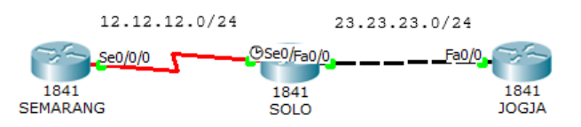

```
Router(config)#hostname SEMARANG
SEMARANG(config)#interface s0/0/0
SEMARANG(config-if)#ip address 12.12.12.1 255.255.255.0
SEMARANG(config-if)#no shutdown
```

```
Router(config)#hostname SOLO
SOLO(config)#interface s0/0/0
SOLO(config-if)#ip address 12.12.12.2 255.255.255.0
SOLO(config-if)#no shutdown
SOLO(config-if)#interface f0/0
SOLO(config-if)#ip address 23.23.23.2 255.255.255.0
SOLO(config-if)#no shutdown
```

```
Router(config)#hostname JOGJA
JOGJA(config)#interface f0/0
JOGJA(config-if)#ip address 23.23.23.3 255.255.255.0
JOGJA(config-if)#no shutdown
```

Konfigurasikan routing static pada router Semarang dan Jogja. Router Solo tidak perlu dikonfigurasi static routing karena sudah direct connected dengan router Semarang dan Jogja.

```
SEMARANG(config-if)#ip route 23.23.23.0 255.255.255.0 12.12.12.2
JOGJA(config-if)#ip route 12.12.12.0 255.255.255.0 23.23.23.2
```

Sekarang cek ping dan lihat tabel routing.

```
JOGJA#ping 12.12.12.1
Type escape sequence to abort.
Sending 5, 100-byte ICMP Echos to 12.12.12.1, timeout is 2 seconds:
.!!!!
Success rate is 80 percent (4/5), round-trip min/avg/max = 3/6/17 ms

JOGJA#show ip route
Codes:  C - connected, S - static, I - IGRP, R - RIP, M - mobile, B - BGP
        D - EIGRP, EX - EIGRP external, O - OSPF, IA - OSPF inter area
        N1 - OSPF NSSA external type 1, N2 - OSPF NSSA external type 2
        E1 - OSPF external type 1, E2 - OSPF external type 2, E - EGP
        i - IS-IS, L1 - IS-IS level-1, L2 - IS-IS level-2, ia - IS-IS inter
area
        * - candidate default, U - per-user static route, o - ODR
        P - periodic downloaded static route

Gateway of last resort is not set

    12.0.0.0/24 is subnetted, 1 subnets
S       12.12.12.0 [1/0] via 23.23.23.2
    23.0.0.0/24 is subnetted, 1 subnets
C       23.23.23.0 is directly connected, FastEthernet0/0
JOGJA#
```

```
SEMARANG#ping 23.23.23.3
Type escape sequence to abort.
Sending 5, 100-byte ICMP Echos to 23.23.23.3, timeout is 2 seconds:
!!!!!
Success rate is 100 percent (5/5), round-trip min/avg/max = 1/4/14 ms

SEMARANG#sh ip route
Codes:  C - connected, S - static, I - IGRP, R - RIP, M - mobile, B - BGP
        D - EIGRP, EX - EIGRP external, O - OSPF, IA - OSPF inter area
        N1 - OSPF NSSA external type 1, N2 - OSPF NSSA external type 2
        E1 - OSPF external type 1, E2 - OSPF external type 2, E - EGP
        i - IS-IS, L1 - IS-IS level-1, L2 - IS-IS level-2, ia - IS-IS inter
area
        * - candidate default, U - per-user static route, o - ODR
        P - periodic downloaded static route

Gateway of last resort is not set

    12.0.0.0/24 is subnetted, 1 subnets
C       12.12.12.0 is directly connected, Serial0/0/0
    23.0.0.0/24 is subnetted, 1 subnets
S       23.23.23.0 [1/0] via 12.12.12.2
SEMARANG#
```

Static routing ditandai dengan tanda S. Ketika ditraceroute, maka melewati 12.12.12.1 sebagai next-hop menuju network 23.23.23.0/24.

```
SEMARANG#traceroute 23.23.23.3
Type escape sequence to abort.
Tracing the route to 23.23.23.3

    1   12.12.12.2      0 msec      0 msec      0 msec
    2   23.23.23.3      1 msec      1 msec      4 msec
SEMARANG#
```

## Default Routing

Default routing sebenarnya masuk dalam static routing. Biasa digunakan untuk routing ke internet. Pada tabel routing, default routing selalu berada paling bawah dan selalu menjadi last preferred (pilihan terakhir).

<span style="color: #7b1fa2;">ip route</span> (spaci) <span style="color: #0288d1;">0.0.0.0</span> (spaci) <span style="color: #00a65a;">0.0.0.0</span> (spaci) <span style="color: #e53935;">ip/interface next-hop</span>

Lanjutan lab sebelumnya. Hapus dulu static route yang sebelumnya dibuat.

```
SEMARANG(config)#no ip route 23.23.23.0 255.255.255.0 12.12.12.2
JOGJA(config)#no ip route 12.12.12.0 255.255.255.0 23.23.23.2
```

Sekarang masukkan default routingnya.

```
SEMARANG(config)#ip route 0.0.0.0 0.0.0.0 12.12.12.2
JOGJA(config)#ip route 0.0.0.0 0.0.0.0 23.23.23.2
```

Sekarang tes ping dan cek tabel routing.

```
SEMARANG#ping 23.23.23.3

Type escape sequence to abort.
Sending 5, 100-byte ICMP Echos to 23.23.23.3, timeout is 2 seconds:
!!!!!
Success rate is 100 percent (5/5), round-trip min/avg/max = 1/1/1 ms

SEMARANG#sh ip route
Codes:  C - connected, S - static, I - IGRP, R - RIP, M - mobile, B - BGP
        D - EIGRP, EX - EIGRP external, O - OSPF, IA - OSPF inter area
        N1 - OSPF NSSA external type 1, N2 - OSPF NSSA external type 2
        E1 - OSPF external type 1, E2 - OSPF external type 2, E - EGP
        i - IS-IS, L1 - IS-IS level-1, L2 - IS-IS level-2, ia - IS-IS inter
area
        * - candidate default, U - per-user static route, o - ODR
        P - periodic downloaded static route

Gateway of last resort is 12.12.12.2 to network 0.0.0.0

    12.0.0.0/24 is subnetted, 1 subnets
C       12.12.12.0 is directly connected, Serial0/0/0
S*  0.0.0.0/0 [1/0] via 12.12.12.2
SEMARANG#
```

Default routing ditandai dengan tanda S\* dan destination 0.0.0.0/0 yang artinya ke semua ip.

### Dynamic Routing Overview


flowchart TD
%% Node Utama
DRP[Dynamic Routing Protocol]

    %% Kategori Utama (IGP & EGP)
    IGP["Interior Gateway Protocol (IGP)"]
    EGP["Exterior Gateway Protocol (EGP)"]

    DRP --- IGP
    DRP --- EGP

    %% Klasifikasi IGP
    DV[Distance Vector]
    LS[Link State]

    IGP --- DV
    IGP --- LS

    %% Klasifikasi EGP
    PV[Path Vector]

    EGP --- PV

    %% Protokol Distance Vector
    RIP1[RIPv1]
    RIP2[RIPv2]
    IG[IGRP]
    EI[EIGRP]

    DV --- RIP1
    RIP1 --- RIP2
    DV --- IG
    IG --- EI

    %% Protokol Link State
    OSPF[OSPF]
    ISIS[IS-IS]

    LS --- OSPF
    LS --- ISIS

    %% Protokol Path Vector
    BGP[BGP]

    PV --- BGP

    %% Styling menyesuaikan warna biru muda dari diagram asli
    classDef blueBox fill:#d6eaf8,stroke:#5dade2,stroke-width:1.5px,color:#17202a;
    class DRP,IGP,EGP,DV,LS,PV,RIP1,RIP2,IG,EI,OSPF,ISIS,BGP blueBox;



Dynamic routing menggunakan protocol routing dalam pembentukan tabel routing. Ketika topologi berubah, tabel routing akan ikut berubah secara otomatis.

- Use more bandwidth daripada static routing, karena route exchanging.
- CPU cycles are used to calculate and communicate routes.
- Cocok untuk network skala besar.

#### PERBANDINGAN PROTOCOL ROUTING

|                             |     RIP v1      |     RIP v2      |       IGRP        |              EIGRP              |                                      OSPF                                      |          IS-IS          |                         BGP                         |
| :-------------------------- | :-------------: | :-------------: | :---------------: | :-----------------------------: | :----------------------------------------------------------------------------: | :---------------------: | :-------------------------------------------------: |
| **Interior/Exterior?**      |    Interior     |    Interior     |     Interior      |            Interior             |                                    Interior                                    |        Interior         |                      Exterior                       |
| **Type**                    | Distance Vector | Distance Vector |  Distance Vector  |             Hybrid              |                                   Link-state                                   |       Link-state        |                     Path Vector                     |
| **Default Metric**          |    Hopcount     |    Hopcount     |  Bandwidth/Delay  |         Bandwidth/Delay         |                                      Cost                                      |          Cost           |                 Multiple Attributes                 |
| **Administrative Distance** |       120       |       120       |        100        | 90 (internal)<br>170 (external) |                                      110                                       |           115           |           20 (external)<br>200 (internal)           |
| **Hopcount Limit**          |       15        |       15        | 255 (100 default) |        224 (100 default)        |                                      None                                      |          None           | EBGP Neighbors: 1 (default)<br>IBGP Neighbors: None |
| **Convergence**             |      Slow       |      Slow       |       Slow        |            Very Fast            |                                      Fast                                      |          Fast           |                       Average                       |
| **Update timers**           |   30 seconds    |   30 seconds    |    90 seconds     |     Only when change occurs     | Only when changes occur;<br>(LSA table is refreshed every 30 minutes, however) | Only when changes occur |               Only when changes occur               |
| **Updates**                 |   Full table    |   Full table    |    Full table     |          Only Changes           |                                  Only Changes                                  |      Only changes       |                    Only changes                     |
| **Classless**               |       No        |       Yes       |        No         |               Yes               |                                      Yes                                       |           Yes           |                         Yes                         |
| **Supports VLSM**           |       No        |       Yes       |        No         |               Yes               |                                      Yes                                       |           Yes           |                         Yes                         |
| **Algorithm**               |  Bellman-Ford   |  Bellman-Ford   |   Bellman-Ford    |              DUAL               |                                    Dijkstra                                    |        Dijkstra         |                 Best Path Algorithm                 |
| **Update Address**          |    Broadcast    |    224.0.0.9    |    224.0.0.10     |           224.0.0.10            |           224.0.0.5 (All SPF Routers)<br>224.0.0.6 (DR's and BDR's)            |                         |                       Unicast                       |
| **Protocol and Port**       |  UDP port 520   |                 |   IP Protocol 9   |         IP Protocol 88          |                                 IP Protocol 89                                 |                         |                    TCP port 179                     |

### IGP dan EGP

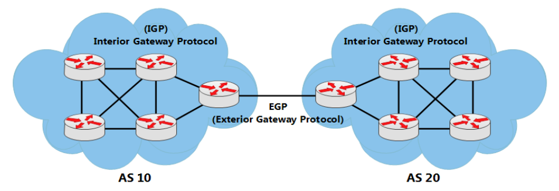

Internet tersusun atas banyak AS. Bayangkan internet itu seperti puzzle, maka ASAS adalah potongan puzzlenya. Dan di internet ada ribuan AS. AS atau Autonomous System sendiri adalah kumpulan router didalam suatu authority yang sama.

Interior Gateway Protocol (IGP) digunakan untuk routing dalam sebuah AS (IntraAS). IGP digunakan untuk jaringan internal dalam sebuah perusahaan, organisasi atau service provider. IGP juga dibagi menjadi 2 jenis:

- Distance Vector

Sesuai namanya, ada 2 karakteristik utama dalam penentuan routenya.

Distance = jauhnya source network menuju destination berdasarkan metric. Metric dihitung dari hop count, cost, bandwidth, delay, dll.

Vector = direction atau arah dari next hop router untuk menuju ke destination.

Protocol jenis Distance Vector hanya mengetahui route dan metric untuk menuju destination tertentu. Protocol tersebut tidak mempunyai informasi tentang map jaringan atau topologi secara keseluruhan.

Yang termasuk protocol routing distance vector: RIPv1, RIPv2, IGRP dan EIGRP.

- Link-State

Protocol jenis link-state mengetahui topologi jaringan secara keseluruhan dengan mengumpulkan informasi dari setiap router. Untuk jaringan dengan skala yang luas (large network), link-state didesign secara hierarchical atau dibagi menjadi area-area. Area yang harus ada pada link-state adalah area 0 atau backbone. Pembagian menjadi area-area ini bertujuan mengurangi resource router dengan setiap area mempunyai table routing yang berbeda dengan area yang lain.

Yang termasuk protocol routing link-state: OSPF dan IS-IS.

Exterior Gateway Protocol (EGP) digunakan untuk routing antar AS (Inter AS). Satu-satunya protocol EGP adalah BGP. BGP merupakan protocol berjenis path-vector. Route yang dihasilkan dari BGP memuat attribute as-path. AS Path adalah urutan AS Number yang dilewati suatu route untuk sampai ke destination.

## Enhanced Interior Gateaway Protocol (EIGRP)

- Cisco proprietary
- Advanced distance vector/hybrid routing protocol
- Using DUAL Algorithm.
- Multicast or unicast for exchange information use port 88
- Administrative distance 90
- Classless routing protocol support VLSM/CIDR.
- Support IPv6
- Rich metric (bandwidth, delay, load and reliability)
- Very fast convergence
- Equal and Unequal Load balancing
- 100% loop-free

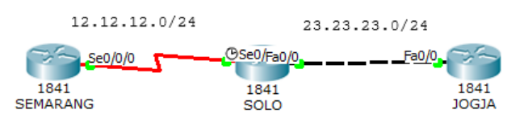

Konfigurasi interface seperti pada lab static routing dan tambahkan interface loopback pada ketiga router. Interface loopback dapat dipakai sebagai identitas dan sebagai ip logical.

```
SEMARANG(config)#int lo0
SEMARANG(config-if)#ip address 1.1.1.1 255.255.255.255
SOLO(config)#int lo0
SOLO(config-if)#ip add 2.2.2.2 255.255.255.255
JOGJA(config)#int lo0
JOGJA(config-if)#ip add 3.3.3.3 255.255.255.255
```

Konfigurasi EIGRP pada router. AS Number dalam semua router EIGRP harus sama.

```
SEMARANG(config)#router eigrp ?
    <1-65535> Autonomous system number

SEMARANG(config)#router eigrp 10
SEMARANG(config-router)#network 12.12.12.0 ?
    A.B.C.D EIGRP wild card bits
    <cr>
SEMARANG(config-router)#network 12.12.12.0 0.0.0.255
SEMARANG(config-router)#network 1.1.1.1 0.0.0.0
SEMARANG(config-router)#no auto-summary
SEMARANG(config-router)#ex
```

```
SOLO(config)#router eigrp 10
SOLO(config-router)#network 12.12.12.0 0.0.0.255
SOLO(config-router)#network 23.23.23.0 0.0.0.255
SOLO(config-router)#network 2.2.2.2 0.0.0.0
SOLO(config-router)#no auto-summary
```

```
JOGJA(config)#router eigrp 10
JOGJA(config-router)#network 23.23.23.0 0.0.0.255
JOGJA(config-router)#network 3.3.3.3 0.0.0.0
JOGJA(config-router)#no auto-summary
```

No-auto summary bertujuan untuk menyertakan subnetmask dalam routing EIGRP. Sekarang lakukan tes ping dan traceroute ke router jogja.

```
SEMARANG#ping 2.2.2.2

Type escape sequence to abort.
Sending 5, 100-byte ICMP Echos to 2.2.2.2, timeout is 2 seconds:
!!!!!
Success rate is 100 percent (5/5), round-trip min/avg/max = 1/3/12 ms

SEMARANG#ping 3.3.3.3

Type escape sequence to abort.
Sending 5, 100-byte ICMP Echos to 3.3.3.3, timeout is 2 seconds:
!!!!!
Success rate is 100 percent (5/5), round-trip min/avg/max = 1/3/11 ms

SEMARANG#traceroute 3.3.3.3
Type escape sequence to abort.
Tracing the route to 3.3.3.3

    1   12.12.12.2      0 msec      2 msec      2 msec
    2   23.23.23.3      1 msec      0 msec      1 msec
SEMARANG#
```

Pengecekan tabel routing.

```
SEMARANG#sh ip route

Gateway of last resort is not set

        1.0.0.0/8 is variably subnetted, 2 subnets, 2 masks
D           1.0.0.0/8 [90/2809856] via 12.12.12.2, 00:07:37, Serial0/0/0
C           1.1.1.1/32 is directly connected, Loopback0
        2.0.0.0/32 is subnetted, 1 subnets
D           2.2.2.2 [90/2297856] via 12.12.12.2, 00:07:37, Serial0/0/0
        3.0.0.0/32 is subnetted, 1 subnets
D           3.3.3.3 [90/2300416] via 12.12.12.2, 00:02:48, Serial0/0/0
        12.0.0.0/24 is subnetted, 1 subnets
C           12.12.12.0 is directly connected, Serial0/0/0
        23.0.0.0/24 is subnetted, 1 subnets
D           23.23.23.0 [90/2172416] via 12.12.12.2, 00:02:49, Serial0/0/0
SEMARANG#
```

```
SOLO#sh ip route

Gateway of last resort is not set

        1.0.0.0/8 is variably subnetted, 2 subnets, 2 masks
D           1.0.0.0/8 is a summary, 00:08:13, Null0
D           1.1.1.1/32 [90/2297856] via 12.12.12.1, 00:08:07, Serial0/0/0
        2.0.0.0/32 is subnetted, 1 subnets
C           2.2.2.2 is directly connected, Loopback0
        3.0.0.0/32 is subnetted, 1 subnets
D           3.3.3.3 [90/156160] via 23.23.23.3, 00:03:19, FastEthernet0/0
        12.0.0.0/24 is subnetted, 1 subnets
C           12.12.12.0 is directly connected, Serial0/0/0
        23.0.0.0/24 is subnetted, 1 subnets
C           23.23.23.0 is directly connected, FastEthernet0/0
SOLO#
```

```
JOGJA#sh ip route

Gateway of last resort is not set

        1.0.0.0/8 is variably subnetted, 2 subnets, 2 masks
D           1.0.0.0/8 [90/2300416] via 23.23.23.2, 00:03:39, FastEthernet0/0
D           1.1.1.1/32 [90/2300416] via 23.23.23.2, 00:03:39, FastEthernet0/0
        2.0.0.0/32 is subnetted, 1 subnets
D           2.2.2.2 [90/156160] via 23.23.23.2, 00:03:39, FastEthernet0/0
        3.0.0.0/32 is subnetted, 1 subnets
C           3.3.3.3 is directly connected, Loopback0
        12.0.0.0/24 is subnetted, 1 subnets
D           12.12.12.0 [90/2172416] via 23.23.23.2, 00:03:39, FastEthernet0/0
        23.0.0.0/24 is subnetted, 1 subnets
C           23.23.23.0 is directly connected, FastEthernet0/0
JOGJA#
```

Tanda D menunjukkan bahwa route dihasilkan melalui protocol EIGRP. AD pada EIGRP adalah 90 ditandai dengan warna kuning dan metic ditandai dengan warna biru. Perhitungan metric menggunakan rumus tersendiri.

## Open Shortest Path First (OSPF)

- Open Standard.
- Link-State routing protocol.
- Using SPF/Dijkstra Algorithm.
- Multicast for exchange information use port 89.
- Administrative distance 110.
- Classless routing protocol support VLSM/CIDR.
- Support IPv6.
- Metric using cost.
- Fast convergence.
- Equal load balancing only.
- Using areas (backbone area and non-backbone areas).

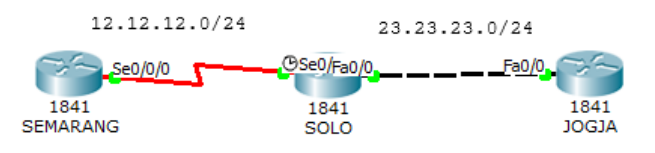

Hapus konfigurasi EIGRP sebelumnya.

```
SEMARANG(config)# no router eigrp 10
SOLO(config)# no router eigrp 10
JOGJA(config-if)# no router eigrp 10
```

Konfigurasi OSPF pada router. OSPF menggunakan process ID. Process ID pada setiap router tidak harus sama, yang terpenting adalah areanya. Untuk terhubung antara area yang satu dengan yang lain harus melewari area 0 atau area backbone.

```
SEMARANG(config)#router ospf ?
    <1-65535> Process ID
SEMARANG(config)#router ospf 1
SEMARANG(config-router)#net
SEMARANG(config-router)#network 12.12.12.0 ?
    A.B.C.D OSPF wild card bits
SEMARANG(config-router)#network 12.12.12.0 0.0.0.255 area 0
SEMARANG(config-router)#network 1.1.1.1 0.0.0.0 area 0
```

```
SOLO(config)#router ospf 2
SOLO(config-router)#network 12.12.12.0 0.0.0.255 area 0
SOLO(config-router)#network 23.23.23.0 0.0.0.255 area 1
SOLO(config-router)#network 2.2.2.2 0.0.0.0 area 0
```

```
JOGJA(config)#router ospf 3
JOGJA(config-router)#network 23.23.23.0 0.0.0.255 area 1
JOGJA(config-router)#network 3.3.3.3 0.0.0.0 area 1
```

Sekarang lakukan tes ping.

```
SEMARANG#ping 2.2.2.2

Type escape sequence to abort.
Sending 5, 100-byte ICMP Echos to 2.2.2.2, timeout is 2 seconds:
!!!!!
Success rate is 100 percent (5/5), round-trip min/avg/max = 1/1/2 ms

SEMARANG#ping 3.3.3.3

Type escape sequence to abort.
Sending 5, 100-byte ICMP Echos to 3.3.3.3, timeout is 2 seconds:
!!!!!
Success rate is 100 percent (5/5), round-trip min/avg/max = 1/2/7 ms

SEMARANG#
```

Cek tabel routing.

```
SEMARANG#sh ip route

Gateway of last resort is not set

        1.0.0.0/32 is subnetted, 1 subnets
C           1.1.1.1 is directly connected, Loopback0
        2.0.0.0/32 is subnetted, 1 subnets
O           2.2.2.2 [110/65] via 12.12.12.2, 00:02:45, Serial0/0/0
        3.0.0.0/32 is subnetted, 1 subnets
O IA        3.3.3.3 [110/66] via 12.12.12.2, 00:01:21, Serial0/0/0
        12.0.0.0/24 is subnetted, 1 subnets
C           12.12.12.0 is directly connected, Serial0/0/0
        23.0.0.0/24 is subnetted, 1 subnets
O IA        23.23.23.0 [110/65] via 12.12.12.2, 00:03:13, Serial0/0/0
```

```
SOLO#sh ip ro

Gateway of last resort is not set

        1.0.0.0/32 is subnetted, 1 subnets
O           1.1.1.1 [110/65] via 12.12.12.1, 00:05:40, Serial0/0/0
        2.0.0.0/32 is subnetted, 1 subnets
C           2.2.2.2 is directly connected, Loopback0
        3.0.0.0/32 is subnetted, 1 subnets
O           3.3.3.3 [110/2] via 23.23.23.3, 00:02:35, FastEthernet0/0
        12.0.0.0/24 is subnetted, 1 subnets
C           12.12.12.0 is directly connected, Serial0/0/0
        23.0.0.0/24 is subnetted, 1 subnets
C           23.23.23.0 is directly connected, FastEthernet0/0
SOLO#
```

```
JOGJA#sh ip route

Gateway of last resort is not set

        1.0.0.0/32 is subnetted, 1 subnets
O IA        1.1.1.1 [110/66] via 23.23.23.2, 00:02:03, FastEthernet0/0
        2.0.0.0/32 is subnetted, 1 subnets
O IA        2.2.2.2 [110/2] via 23.23.23.2, 00:02:03, FastEthernet0/0
        3.0.0.0/32 is subnetted, 1 subnets
C           3.3.3.3 is directly connected, Loopback0
        12.0.0.0/24 is subnetted, 1 subnets
O IA        12.12.12.0 [110/65] via 23.23.23.2, 00:02:03, FastEthernet0/0
        23.0.0.0/24 is subnetted, 1 subnets
C           23.23.23.0 is directly connected, FastEthernet0/0
JOGJA#
```

Tanda O menunjukkan bahwa route dihasilkan melalui protocol OSPF. Tanda IA menunjukkan bahwa destination route berada pada area yang berbeda. AD pada OSPF adalah 110.

**Access List (ACL)**

Access List (ACL) biasa digunakan untuk filtering. Ada 2 macam access list yaitu standard dan extented.

| Standard ACL                              | Extended ACL                                                                   |
| :---------------------------------------- | :----------------------------------------------------------------------------- |
| ACL Number range 1-99                     | ACL Number range 100-199                                                       |
| Can block a network, host and subnet      | Can allow or deny a network, host, subnet and service                          |
| All service are blocked                   | Select service can be blocked                                                  |
| Implemented closest to the destination    | Implemented closest to the destination                                         |
| Filtering based on source IP address only | Filtering based on source IP address, destination IP, protocol and port number |

## Standart Access List

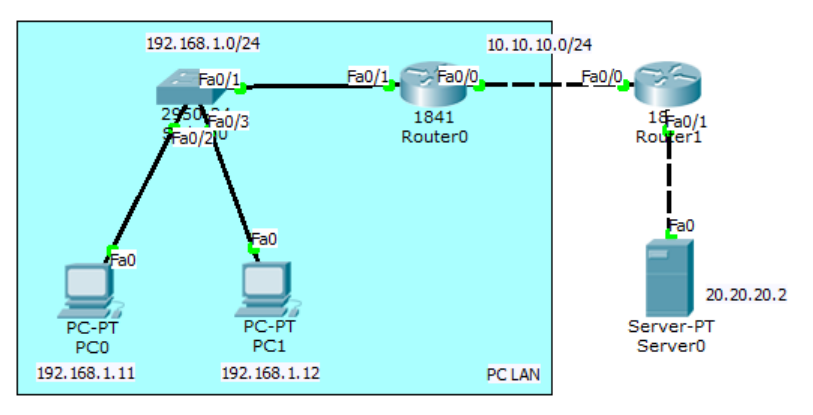

Lakukan konfigurasi supaya PC LAN dapat ping ke server.<br>
Konfigurasi interface dan routing pada Router0.

```
Router(config)#int fa0/1
Router(config-if)#ip add 192.168.1.1 255.255.255.0
Router(config-if)#no sh
Router(config-if)#int fa0/0
Router(config-if)#ip add 10.10.10.1 255.255.255.0
Router(config-if)#no sh
Router(config-if)#ip route 20.20.20.0 255.255.255.0 10.10.10.2
```

Konfigurasi interface dan routing pada Router1.

```
Router(config)#int fa0/0
Router(config-if)#ip add 10.10.10.2 255.255.255.0
Router(config-if)#no sh
Router(config-if)#int fa0/1
Router(config-if)#ip add 20.20.20.1 255.255.255.0
Router(config-if)#no sh
Router(config-if)#ip route 192.168.1.0 255.255.255.0 10.10.10.1
```

Berikan IP pada server dan coba cek web server melalui browser pada PC LAN.

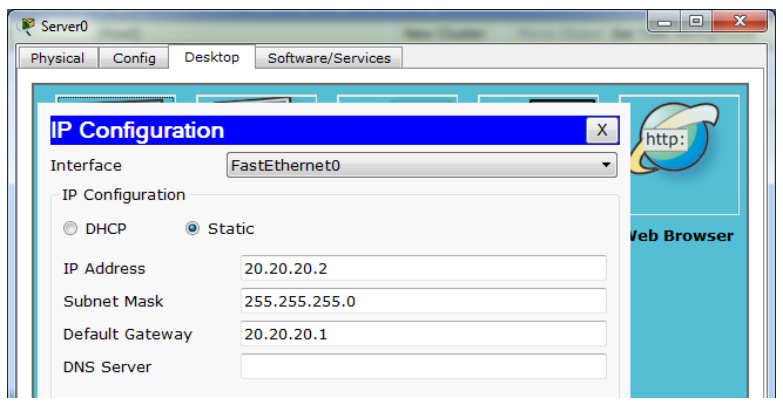

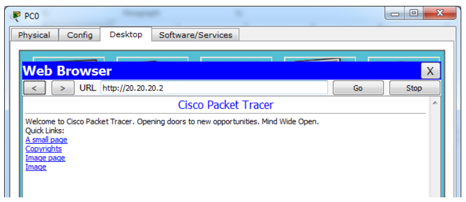

Cek ping dari PC LAN ke web server.

```
PC>ping 20.20.20.2

Pinging 20.20.20.2 with 32 bytes of data:

Reply from 20.20.20.2: bytes=32 time=0ms TTL=126
Reply from 20.20.20.2: bytes=32 time=0ms TTL=126
Reply from 20.20.20.2: bytes=32 time=0ms TTL=126
Reply from 20.20.20.2: bytes=32 time=0ms TTL=126

Ping statistics for 20.20.20.2:
    Packets: Sent = 4, Received = 4, Lost = 0 (0% loss),
Approximate round trip times in milli-seconds:
    Minimum = 0ms, Maximum = 0ms, Average = 0ms
PC>
```

Sekarang konfigurasikan standard access list agar PC LAN tidak dapat mengakses web server. Set access list pada router dan interface yang paling dekat dengan destination.

```
Router(config)#access-list 10 deny 192.168.10.0 ?
    A.B.C.D Wildcard bits
    <cr>
Router(config)#access-list 10 deny 192.168.1.0 0.0.0.255
Router(config)#access-list 10 permit any
Router(config)#int fa0/1
Router(config-if)#ip access-group 1 out
```

Cek ping dan akses browser dari PC LAN ke web server.

```
PC>ping 20.20.20.2

Pinging 20.20.20.2 with 32 bytes of data:

Reply from 10.10.10.2: Destination host unreachable.
Reply from 10.10.10.2: Destination host unreachable.
Reply from 10.10.10.2: Destination host unreachable.
Reply from 10.10.10.2: Destination host unreachable.

Ping statistics for 20.20.20.2:
    Packets: Sent = 4, Received = 0, Lost = 4 (100% loss),
PC>
```

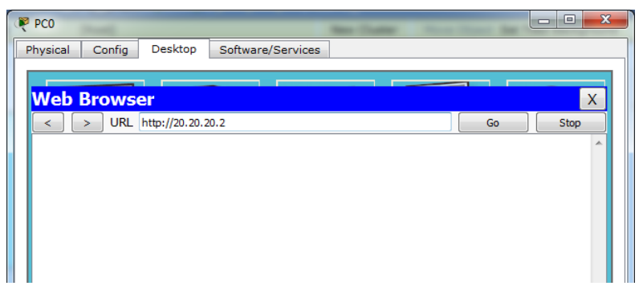

Cek access list pada Router1.

```
Router#show access-lists
Standard IP access list 10
    deny 192.168.1.0 0.0.0.255 (64 match(es))
    permit any (5 match(es))
Router#
```

Pada standard access list, semua service akan diblok, baik UDP untuk akses browser atau ICMP untuk ping. Untuk memilih hanya service tertentu saja, gunakan extended access list.

## Extended Access List

Extented access list mengizinkan hanya service tertentu saja yang diblok. Gambar dibawah adalah jenis-jenis service beserta aplikasinya.


flowchart TD
%% Node Utama
IP[IP]

    %% Protokol Layer Transport/Network
    TCP[TCP]
    UDP[UDP]
    ICMP[ICMP]

    IP --- TCP
    IP --- UDP
    IP --- ICMP

    %% Aplikasi di bawah TCP
    HTTP[HTTP]
    TELNET[TELNET]
    FTP[FTP]
    SNTP[SNTP]

    TCP --- HTTP
    TCP --- TELNET
    TCP --- FTP
    TCP --- SNTP

    %% Aplikasi di bawah UDP
    DNS[DNS]
    TDTP[TDTP]
    DHCP[DHCP]
    NNTP[NNTP]

    UDP --- DNS
    UDP --- TDTP
    UDP --- DHCP
    UDP --- NNTP

    %% Aplikasi di bawah ICMP
    PING[PING]
    TRACE[TRACEROUTE]

    ICMP --- PING
    ICMP --- TRACE

    %% Styling Warna Biru
    classDef mainBox fill:#5b9bd5,stroke:#2e75b6,stroke-width:2px,color:#ffffff,font-weight:bold;
    classDef subBox fill:#ddebf7,stroke:#5b9bd5,stroke-width:1px,color:#000000;

    class IP,TCP,UDP,ICMP mainBox;
    class HTTP,TELNET,FTP,SNTP,DNS,TDTP,DHCP,NNTP,PING,TRACE subBox;



Masih memakai topologi dari lab sebelumnya. Hapus dulu standard access list yang telah dibuat pada Router1.

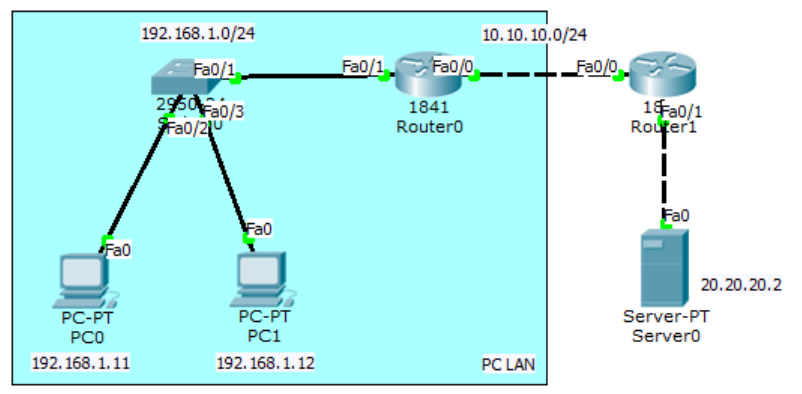

```
Router(config)#no access-list 10
```

Konfigurasi extended access list pada Router1 agar PC LAN dapat mengakses web server namun tidak bisa melakukan ping.

```
Router(config)#access-list 100 deny icmp 192.168.1.0 0.0.0.255 host
20.20.20.2 echo
Router(config)#access-list 100 permit ip any any
Router(config)#int fa0/1
Router(config-if)#ip access-group 100 out
```

Coba cek browser dan tes ping.

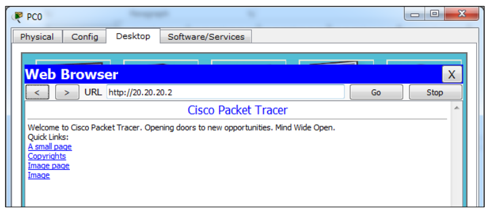

```
PC>ping 20.20.20.2

Pinging 20.20.20.2 with 32 bytes of data:

Reply from 10.10.10.2: Destination host unreachable.
Reply from 10.10.10.2: Destination host unreachable.
Reply from 10.10.10.2: Destination host unreachable.
Reply from 10.10.10.2: Destination host unreachable.

Ping statistics for 20.20.20.2:
    Packets: Sent = 4, Received = 0, Lost = 4 (100% loss),
PC>
```

Cek access list.

```
Router#show access-lists
Standard IP access list 10
    deny 192.168.1.0 0.0.0.255 (64 match(es))
    permit any (5 match(es))
Router#
```

**Network Address Translation (NAT)**


Network Aceess Translation (NAT) digunakan untuk mentranslasikan ip privat ke ip public atau sebaliknya. Misalkan ada server pada suatu perusahaan, selain bisa diakses secara local, perusahaan ingin server tersebut bisa diakses lewat internet. Maka server tersebut diberi ip public dan dikonfigurasi static NAT.

Dalam konfigurasi NAT, interface diset menjadi 2 kategori: inside dan outside.

- Inside = traffic yang masuk ke interface router dari local network.
- Outside = traffic yang keluar melalui interface router menuju destination/internet.

Ada beberapa tipe NAT.

- Static NAT, satu ip privat ditranslasikan ke satu ip public (one to one mapping)
- Dynamic NAT, Jumlah ip public yang disediakan harus sejumlah ip privat yang ditranslasikan NAT jenis ini jarang digunakan.
- Overloading/Port Address Translation (PAT), akses internet menggunakan 1 ip public. Ini yang banyak digunakan sekarang.

## Static NAT

Dalam static NAT, hanya 1 ip privat ditranslasikan ke 1 ip public. Artinya hanya 1 PC LAN yang dapat mengakses internet.

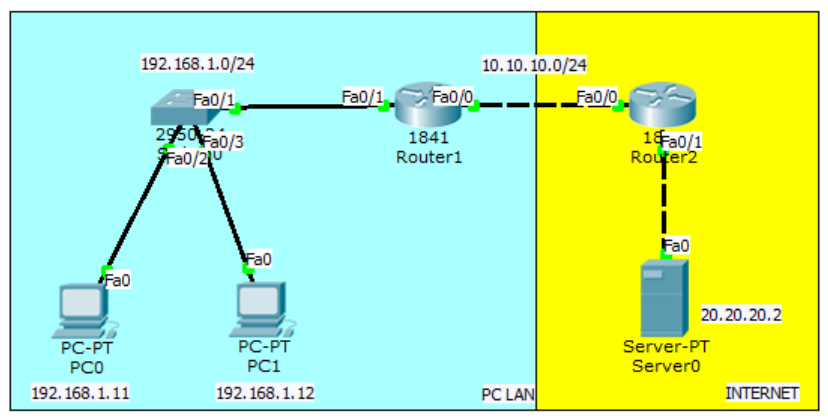

Konfigurasinya hampir sama dengan lab access list, namun tidak perlu dirouting karena nantinya akan menggunakan NAT.

Konfigurasi interface dan routing pada Router1.

```
Router(config)#int fa0/1
Router(config-if)#ip add 192.168.1.1 255.255.255.0
Router(config-if)#no sh
Router(config-if)#int fa0/0
Router(config-if)#ip add 10.10.10.1 255.255.255.0
Router(config-if)#no sh
```

Konfigurasi interface dan routing pada Router2.

```
Router(config)#int fa0/0
Router(config-if)#ip add 10.10.10.2 255.255.255.0
Router(config-if)#no sh
Router(config-if)#int fa0/1
Router(config-if)#ip add 20.20.20.1 255.255.255.0
Router(config-if)#no sh
```

Konfigurasi static NAT dan default route pada R1. PC LAN 192.168.1.11 akan ditranslasikan ke ip public 10.10.10.10.

```
Router(config)#ip nat inside source ?
    list Specify access list describing local addresses
    static Specify static local->global mapping
Router(config)#ip nat inside source static 192.168.1.11 10.10.10.10
Router(config)#int fa0/1
Router(config-if)#ip nat inside
Router(config-if)#int fa0/0
Router(config-if)#ip nat outside
Router(config)#ip route 0.0.0.0 0.0.0.0 fa0/0
```

Ping static NAT melalui server dan sebaliknya. Alamat PC LAN tidak akan pernah dapat diping dari internet.

```
SERVER>ping 10.10.10.10

Pinging 10.10.10.10 with 32 bytes of data:

Reply from 10.10.10.10: bytes=32 time=11ms TTL=126
Reply from 10.10.10.10: bytes=32 time=0ms TTL=126
Reply from 10.10.10.10: bytes=32 time=0ms TTL=126
Reply from 10.10.10.10: bytes=32 time=11ms TTL=126

Ping statistics for 10.10.10.10:
    Packets: Sent = 4, Received = 4, Lost = 0 (0% loss),
Approximate round trip times in milli-seconds:
    Minimum = 0ms, Maximum = 11ms, Average = 5ms

SERVER>ping 192.168.1.11

Pinging 192.168.1.11 with 32 bytes of data:

Reply from 20.20.20.1: Destination host unreachable.
Reply from 20.20.20.1: Destination host unreachable.
Request timed out.
Reply from 20.20.20.1: Destination host unreachable.

Ping statistics for 192.168.1.11:
    Packets: Sent = 4, Received = 0, Lost = 4 (100% loss),

SERVER>
```

```
PC>ping 20.20.20.2

Pinging 20.20.20.2 with 32 bytes of data:

Reply from 20.20.20.2: bytes=32 time=12ms TTL=126
Reply from 20.20.20.2: bytes=32 time=0ms TTL=126
Reply from 20.20.20.2: bytes=32 time=0ms TTL=126
Reply from 20.20.20.2: bytes=32 time=0ms TTL=126

Ping statistics for 20.20.20.2:
    Packets: Sent = 4, Received = 4, Lost = 0 (0% loss),
Approximate round trip times in milli-seconds:
    Minimum = 0ms, Maximum = 12ms, Average = 3ms
PC>
```

## Overloading/Port Address Translation (PAT)

PAT digunakan agar banyak PC local dapat mengakses internet secara bersamasama hanya dengan menggunakan 1 ip public.

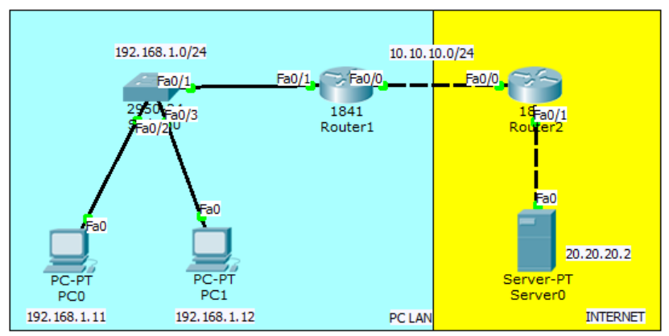

Lanjutan lab sebelumnya. Hapus dahulu konfigurasi static NAT yang telah dibuat.

```
Router(config)#no ip nat inside source static 192.168.1.11 10.10.10.10
```

Buat access list untuk mendefinisikan network yang akan ditranslasikan dan konfigurasi dynamic nat overload pada R1.

```
Router(config)#access-list 1 permit 192.168.1.0 0.0.0.255
Router(config)#ip nat inside source list ?
 <1-199> Access list number for local addresses
 WORD Access list name for local addresses
Router(config)#ip nat inside source list 1 interface fa0/0 overload
```

Sekarang ping web server melalui PC0 dan PC1 pastikan reply.

```
PC>ping 20.20.20.2

Pinging 20.20.20.2 with 32 bytes of data:

Reply from 20.20.20.2: bytes=32 time=12ms TTL=126
Reply from 20.20.20.2: bytes=32 time=0ms TTL=126
Reply from 20.20.20.2: bytes=32 time=0ms TTL=126
Reply from 20.20.20.2: bytes=32 time=0ms TTL=126

Ping statistics for 20.20.20.2:
    Packets: Sent = 4, Received = 4, Lost = 0 (0% loss),
Approximate round trip times in milli-seconds:
    Minimum = 0ms, Maximum = 12ms, Average = 3ms
PC>
```

**High Availibility**

High Availibility digunakan dengan maksud redundancy yaitu sebagai menggunakan beberapa router, yang satu menjadi link utama dan yang lain sebagai backup. Satu virtual gateway akan dipasang di PC local sehingga ketika pindah router tidak perlu mengeset gateway lagi.

## HSRP

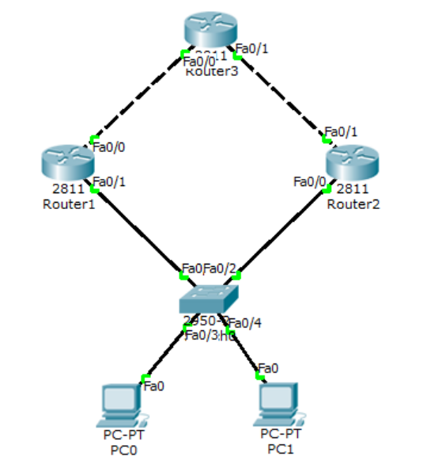

Konfigurasi routing seperti biasa pada ketika

```
Router(config)#hostname Router1
Router1(config)#int fa0/0
Router1(config-if)#ip add 13.13.13.1 255.255.255.0
Router1(config-if)#no sh

Router1(config-if)#int fa0/1
Router1(config-if)#ip add 12.12.12.1 255.255.255.0
Router1(config-if)#no sh

Router1(config-if)#router eigrp 10
Router1(config-router)#network 13.13.13.1 0.0.0.255
Router1(config-router)#network 12.12.12.1 0.0.0.255
Router1(config-router)#passive-interface fa0/1
Router1(config-router)#no auto-summary

Router(config)#hostname Router2
Router2(config)#int fa0/1
Router2(config-if)#ip add 23.23.23.2 255.255.255.0
Router2(config-if)#no sh

Router2(config-if)#int fa0/0
Router2(config-if)#ip add 12.12.12.2 255.255.255.0
Router2(config-if)#no sh

Router2(config-if)#router eigrp 10
Router2(config-router)#network 23.23.23.2 0.0.0.255
Router2(config-router)#network 12.12.12.2 0.0.0.255
Router2(config-router)#passive-interface fa0/0
Router2(config-router)#no auto-summary
```

```
Router(config)#hostname Router3
Router3(config)#int lo0

Router3(config-if)#ip add 3.3.3.3 255.255.255.255
Router3(config-if)#int fa0/1
Router3(config-if)#ip add 23.23.23.3 255.255.255.0
Router3(config-if)#no sh

Router3(config-if)#int fa0/0
Router3(config-if)#ip add 13.13.13.3 255.255.255.0
Router3(config-if)#no sh

Router3(config-if)#router eigrp 10
Router3(config-router)#network 23.23.23.3 0.0.0.255
Router3(config-router)#network 13.13.13.3 0.0.0.255
Router3(config-router)#network 3.3.3.3 0.0.0.0
Router3(config-router)#no auto-summary
```

Pastikan Router1 dan Router2 dapat melakukan ping ke 3.3.3.3 baru lakukan konfigurasi HSRP.

```
Router1(config)#int fa0/1
Router1(config-if)#standby ?
    <0-4095> group number
    ip Enable HSRP and set the virtual IP address
    ipv6 Enable HSRP IPv6
    preempt Overthrow lower priority Active routers
    priority Priority level
    track Priority Tracking
Router1(config-if)#standby 1 ip 12.12.12.12
Router1(config-if)#standby 1 preempt
%HSRP-6-STATECHANGE: FastEthernet0/1 Grp 1 state Speak -> Standby

%HSRP-6-STATECHANGE: FastEthernet0/1 Grp 1 state Standby -> Active
Router1(config-if)#standby 1 priority 105
Router1(config-if)#standby 1 track fa0/0
```

```
Router2(config)#int fa0/0
Router2(config-if)#standby 1 ip 12.12.12.12
Router2(config-if)#standby preempt
%HSRP-6-STATECHANGE: FastEthernet0/0 Grp 1 state Speak -> Standby
```

Konfigurasi di PC.

```
PC0 IP:12.12.12.100/24 GATEWAY:12.12.12.12
PC1 IP:12.12.12.101/24 GATEWAY:12.12.12.12
```

Ping dan trace dari PC ke 3.3.3.3.

```
PC>ping 3.3.3.3

Pinging 3.3.3.3 with 32 bytes of data:

Reply from 3.3.3.3: bytes=32 time=1ms TTL=254
Reply from 3.3.3.3: bytes=32 time=1ms TTL=254
Reply from 3.3.3.3: bytes=32 time=1ms TTL=254
Reply from 3.3.3.3: bytes=32 time=0ms TTL=254

Ping statistics for 3.3.3.3:
    Packets: Sent = 4, Received = 4, Lost = 0 (0% loss),
Approximate round trip times in milli-seconds:
    Minimum = 0ms, Maximum = 1ms, Average = 0ms

PC>tracert 3.3.3.3

Tracing route to 3.3.3.3 over a maximum of 30 hops:

    1  1 ms    1 ms    0 ms    12.12.12.1
    2  1 ms    1 ms    0 ms    3.3.3.3

Trace complete.

PC>
```

Cek standby pada Router1 dan Router2.

```
Router1#show standby br
                     P indicates configured to preempt.
                     |
Interface   Grp Pri P State     Active      Standby     Virtual IP
Fa0/1       1   105 P Active    local       12.12.12.2  12.12.12.12
Router1#

Router2#show standby br
                     P indicates configured to preempt.
                     |
Interface   Grp Pri P State     Active      Standby     Virtual IP
Fa0/0       1   100   Standby   12.12.12.1  local       12.12.12.12
Router2#
```

```
Router2(config)#int fa0/0
Router2(config-if)#standby 1 ip 12.12.12.12
Router2(config-if)#standby preempt
%HSRP-6-STATECHANGE: FastEthernet0/0 Grp 1 state Speak -> Standby
```
