**Cisco Devices Overview**

Switches in Cisco are usually called catalysts. The most prominent difference between a switch and a router is that a switch has many ports.

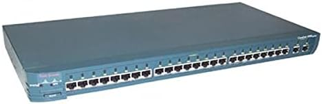

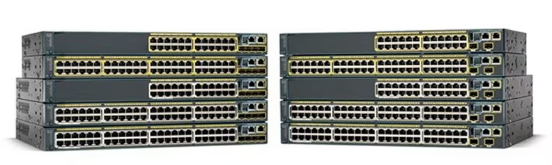

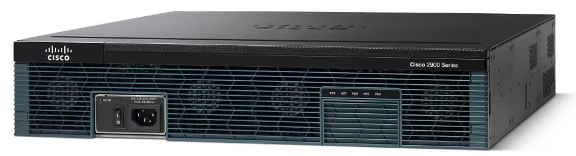

## Basic Cisco Switch & Router Commands

There are some basic Cisco commands that are mandatory to know.

```
Router>
Router>enable
Router#
Router#configure terminal
Router(config)#
```

There are several access privileges when logging into Cisco IOS:

- _User mode_ is indicated by a ">" sign.
- _Privilege mode_ is indicated by a "#" sign. To enter privilege mode from user mode, type the _enable_ command.
- _Global configuration mode_ is used to configure devices.

Changing the Hostname

```
Router(config)#hostname Semarang
Semarang (config)#
```

Saving Configuration<br>
Configuring so that when the device reboots, the configuration is not lost.

```
Router(config)#write
```

or

```
Router(config)#copy run start
```

Resetting Cisco Devices<br>
To restore the configuration to default.

```
Router(config)#write erase
```

The show ip interface brief command is used to view interface information.

```
R1#show ip interface brief
Interface           IP-Address      OK? Method Status           Protocol
FastEthernet0/0     10.10.10.1      YES manual up                  up
FastEthernet0/1     12.12.12.1      YES manual up                  up
Loopback0           1.1.1.1         YES manual up                  up
Vlan1               unassigned      YES unset administratively down down
R1#
```

The show running-config command is used to view the running configuration.

```
R1#show running-config
Building configuration...
Current configuration : 687 bytes
!
version 12.4
no service timestamps log datetime msec
no service timestamps debug datetime msec
no service password-encryption
!
hostname R1
!
spanning-tree mode pvst
!
interface Loopback0
ip address 1.1.1.1 255.255.255.255
!
interface FastEthernet0/0
ip address 10.10.10.1 255.255.255.0
ip nat inside
duplex auto
speed auto
!
interface FastEthernet0/1
ip address 12.12.12.1 255.255.255.0
ip nat outside
duplex auto
speed auto
!
interface Vlan1
no ip address
shutdown
!
ip nat inside source static 10.10.10.2 12.12.12.12
ip classless
ip route 0.0.0.0 0.0.0.0 12.12.12.2
!
line con 0
!
line aux 0
!
line vty 0 4
login
!
+
end
```

## Cisco Password Configuration

Security is an important matter in a network. Providing authentication in the form of a username and password in the device is done so that not just anyone can log into the device.

Setting a Line Console Password means when configuring through the console port, you will be prompted to log in.

```
Router>enable
Router#configure terminal
Router(config)#line console 0
Router(config-line)#password 123
Router(config-line)#login
```

When entering the device, the following display will appear.<br>

```
User Access Verification
Password:
```

VTY (Virtual Terminal) configuration so that the device can be telnetted using a specific username and password.

```
Router(config)#username admin
Router(config)#enable password coba1
Router(config)#enable secret coba2
```

When running show run.

```
Router#sh run
Building configuration...
Current configuration : 598 bytes
!
version 12.4
no service timestamps log datetime msec
no service timestamps debug datetime msec
no service password-encryption
!
hostname Router
!
enable secret 5 $1$mERr$9SLtlDbYs.aoemVq5cCcc.
enable password coba1
!
username admin
```

enable secret = password is encrypted.<br>
enable password = password is not encrypted and can be seen with show run.<br>
If we set enable secret and enable password, the one used is enable secret.

## Virtual LAN (VLAN)

Virtual LAN (VLAN) divides one broadcast domain into several broadcast domains, so that in one switch there can consist of several networks. Hosts from different VLANs will not be connected, thereby increasing network security.

VLAN is a facility owned by manageable switches, for example Cisco. On unmanageable switches, the ports can only be used for connections to the same network (one network) so they do not support the VLAN facility.

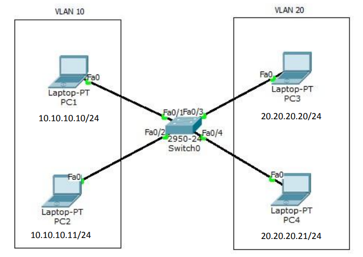

Create the topology as shown in the picture above in packet tracer. Configure VLAN on the switch with VLAN10 named Marketing and VLAN20 named Sales.

```
Switch>enable
Switch#conf t
Switch(config)#vlan 10
Switch(config-vlan)#name Marketing
Switch(config-vlan)#vlan 20
Switch(config-vlan)#name Sales
Switch(config-vlan)#int f0/1
Switch(config-if)#switchport access vlan 10
Switch(config-if)#int f0/2
Switch(config-if)#switchport access vlan 10
Switch(config-if)#int f0/3
Switch(config-if)#switchport access vlan 20
Switch(config-if)#int f0/4
Switch(config-if)#switchport access vlan 20
```

To check, ping from one PC to another PC and type the show vlan command on the switch. PC cannot ping to a different VLAN.

```
PC>ping 10.10.10.11
Pinging 10.10.10.11 with 32 bytes of data:
Reply from 10.10.10.11: bytes=32 time=0ms TTL=128
Reply from 10.10.10.11: bytes=32 time=0ms TTL=128
Reply from 10.10.10.11: bytes=32 time=0ms TTL=128
Reply from 10.10.10.11: bytes=32 time=0ms TTL=128
Ping statistics for 10.10.10.11:
Packets: Sent = 4, Received = 4, Lost = 0 (0% loss),
Approximate round trip times in milli-seconds:
Minimum = 0ms, Maximum = 0ms, Average = 0ms
PC>ping 20.20.20.21
Pinging 20.20.20.21 with 32 bytes of data:
Request timed out.
Request timed out.
Request timed out.
Request timed out.
Ping statistics for 20.20.20.21:
Packets: Sent = 4, Received = 0, Lost = 4 (100% loss),
PC>
```

```
Switch#show vlan
VLAN Name                             Status    Ports
---- -------------------------------- --------- ----------------------------
---
1    default                          active    Fa0/5, Fa0/6, Fa0/7, Fa0/8
                                                Fa0/9, Fa0/10, Fa0/11,
Fa0/12
                                                Fa0/13, Fa0/14, Fa0/15,
Fa0/16
                                                Fa0/17, Fa0/18, Fa0/19,
Fa0/20
                                                Fa0/21, Fa0/22, Fa0/23,
Fa0/24
10   VLAN0010                         active    Fa0/1, Fa0/2
20   VLAN0020                         active    Fa0/3, Fa0/4
1002 fddi-default                     act/unsup
1003 token-ring-default               act/unsup
1004 fddinet-default                  act/unsup
1005 trnet-default                    act/unsup
VLAN Type  SAID       MTU   Parent RingNo BridgeNo Stp  BrdgMode Trans1 Trans2
---- ----- ---------- ----- ------ ------ -------- ---- -------- ------ ----
--
1    enet  100001     1500  -      -      -        -    -        0      0
10   enet  100010     1500  -      -      -        -    -        0      0
20   enet  100020     1500  -      -      -        -    -        0      0
1002 fddi  101002     1500  -      -      -        -    -        0      0
1003 tr    101003     1500  -      -      -        -    -        0      0
1004 fdnet 101004     1500  -      -      -        ieee -        0      0
1005 trnet 101005     1500  -      -      -        ibm  -        0      0
Remote SPAN VLANs
----------------------------------------------------------------------------
--
Primary Secondary Type              Ports
------- --------- ----------------- ----------------------------------------
--
```

## LAN Trunking

Trunking functions to pass VLAN traffic from different switches. Between the 1st floor and 2nd floor switches are connected. PC1, PC2, PC5 and PC6 enter VLAN 10 while PC3, PC4, PC5 and PC6 enter VLAN 20.

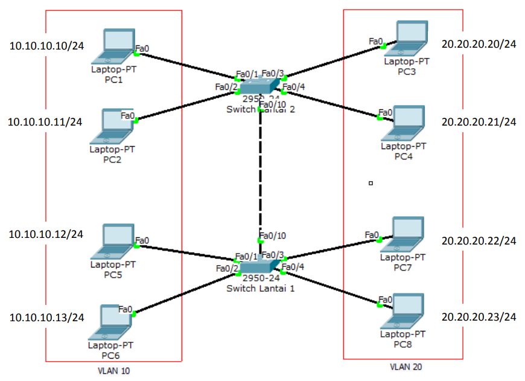

Configure VLANs as shown below. Creating vlan 10 and vlan 20.

```
10.10.10.10/24
10.10.10.11/24
10.10.10.12/24
10.10.10.13/24
20.20.20.20/24
20.20.20.21/24
20.20.20.22/24
20.20.20.23/24
switch1(config)#vlan 10
switch1(config-vlan)#vlan 20
switch1(config-vlan)#int f0/1
switch1(config-if)#sw access vlan 10
switch1(config-if)#int f0/2
switch1(config-if)#sw access vlan 10
switch1(config-vlan)#int f0/3
switch1(config-if)#sw access vlan 10
switch1(config-vlan)#int f0/4
switch1(config-if)#sw access vlan 10
Switch0(config)#vlan 10
Switch0(config-vlan)#vlan 20
Switch0(config-vlan)#int f0/1
Switch0(config-if)#sw access vlan 10
Switch0(config-if)#int f0/2
Switch0(config-if)#sw access vlan 10
Switch0(config-vlan)#int f0/3
Switch0(config-if)#sw access vlan 10
Switch0(config-vlan)#int f0/4
Switch0(config-if)#sw access vlan 10
```

Configure the interface interconnected between switches to trunk mode.<br>
Do this on both switches.

```
Switch0(config)#int f0/10
Switch0(config-if)#switchport mode trunk
Switch1(config)#int f0/10
Switch1(config-if)#switchport mode trunk
```

Ping from one PC to another PC and type the show vlan command.

```
PC>ping 10.10.10.11

Pinging 10.10.10.11 with 32 bytes of data:

Reply from 10.10.10.11: bytes=32 time=17ms TTL=128
Reply from 10.10.10.11: bytes=32 time=0ms TTL=128
Reply from 10.10.10.11: bytes=32 time=0ms TTL=128
Reply from 10.10.10.11: bytes=32 time=0ms TTL=128

Ping statistics for 10.10.10.11:
    Packets: Sent = 4, Received = 4, Lost = 0 (0% loss),
Approximate round trip times in milli-seconds:
    Minimum = 0ms, Maximum = 17ms, Average = 4ms

PC>ping 10.10.10.13

Pinging 10.10.10.13 with 32 bytes of data:

Reply from 10.10.10.13: bytes=32 time=11ms TTL=128
Reply from 10.10.10.13: bytes=32 time=0ms TTL=128
Reply from 10.10.10.13: bytes=32 time=0ms TTL=128
Reply from 10.10.10.13: bytes=32 time=1ms TTL=128

Ping statistics for 10.10.10.13:
    Packets: Sent = 4, Received = 4, Lost = 0 (0% loss),
Approximate round trip times in milli-seconds:
    Minimum = 0ms, Maximum = 11ms, Average = 3ms

PC>ping 20.20.20.20

Pinging 20.20.20.20 with 32 bytes of data:

Request timed out.
Request timed out.
Request timed out.
Request timed out.

Ping statistics for 20.20.20.20:
    Packets: Sent = 4, Received = 0, Lost = 4 (100% loss),

PC>
```

PC can ping to fellow VLANs on different switches but cannot to different VLANs.

```
Switch1#sh int trunk
Port            Mode            Encapsulation   Status          Native vlan
Fa0/10          on              802.1q          trunking        1
Port            Vlans allowed on trunk
Fa0/10          1-1005
Port            Vlans allowed and active in management domain
Fa0/10          1,10,20
Port            Vlans in spanning tree forwarding state and not pruned
Fa0/10          1,10,20
```

## Inter-VLAN - Router on a Stick

To connect different VLANs, a layer 3 device is required, be it a router or a layer 3 switch. The first method is to use one router via a single interface. This technique is called router on a stick. The disadvantage of this technique is that a collision domain will occur because it only uses one interface.

There are 2 trunking protocols commonly used:

- ISL = Cisco proprietary, works on Ethernet, Token Ring and FDDI, adding a 30-byte tag to the frame and all VLAN traffic is tagged.
- IEEE 802.1Q (dot1q) = open standard, only works on Ethernet, adding a 4-byte tag to the frame.

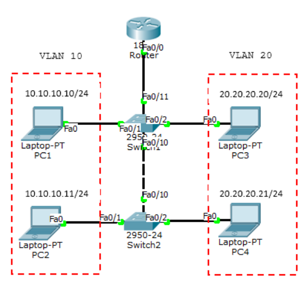

Create the topology as above and configure VLAN10 and VLAN20 as in the previous lab. Add 1 router. Because it only uses 1 interface, a sub-interface must be created to serve as the VLAN gateway. The SW1 port connected to the router must be set to trunk mode.

```
Router(config)#interface FastEthernet0/0.10
Router(config-subif)#encapsulation dot1Q 10
Router(config-subif)#ip address 10.10.10.1 255.255.255.0
Router(config-subif)#interface FastEthernet0/0.20
Router(config-subif)#encapsulation dot1Q 20
Router(config-subif)#ip address 20.20.20.1 255.255.255.0
```

Check the interface with the show ip int brief command.

```
Router#sh ip int br
Interface           IP-Address      OK? Method Status
Protocol

FastEthernet0/0     unassigned      YES unset  up                    up

FastEthernet0/0.10  10.10.10.1      YES manual up                    up

FastEthernet0/0.20  20.20.20.1      YES manual up                    up

FastEthernet0/0.30  30.30.30.30     YES manual up                    up

FastEthernet0/1     unassigned      YES unset  administratively down down

Vlan1               unassigned      YES unset  administratively down down
Router#
```

Now ping between different VLANs.

```
PC>ping 20.20.20.21

Pinging 20.20.20.21 with 32 bytes of data:

Request timed out.
Reply from 20.20.20.21: bytes=32 time=1ms TTL=127
Reply from 20.20.20.21: bytes=32 time=0ms TTL=127
Reply from 20.20.20.21: bytes=32 time=0ms TTL=127

Ping statistics for 20.20.20.21:
    Packets: Sent = 4, Received = 3, Lost = 1 (25% loss),
Approximate round trip times in milli-seconds:
    Minimum = 0ms, Maximum = 1ms, Average = 0ms

PC>tracert 20.20.20.21

Tracing route to 20.20.20.21 over a maximum of 30 hops:
 1      30 ms       0 ms        0 ms    10.10.10.1
 2      0 ms        0 ms        0 ms    20.20.20.1

Trace complete.
```

```
Router#sh ip arp
Protocol Address        Age (min) Hardware Addr     Type Interface
Internet 10.10.10.10            4 0000.0C1B.0D20    ARPA
FastEthernet0/0.10
Internet 20.20.20.21            3 0060.7092.05A9    ARPA
FastEthernet0/0.20
Internet 30.30.30.1             1 0001.C7AE.3D52    ARPA
FastEthernet0/0.30
Router#
```

## Inter-VLAN - Layer 3 Switch

To connect between VLANs requires a layer 3 device be it a router or a layer 3 switch. If before using a router on a stick, this time we will use an L3 (layer 3) switch. This is the cool thing about Cisco, while other switches work at layer 2, Cisco switches can work at layer 3 and execute routing. However, even for more extensive routing it is recommended to use a router according to its function.

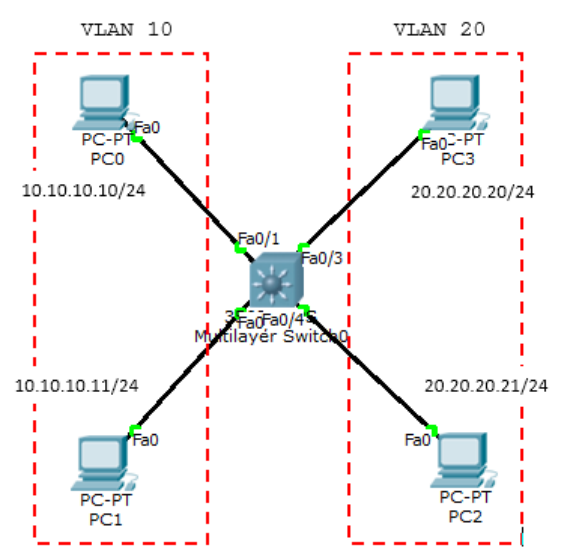

Configure the ports to their respective VLANs.

```
Switch(config)#interface FastEthernet0/1
Switch(config-if)#switchport access vlan 10
Switch(config-if)#switchport mode access
Switch(config-if)#
Switch(config-if)#interface FastEthernet0/2
Switch(config-if)#switchport access vlan 10
Switch(config-if)#switchport mode access
Switch(config-if)#
Switch(config-if)#interface FastEthernet0/3
Switch(config-if)#switchport access vlan 20
Switch(config-if)#switchport mode access
Switch(config-if)#interface FastEthernet0/4
Switch(config-if)#switchport access vlan 20
Switch(config-if)#switchport mode access
```

Create VLAN interfaces and provide ip addresses.

```
Switch(config)#int vlan 10
Switch(config-if)#ip add 10.10.10.1 255.255.255.0
Switch(config-if)#int vlan 20
Switch(config-if)#ip add 20.20.20.1 255.255.255.0
```

Type the ip routing command to route VLANs.

```
Switch(config)#ip routing
```

Now test ping.

```
PC>ping 20.20.20.21

Pinging 20.20.20.21 with 32 bytes of data:

Request timed out.
Reply from 20.20.20.21: bytes=32 time=0ms TTL=127
Reply from 20.20.20.21: bytes=32 time=0ms TTL=127
Reply from 20.20.20.21: bytes=32 time=0ms TTL=127

Ping statistics for 20.20.20.21:
    Packets: Sent = 4, Received = 3, Lost = 1 (25% loss),
Approximate round trip times in milli-seconds:
    Minimum = 0ms, Maximum = 0ms, Average = 0ms

PC>
```

## DHCP using a Switch

The function of DHCP is to provide an IP address automatically to the host.

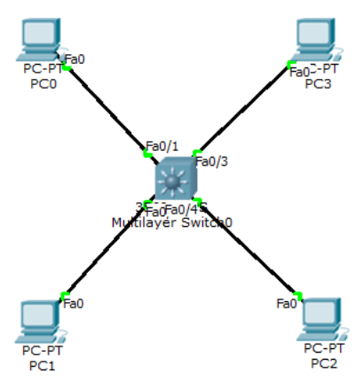

DHCP Configuration.

```
Switch(config)#ip dhcp pool vlan10
Switch(dhcp-config)#network 10.10.10.0 255.255.255.0
Switch(dhcp-config)#default-router 10.10.10.1
Switch(dhcp-config)#dns-server 8.8.8.8
Switch(dhcp-config)#ip dhcp pool vlan20
Switch(dhcp-config)#network 20.20.20.0 255.255.255.0
Switch(dhcp-config)#default-router 20.20.20.1
Switch(dhcp-config)#dns-server 8.8.8.8
```

if there is an ip that you do not want to use in DHCP, enter the ip dhcp excluded-address command.

```
ip dhcp excluded-address 10.10.10.2 10.10.10.10
```

The show ip dhcp binding command displays the client that gets a dhcp ip.

```
Switch#sh ip dhcp binding
IP address      Client-ID/          Lease expiration        Type
Hardware address
10.10.10.12     0003.E4A2.9D08      --                      Automatic
10.10.10.11     0001.64C9.674C      --                      Automatic
20.20.20.11     0001.4266.50B0      --                      Automatic
20.20.20.12     0002.1638.8C69      --                      Automatic
Switch#
```

DHCP can also be set manually for clients with specific MAC Addresses.

```
ip dhcp pool PC_MANAGER
host 20.20.20.100
default router 20.20.20.1
client-id 0102.c7f8.0004.22
client-name Komputer_IDN
```

## Port Security

Port Security is used so that the Cisco device interface port cannot be used except for PCs with specific MAC Addresses.

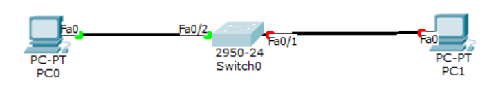

```
int fa0/1
switchport mode access
switchport port-security
switchport port-security mac-address sticky
switchport port-security violation shutdown

int fa0/2
switchport mode access
switchport port-security
switchport port-security mac-address sticky
switchport port-security violation restrict
```

There are 3 violations:

- protect = data sent through the port is left unsent
- restrict = like protect but sends a notification with snmp
- shutdown = the port will be shut down automatically, to restore it then it must be no shut with the console switch or telnet.

Sticky means that the MAC address that first passes the switch is the one used. If it is not that MAC address that is connected to the port that is set for port-security, then it will be processed depending on the violation set.

```
show port-security
Switch#show port-security
Secure Port MaxSecureAddr CurrentAddr SecurityViolation Security Action
                (Count)     (Count)         (Count)
--------------------------------------------------------------------
        Fa0/1         1           1               1         Shutdown
        Fa0/2         1           1               1         Restrict
----------------------------------------------------------------------
Switch#
```

## Spanning Tree Protocol (STP)

Spanning Tree Protocol (STP) is a protocol that functions to prevent loops in switches when switches use more than 1 link with the intention of redundancy. STP by default is set active on Cisco Catalyst. STP is an open standard (IEEE 802.1D). STP can prevent:

- Broadcast Storms
- Multiple Frame Copies
- Database Instability

There are several types of STP:

- Open Standard: STP (802.1D), Rapid STP (802.1W), Multiple Spanning Tree MST (802.1S)
- Cisco Proprietary: PVST (Per Vlan Spanning Tree), PVST+, Rapid PVST.

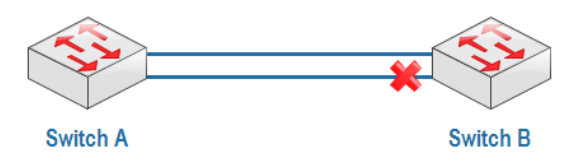

When Switch0 sends a packet of data with a destination that is not in its MAC address table, Switch0 will broadcast to all ports up to Switch1. If in the Switch1 MAC address table there is also no earlier destination then Switch1 will again broadcast to Switch0 and it will be like that so that the network goes down.

There are several ways to overcome this:

- Only use 1 link (no redundancy)
- Shutdown one interface, do a manual shutdown on one interface or automatically using STP.

STP will create blocking or shutdown on one of the ports to prevent loops. When the main link goes down, the port that was previously blocking will become forwarding. Port blocking is indicated in red.

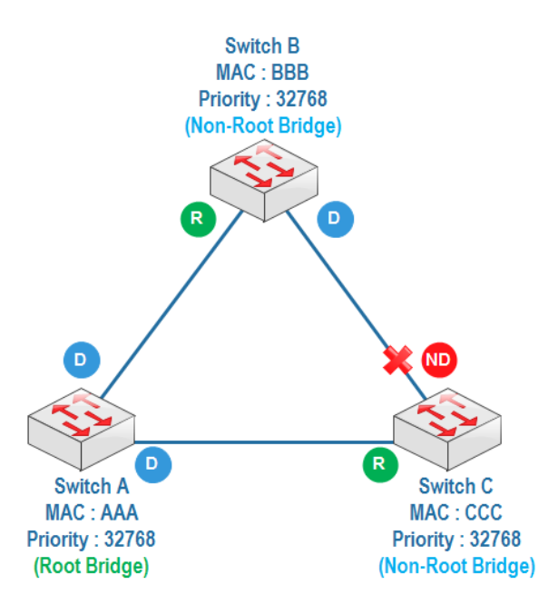

How STP works:

1. When STP is active, each switch will send a special frame to each other called a **Bridge Protocol Data Unit (BPDU)**.

2. Determine Root Bridge<br>
   The switch with the lowest bridge id will be the root bridge. Bridge id = priority + MAC address. In one LAN there is only one switch as the root bridge, other switches become non-root bridges. The default priority is 32768 and can be changed.

3. Determine Root Port<br>
   The root port is the closest path to the root bridge. For each non-root bridge there is only 1 root port.

4. Determine designated port and non-designated port<br>
   A designated port is a forwarding port and a non-designated port is a blocking port. For a root bridge all its ports are designated ports.<br>
   The switch with the lowest priority, one of its ports will be a nondesignated port or blocking port. If the priorities are the same, the lowest MAC address will be looked at.

STP will make a blocking or shutdown on one of the ports to prevent a loop from occurring. When the main link is down then the previously blocking port will become forward. The blocking port is indicated by a red color.

STP uses link cost calculations to determine the root port on a non-root switch.

- 10 Gbps = Cost 2
- 1 Gbps = Cost 4
- 100 Mbps = Cost 19
- 10 Mbps = Cost 100

### Spanning Tree Protocol (STP)

Create a topology as below.

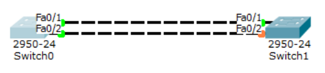

```
Switch0#show spanning-tree
VLAN0001
    Spanning tree enabled protocol ieee
    Root ID     Priority    32769
                Address     000B.BE80.D273
                Cost        19
                Port        1(FastEthernet0/1)
                Hello Time  2 sec Max Age 20 sec Forward Delay 15 sec

    Bridge ID   Priority    32769 (priority 32768 sys-id-ext 1)
                Address     00D0.FFDA.ECBC
                Hello Time  2 sec Max Age 20 sec Forward Delay 15 sec
                Aging Time  20

Interface        Role Sts Cost      Prio.Nbr Type
---------------- ---- --- --------- -------- -------------------------------
-
Fa0/2            Altn BLK 19        128.2    P2p
Fa0/1            Root FWD 19        128.1    P2p

Switch0#
```

```
Switch1#sh spanning-tree
VLAN0001
    Spanning tree enabled protocol ieee
    Root ID     Priority    32769
                Address     000B.BE80.D273
                This bridge is the root
                Hello Time  2 sec Max Age 20 sec Forward Delay 15 sec

    Bridge ID   Priority    32769 (priority 32768 sys-id-ext 1)
                Address     000B.BE80.D273
                Hello Time  2 sec Max Age 20 sec Forward Delay 15 sec
                Aging Time  20

Interface        Role Sts Cost      Prio.Nbr Type
---------------- ---- --- --------- -------- -------------------------------
-
Fa0/1            Desg FWD 19        128.1    P2p
Fa0/2            Desg FWD 19        128.2    P2p

Switch1#
```

Automatically, Switch0 becomes the root bridge seen from all its forwarding ports (colored green), so that Switch1 becomes the root bridge, change the priority on Switch1.

```
Switch1(config)#spanning-tree vlan 1 priority 0
```

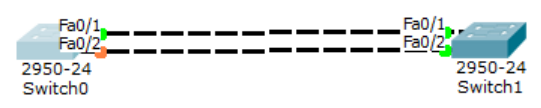

Now Switch1 is the root bridge. To move the blocking port from fa0/2 to fa0/1 on Switch1, run the following command.

```
Switch1(config)#int f0/1
Switch1(config-if)#speed 10
```

Check the results. Port blocking moves to fa0/1.


```
Switch1(config-if)#do show spanning-tree
VLAN0001
    Spanning tree enabled protocol ieee
    Root ID     Priority    1
                Address     00D0.FFDA.ECBC
                Cost        19
                Port        2(FastEthernet0/2)
                Hello Time  2 sec Max Age 20 sec Forward Delay 15 sec

    Bridge ID   Priority    32769 (priority 32768 sys-id-ext 1)
                Address     000B.BE80.D273
                Hello Time  2 sec Max Age 20 sec Forward Delay 15 sec
                Aging Time  20

Interface        Role Sts Cost      Prio.Nbr Type
---------------- ---- --- --------- -------- -------------------------------
-
Fa0/1            Altn BLK 100       128.1    P2p
Fa0/2            Root FWD 19        128.2    P2p
```

## STP Portfast

Portfast is one of the features of STP. When plugging a cable into a switch for the first time, it takes a while for the blocking process, which is indicated by an orange indicator light, to become forwarding, which is indicated by a yellow color.

STP Port States:

Blocking 20 seconds/no limits<br>
Listening 15 seconds<br>
Learning 15 seconds<br>
Forwarding no limits<br>
Disable no limits

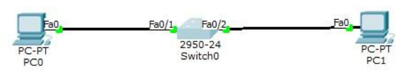

This is caused by the switch performing listening and learning steps first before forwarding. From the blocking, listening and learning processes, it takes approximately 30 seconds. To directly go to forward without going through listening and learning then portfast is used. Portfast is suitable to be used for ports leading to end hosts. For ports pointing to switches, it is not recommended because it will turn off the STP function in preventing looping.

For example, ports 1 to 4 that want to be configured stp portfast then type the following command.

```
int range fa0/1 - 4
spanning-tree portfast
```

Then when plugging the cable into the switch it will immediately turn yellow.

## Etherchannel

Because of the STP feature, there will be blocking ports to prevent loops. Etherchannel is used to bundle several links as if they were one link logically, so that STP must be turned off and there are no blocking ports.

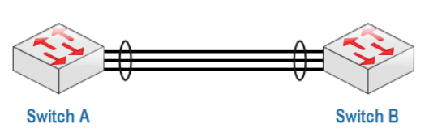

With etherchannel, data transfer is faster and does not depend only on 1 link. Etherchannel can be configured with several mechanisms:

- Static Persistence, without using a negotiation protocol.
- By using a negotiation protocol:
  - LACP (Link Aggregation Control Protocol) - open standard IEEE 802.1AD.
  - PAgP (Port Aggregation Protocol) - Cisco proprietary.

Create a topology as below.

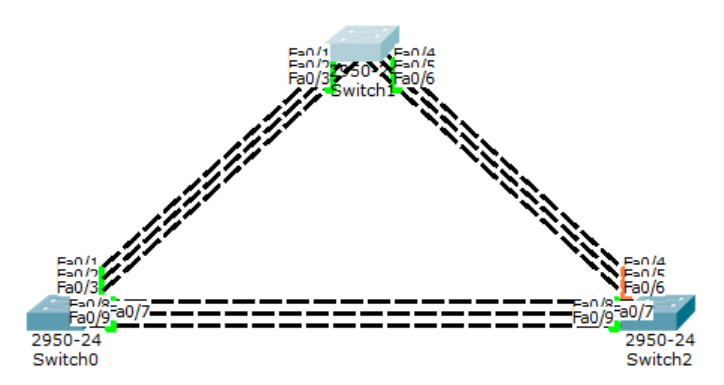

LaCP configuration on the left and middle switches.

```
Switch(config)#int range fa0/1-3
Switch(config-if-range)#channel-group 1 mode ?
    active      Enable LACP unconditionally
    auto        Enable PAgP only if a PAgP device is detected
    desirable   Enable PAgP unconditionally
    on          Enable Etherchannel only
    passive     Enable LACP only if a LACP device is detected
Switch(config-if-range)#channel-group 1 mode active
Switch(config-if-range)#int port-channel 1
Switch(config-if)#switchport mode trunk
```

The mode used in LaCP can be active-active or active-passive but cannot be passive-passive.

```
Switch#sh etherchannel summary
Flags:  D - down            P - in port-channel
        I - stand-alone     s - suspended
        H - Hot-standby (LACP only)
        R - Layer3          S - Layer2
        U - in use          f - failed to allocate aggregator
        u - unsuitable for bundling
        w - waiting to be aggregated
        d - default port

Number of channel-groups in use:    1
Number of aggregators:              1

Group  Port-channel  Protocol    Ports
------+-------------+-----------+-------------------------------------------
---
1      Po1(SU)       LACP        Fa0/1(P) Fa0/2(P) Fa0/3(P)
Switch#
```

PAgP configuration on the middle and right switches.

```
Switch(config)#int range fa0/4-6
Switch(config-if-range)#channel-group 2 mode desirable
Switch(config-if-range)#int port-channel 2
Switch(config-if)#switchport mode trunk
```

In PAgP you can use desirable-desirable or desirable-auto modes. Now check the middle switch.

```
Switch#sh etherchannel summary
Flags:  D - down        P - in port-channel
        I - stand-alone s - suspended
        H - Hot-standby (LACP only)
        R - Layer3      S - Layer2
        U - in use      f - failed to allocate aggregator
        u - unsuitable for bundling
        w - waiting to be aggregated
        d - default port

Number of channel-groups in use:    2
Number of aggregators:              2

Group  Port-channel  Protocol    Ports
------+-------------+-----------+-------------------------------------------
---
1      Po1(SU)       LACP        Fa0/1(P) Fa0/2(P) Fa0/3(P)
2      Po2(SU)       PAgP        Fa0/4(P) Fa0/5(P) Fa0/6(P)
Switch#
```

Manual etherchannel configuration, without LACP or PAgP on the left and right switches.

```
Switch(config)#int range fa0/7-9
Switch(config-if-range)#channel-group 3 mode on
Switch(config-if-range)#int port-channel 3
Switch(config-if)#switchport mode trunk
```

```
Switch#sh etherchannel summary
Flags:  D - down        P - in port-channel
        I - stand-alone s - suspended
        H - Hot-standby (LACP only)
        R - Layer3      S - Layer2
        U - in use      f - failed to allocate aggregator
        u - unsuitable for bundling
        w - waiting to be aggregated
        d - default port

Number of channel-groups in use:    2
Number of aggregators:              2

Group  Port-channel  Protocol    Ports
------+-------------+-----------+-------------------------------------------
---
1      Po1(SU)       LACP        Fa0/1(P) Fa0/2(P) Fa0/3(P)
3      Po3(SU)       -           Fa0/7(P) Fa0/8(P) Fa0/9(P)
Switch#
```

## Vlan Trunking Protocol (VTP)

VLAN Trunking Protocol (VTP) is a protocol that manages VLANs on multiple switches at once within the same VTP domain. VTP can add, delete and rename VLANs at once on multiple switches. VTP lightens the work of administrators so they do not need to configure VLANs on switches one by one.

VTP is a proprietary Cisco protocol. VLAN configurations are stored in the vlan.dat database file in flash memory.

There are 3 VTP modes:

- Server (default)
- Client
- Transparent

|                               | VTP Server | VTP Client | VTP Transparent |
| :---------------------------- | :--------: | :--------: | :-------------- |
| **Create/Modify/Delete VLAN** |    Yes     |     No     | Only local      |
| **Synchronizes itself**       |    Yes     |    Yes     | No              |
| **Forwards advertisements**   |    Yes     |    Yes     | Yes             |

In VTP there is something called a revision number. The revision number is the number of VTP updates that a switch has received.

The important thing regarding the revision number is that when a switch is in server or client mode with the same VTP domain and has a higher revision number, when placed in a network, it automatically sends a VLAN database update and replaces the previous switch database thereby bringing the network down. The server mode switch will still have its database replaced because the server mode is basically a client mode as well.

The solution is to reset it first.

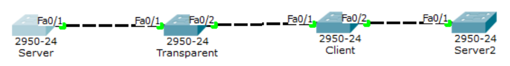

Configure the command below on all switches.

```
Switch(config)#interface range fa0/1-2
Switch(config-if-range)#switchport mode trunk
```

Server

```
Switch(config)#int vlan 1
Switch(config-if)#ip add 10.10.10.1 255.255.255.0
Switch(config-if)#no shut
Switch(config-if)#vtp mode server
Switch(config)#vtp domain belajar
Switch(config)#vtp password rahasia
```

Transparent

```
Switch(config)#int vlan 1
Switch(config-if)#ip add 10.10.10.2 255.255.255.0
Switch(config-if)#no shut
Switch(config-if)#vtp mode transparent
Switch(config)#vtp domain belajar
Switch(config)#vtp password rahasia
```

Client

```
Switch(config)#int vlan 1
Switch(config-if)#ip add 10.10.10.3 255.255.255.0
Switch(config-if)#no shut
Switch(config-if)#vtp mode client
Switch(config)#vtp domain belajar
Switch(config)#vtp password rahasia
```

Server2

```
Switch(config)#int vlan 1
Switch(config-if)#ip add 10.10.10.4 255.255.255.0
Switch(config-if)#no shut
Switch(config-if)#vtp mode server
Switch(config)#vtp domain belajar
Switch(config)#vtp password rahasia
```

Create VLANs on each switch.

- Server: VLAN10, VLAN20
- Transparent: VLAN30, VLAN40
- Client: VLAN50, VLAN60
- Server2: VLAN70, VLAN80

The result is the Server has 4 VLANs.

```
Switch#show vlan
VLAN    Name                Status      Ports
10      VLAN0010            active
20      VLAN0020            active
70      VLAN0070            active
80      VLAN0080            active
```

Transparent has 2 VLANs.

```
Switch#sh vlan
VLAN    Name                Status      Ports
30      VLAN0030            active
40      VLAN0040            active
```

Client has 4 VLANs

```
Switch#SH VLAN
VLAN    Name                Status      Ports
10      VLAN0010            active
20      VLAN0020            active
70      VLAN0070            active
80      VLAN0080            active
```

Server2 has 4 VLANs.

```
Switch#SH VLAN
VLAN    Name                Status      Ports
10      VLAN0010            active
20      VLAN0020            active
70      VLAN0070            active
80      VLAN0080            active
```
