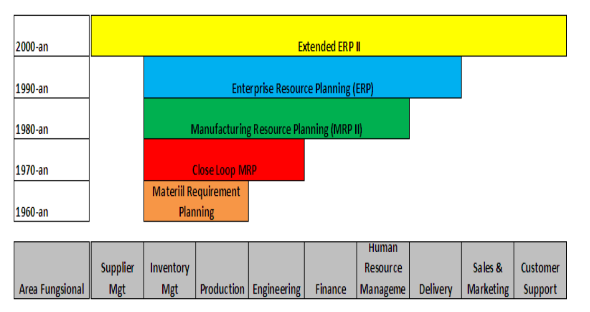
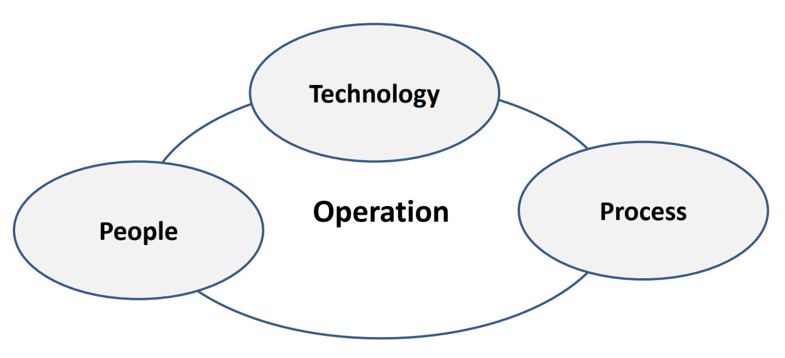

## History of ERP Systems

| Year         | Event                                                                                                                                                                                                                                       |
| ------------ | ------------------------------------------------------------------------------------------------------------------------------------------------------------------------------------------------------------------------------------------- |
| 1960s        | Manufacturing systems focused on Inventory Control.                                                                                                                                                                                         |
| 1970s        | Focus shifted to MRP (Material Requirement Planning) which translates a product's Master schedule into time-phased net requirements, for the planning and procurement of sub-assemblies, components, and raw materials.                     |
| 1980s        | MRP-II (Manufacturing Resource Planning) expanded to include shop floor operations and distribution management activities.                                                                                                                  |
| 1990s        | MRP-II was further developed to include engineering, finance, human resources, and project management activities covering almost all business enterprise system activities, which later became known as Enterprise Resource Planning (ERP). |
| 2000-present | Extended ERP became ERP II.                                                                                                                                                                                                                 |

## Evolution Stages of ERP Systems

## Material Requirement Planning

MRP is used to simulate manufacturing industry equations, using a master schedule to answer what products will be produced, a bill of materials to answer what materials are needed to make the product, and an inventory balance list to answer what materials are already owned and what materials must be purchased.

### Closed Loop MRP

A tool in the form of a system to support planning up to sales and production (Sales and Distributor Planning), product manufacturing schedules (Master Scheduling), sales planning forecasting, and consumer order planning (Demand Management), as well as resource analysis.

### Scope of Closed Loop MRP


graph TD

    A[Demand Management]
    B[Production Planning]
    C[Master Scheduling]
    D[Material Requirements]
    E[Plant & Supplier Scheduling]
    F[Execution]
    G[Capacity Planning]

    %% Main flow
    A <--> B
    A <--> C
    A <--> E

    B <--> G
    C <--> G
    D <--> G
    E <--> G

    C <--> D
    D <--> E
    C <--> E

    E <--> F



## Manufacturing Resource Planning (MRP II)

Similar to the previous stage, there are only additional elements as follows:

1. Sales and operations planning, a process used to balance demand and supply, allowing management to control operational and business aspects.
2. Financial interface, the ability to translate operational plans (units like pieces, kg, gallons, and other units) into cost units (in a specific currency).
3. Simulation capability to conduct "what if" analysis to find possible answers to be applied, both in units and in monetary amounts.

## Enterprise Resource Planning (ERP)

The foundation of ERP is derived from MRP II, but its business processes are expanded and more suitably applied to the conditions of companies that have several business units. With an ERP system, financial integration is more emphasized, supply chain tools, support for business across organizational functional boundaries, and even across companies can be done easily. The main goal of implementing ERP is to enable companies to run businesses in rapidly changing and highly competitive conditions, and much better than before.

## Extended ERP II

An extension of the existing functions in the ERP system, which includes functions that can bridge communication with suppliers and consumers. This system not only focuses on consumers, production processes, real-time transactions, and company asset management, but also focuses on optimizing the entire business network, including integration with suppliers.

## Comparison of ERP and ERP II

| Aspect       | ERP                                                      | ERP II                                                                                                                               |
| ------------ | -------------------------------------------------------- | ------------------------------------------------------------------------------------------------------------------------------------ |
| Role         | Enterprise Optimization                                  | Element participation in the company's business process chain, full e-commerce support                                               |
| Domain       | Manufacturing and Distribution                           | All segments and sectors within the company                                                                                          |
| Function     | Production, Sales, Distribution, and Financial Processes | Cross-Industry, specific sectors, specific industrial processes                                                                      |
| Process      | Handles internal processes, closed to external processes | Connected with business partners                                                                                                     |
| Architecture | Web support, closed, monolithic architecture             | Web-based, open, flexible for integration with other component-based systems                                                         |
| Data         | Generated and consumed internally by the company         | Generated and consumed by internal and external parties of the company, and the results are published to all interested stakeholders |

## ERP System Infrastructure

## Characteristics of ERP Systems

According to Daniel O'Leary, they are as follows:

1. Software packages designed for a client-server environment, whether traditional or network-based.
2. Integrates most of the business processes.
3. Processes a vast majority of company transactions.
4. Uses a corporate database that typically stores each piece of data only once.
5. Allows real-time data access.
6. Allows integration of transaction processes and planning activities.
7. Supports multi-currency and language systems, which are essential for multinational companies.
8. Allows customization for specific company needs without requiring reprogramming.

According to Daniel O’Leary:

- Software packages designed for a client-server environment, whether traditional or network-based
- Integrates most of the business processes
- Processes a vast majority of company transactions
- Uses a corporate database that typically stores each piece of data only once
- Allows real-time data access
- Allows integration of transaction processes and planning activities
- Supports multi-currency and language systems, which are essential for multinational companies
- Allows customization for specific company needs without requiring reprogramming

## Benefits of ERP Systems

According to James A. O'Brien, they are as follows:

1. Quality and Efficiency.
2. Cost Reduction.
3. Decision Support.
4. Enterprise Agility.
5. Integrated Systems.
6. ERP systems not only integrate data and people.
7. ERP systems allow management to manage operations.
8. ERP systems facilitate information extraction.
9. ERP systems generate information.
10. ERP systems create organizational structures.
11. ERP systems guarantee all activities.
12. ERP systems control all business processes.

## ERP Concept

Enterprise Resource Planning (ERP) is an abbreviation of three elements: Enterprise (Company/Organization), Resource, and Planning. So, Enterprise Resource Planning (ERP) is a concept for planning and managing corporate resources, in the form of an integrated and multi-module software application package designed to serve and support various functions within the company (to serve and support multi-business functions), making work more efficient and providing better service to consumers, which ultimately can generate added value and provide maximum benefits for all stakeholders of the company.

1. ERP consists of commercial software packages that ensure seamless integration of all information flows within the company, which includes finance, accounting, human resources, supply chain, and consumer information.
2. An ERP system is a configurable information system package that integrates information and information-based processes within and across functional areas in an organization.
3. ERP is a single database, a single application, and a unified interface across the entire enterprise.


flowchart TB

    ES([ENTERPRISE SYSTEM])

    FA[Financial & Accounting]
    CRM[Customer Relationship Management]
    HR[Human Resource]
    INV[Inventory]
    SD[Sales & Distributor]
    BI[Business Intelligence]
    MFG[Manufacturing]
    PROC[Procurement]
    PM[Plant Maintenance]

    %% Relation from center
    ES --> FA
    ES --> CRM
    ES --> HR
    ES --> INV
    ES --> SD
    ES --> BI
    ES --> MFG
    ES --> PROC
    ES --> PM



### Scope of Financial and Accounting

- Cost Center and Profit Center
- Account Payable
- Account Receivable
- Cash/Bank Management (Cash Flow Management)
- Treasury Management
- General Ledger (Income Statement & Balance Sheet)
- Sales Quotation
- Sales Order
- Shipping
- Goods Issue
- Invoicing
- Credit Control
- Commission, Discount, Credit Notes

### Scope of Manufacturing

- Order Production
- Bill of Material
- Production Planning Control – Order Production
- Master Planning
- Scheduling
- MRP (Material Requirement Planning)
- Product Costing

### Scope of Inventory

- Inventory Movement (transfer)
- Inventory Management
- Multiple Warehouse Locations
- Product Category
- Product Items
- Physical and Valuation Inventory

### Procurement

- Purchase Requisition and Approval
- Purchase Order and Approval
- Goods Receipt
- Invoice Verification
- Purchase Return

### Scope of Human Resource

- Employee Scheduling
- Training
- Employment Development
- Payroll, Benefit, Bonus, Overtime
- Job Description
- HR Self Service
- Organizational Structure and Workflow analysis

### Scope of Plant

- Reduce operational budget on production
- Increase Efficiency (work clearance management, maintenance execution, service part, document management, maintenance budgeting, and integration with accounting assets)

### Scope of Customer Relationship Management

- Customer Campaign
- Customer Interaction Center
- Customer Self Service Online Inquiry
- Lead and Activity Tracking (Information, Service, Charge, Account, Warranty, help)
- Knowledge base, Sales Report, Sales Support, Sales Qualification
- Consistent user experience
- Personalization of Service
- Real-time access enterprise info

### Scope of Business Intelligence

- Information systems for management decision-making, such as a Decision Support System (DSS), featuring an Innovative and Intuitive Interface for analyzing transaction data to acquire business performance insights.
- It is an interactive process for the exploration and analysis of structured information and in a specific domain (data warehouse) to discover certain business patterns, thereby assisting in decision-making.
