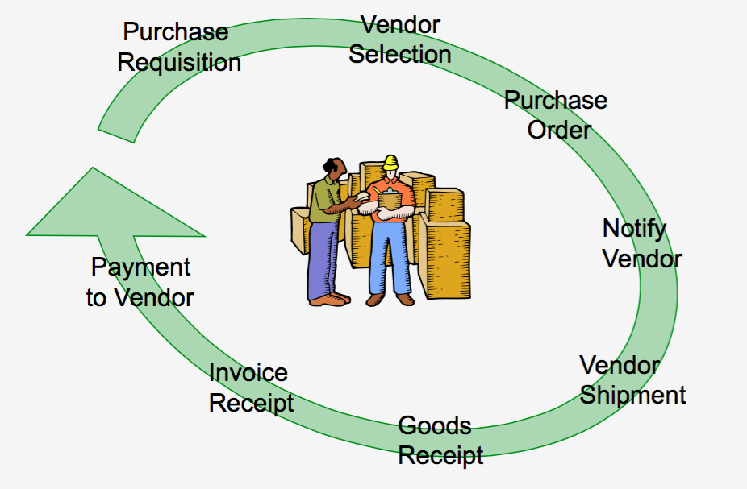
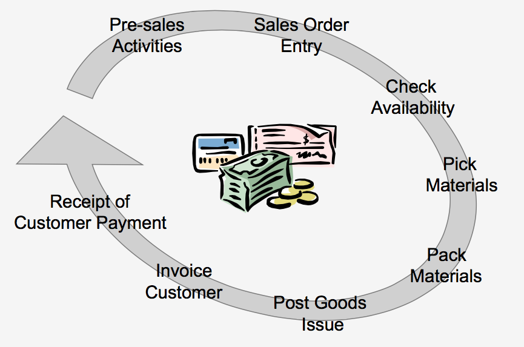

## Procurement

The procurement system cycle begins with the creation of a **purchase requisition** from a department. Once the request form is approved by the relevant department head and submitted to the purchasing department, the purchasing officer will select suppliers, negotiate prices, and then issue a **purchase order** (PO) as evidence that the company has approved the purchase process with the supplier. This is followed by the **goods receipt** process by the warehouse based on that purchase order. Based on the agreement, the supplier then performs billing accompanied by an invoice and tax invoice for the payment process. The **invoice verification** process is then handled by the finance department. Finally, the payment process to the supplier is carried out as proof of settlement for the purchased goods.

### Procurement System Cycle

### Procurement Reports

- Purchase requisition status report
- Purchase order status report
- Purchase report
- Purchase return report
- Purchase control report

## Sales and Distribution

The sales management cycle begins with **pre-sales** activities (sales contract), which involve price negotiations with customers followed by the creation of a **quotation**. This is continued by processing the **sales order**. Currently, the implementation of this ERP system can be done using web-based platforms. After that, sales administration checks the stock availability in the warehouse to provide the goods needed to fulfill the sales order. This is known as **Inventory Sourcing**.

Once the goods are available, the **shipping** process is carried out, which involves sending the goods to the customer's location with the creation of a packing list (Surat Jalan/SJ) and a **Delivery Order** (DO). This is followed by **billing** activities, which is the process of creating commercial invoices, tax invoices, and receipts submitted to the customer for collection. Based on that bill, the customer makes a payment; from the company's perspective, the process of receiving the customer's receivable value (**receipt account receivable**) will be performed.

### Sales and Distribution Cycle

### Benefits of Sales and Distribution

- Enhances customer satisfaction by accelerating the process from order receipt to timely delivery.
- Provides sales information and sales analysis required by the customer.
- Creates sales planning for calculating material requirements, purchase planning, and future product production.

### Characteristics of the Sales and Distribution Module

- Facilities for managing and inputting sales contracts and sales orders.
- Overdue credit limit facilities to restrict sales orders against accounts receivable balances that are past due but have not been paid by the customer.
- Facilities for inputting sales transactions in multi-currency.
- Delivery schedule facilities to create delivery orders based on sales orders that must be sent immediately by considering the stock balance in the warehouse.
- Delivery order facilities for timely shipping transactions.
- Automatic sales invoice facilities (commercial invoice, tax invoice, receipt) for the customer billing process.
- Sales return facilities for goods return transactions from customers for specific reasons.

In sales and distribution activities, information systems are required to be increasingly flexible, sophisticated, and user-friendly to handle various changes and specific conditions accurately and quickly, such as: price change processes, stock allocation, flexible use of barcode systems, supporting promotional activities, delivery timing accuracy, and credit limit checks.

### Sales and Distribution Reports

- Sales Contract and Outstanding Sales Contract Report
- Sales Order and Outstanding Sales Order Report
- Sales Report
- Sales Analysis Report
- Sales Return Report
- Delivery Update Report
- Salesperson Commission Report
- Customer Credit Report
- Gross Profit Report

## Finance and Accounting

In an ERP system, the preparation of financial reports is carried out through the **General Ledger** application. All transaction data is obtained from other transaction processing systems, such as:

- **Sales transaction processing system**: sales order processing, billing, sales analysis.
- **Purchases transaction processing system**: purchases, inventory processing.
- **Cash receipt and Disbursement transaction processing system**: accounts receivable, cash receipts, accounts payable, cash disbursements.
- **Payroll transaction processing system**: payroll, timekeeping.


flowchart LR

    %% ======================
    %% SALES SYSTEM (LEFT)
    %% ======================
    subgraph S1[Sales Transaction Processing System]
        SOP[Sales Order Processing]
        BILL[Billing]
        SA[Sales Analysis]

        SOP --> BILL
        SOP --> SA
    end

    %% ======================
    %% CASH SYSTEM (CENTER TOP)
    %% ======================
    subgraph S2[Cash Receipts and Disbursements Transaction Processing System]
        AR[Accounts Receivable]
        CR[Cash Receipts]
        AP[Accounts Payable]
        CD[Cash Disbursements]

        CR --> AR
        CD --> AP
    end

    %% ======================
    %% GENERAL LEDGER (RIGHT TOP)
    %% ======================
    subgraph S3[General Ledger Processing and Reporting System]
        GL[General Ledger]
        FR[Financial Reporting]

        GL --> FR
    end

    %% ======================
    %% PURCHASES SYSTEM (CENTER BOTTOM)
    %% ======================
    subgraph S4[Purchases Transaction Processing System]
        PUR[Purchases]
        INV[Inventory Processing]

        PUR --> INV
    end

    %% ======================
    %% PAYROLL SYSTEM (RIGHT BOTTOM)
    %% ======================
    subgraph S5[Payroll Transaction Processing System]
        TK[Timekeeping]
        PAY[Payroll]

        TK --> PAY
    end

    %% ======================
    %% CONNECTIONS
    %% ======================

    BILL --> AR
    CR --> GL
    CD --> GL
    PUR --> AP
    INV --> GL
    PAY --> GL
    BILL --> GL
    SOP --> INV



## General Ledger

The General Ledger is the heart of the accounting information system because it generates **financial reporting** to determine a company's financial condition, such as balance sheets, profit and loss statements, financial ratio analysis reports, and other financial reports. The benefits of the General Ledger include:

- Multi-currency facilities for account codes that have foreign currency equivalence.
- Recurring journal facilities to simplify and speed up transaction entry for repetitive transactions.
- Budget facilities that can be quickly and easily compared with actuals.
- Automatic financial statement presentation (automatic reporting).
- Multi-level and informative reporting systems.
- Ability to store data for unlimited periods, restricted only by the hard disk capacity used.
- Designed with a built-in early warning system during transaction input and storage.
- Posting and unposting facilities per period, making it easier to correct data errors from previous periods.

Generated reports include:

- Balance Sheet and Profit and Loss Report
- Detail and Highlight Financial Reports
- Expense details per cost center report
- Account balance detail report
- General Ledger card report
- Trial Balance report
- Transaction journal list report

## Inventory

Through the inventory module, a company's stock can be controlled to minimize inventory levels. This impacts working capital by reducing the amount of tied-up stock without disrupting production flow. It also reduces losses from obsolete, damaged, or expired inventory.

### Reasons for Inventory

- Meeting customer needs at specific times.
- Taking advantage of price discounts from suppliers.
- Avoiding fluctuations from rising prices.
- Providing buffer stock for uncertain demand conditions.
- Maintaining the continuity of the production process.

### Inventory Classification

- Raw material
- Work in process
- Finished goods

### Raw Material

The basic material used in an industry to produce goods ready for sale to customers. This depends on the type of company; raw materials in one company might be the finished goods of another.

### Work in Process (WIP)

Inventory that has been processed but is not yet a finished good (semi-finished). In manufacturing industries, WIP requires machine processing costs, auxiliary materials, and labor.

### Finished Goods

Goods ready to be shipped or sold to customers. In manufacturing, finished goods are the products from the final process stored in the warehouse ready for sale.

### Just In Time (JIT)

Inventory is identical to tying up a sum of money or investment that can disrupt a company's cash flow, especially if the inventory is non-moving. Just in Time is a method used to handle inventory systems, with benefits such as:

1. Reduced inventory, thus reducing investment in inventory, which ultimately affects the company's financial performance.
2. Less obsolete inventory.
3. Improved inventory quality.
4. Reduced inspection and rework processes.
5. Quick detection if defects occur due to the production process.
6. Decreased inventory handling costs, such as handling and carrying costs.
7. Reduced space or warehouse requirements, minimizing warehouse investment.
8. Shorter lead times.
9. Increased productivity.
10. Greater flexibility.
11. Better relationships with suppliers.
12. Simpler scheduling and control activities.
13. Increased capacity.
14. More efficient use of human resources.
15. Greater product variety.
16. Increased customer satisfaction.
17. Faster response to customer orders.

## Characteristics of the Inventory Module

1. **Inventory Adjustment facilities**, to correct inventory due to damage, stock discrepancies, shrinkage, evaporation, etc.
2. **Inventory Transfer facilities**, to record stock movement/mutation between warehouses, changes in product types, and inventory analysis reports for easier control.
3. **Stock validation facilities**, for managing negative stock, where inventory transactions are validated so they do not exceed available stock.
4. **Inventory turnover calculation facilities** per inventory item.
5. **Average usage calculation facilities** per inventory item used in company operations.
6. **Minimum inventory quantity facilities** for inventory items calculated based on Average Usage, Lead Time, and days to be fulfilled.
7. **Grouping level facilities** for inventory movement (slow-moving, middle-moving, fast-moving).
8. **Multi-warehouse facilities**, to record inventory across many different warehouse locations.
9. **Posting and unposting facilities per period**, allowing for correction of previous data errors through inventory unposting with specific authorization.

Implementation of the Just In Time method works best when supported by an ERP system integrated with the Master Production Schedule (MPS) and Material Requirement Planning (MRP) in planning production needs for creating material purchase requisitions followed by PO creation. This process is inherently linked to the Bill of Materials (BOM).

## Generated Reports

- Inventory history data report
- Inventory purchase price and selling price information
- Inventory receipt report
- Inventory issuance report
- Inventory cards
- Stock and inventory mutation report
- Inventory status report
- Product type change, inventory correction, and inventory issuance return reports
