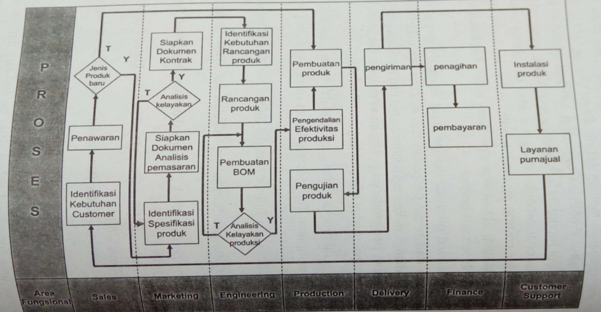

## Production and Operations

The core aspects of production and operations are production planning, accurate forecasting of material requirements from received sales orders, and the comparison of standard costing with actual costs (accounting).

For the production planning approach to be accurate, it must be based on sales forecasting for a specific period and inventory positions. Then, demand management can be carried out, which consists of: calculating material requirements (material requirement planning) which is forwarded to the purchasing process, and detailing the schedule of the production process.

## Production Planning Approach in ERP Systems


graph TD
A([Sales Planning]) --> C[Sales and Operations Planning]
B([Inventory Balance]) --> C
C --> D[Demand Management]
D --> E[Detail Schedule]
D --> F[MRP]
E --> G([Production])
F --> H([Purchasing])


## Uses of the Production Module

Arranging production schedules quickly in accordance with the delivery schedule from sales orders and sales plans by considering material availability and production capacity.

Improving the control of material usage per work order to achieve the efficiency level of production activities.

## Characteristics of the Production Module

- Facility for inputting Direct Labor and FOH Standard Rates per Machine
- Facility for calculating Bill of Materials (BOM) per Production Work Order
- Facility for Pre-Calculation Standard calculation per Production Work Order
- Facility for inputting Production Work Orders and Goods Requests per Production Work Order
- Facility for inputting Receipts of Finished Goods and Details of Material Usage per Work Order
- Facility for inputting Returns of Finished Goods Receipts for production reprocessing
- Facility for inputting Work In Process (WIP) Corrections

### General Business Process Cycle of Product and Service Companies

### Generated Reports

- Pre-Calculation Standard Cost Report for Production Work Orders
- Profit/Loss Report by Production Work Order (Detail and Summary)
- Finished Goods Receipt Report (per period, per Production Work Order)
- Raw Material Variance Analysis Report per Production Work Order
- Direct Labor and FOH Loading Variance Analysis Report per Production Work Order
- Production Process Report - Capacity Utilization and Machine Efficiency (Detail and Summary)
- WIP Status and WIP Summary Report
- Outstanding Report per Production Work Order
- Cost of Goods Sold Summary Report per Production Work Order
- Production Waste Report
- Material Usage Report per Production Work Order
- BOM Variance Report (Volume Variance, Price Variance, Usage Variance)

## Customer Relationship Management

It is a strategy used to study customer needs and behavior to build strong relationships with customers. CRM is an approach to understanding and influencing customer behavior, which can be done through the ability to communicate to improve customer order request services.

A CRM program is a process of customer interaction with the system, where customers can obtain useful information such as: order status, person in charge contact, and sales functions, which ultimately aim to foster good relationships with customers.

CRM solutions provide the information needed to support sales, service, and marketing programs. The benefits of CRM can include simplifying business processes, improving data quality and accuracy, and providing access for users or business units to the same resources.

### Benefits of CRM

- Providing better customer service
- Making call centers more efficient
- Simplifying marketing and sales processes
- Acquiring new customers
- Knowing customers and ideal customers in detail
- Knowing the products customers need and products they do not need
- Knowing when and how customers buy
- Knowing customer characteristics
- Identifying and classifying customer levels
- Knowing how to estimate the products customers will buy
- Knowing how to build good relationships with customers for the future

### Advantages of CRM according to Efraim Turban

- Relatively low cost in recruiting prospective customers
- Does not require many customers to maintain continuous business processes (steady business volume)
- Increasing the expansion of segmentation and sales and service targets, thereby gaining profits with a large number of customers
- Increasing the level of customer loyalty
- Improving service to customers
- Evaluating customer purchases and determining how to create new products
- Shifting from a product focus to a customer focus

### Efforts for CRM in IT Development

- Preparation requirements including the allocation of time and money, establishing realistic goals, and obtaining commitment from top management
- Adjustment of current business processes
- Training and active involvement of each user
- Ensuring the level of system integration

### Measures of CRM Success

- Reducing report generation
- Reducing costs in conducting business processes
- Increasing external customer satisfaction levels
- Increasing work productivity
- Increasing sales

### Generated Reports

- Customer service and support
- Customer Interaction Report
- Customer Self Service online inquiry report
- Lead and Activity tracking
- Sales Report
- Sales Support Report
- Sales Qualification Report

## Human Resources

The HR management function involves the recruitment, placement, evaluation, compensation, and development of an organization's employees.

The goal of HR management is the effective and efficient handling of HR within the company.

The HR system is designed to support planning to meet the company's personnel needs, develop employee potential, and control all personnel policies and programs.

## Human Resource Information System (HRIS)

HRIS can support the strategic, tactical, and operational use of HR in an organization, which includes:

a. Recruitment, selection, and job assignment
b. Job placement
c. Performance appraisal
d. Employee benefits analysis
e. Employee training and development
f. Employee health, safety, and security

## HR Information System


flowchart TD
%% --- Header Columns ---
H0[" "] ~~~ H1["EMPLOYMENT"]
H1 ~~~ H2["DEVELOPMENT"]
H2 ~~~ H3["COMPENSATION"]

    %% Align Headers with Row 1
    H1 ~~~ K1
    H2 ~~~ P1
    H3 ~~~ C1

    %% --- Row 1: Strategic Systems ---
    L1["STRATEGIC SYSTEM"] ~~~ K1["• HR Planning • Workforce tracking"]
    K1 ~~~ P1["• Succession planning • Performance   Appraisal Planning"]
    P1 ~~~ C1["• Contract Costs • Salary forecast"]

    %% --- Row 2: Tactical Systems ---
    L2["TACTICAL SYSTEM"] ~~~ K2["• Labor cost analysis • Turnover analysis"]
    K2 ~~~ P2["• Training effectiveness • Career matching"]
    P2 ~~~ C2["• Contract effectiveness &   equity analysis • Benefits trend   analysis"]

    %% --- Row 3: Operational Systems ---
    L3["OPERATIONAL SYSTEM"] ~~~ K3["• Recruitment • Workforce   scheduling"]
    K3 ~~~ P3["• Skills assessment • Performance Evaluation"]
    P3 ~~~ C3["• Payroll   control • Benefits administration"]

    %% --- Vertical Relationship Arrows (Two-way) ---
    K1 <--> K2 <--> K3
    P1 <--> P2 <--> P3
    C1 <--> C2 <--> C3

    %% --- Visual Styling (Removing boxes on text labels) ---
    style H0 fill:none,stroke:none
    style H1 fill:none,stroke:none,font-weight:bold,font-size:16px
    style H2 fill:none,stroke:none,font-weight:bold,font-size:16px
    style H3 fill:none,stroke:none,font-weight:bold,font-size:16px

    style L1 fill:none,stroke:none,font-weight:bold,font-size:14px
    style L2 fill:none,stroke:none,font-weight:bold,font-size:14px
    style L3 fill:none,stroke:none,font-weight:bold,font-size:14px



## Factors in HR Assessment

- Competence
- Commitment
- Compatibility
- Cost Effectiveness

## Generated Reports

- Employee Scheduling Report
- Training
- Employment Development
- Payroll, benefits, bonuses, overtime
- Job Description Report
- Organizational structure and Work Flow Analysis
