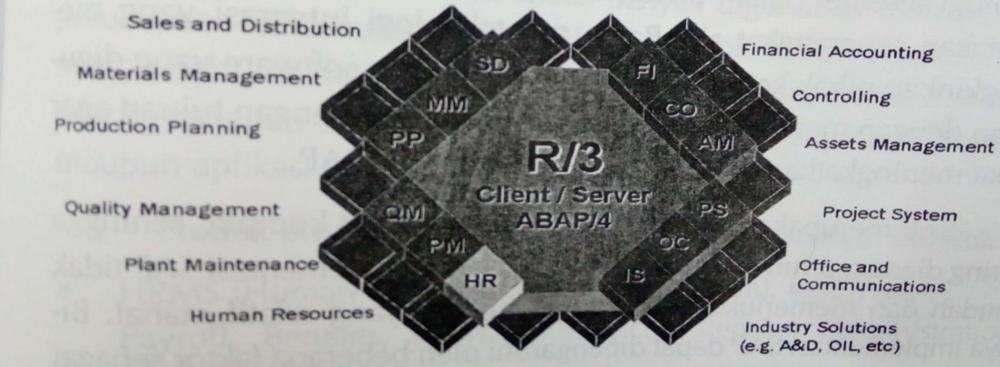
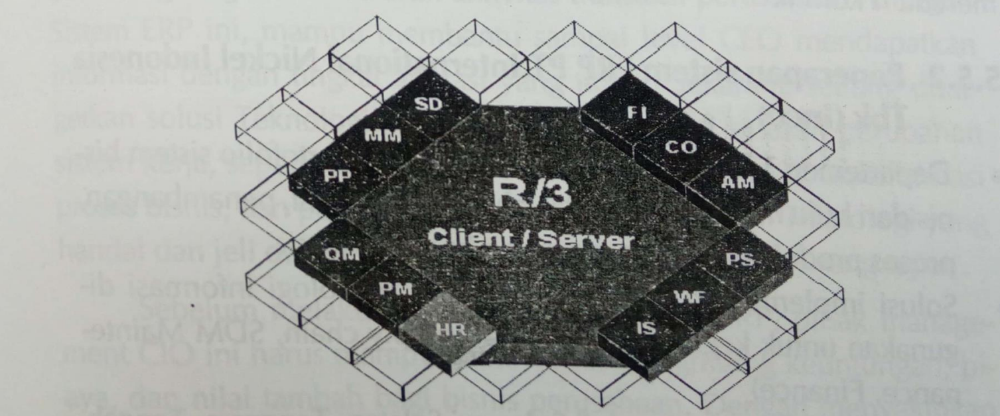
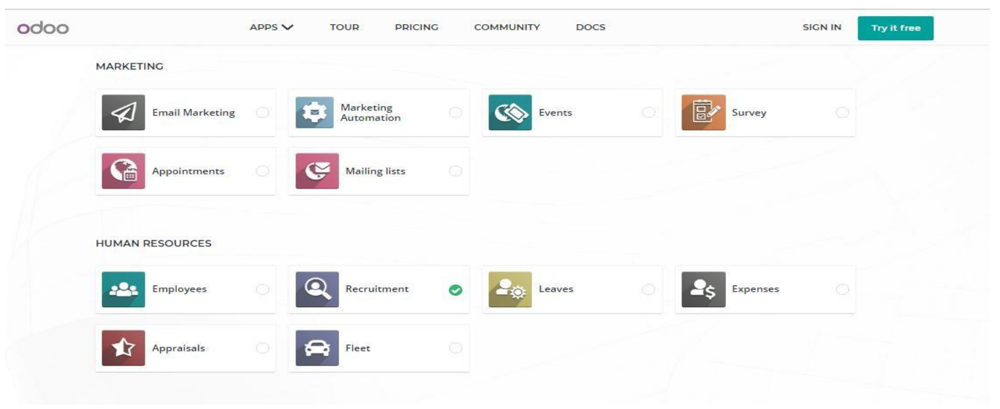
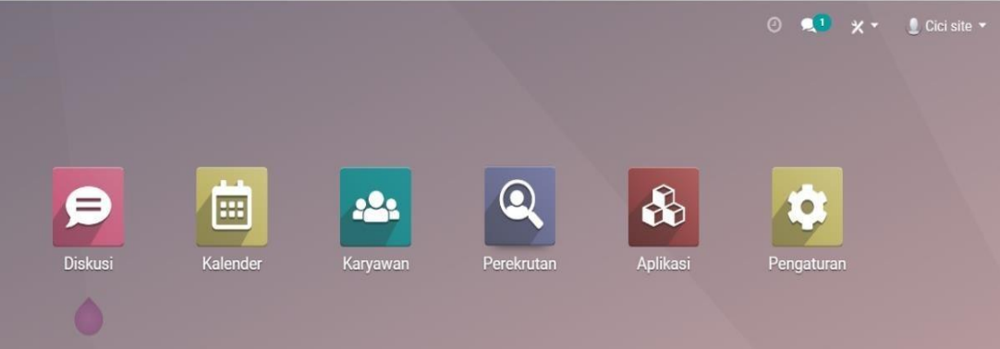
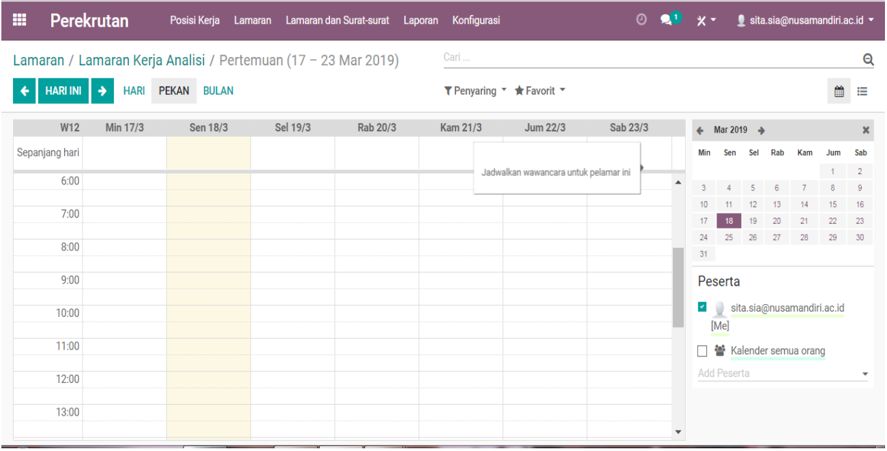
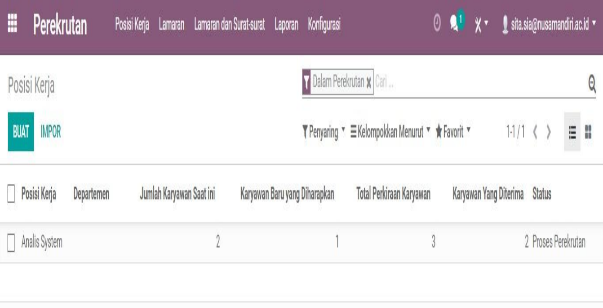

Currently, there are various types of ERP software circulating with various features, versions, scales, and capabilities, providing ERP systems for various types of industries.

## SAP

SAP is one of the popular ERP systems in Indonesia. SAP was founded around 1975 in Germany by 5 former employees who worked at IBM. SAP actually comes from the German language, namely System Andwendungen Produkteinder Datenverarbeitung or in English, the abbreviation SAP stands for Systems Applications Product in Data Processing.

SAP consists of integrated modules, including SAP ERP Enterprise Core, which is an ERP application solution, and SAP Business Suite, which is a business application package such as SAP Customer Relationship Management, SAP Supply Chain Management, SAP Supplier Relationship Management, SAP Product Lifecycle Management.

- Users of ERP system applications are generally medium to large companies. SAP is a market leader worldwide with market dominance reaching 65%. SAP now provides ERP solution packages for small to medium enterprises, such as SAP Business One and SAP All In One.

In Indonesia, currently, the SAP System is widely used in various combinations of modules, features, and facilities by large companies such as: Garuda Indonesia, Telkom, PLN, Pertamina, Astra International, Astra Honda Motor, Indofood, Aqua Danone, Bentoel Prima, Bank Mandiri, Ultra Jaya, Excelcomindo, Blue Bird, Nippon Indosari Corp, Jamu Puspo, Zyrex, etc.

### SAP System

The Main Functions in SAP ERP are:

Cost Accounting, Management Accounting, Sales, Distribution, Manufacturing, Production Planning, Procurement, HR, Payroll.

### Factors influencing SAP implementation

1. Timeframe
2. People
3. Hardware

## PeopleSoft Software

PeopleSoft is a software company that has been developing for quite a long time and its products have been widely used by various leading companies in the world. The acquisition of PeopleSoft by Oracle further added to the diversity of Oracle products and expanded Oracle's support for all users of its products, both database products and program applications.

### PeopleSoft Software Products

- HRMS (Human Resource Management System), consisting of: Payroll, Benefits, Human Resources, Pension Administration, Time & labor
- Accounting and Control consisting of: General Ledger, Payables, Receivables, Asset Managements, Projects, Budgets, Expenses, Cash management
- Treasury Management
- Material Management
- Supply Chain Planning
- Service Revenue Management
- Enterprise Performance Management
- Procurement
- Project Management

## Oracle

Oracle Corporation was founded in 1977 and is a software company that develops, builds, markets, distributes, and services database software and software infrastructure. The software marketed includes application servers, collaboration software, and development. Since 2004, the Oracle company acquired one of the leading ERP system development companies, namely PeopleSoft, so the Oracle company must be able to support various types of products and continue to develop its products and services.

### Oracle e-business suite

#### Financials:

- Planning (General Ledger, Analyzer)
- Analysis
- Consolidation
- Expenditure management
- Billing and Cash Collection
- Cash management
- Asset management

#### Supply Chain Management:

- Strategic Procurement
- Non-production Procurement
- Strategic sourcing
- Catalog Management

#### Project:

- Costing
- Billing
- Time and Expense
- Activity Management Gateway

#### Human Resources Material Management:

- Inventory
- Purchasing

#### Manufacturing:

- Factory and Item Definition
- Planning & simulation
- Materials Management
- Production
- Cost Management
- Integrated Technologies

## Application Modules System Oracles

## Open Source ERP

Odoo is one of the ERP software service providers. Odoo has two types of versions, namely the first is the community version and the second is the enterprise version. The first version is open source and we can see it on the odoo.com website directly in the community section. And the second version is an exclusive version and can be seen on the Odoo website. This software provides software that is intuitive, complete, integrated, and definitely open source for its users in business activities.

- Here is an example of a trial for creating a Human Resource module in the online Recruitment section.
- Open the website https://www.odoo.com/trial select the Human Resource section and select recruitment.

- The display of the Human Resource dashboard in the recruitment section will look like the image below:

- The schedule display of the recruitment needs from Human Resource will appear like the image below:

- The display of data needs for the recruitment module is like the following image:

