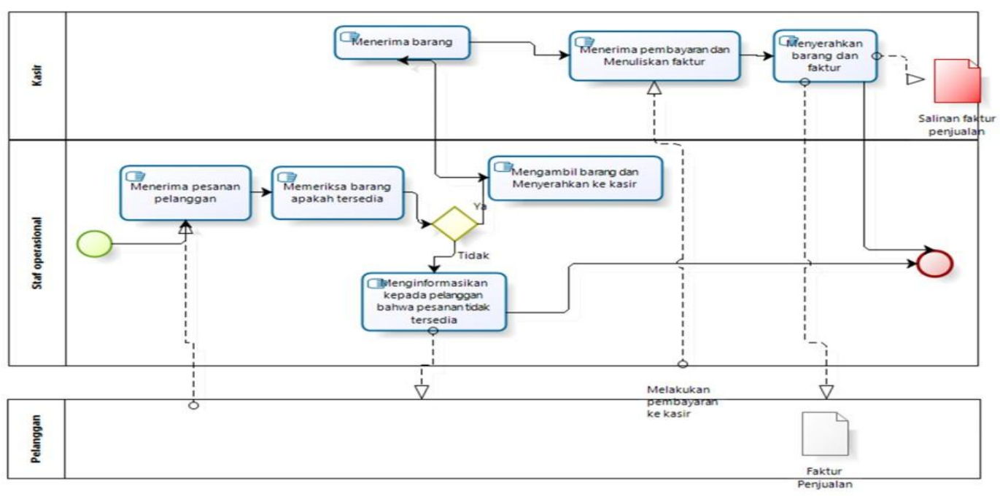
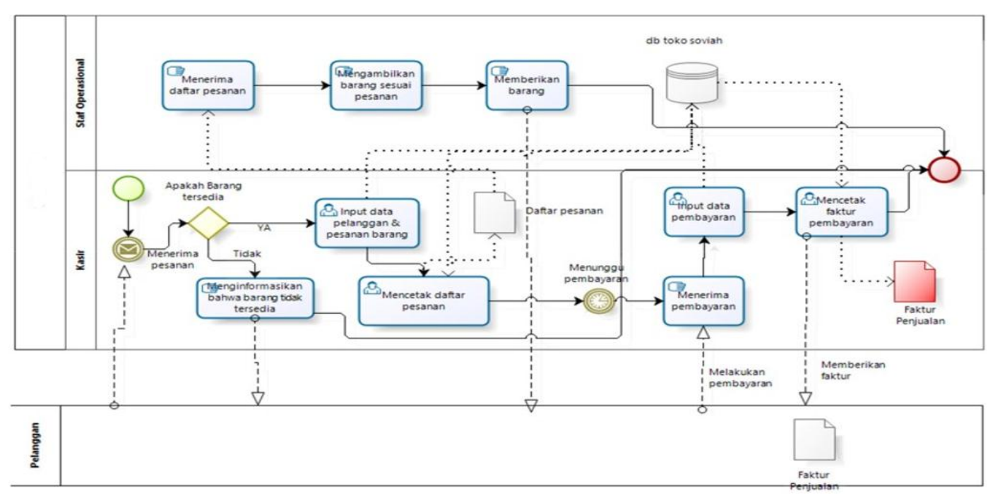
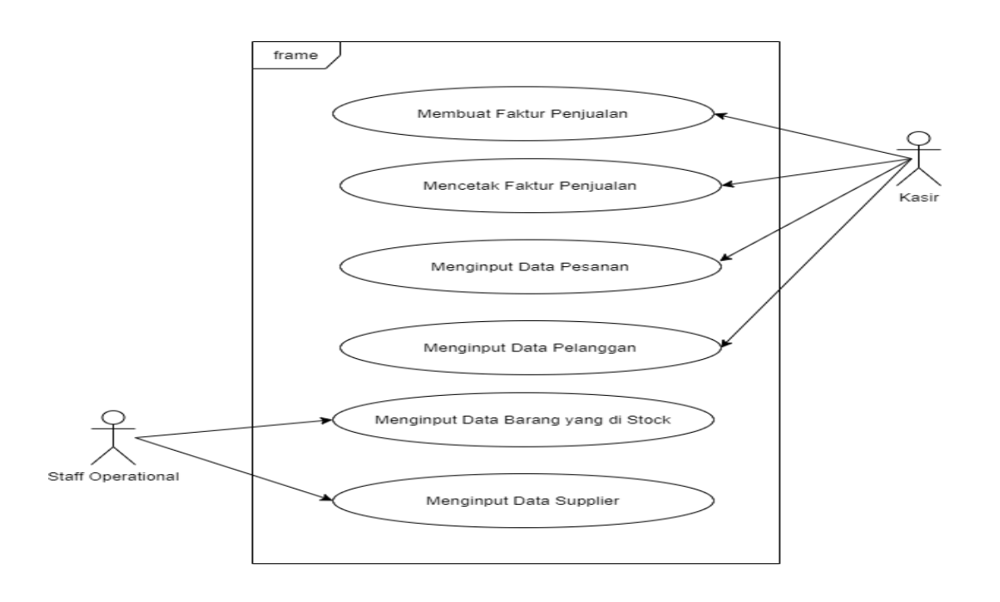

## OOAD Method

- **OOAD (Object-Oriented Analysis and Design)**
- It is a method for analyzing information regarding the system context, capable of supporting the handling of large amounts of data that can be distributed to related departments, and with an object-oriented approach to analysis, design, user interface, and programming.
- Uses UML in the design of its information system.

## Case Study of ERP Implementation

- Below, the implementation of ERP using the OOAD Method for the **Sales & Distribution System** will be described.
- The UML Diagrams depicted are:
  - Use Case Diagram
  - Activity Diagram

## Example of the Current Sales System Business Process Before Odoo Implementation

## Example of Sales and Distribution Module Use Case

