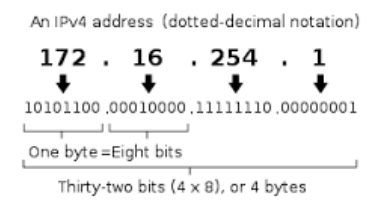
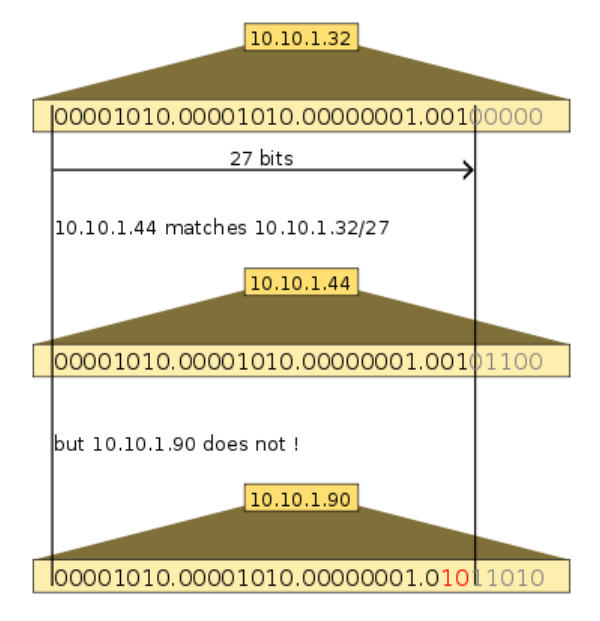
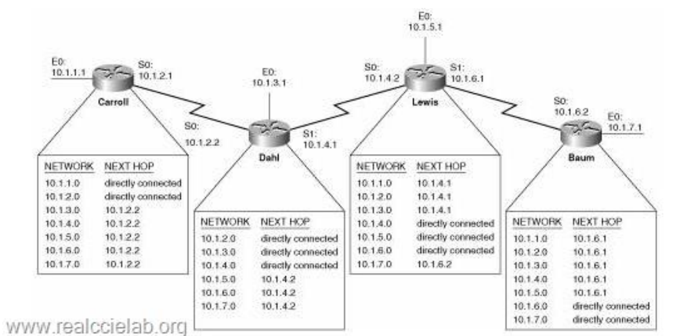

## IP Addressing

Jaringan komputer menghubungkan sejumlah komputer sehingga dapat berkomunikasi satu sama lain. Komunikasi yang dilakukan berupa pertukaran data antara pihak pengirim dan pihak penerima. Proses pengiriman pesan ini memerlukan alamat, sehingga pesan yang dikirim oleh pengirim dapat diterima oleh penerima yang sesuai. Alamat yang digunakan inilah pada jaringan komputer disebut sebagai IP Address.

Pengalamatan yang umum digunakan pada jaringan komputer saat ini adalah IP Address versi 4 atau
sering disebut IPV4. IPV4 merupakan metode pengalamatan yang terdiri dari 4 byte yang masing – masing byte dipisahkan oleh titik, dengan 1 byte jika di desimalkan menjadi 255. Dengan demikian secara teori IP V4 yang dapat digunakan adalah 255 x 255 x 255 x 255.

IP Address terdiri dari dua bagian, yaitu network address dan host identifier. Network address mendefinisikan alamat jaringan yang digunakan. Host identifier digunakan untuk mendefinisikan host yang tergabung pada jaringan tersebut. Host yang berada pada network address yang sama dapat berkomunikasi secara langsung, sedangkan host yang berbeda network address memerlukan router untuk berkomunikasi.

Pada awal diimplementasikan, IPv4 menggunakan konsep pembagian berdasarkan class. Pada metode class, IP address dibagi menjadi class berdasarkan jumlah host yang akan berkomunikasi pada jaringan tersebut. Seiiring dengan semakin berkembangnya jaringan dan internet, penggunaan metode class tidak relevan lagi digunakan. Untuk itu, saat ini metode yang digunakan dalam pembagian IPAddressing umumnya menggunakan CIDR (Classless Classless Inter-Domain Routing) yang merupakan pengembangan dari metode berbasis class.

Pada metode CIDR muncul notasi / (slash) yang diikuti oleh angka decimal 0 – 24 pada alamat IPv4. Notasi ini digunakan untuk mendefinisikan panjang subnet mask yang selanjutnya berfungsi memisahkan network address dan host identifier.Contohnya 192.168.100.14/24 merupakan alamat IPv4 192.168.100.14 dengan subnet mask 255.255.255.0 yang dari notasi CIDR 24 yang menunjukkan jumbah bit 1 secara berurut pada subnet mask, sehingga network addressnya adalah 192.168.100.0,

Gambar 2 menunjukkan ilustrasi penggunaan CIDR dengan 10.10.1.44/27 yang masuk kedalam subnet 10.10.1.32/27 sedangkan 10.10.1.90 tidak termasuk didalamnya.

## Subnetting

Dijelaskan sebelumnya bahwa IP Address terdiri dari 2 bagian yaitu network address dan host identifier. Pada kasus tertentu diperlukan lebih dari satu network yang akan dibangun dari sebuah alamat network. Proses untuk membagi atau memecah network menjadi beberapa network kecil disebut dengan subnetting.

Tujuan dari pembentukan subnetting umumnya antara lain :

- Efisiensi IP Address yang akan digunakan
- Mengurangi kepadatan traffic jaringan
- Memudahkan pengelolaan jaringan, dll

Metode yang saat ini umum digunakan untuk membentuk subnet disebut dengan VLSM ( VARIABLE LENGHT SUBNET MASK ). Proses pembentukan subnet menggunakan metode VLSM dimulai dengan pendefinisian jumlah host yang akan tergabung dalam subnet tersebut. Dari jumlah host ini kemudian ditentukan subnet mask yang akan digunakan untuk membentuk subnetwork address yang baru.

## Routing

Host yang tergabung dalam satu network address dan subnet mask yang sama dapat berkomunikasi secara langsung antara satu host dengan host lainnya. Namun, untuk berkomunikasi dengan jaringan yang berbeda diperlukan pendefinisian jalur untuk berkomunikasi yang sering disebut dengan routing. Proses routing ini dilakukan pada device yang disebut sebagai router.

Router bertugas untuk menyediakan jalur untuk berkomunikasi ke jaringan lain. Router memanfaatkan konsep tabel untuk mendefinisikan jalur yang dapat dilalui menuju ke jaringan tertentu. Tabel ini disebut juga routing table. Pada implementasinya, untuk membentuk tabel routing dapat dilakukan secara manual (static) atau secara dinamis dengan menggunakan algoritma tertentu.

Untuk mengisi routing table diperlukan informasi antara lain ;

- Alamat network tujuan
- Alamat router yang menghandle jaringan tersebut
- Alamat router tetangga yang dapat dilalui untuk mencapai network tujuan

Gambar 3 mengilustrasikan router digunakan untuk menghubungkan jaringan yang berbeda dengan memanfaatkan routing table. Routing table dibuat pada masing – masing router untuk mendefinisikan jalur yang dapat digunakan untuk berkomunikasi dengan jaringan lain.
