## Mikrotik

Mikrotik OS is a specialized operating system used for network management. The word Mikrotik refers to the Latvian language where this OS originated, meaning small network. With the vision of facilitating networking management, Mikrotik Router OS offers ease of implementation, ease of configuration, and ease of integration with other devices.

Mikrotik comes in two types, namely Mikrotik Router OS (ROS) and Mikrotik RouterBoard. Mikrotik RouterBoard is specific hardware embedded with the Mikrotik operating system to function as a router. Meanwhile, Mikrotik RouterOS is a Mikrotik operating system that can be installed on a PC so it can function as a router. RouterOS is an Independent Operating System and software capable of making an Intel/AMD-based PC perform functions like routing, bridging, firewalling, bandwidth management, wireless AP or client, and many other functions.

Mikrotik provides tools to easily manage its devices or OS. The commonly used tool is Winbox. This is a GUI-based tool developed for the Windows operating system. Winbox provides shortcuts to help manage Mikrotik devices.

## Static IP Address Configuration

To configure a Static IP Address method on Mikrotik, it is done by:

1. Open winbox.exe

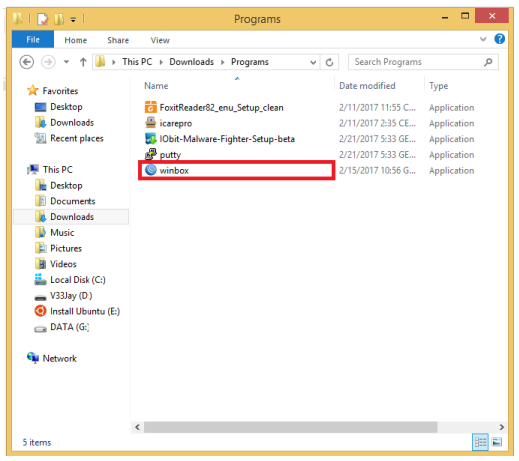

2. After the initial winbox screen appears, please enter the MikroTik IP (the IP connected to the internet) in the Connect To column. Enter the username in the login column and enter the password in the password column according to the MikroTik's username and password. Then, click Connect.

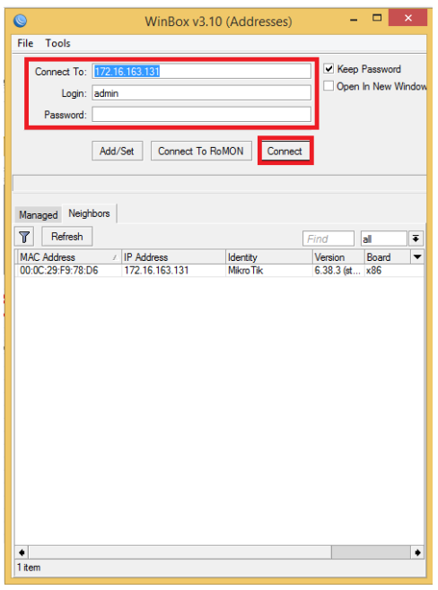

3. After that, the main winbox view appears. On the Left Side Bar, there are menus for managing the Mikrotik device. To configure the IP address, click the IP menu. Inside the IP menu, there are many options for configuring IPv4. Select the Addresses section to create a Static IP Address.

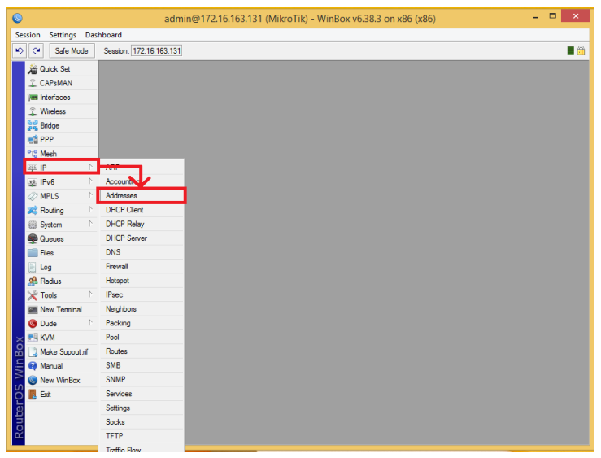

4. Then the Address List box will appear. This box will display the list of IPs existing in MikroTik. To add one, click the button with the '+' sign and the New Address box will appear. In the New Address, there are 3 columns, namely Address, Network, and Interface. In the Address column, enter the Static IP and Netmask corresponding to the network to be created. Leave the Network column blank if the Address column already contains the netmask. In the Interface column, select the interface to be given the IP Address. Once everything is filled in, click the Apply button and OK. After that, the created IP will appear in the Address List box.

## DHCP IP Configuration

Mikrotik has a DHCP Server feature. A DHCP Server is a server that provides services or automatic IP Address allocation for Clients whose Addresses are set to Automatic. A DHCP Server provides Automatic IP configuration which includes: IP Address, IP Gateway, and IP DNS Server.

To configure Mikrotik as a DHCP Server, there are two main steps: creating an IP Pool to make the range of IPs that will be used, and then creating the DHCP Server. This DHCP Server configuration is done with the help of WinBox connected to a Mikrotik. The steps to create a Pool are as follows:

1. Connect **Winbox** to **mikrotik**, then in Winbox **click IP** then click **Pool** so the IP Pool form appears.

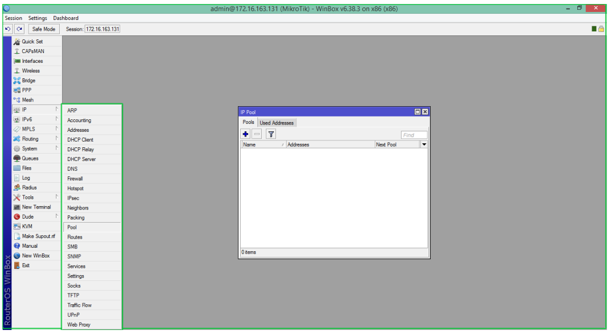

2. The next step is adding the range of IPs to be used in the DHCP Server, so a new IP Pool must be added. To add an IP Pool, click the "+" button so the New IP Pool menu appears. What is configured in the New IP Pool Form is as follows:

   **Name**: Contains the pool name, for example, the pool is named local.

   **Addresses**: Contains the IP Address range that will be used for clients, for example 172.16.162.30-172.16.162.40

   Then click **Apply** followed by clicking **OK**.

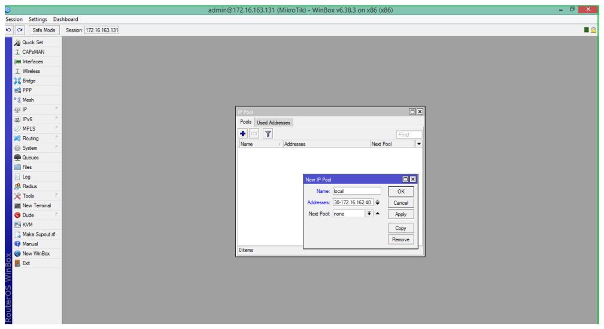

3. If successful, a new pool named **local** containing the Address range for Local IPs will be added to the **IP Pool** page.

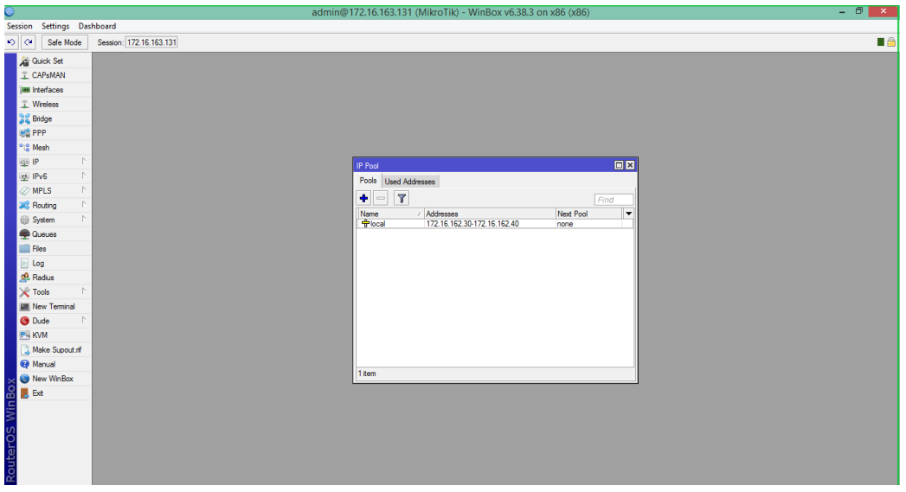

4. Once the IP Pool is configured, the next step is configuring the DHCP Server. To configure a DHCP Server on Mikrotik, the first thing to do is, in **winbox** click **IP** then click **DHCP Server**. Next, the DHCP Server page will appear.

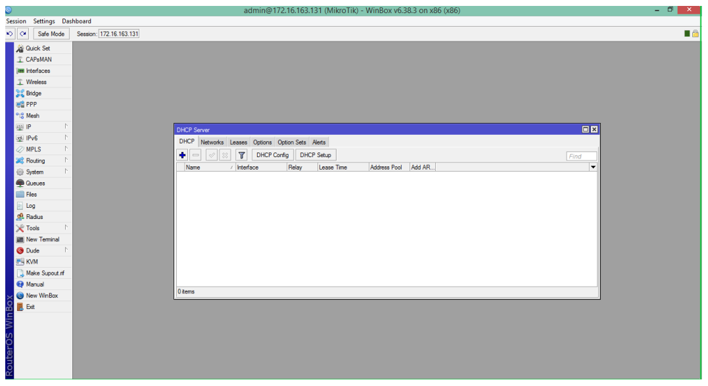

5. To add a DHCP Server, click the "+" button. This brings up the New DHCP Server page. What needs to be configured is as follows:

   **Name**: Filled with the DHCP server name.

   **Interface**: Select the network interface that will be the DHCP Server (the one connected to local).

   **Address Pool**: Filled with the pool that has been created previously.

   Then click **apply**, followed by clicking **OK**.

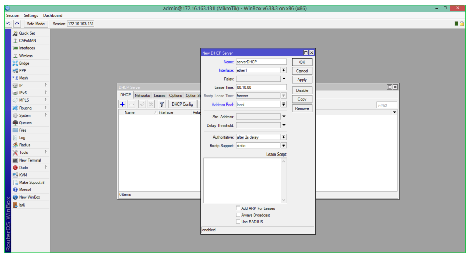

6. Once the DHCP Server is created, the next is to configure the **network** sent by the DHCP Server and used by the client. To configure the network, click the **network** tab on the DHCP Server page.

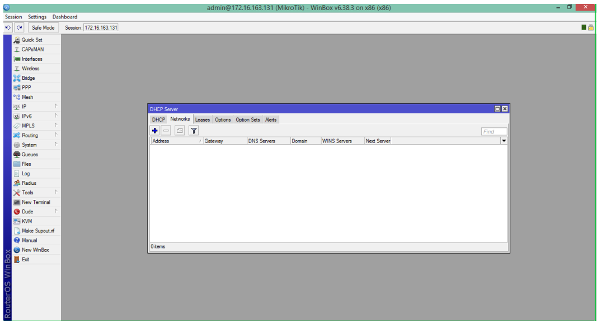

7. To add a network, click the "+" button. This will display the DHCP Network page. What needs to be configured in DHCP Network is as follows:

   **Address**: Filled with the network address that will be used by the client.

   **Gateway**: Filled with the gateway that will be used by the client.

   **Netmask**: Filled with the netmask prefix used by the client.

   **DNS Server**: Filled with the DNS Server that will be used by the client.

   Click **apply**, then followed by clicking **OK**.

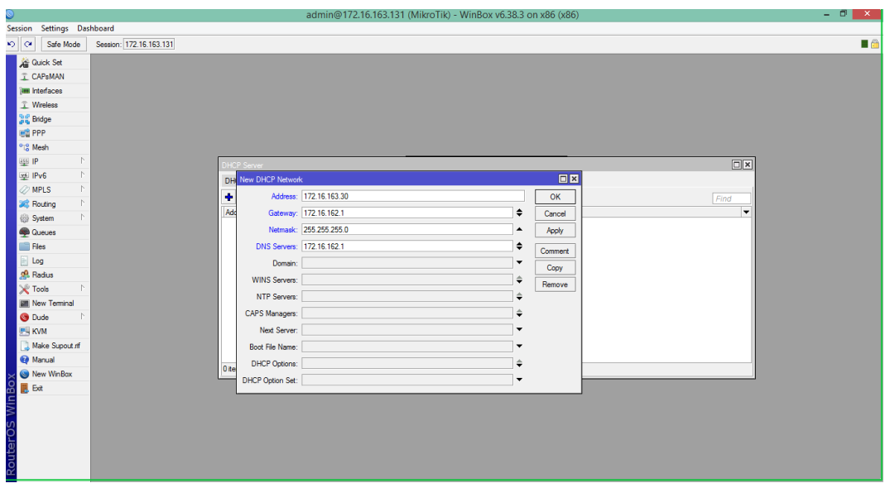

8. Up to this point, the configuration of the **DHCP Server** on **mikrotik** is complete. For testing, use a **client** computer to view the **DHCP Server** configuration. If an **IP Address** is successfully obtained according to the configuration, then the DHCP Server has been configured correctly. The next step is to check the connection from the client to the Mikrotik by pinging from the client to the Mikrotik IP. If the dynamic IP configuration is correct, then the Mikrotik will **reply to the ping** from the client.

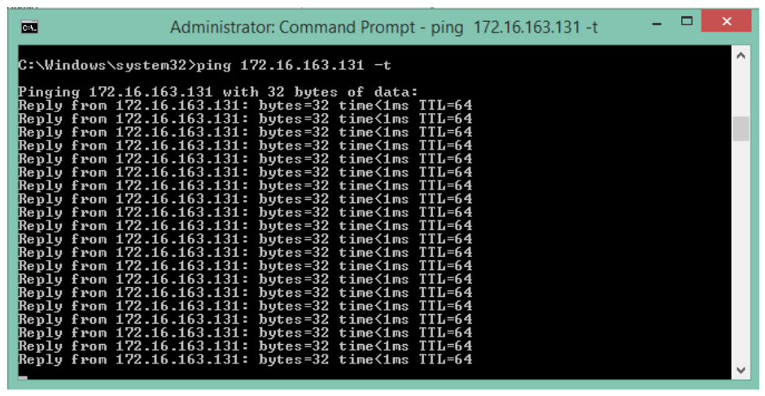

## Static Routing Configuration

Static routing is a router that has a static routing table manually set by network administrators. Static routing is the simplest routing arrangement that can be done on a computer network. The configuration stages are as follows:

1. Mikrotik Login

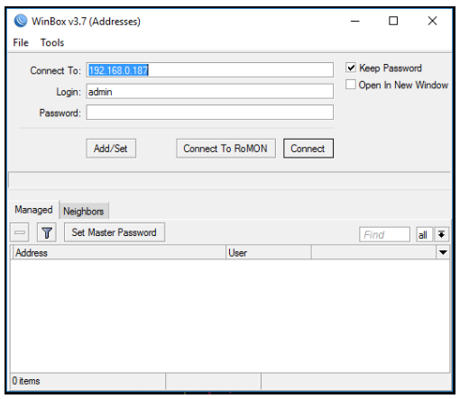

2. Next, look for the IP menu then the Routes submenu

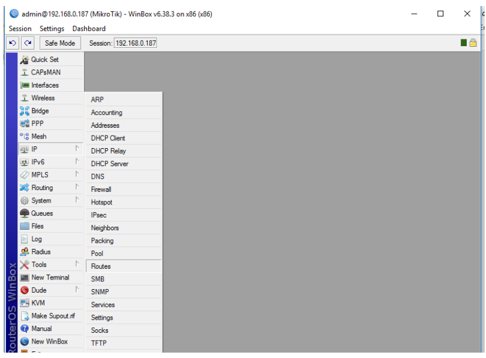

3. The route list menu will appear, then click the '+' sign to add a new router configuration which will display the new route menu

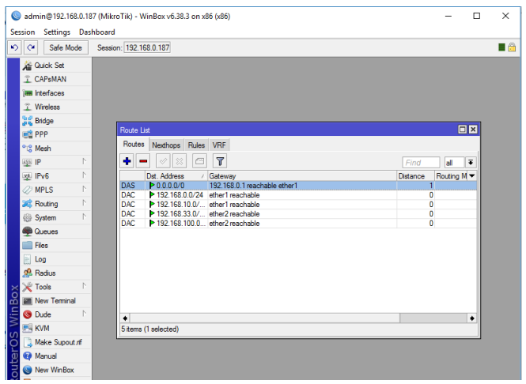

4. In the new route menu, there are several fields that need to be filled, namely:

   a. Dst. Address is filled with the destination network address. For default routing, enter 0.0.0.0/0 which aims to determine the route for all networks to be directed to a specific gateway

   b. Gateway is filled with the destination router address or neighboring router that will lead to the destination network. Generally, to connect to the Internet, the gateway IP is provided by the ISP.

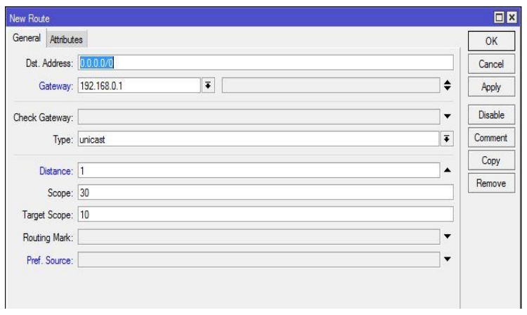

Once finished configuring it, press the 'OK' button

5. Test the routing configuration by pinging the internet or by pinging the router gateway

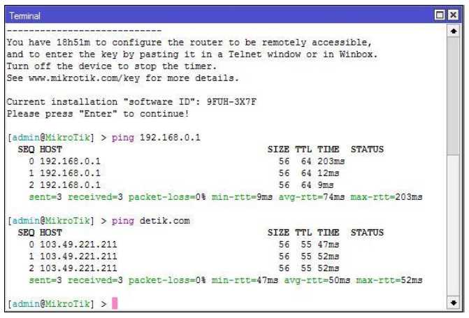

## NAT Firewall Configuration

Mikrotik has a firewall menu, one of which is NAT. NAT stands for Network Address Translation, which can function to translate IP addresses. As is known, to connect to the internet, a Public IP is required. However, due to the limited availability of Public IPs, each host generally communicates using a Private IP. NAT is used to translate a Private IP into a Public IP so hosts can communicate via the internet. Here are the steps to use a NAT firewall on Mikrotik:

1. Log into Mikrotik via the winbox application
2. Find the firewall menu, which is IP → firewall

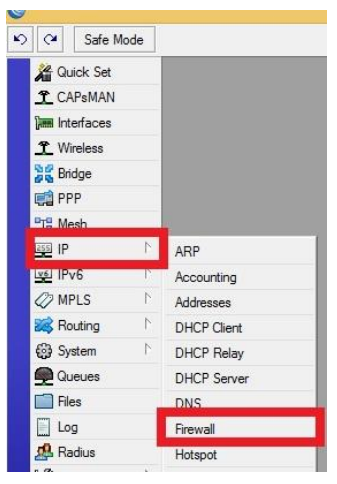

3. Winbox will display the firewall interface. Then select NAT and press the add icon on NAT which has the function to add a new rule.

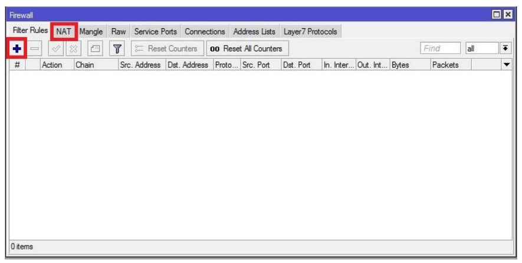

4. When the add icon is pressed, a form to create a new rule will appear.

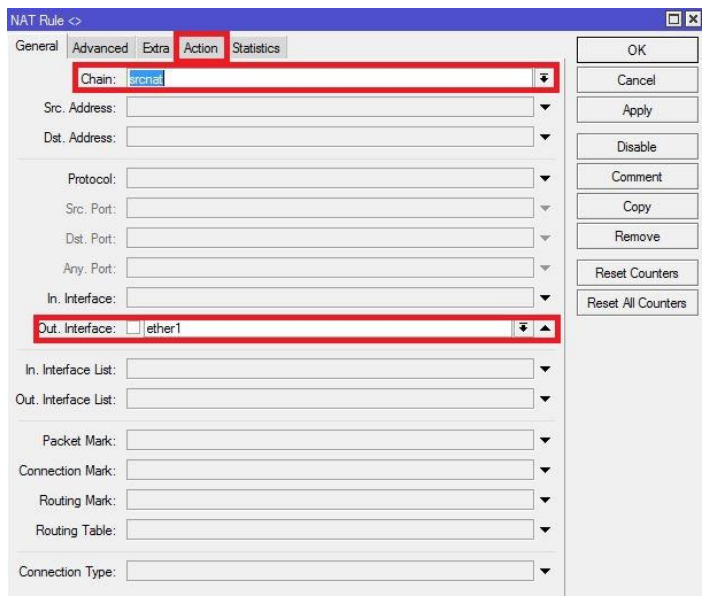

5. Configurations in the general menu are:

   a. Chain: srcnat

   b. Out. Interface: ether1, because on Mikrotik we set the ether1 interface as the public IP to access the internet

   c. Press the Action menu to determine the action to be used on this rule

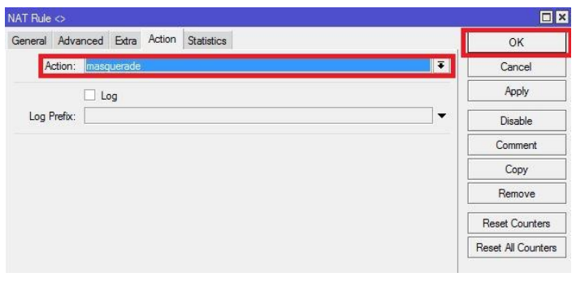

6. Select the masquerade action and press the Ok button to complete the NAT rule configuration.

7. The rule has been successfully created. Now ping 8.8.8.8 from the client, to ensure the NAT rule has been successful.

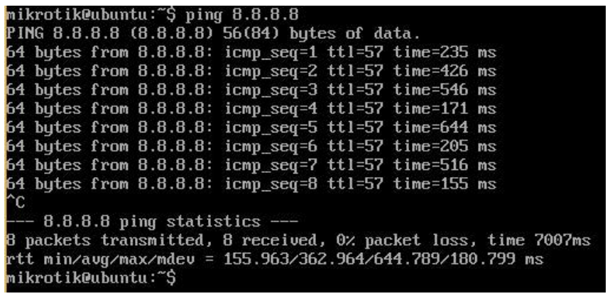

8. If the ping is successful and the client has internet access, then the NAT firewall configuration with masquerade has been successfully performed.

## Hotspot Configuration

1. First, go to the **IP > Hotspot > Hotspot Menu**

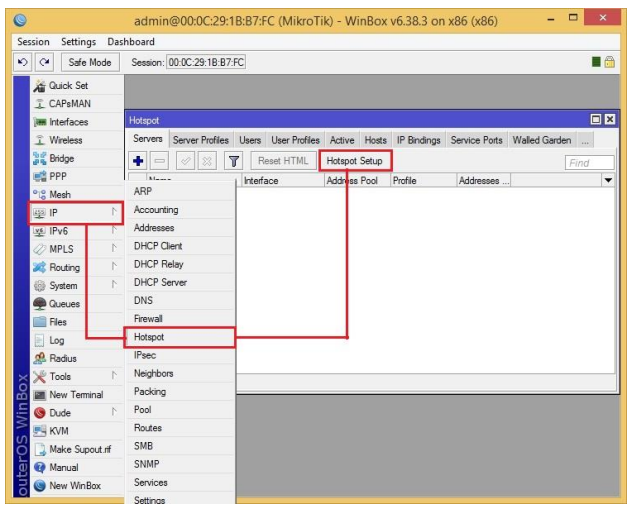

2. A "Hotspot Menu" pop-up will appear that will guide you to select the interface to be used as a hotspot. In the example below, it's ether1. If the interface we chose is correct, click the **next** button.

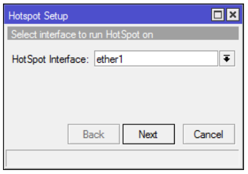

3. Next, enter the IP address to be used as the hotspot login. In the example below, it is 192.168.100.1 with a netmask of 255.255.255.0 (/24) then click the **next** button.

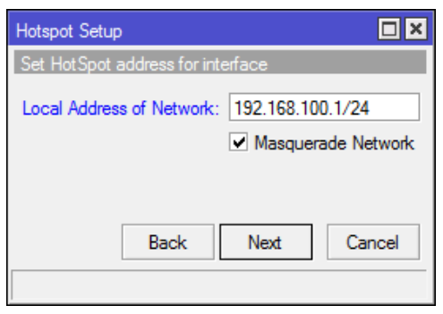

4. Then set the pool address where this pool address is used as the DHCP IP that will be given to users who log in to the hotspot. In the example below, it is 192.168.100.2-192.168.100.254. Then click **next**.

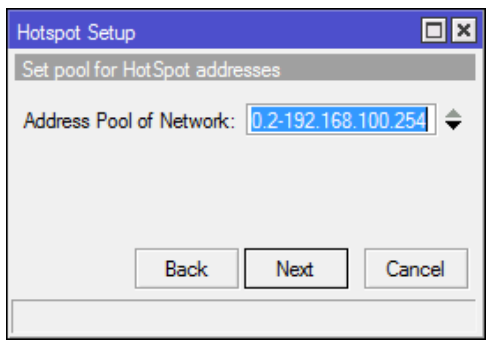

5. The next step is determining the SSL Certificate. If using HTTPS to log into the hotspot, select "import other certificate". If not, select "none" then select **next**.

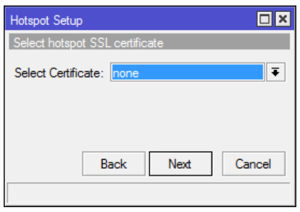

6. The next step is determining the SMTP Server if required. If not, leave it default then click **next**.

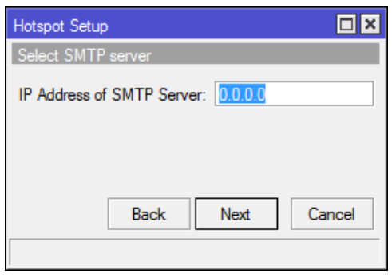

7. Then determine the DNS Server. In the example below, using Google DNS which is 8.8.8.8. If you want to add another DNS, click the up/down button and enter another DNS then click **next**.

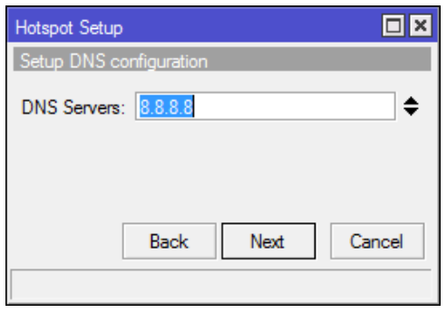

8. Then enter the DNS Name that has been inputted. In the example below, it is hotspot.example.co.id then click **next**.

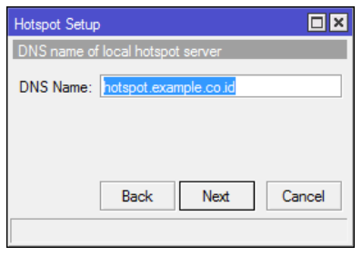

9. The next step is determining the username and password that will be used to log in to the hotspot. In the example below, the username used is "hotspot" and the password is "hotspot" then click **next**.

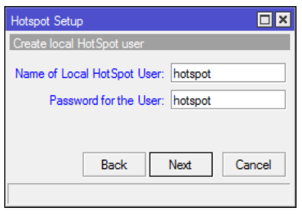

10. The hotspot is ready to use. And to log in, use the username and password that were created previously.

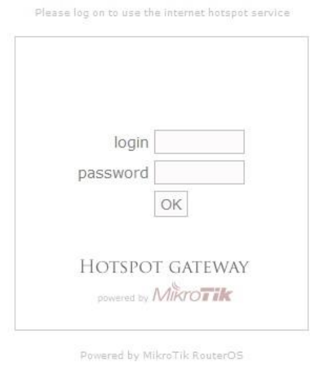

## Simple QoS

QoS stands for **Quality Of Services**. QoS aims to provide service according to the expected level. Without QoS, there will be a scramble for traffic resources. Generally, QoS is coupled with traffic limitation. However, QoS itself actually consists of many parts, including prioritize, traffic classification, traffic limitation, etc. On Mikrotik, there are several configurations to implement QoS. One of them is the Simple QoS feature.

With simple QoS on Mikrotik, QoS management is made easy for administrators. For example, below, a QoS in the form of traffic limitation for one Client IP will be created. Before being given a limitation, the client will get maximum traffic according to the available bandwidth.

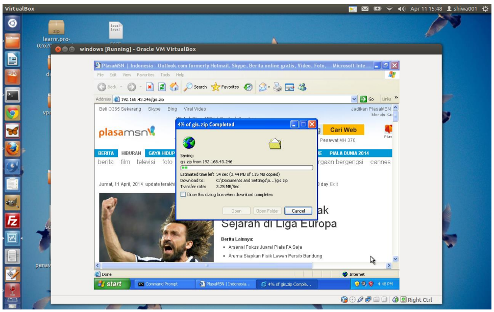

Like the example above, before being limited, the client gets an average bandwidth of 3MB/Sec. This will certainly make the internet network slow for other clients if the available bandwidth is small. To overcome this, it is necessary to create a traffic limitation. On Mikrotik, to configure QoS traffic limitation, it can be applied by:

1. In winbox click the **Queue** menu, so the **Queue List** page will appear. To add a traffic limitation using Mikrotik simple QoS, click the **Simple Queues** tab on the **Queue List** page.

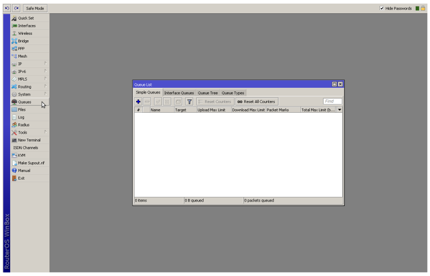

2. To add a new traffic limitation, click the "+" button on the simple queues tab. The **New Simple Queue** page will appear. The configurations that need to be made on this menu are:

   **Name**: Fill in with the name of the limitation to be created, for example, **client1** for limiting host client1

   **Target**: Fill in with the IP of the host to be limited.

   **Max Limit**: Fill in with the max bandwidth that the client will get.

   Then click **Apply** followed by clicking **OK**

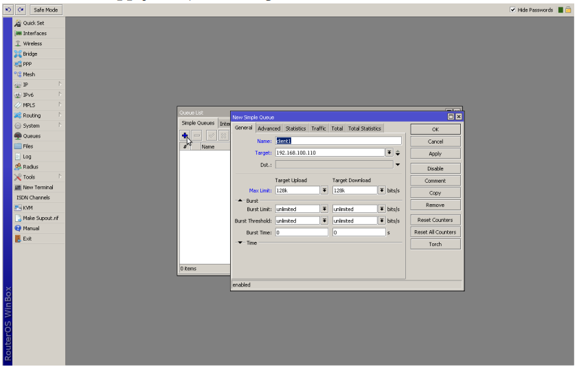

3. Next, the rule on Simple Queues will increase according to what was configured previously.

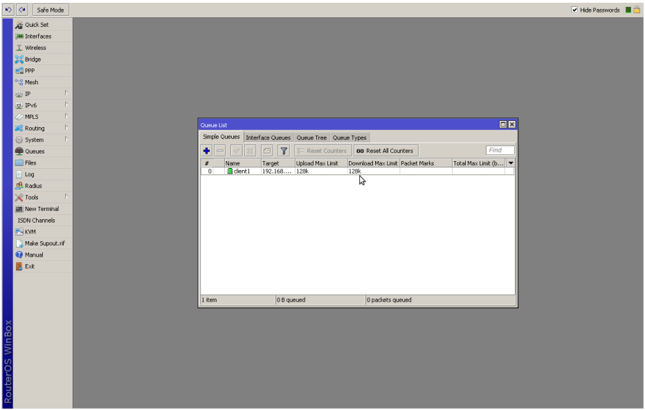

4. To test the simple QoS configuration that has been created, perform a download to a certain site. If the configuration is correct, then the traffic limitation runs successfully. Like the example below, the client will get an average bandwidth of 128kbps ~ 16KBps.

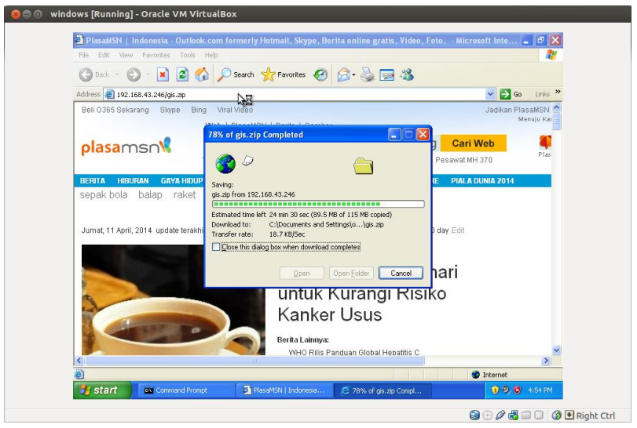

## Mikrotik Monitoring Tools

1. Open winbox.exe. On the Left Side Bar, there is a Tools option. Inside Tools, there is a Graphing option. Click Graphing to perform Monitoring on the specified network interface.

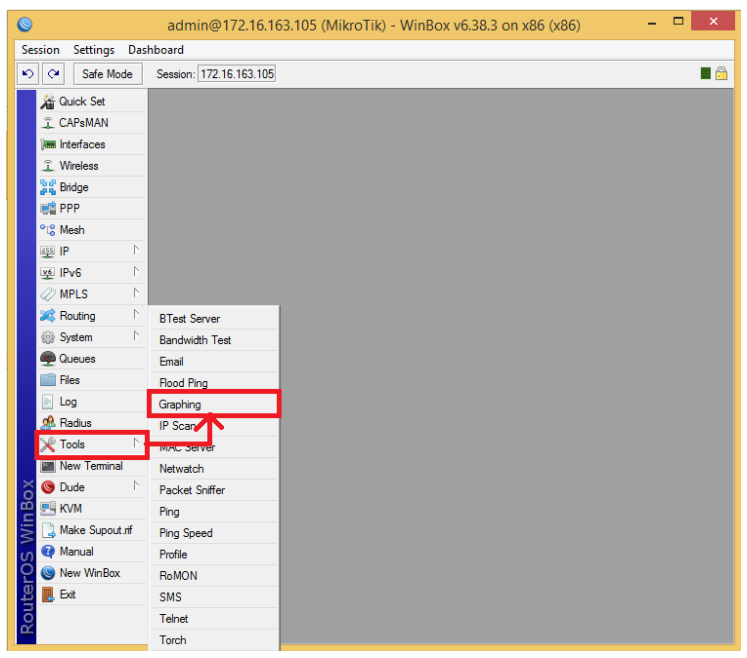

2. After that, the Graphing box will appear. Click Graphing Settings then Select 5 min and click Apply and OK. This aims to determine the data recording time to be displayed in the graph. Next, to add a network interface that we will monitor, click the '+' button. The New Interface Graphing Rule box will appear. In the Interface column, select the network interface to monitor. After that click Apply and OK.

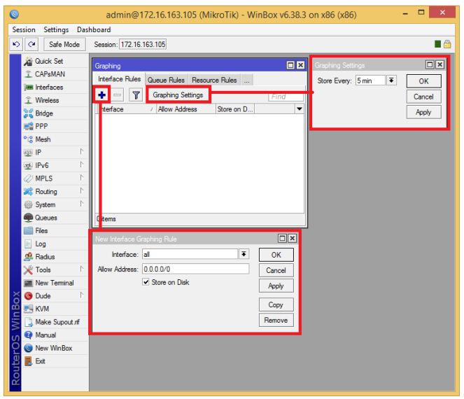

3. To perform monitoring, it can be done by opening a browser. Type in the Address Bar: http://[MikroTik_IP]/graphs. Furthermore, you can see the link of the network interface you want to monitor. Click the link and then a graph of the monitored interface will appear.

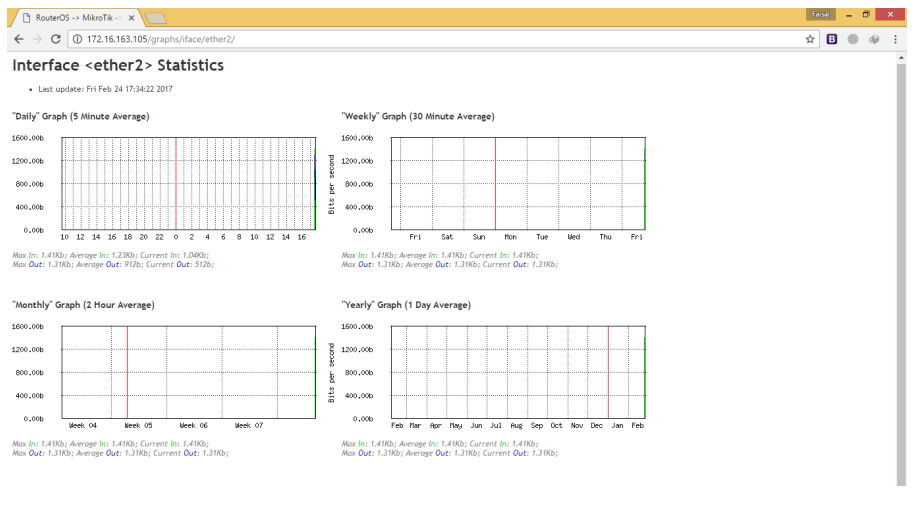
