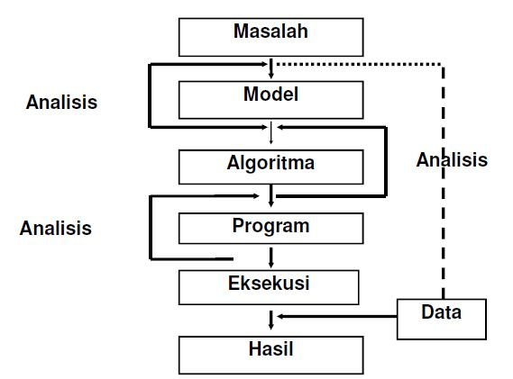
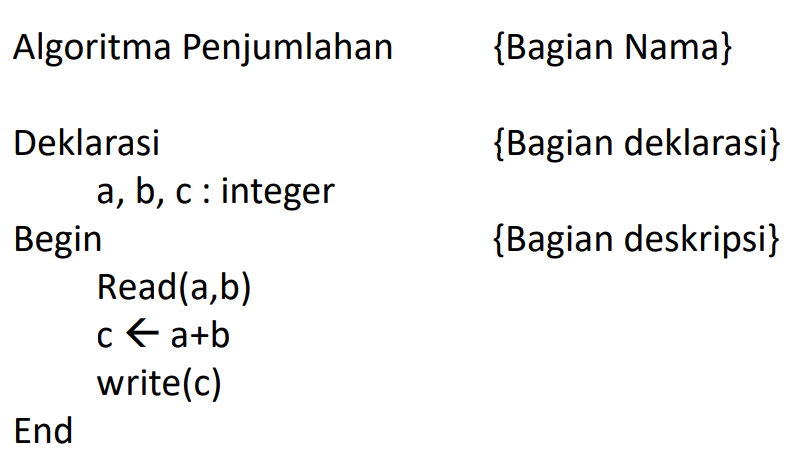

# Basic Concepts of Logic and Algorithms

**Logic** was first introduced by Aristotle (384-322 BC).

**Algorithm** was introduced by the Mathematician: Abu Ja’far Muhammad ibn Musa al-Khwarizmi. A Persian scientist who wrote the book al-jabr wa'l-muqabala (rules of restoration and reduction) around 825 AD.

# Definitions of Logic and Algorithm

## Definition of Logic

1. The science within the realm of philosophy that discusses the principles and laws of correct reasoning (Rakmat, 2013).
2. The science that provides the principles that must be followed in order to think validly according to applicable rules (Mustofa, 2016).

## Definition of Algorithm

1. A sequence of steps to solve mathematical and logical problems (Zarman & Wicaksono, 2020).
2. A clear series of instructions to solve a problem (Rinaldi Munir, 2016).
3. A limited set of instructions which, when executed, will complete a specific task (Sjukani, 2013).

# Problem Solving Stages



# Example of an Algorithm

How do you make Instant Noodles?

- Example 1

Start

1. Boil water
2. Put the noodles into the boiling water
3. Pour the cooked noodles into a bowl
4. Add the seasoning
5. Stir evenly.

End

- Example 2

Start

1. Boil water
2. Put the noodles into the boiling water
3. Add the seasoning
4. Stir evenly
5. Pour the cooked noodles into a bowl

End


**Note:** algorithm examples 1 & 2 explain that a problem can be solved with various steps and sequences.


# Characteristics of an Algorithm

1. An algorithm must stop after executing a finite number of steps.
2. Each step must be precisely defined and not ambiguous.
3. An algorithm has zero or more inputs.
4. An algorithm has zero or more outputs.
5. An algorithm must be effective; every step must be simple enough that it can be done in a reasonable amount of time.

# Algorithm

How to write an Algorithm? There is no clear standard for writing algorithms; it depends on the problem and resources. Algorithms are not written to support a specific programming code. All programming languages share basic constructs. The basic constructs consist of:

1. Loop / Repetition (`for`, `while`)
2. Branching / Control Flow (`if` – `else`)

Example: Algorithm to Add Two Numbers and Print the Result

Start

1. Read numbers a and b
2. Calculate a plus b, store in c
3. Write the value of c

End

## Writing Algorithms in Pseudocode



# Programming Languages

A **Program** is a collection of instructions given to a computer to perform a task or job. To create a program, a programming language is needed.

A **Programming language** is a computer language used to write programs.

Examples of programming languages are: Assembly language, Fortran, Cobol, Pascal, C, C++, Basic, Prolog, PHP, Java, Python.

Based on their proximity (level), programming languages are grouped into 2 types, namely:

1. Low-level language
   A language designed so that each instruction is executed directly by the computer, without having to go through a translator. Example: machine language (a set of binary codes (0 and 1)).

2. High-level language
   This type of language makes programs easier to understand.

Examples: Pascal, Cobol, Fortran, Basic, Prolog, C, C++, PHP, Java, Python.

# Python Programming Language

Python is a high-level programming language designed by Guido van Rossum. Python is a programming language that is easy to understand because its syntax structure is neat and easy to learn.

Python is widely used to create application programs such as: GUI programs (desktop), Mobile Web Applications, Games, Hacking, and the **Internet of Things** (IoT).

Python is recommended for beginners who have never coded before.

# C++, Java, and Python Programming Languages

Printing the Word **"Logika Algoritma"**

Syntax in C++:

```c++
#include <iostream.h>
main() {
cout<<"Logika Algoritma"; }
return 0
```

Syntax in Java:

```java
Class LogicAlgorithmsApp
{
public static void main(String[] args)
{
System.out.println("Logic
Algorithms"); } }
```

Syntax in Python:

```python
print("Logic Algorithms")
```

# Algorithm Analysis Stages

## 1. How to plan an algorithm.

By determining a model or design to solve a problem as a solution, so there will be many variations of models taken to find the best one.

## 2. How to express an algorithm

Determining the algorithmic model used to create an ordered sequence to obtain a solution to the problem. The algorithmic model can be expressed in pseudocode or a flowchart.

### a. Pseudocode

An informal way to describe an algorithm that follows the structure of a specific programming language.

### b. Flowchart

A diagrammatic representation of an algorithm that illustrates the logical flow of a problem.

**The purpose of pseudocode is**: Easier to be read by
humans, easier to understand and easier to
pour out ideas/thoughts.

**Example** : To calculate the Area of a Triangle

1. Input Base Value
2. Input Height Value
3. Calculate Area = ( Base \* Height ) / 2
4. Print Area

# Advanced Algorithm Analysis Stages

## 3. How to validate an algorithm.

The validity of an algorithm is achieved when a solution is obtained as the resolution of the problem.

## 4. How to Analyze an Algorithm

Algorithm analysis by observing the execution time and the amount of memory used.

## 5. How to Test a Program from an Algorithm

The algorithm is implemented into a programming language, for example: Python. The algorithm testing process involves
two stages, namely:
a. Debugging Phase and
b. Profiling Phase

### a. Debugging Phase

namely the phase of the program execution process that will make corrections to errors.

### b. Profiling Phase

namely the phase that will work if the program is correct (has passed the debugging phase).
