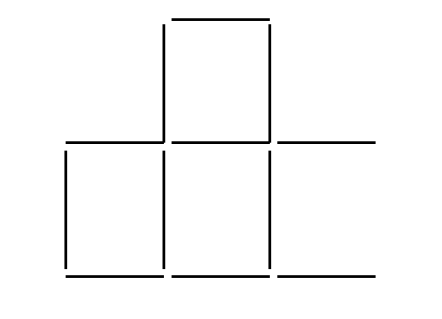
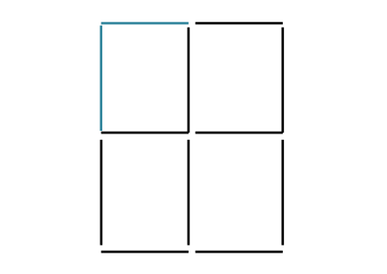
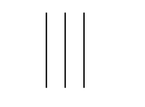
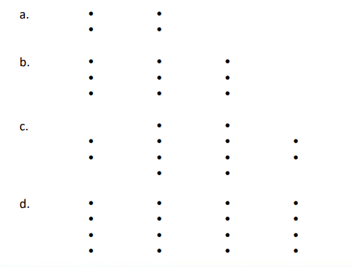
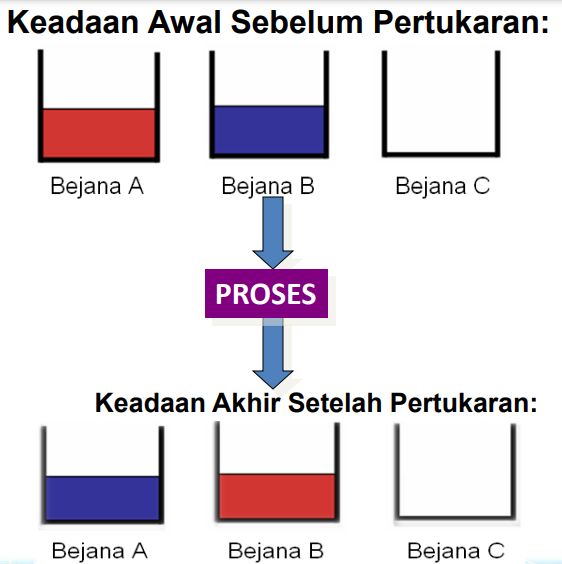
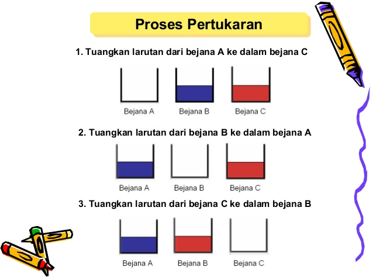

# Algorithm Concepts

## 1. Variable Algorithm

Is a Variable whose value is NOT a constant (always changing – according to the **CURRENT** Variable condition)

Syntax : P = Q

Algorithm : P <- Q

Meaning : That the Value of P is assigned the Value of Q, the Value of P will be EQUAL TO the value of Q, & the Value of Q REMAINS

## 2. Exchange Algorithm

Serves to exchange the respective contents of Variables such that the Value of each Variable will change/exchange.

### Example of Algorithm Problem

#### Problem

Given P=10, Q=15 and R=5. Given Algorithm P=Q, Q=R, what are the Values of P, Q, R now?

#### Answer

1. **P = Q:** In this step, the value of Q (15) will be copied into the variable P. Thus, P is now 15.
2. **Q = R:** In this step, the value of R (5) will be copied into the variable Q. Thus, Q is now 5.

   The final result is:

- The value of P is 15
- The value of Q is 5
- The value of R remains 5 (does not change in the given algorithm)

# Algorithm Analysis

1. A bunch of 12 matchsticks can form boxes as below. The question is, move two of these matchsticks to form four boxes.



By moving the two matchsticks at the bottom, as below



2. There are three matchsticks below, how to form the number 6 without breaking them



Answer: The three matchsticks will form the Roman numeral 6


3. Budi never skips his class, but he never did any assignments for this past year. His only job is talking and Budi also never took the semester exam, Budi is also not an achieving student. Why does Budi never get a warning from the school? (what do you think is the answer)

   The answer: Because Budi is a teacher.

   Explanation: Budi never did assignments but created assignments, his job is only talking to explain the lesson material in the class so Budi will never take the semester exam.

4. What is the minimum number of lines to cover all the dots below with the condition that to make the lines they must not be broken:



5. Algorithm for Exchanging Container Contents For Trial Practice Student Exchange Bringing 2 Glasses of water of different colors and 1 Empty glass

   Given two containers, A and B; container A contains a red solution, container B contains a blue solution

   **Write pseudocode** to exchange the contents of the two containers such that container A contains a blue solution and container B contains a red solution.



DESCRIPTION :

- Pour the solution from container A into container C.
- Pour the solution from container B into container A.
- Pour the solution from container C into container B.



# Data Types in Python

| Data Type   |                                            Description                                            |
| :---------- | :-----------------------------------------------------------------------------------------------: |
| Boolean     |                   Has two values, namely true has value 1 and false has value 0                   |
| String      | Consists of characters/sentences in the form of letters, numbers, etc. (enclosed by " or ' signs) |
| Integer     |                                        Expresses integers                                         |
| Float       |                                Expresses numbers that have a comma                                |
| Complex     |                           Expresses pairs of real and imaginary numbers                           |
| List        |               Sequence data that stores various data types, its contents can change               |
| Tuple       |           Sequence data that stores various data types, but its contents cannot change            |
| Hexadecimal |                              Expresses numbers in hexadecimal format                              |
| Dictionary  |        Sequence data that stores various data types in the form of pointer and value pairs        |

## Examples of data types in Python

```py
#Boolean data type
print(True)
#String data type
print("Learning Python is fun...")
#Integer data type
print(20)
#Float data type
print(3.14)
#Complex data type
print(5j)
```

```yml
Running Result:
True
Learning Python is fun...
20
3.14
5j
```

# List Data Type

Is an array containing a collection of non-homogeneous types.

```py
#list data type
words = ["Learning", "Python", "at", "School Programs"]
numbers = [10, 50, 100, 1000]
mixed = ["Learning", 100, 7.99, True]

#print
print(words)
print(numbers)
print(mixed)
```

```yml
Running Result:
['Learning', 'Python', 'at', 'School Programs']
[10, 50, 100, 1000]
['Learning', 100, 7.99, True]
```

# Tuple Data Type

The tuple data type is almost similar to list, the difference is its members cannot be changed after being declared. Tuple uses parentheses and members are separated by commas.

```py
#tuple data type
words = ("Learning", "Python", "at", "School Programs")
numbers = (10, 50, 100, 1000)
mixed = ("Learning", 100, 7.99, True)

#print
print(words)
print(numbers)
print(mixed)
```

```yml
Running Result:
('Learning', 'Python', 'at', 'School Programs')
(10, 50, 100, 1000)
('Learning', 100, 7.99, True)
```

# Dictionary Data Type

The general form of dictionary data type in Python programming: Variable_name = {"key1": "value1", "key2": "value2", "key3": "value3"}

```py
#Dictionary data type
data = {1:"Learning",
2: ["C++", "Python"],
"At Campus": "School Programs",
"give up" : False,
"Year": 2021}
print(data)
```

```yml
Running Result:
{1: 'Learning', 2: ['C++', 'Python'], 'At Campus': 'School Programs', 'give up': False,
'Year': 2021}
```

# Arithmetic & Mathematical Operators

| Operator |               Description               |
| :------- | :-------------------------------------: |
| +        |                Addition                 |
| -        |               Subtraction               |
| \*       |             Multiplication              |
| /        |                Division                 |
| %        |           Modulus (remainder)           |
| \*\*     |             Exponentiation              |
| //       | Division where the result is an integer |

## Examples of Arithmetic and Mathematical Operators

```py
>>> 1+2
3
>>> 8-12
-4
>>> 4*5
20
>>> 42/7
6.0
>>> 9%2
1
>>> 5**2
25
>>> 10//3
3
```

# Comparison Operators

| Operator |       Description        |
| :------- | :----------------------: |
| >        |       Greater than       |
| <        |        Less than         |
| ==       |         Equal to         |
| !=       |       Not equal to       |
| <=       |  Less than or equal to   |
| >=       | Greater than or equal to |

## Examples of Comparison Operators

```py
>>> 10>5
True
>>> 8<6
False
>>> 10==10
True
>>> 5!=6
True
>>> 6<=6
True
>>> 8>=3
True
```

# Bitwise Operators

| Operator |   Description    |
| :------- | :--------------: |
| &        |       AND        |
| l        |        OR        |
| ~        |       NOT        |
| ^        |       XOR        |
| <<       | Shift bits left  |
| >>       | Shift bits right |

# AND Operator

The AND operator will be false (0) if the value of all its operands or one of them is false (0), and will be true (1) if both operands are true (1).

| Operand 1 | Operand 2 | Output |
| :-------- | :-------: | -----: |
| 0         |     0     |      0 |
| 0         |     1     |      0 |
| 1         |     0     |      0 |
| 1         |     1     |      1 |

# OR Operator

The OR operator will produce output: If one operand or both operands are true (1) it will produce output true (1), if both operands are false (0) then it will produce output false (0).

| Operand 1 | Operand 2 | Output |
| :-------- | :-------: | -----: |
| 0         |     0     |      0 |
| 0         |     1     |      1 |
| 1         |     0     |      1 |
| 1         |     1     |      1 |

# XOR Operator

The operation result using the XOR operator, namely:

- If the bits being compared have different values, for example 1 (true) and 0 (false) then the output is 1 (true).
- If the bits being compared have the same value, for example 1 (true) and 1 (true) or 0 (false) and 0 (false) then the output is 0 (false).

| Operand 1 | Operand 2 | Output |
| :-------- | :-------: | -----: |
| 0         |     0     |      0 |
| 0         |     1     |      1 |
| 1         |     0     |      1 |
| 1         |     1     |      0 |

# Concatenating String Values

In Python Programming to concatenate string values in a program is as follows:

```py
#Concatenation of two strings
word1 = "Learning Python Programming Language "
word2 = "Is Very Fun"

# Display the values of word1 and word2
print("Word1: ",word1)
print("Word2: ",word2)

# Concatenate word1 and word2
combine = word1 + word2
print("Result of Concatenating word1 and word2")
print(combine)
```

```yml
Running Result:
Learning Python Programming Language Is Very Fun
```

# Len Function

To count the number of characters use the len() function

```py
#Len Function
#To Count Character Length
word = "Learning Python Programming Language"
number_of_characters=len(word)
print(number_of_characters)
```

```yml
Running Result:
36
```

# index() Function

To find out the character position in a sentence.

```py
#index function
word = 'Aisyah Zahra'

#where is the Z character position
print (word.index('Z'))

#where is the r character position
print (word.index('r'))
```

```yml
Running Result:
7
10
```
