It is a diagram that describes the logical arrangement of a program. The symbols used are as follows:

| Symbol                     |       Symbol Name       |                                               Description                                               |
| :------------------------- | :---------------------: | :-----------------------------------------------------------------------------------------------------: |
| 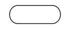     |        Terminal         |               as the beginning (contains 'Start') and as the end (contains 'End'/'Stop').               |
| 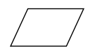 |      Input/Output       |                                     Reads input or displays output.                                     |
| 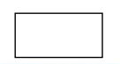       |   Process/Processing    |                        Processes data through arithmetic and logical operations.                        |
| 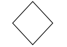     | Decision/(decision box) | Functions to decide the direction/branch taken according to the fulfilled condition, namely True/False. |
| 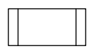     |  Subroutine/subprogram  |                       To execute the process of a part (subprogram) or procedure.                       |
| 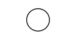     |    On page Connector    |              to connect a disconnected flowchart where the part is still on the same page.              |
| 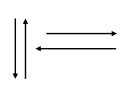     |   Flowline/Data flow    |                             The direction part of the executed instruction.                             |
| 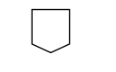     |   Off page Connector    |    Connects a connection from a disconnected flowchart part where the connection is on another page.    |
| 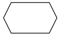  |       Preparation       |                                   Used for initial value assignment.                                    |

# Computer Program Flowchart

Basically a computer program generally consists of:

1. Reading / entering data into the computer
2. Performing computation/calculation on the data
3. Outputting / printing/ displaying the results.

## Flowchart consists of three structures

1. Sequence Structure / Simple Structure Used for programs whose instructions are sequential

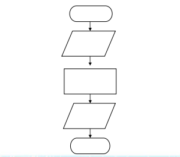

## Example of Sequence Structure Flowchart Calculating Triangle Area

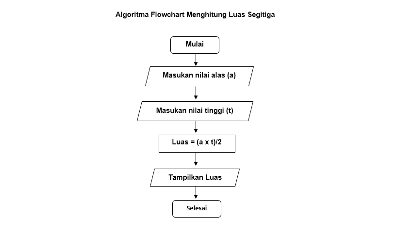

### Using Storage Tables

Table 1. Sequence Storage Media 1

| Command   |  A  |  B  | Output |
| :-------- | :-: | :-: | :----: |
| A <- 10   | 10  |     |        |
| A <- 2\*A | 20  |     |        |
| B <- A    |     | 20  |        |
| Write(B)  |     |     |   20   |

Table 2. Sequence Storage Media 2

| Command      |  X  |  Y  |  Z  | Output |
| :----------- | :-: | :-: | :-: | :----: |
| X <- 100     | 100 |     |     |        |
| Y <- X-25    |     | 75  |     |        |
| Z <- Y/5     |     |     | 15  |        |
| X <- X/(Z+5) |  5  |     |     |        |
| Write(X,Y,Z) |     |     |     |        |

# Summing Two Positive Numbers

Create a flowchart to sum two positive integers and print the result. The algorithm:

- Enter number a
- Enter number b
- Sum numbers a and b
- Print the sum result

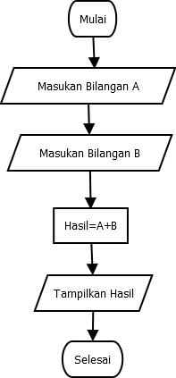

# Determining Even/Odd Numbers

Branching Structure Used for programs that use condition selection. (example determining even/odd numbers)

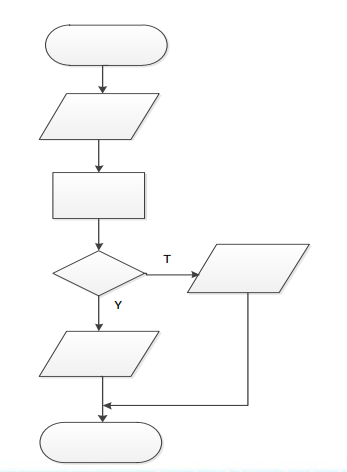

**The algorithm:**

1. Enter a number
2. Divide the number by 2
3. If the remainder of the division = 0 then the number is an even number
4. If the remainder of the division = 1 then the number is an odd number

**Pseudocode:**

```
read number
If number mod 2 = 0 then
“Even Number”
Else
“Odd Number”
```

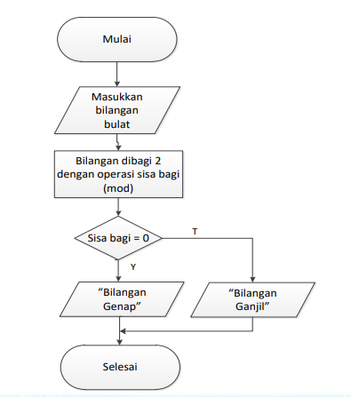

# Looping Flowchart

Looping Structure Used for programs whose instructions will be executed repeatedly.

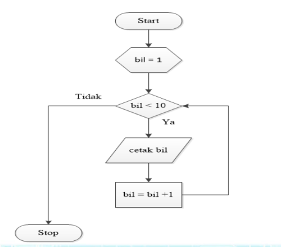
