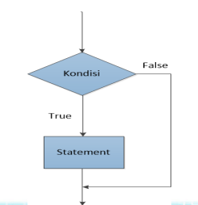
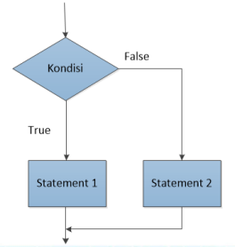
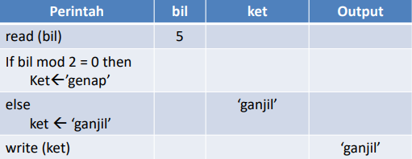
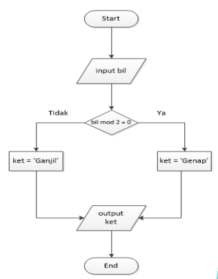
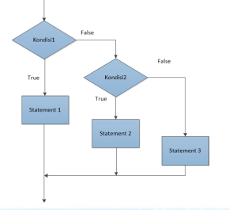
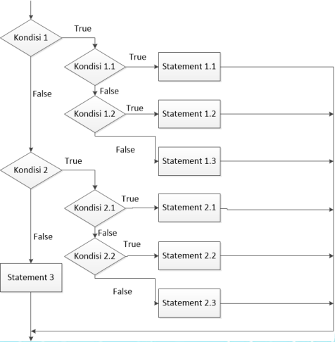

Branching structures in Python programming are:

1. `if` Branching Structure
2. `if else` Branching Structure
3. `if elif else` Branching Structure
4. `nested if` Branching Structure

## 1. `if` Branching Structure

The `if` branching structure is used for a single decision choice. If the condition is True, the statement is executed. If the condition is False, the statement is not executed.

**General Form**

```
if condition:
  statement
```

`if` flowchart:



### Example `if` condition

If the Exam Score >= 70, then print "Congratulations You Passed the Exam". The Python program code is as follows:

```py
# if Branching structure
Nilai = input('Enter Your Score: ')
if Nilai >= '70':
print('Congratulations You Passed the Exam')

# Output
75
Congratulations You Passed the Exam
```

## 2. `if else` Branching Structure

The `if ... else` branching will evaluate a condition. If it evaluates to True, statement1 is executed; if the condition evaluates to False, statement2 is executed.

**General Form:**

```
if condition:
  statement1
else:
  statement2
```



### Determining Even or Odd Numbers

**Problem:** Create an algorithm to determine whether a given number is even or odd.

**Problem Identification:**

**Input:** Integer

**Output:** "Odd" or "Even" number.

```
algorithm even_odd_number
Declaration
Bil: integer
Ket: string
Begin
  Read (bil)
  If bil mod 2 = 0 then
    ket <- 'even'
  Else
    ket <- 'odd'
  Write (ket)
end
```

Initially, a variable (bil) is inputted, for example, 5. Because the condition (bil mod 2 = 0) is false, the `ket` variable becomes the one after `else`, which is 'odd', so the `write (ket)` command outputs 'odd'.



### Even/Odd Number Flowchart



### Example `if else` Program to Determine Odd or Even Numbers

```py
# if ... else Branching structure
bilangan = int(input('Enter A Number: '))
if bilangan % 2 == 0:
    print("Number {} is even.".format(bilangan))
else:
    print("Number {} is odd.".format(bilangan))
```

```yml
Running Result:
Enter A Number: 9
Number 9 is odd.

Enter A Number: 6
Number 6 is even.
```

## 3. `if elif else` Branching Structure

Used to test more than 2 conditions. If condition1 is true, statement1 is executed. If false, it proceeds to condition2. If condition2 is true, statement2 is executed, and if false, statement3 is executed.

**General form:**

```
if condition1:
  statement1
elif condition2:
  statement2
else:
  statement3
```



### Example `if elif else` Program

```py
# if ... elif ... else Branching Structure
Nilai = input('Enter Final Score: ')
if Nilai >= 80:
  print('Grade = A')
elif Nilai >= 70:
  print('Grade = B')
elif Nilai >= 60:
  print('Grade = C')
elif Nilai >= 40:
  print(Grade = D)
else:
  printf(Grade = E)
```

```yml
Running Result:
Enter Final Score: 70
Grade = B
>>>

Enter Final Score: 90
Grade = A
>>>

Enter Final Score: 65
Grade = C
>>>
```

## 4. `Nested if` Branching Structure

**Nested if**

A nested if condition is an `if` condition inside another `if` condition.

**General form:**

```
if condition1:
  if condition 1.1:
    statement 1.1
  elif condition 1.2:
    statement 1.2
  else:
    statement 1.3
elif condition2:
  if condition 2.1:
    statement 2.1
  elif condition 2.2:
    statement 2.2
  else:
    statement: 2.3
  else:
    statement3
```



### Example Nested if Program

```py
# Nested If Branching Structure
# Shirt Brand Polo/Alisan/StYess
Merk = input('Shirt Brand P/A/S: ')

if Merk == 'P':
    print('Brand Polo')
    ukuran = input('Size L/M/S: ')
    if ukuran == 'L':
        print('Price = 300000')
    elif ukuran == 'M':
        print('Price = 225000')
    else:
        print('Price = 175000')
elif Merk == 'A':
    print('Brand Alisan')
    ukuran = input('Size L/M/S: ')
    if ukuran == 'L':
        print('Price = 275000')
    elif ukuran == 'M':
        print('Price = 200000')
    else:
        print('Price = 150000')
elif Merk == 'S':
    print('Brand StYess')
    ukuran = input('Size L/M/S: ')
    if ukuran == 'L':
        print('Price 250000')
    elif ukuran == 'M':
        print('Price = 175000')
    else:
        print('Price = 125000')
else:
    print('Invalid Brand')

```

```yml
Running Result:
Shirt Brand P/A/S: P
Brand Polo
Size L/M/S: L
Price = 300000
Shirt Brand P/A/S: A
Brand Alisan
Size L/M/S: S
Price = 150000
```


**Note:** Shirt Brand and Size are inputted with Uppercase Letters.

