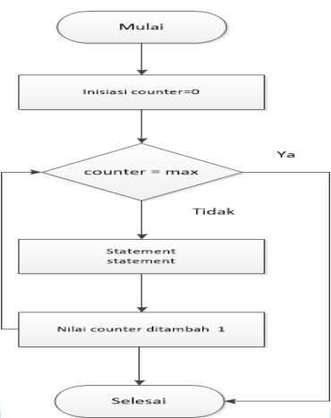
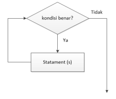
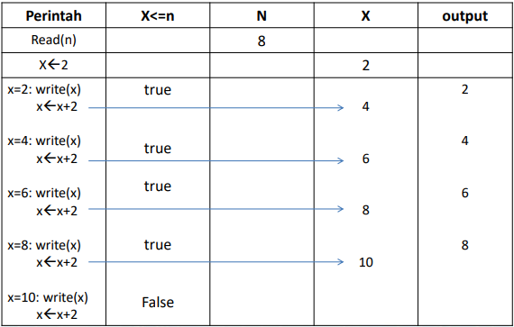

A repetition (looping) instruction is an instruction that can repeat the execution of a series of other instructions repeatedly according to specified conditions. The structure of a looping instruction basically consists of:

1. Loop condition. A condition that must be met for the loop to occur.
2. Loop body. A series of instructions whose execution will be repeated.
3. Loop counter. A variable whose value must change for the loop to occur and ultimately limit the number of loops that can be executed.

## Loop Forms in Python

1. `For` Loop. A loop that executes the "same statement block" repeatedly based on specified requirements or conditions.
2. `While` Loop. A loop that executes commands as long as the condition evaluates to true.
3. Nested Loop. A loop inside a loop.

### 1. `For` Loop

**General Form**

```
For variable in range:
  statements
```

**Flowchart - For**



#### Displaying a Series of Numbers

```
Algorithm series
Declaration
  n, i : integer
Begin
  read(n)
  for i in range n
    write(i)
End
```

```py
# Display Number Series
n = int(input('Amount of Data: '))
for i in range(n):
    print(i)

# Output
Amount of Data : 5
0 1 2 3 4
```


**Note:** In Python, looping with the Range function starts from 0


Algorithm explanation: First input the value n, for example: 5, then a loop occurs with i=0 up to n. The loop is executed as long as the condition is true. Then `write (i)` produces output 0 etc., the process
**is repeated again until i is less than the value of n.**

| Command       |  n  | i=0..n |  i  | Output |
| :------------ | :-: | :----: | :-: | :----: |
| read(n)       |  5  |        |     |        |
| i=0: write(i) |     |  true  |  0  |   0    |
| i=1: write(i) |     |  true  |  1  |   1    |
| i=2: write(i) |     |  true  |  2  |   2    |
| i=3: write(i) |     |  true  |  3  |   3    |
| i=4: write(i) |     |  true  |  4  |   4    |
| i=5: write(i) |     | false  |     |        |

### 2. `While` Loop

The loop will continue to be executed as long as the condition is True/correct.

**General Form**

```
while condition:
  statement(s)
```

**While Loop Flowchart**



1. There is an instruction related to the condition before entering the `while` so that this condition is true (met) and the repetition can be executed.
2. There is an instruction among the repeated instructions that changes the value of the loop variable so that when the loop condition is not met, the loop stops.

#### Displaying a Series of Even Numbers

```
Algorithm series
Declaration
  n, x : integer
Begin
    read(n)
    x <- 2
    while x <= n do
        write(x)
        x <- x + 2
End
```

```py
# Display a Series of Even Numbers
n = int(input('Enter the Value of N: '))
x = 2
while x <= n:
    print(x, end=" ")
    x = x + 2

# Output
Enter the Value of N : 8
2 4 6 8
```

First input the value n = 8, then x is given the value 2, after that x is compared with n. If (x<=n) is true then x is displayed then x is added by 2 and produces a new x value. After that the data goes back up and tests if (X<=N) is true, if yes the same process as before is done again. And so on until (x<=n) is false.

#### Series Storage Table



#### While algorithm to display numbers 1 to 15

```
Algorithm While_Loop
{printing numbers 1 to 15}
Declaration
number = 1

Description
  while number <= 15:
    print number
number <- number + 1
```

#### Python Program to Print numbers 1 to 15

```py
# While Loop
angka = 1
while angka <= 15:
  print ("Number: ", angka)
  angka = angka + 1
print ("Thank You")

# Output
Running Result :
Number: 1
Number: 2
Number: 3
Number: 4
Number: 5
Number: 6
Number: 7
Number: 8
Number: 9
Number: 10
Number: 11
Number: 12
Number: 13
Number: 14
Number: 15
Thank You
```

##### Python Program to Print numbers Descending from 10 to 1

```py
# While Loop
# Printing numbers 10 to 1
bil = 10
while bil > 0:
    print(bil)
    bil = bil - 1
print("Result of Printing Numbers in Descending Order")

# Output
10
9
8
7
6
5
4
3
2
1
Result of Printing Numbers in Descending Order
```

#### Python Program to Determine if a Number is Prime or Not

```py
# Input number
bilangan = int(input("Enter Number: "))

# Prime numbers must be greater than 1
if bilangan > 1:
    for i in range(2, bilangan):
        if (bilangan % i) == 0:
            print(bilangan, "is not a prime number")
            print(i, "times", bilangan // i, "=", bilangan)
            break
    else:
        print(bilangan, "is a prime number")
# If the number is less than or equal to one
else:
    print(bilangan, "is not a prime number")

# Output
Enter Number : 137
137 is a prime number

Enter Number : 147
147 is not a prime number
3 times 49 = 147
```

#### BREAK Command;

Functions to exit a `for` or `while` loop, its general form is:

```yml

...

...
break
...

...
```

##### Python Program Using the Break Command

```py
# break command in a for loop
# The program will exit after printing numbers up to 6 because of the break command
bil = 6
for i in range(0, 10):
    print(i)
    if i == bil:
        break

# Output
0
1
2
3
4
5
6
```


**Note:** Looping will continue to be executed until forced out by a `break;` instruction


#### Continue Command:

The `Continue` function will perform the repetition starting from the beginning again.

```py
# Use of continue in while
bil = 0
pilihan = 'y'

while (pilihan != 'n'):
    bil = int(input("Enter a number below 50: "))
    if (bil > 50):
        print("Number exceeds 50, Please try again.")
        continue
    print("The square of this number is: ", bil * bil)
    pilihan = input("Do you want to try again (y/n)? ")

# Output
Enter a number below 50: 20
The square of this number is: 400
Do you want to try again (y/n)? y
Enter a number below 50: 36
The square of this number is: 1296
Do you want to try again (y/n)? y
Enter a number below 50: 70
Number exceeds 50, Please try again.
Enter a number below 50: 25
The square of this number is: 625
Do you want to try again (y/n)? n
```

### 3. Nested Loop

General Form of Nested While:

```
While condition:
  while condition:
    statement(s)
  statement(s)
```

General Form of Nested For:

```
for variable in range:
  for variable in range:
    statement(s)
  statement(s)
```

#### Python Program Using Nested While to Print Prime Numbers between 1 - 50

```py
# Program Using Nested While
# To print prime numbers between 1 and 50

i = 2
while(i < 50):
    j = 2
    while(j <= (i/j)):
        if not(i % j):
            break
        j = j + 1
    if (j > i/j):
        print(i, "is a Prime Number")
    i = i + 1

print("Thank You")

# Output
2 is a Prime Number
3 is a Prime Number
5 is a Prime Number
7 is a Prime Number
11 is a Prime Number
13 is a Prime Number
17 is a Prime Number
19 is a Prime Number
23 is a Prime Number
29 is a Prime Number
31 is a Prime Number
37 is a Prime Number
41 is a Prime Number
43 is a Prime Number
47 is a Prime Number
Thank You
```

#### Python Program

1. Create a Program to print even numbers from 1 to 10:

```py
for i in range(2,12,2):
    print(i)

# Output
2
4
6
8
10
```

2. Create a program to sum Numbers 1 to 10

```py
jum = 0
for i in range(10):
    i = i + 1
    print(i)
    jum = jum + i

print("The Sum of Numbers 1 - 10 is: ", jum)

#Output
1
2
3
4
5
6
7
8
9
10
The Sum of Numbers 1 - 10 is: 55
```

3. Create a program to draw a right-angled triangle by inputting an integer.

**Input & output format:**

Input is an integer with the range: 1 ≤ 𝑁 ≤ 100.

The program output is the '\*' character depicting a right-angled triangle pattern.

```py
# Ask the user for a positive integer input
n = int(input("Enter a Positive Integer: "))

# Input validation, ensure n is a positive integer
if n <= 0:
    print("Invalid input. Please enter a positive integer.")
else:
    # Perform a nested for loop to generate the right-angled pattern
    for i in range(0, n):
        for j in range(0, i + 1):
            print('* ', end='')
        print('')  # Move to the next line after each line of stars is complete

# Output
*
* *
* * *
* * * *
* * * * *
```
