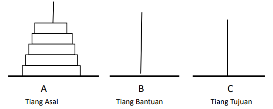

**Recursion** is a process that can call itself.

_Example of Recursion Concept_  
**Problem** : Slicing bread thinly until it runs out  
**Algorithm** :

1. If the bread runs out or the slice is the thinnest possible, the bread slicing is complete.
2. If the bread can still be sliced, cut a thin slice from the edge of the bread, then perform procedures 1 and 2 for the remaining part.

# Examples of Recursive Functions

1. Power function (Exponentiation)
2. Factorial
3. Fibonacci
4. Tower of Hanoi

# Power Function

Calculating 10 to the power of n using the recursive concept.

In programming notation, it can be written as:

10<sup>0</sup> = 1 ................................................ (1)  
10<sup>n</sup> = 10 \* 10<sup>n-1</sup> .............................. (2)

Example:  
10<sup>3</sup> = 10 _ 10<sup>2</sup>  
 10<sup>2</sup> = 10 _ 10<sup>1</sup>  
 10<sup>1</sup> = 10 \* 10<sup>0</sup>  
 10<sup>0</sup> = 1

## Power Function Program

```py
# Recursive Power Function
def pangkat(x, y):
    if y == 0:
        return 1
    else:
        return x * pangkat(x, y - 1)

x = int(input("Enter Value X: "))
y = int(input("Enter Value Y: "))
print("%d to the power of %d = %d" % (x, y, pangkat(x, y)))

# Output
Enter Value X: 10
Enter Value Y: 3
10 to the power of 3 = 1000
```

- The power function will call itself; each inputted x and y value will be sent to the `pangkat()` function through the parameters `x` and `y`.
- As long as the value of y is not 0, the `pangkat()` function will continue calling itself, and the value of y will always decrease by 1 (y-1) until the condition is met and the repetition stops.

# Factorial

0! = 1  
N! = N x (N-1)! For N > 0

In programming notation, it can be written as:  
FAKT(0) = 1 .............................................. (1)  
FAKT(N) = N \* FAKT(N-1) .................................. (2)

Example:  
FAKT(5) = 5 _ FAKT(4)  
FAKT(4) = 4 _ FAKT(3)  
FAKT(3) = 3 _ FAKT(2)  
FAKT(2) = 2 _ FAKT(1)  
FAKT(1) = 1 \* FAKT(0)

## Recursive Factorial Calculation

Calculate 5!, it can be done recursively as follows: 5! = 5 \* 4!

Recursively, the value of 4! can be recalculated as 4 _ 3!, so 5! becomes: 5! = 5 _ 4 \* 3!

Recursively, the value of 3! can be recalculated as 3 _ 2!, so 5! becomes: 5! = 5 _ 4 _ 3 _ 2!

Recursively, the value of 2! can be recalculated as 2 _ 1, so 5! becomes: 5! = 5 _ 4 _ 3 _ 2 \* 1 = 120.

## Factorial Program

```py
# Recursive Factorial Function
def faktorial(a):
    if a == 1:
        return a
    else:
        return a * faktorial(a - 1)

bil = int(input("Enter a Number: "))
print("%d! = %d" % (bil, faktorial(bil)))

# Output
Enter a Number : 5
5! = 120

Enter a Number : 6
6! = 720
```

## Factorial Function

- The Factorial function is a recursive function because it calls itself.
- When executed, the program will prompt to "Enter a Number" into the variable `bil`, then the number will be sent to the `faktorial()` function via parameter `a`.
- As long as the value of `a` is not 1, the factorial function will continue calling itself. The repetition will stop when the value = 1.

# Fibonacci

Fibonacci Sequence : 0, 1, 1, 2, 3, 5, 8, 13, .........

In programming notation, it can be written as:  
Fibo(1) = 0 & Fibo(2) = 1 ........................................ (1)  
Fibo(N) = Fibo(N-1) + Fibo(N-2) ................................. (2)

Example:  
Fibo(5) = Fibo(4) + Fibo(3)  
Fibo(4) = Fibo(3) + Fibo(2)  
Fibo(3) = Fibo(2) + Fibo(1)

## Fibonacci Sequence Program

```py
def fibonacci(n):
    if n == 0 or n == 1:
        return n
    else:
        return fibonacci(n - 1) + fibonacci(n - 2)

x = int(input("Enter Fibonacci Sequence Limit: "))
print("Fibonacci Sequence:")
for i in range(x):
    print(fibonacci(i), end=' ')

# Output
Enter Fibonacci Sequence Limit: 5
Fibonacci Sequence
0 1 1 2 3

Enter Fibonacci Sequence Limit: 8
Fibonacci Sequence
0 1 1 2 3 5 8 13
```

## Fibonacci Function

- The Fibonacci function is a recursive function that calls itself.
- Fibonacci numbers are numbers that have initial terms of 0 and 1, and the next term is the sum of the previous two terms.
- The Fibonacci function will keep calling itself when (value `n`) is not 0 or 1 by performing an addition process (`fibonacci(n-1) + fibonacci(n-2)`).

# Tower of Hanoi Concept



- If n=1, then simply move the disk from peg A to peg C & done.
- Move the top n-1 disks from peg A to peg B.
- Move the nth disk (last disk) from peg A to peg C.
- Move n-1 disks from peg B to peg C.

The moving steps above can be changed into the following notation:

**Tower(n, source, auxiliary, destination)**

- For a number of disks n > 1, it can be divided into 3 resolution notations:
- Tower(n-1, Source, Destination, Auxiliary);
- Tower(n, Source, Auxiliary, Destination); or Source -> Destination;
- Tower(n-1, Auxiliary, Source, Destination);

## Disk Moving Steps

1. **TOWER(1, A, C, B)**  
   Move disk from peg A to peg B: A → B

2. **TOWER(2, A, B, C)**  
   Move two disks from peg A to peg C: A → C  
   Move one disk from peg A to peg B: A → B

3. **TOWER(1, B, A, C)**  
   Move disk from peg B to peg C: B → C

4. **TOWER(3, A, C, B)**  
   Move three disks from peg A to peg B: A → B  
   Move one disk from peg A to peg C: A → C  
   Move two disks from peg A to peg B: A → B

5. **TOWER(1, C, B, A)**  
   Move disk from peg C to peg A: C → A

6. **TOWER(2, C, A, B)**  
   Move two disks from peg C to peg B: C → B  
   Move one disk from peg C to peg A: C → A

7. **TOWER(1, A, C, B)**  
   Move disk from peg A to peg B: A → B

8. **TOWER(1, A, C, B)**  
   Move one disk from peg A to peg C: A → C

9. **TOWER(4, A, B, C)**  
   Move four disks from peg A to peg B: A → B  
   Move one disk from peg B to peg C: B → C  
   Move two disks from peg B to peg A: B → A  
   Move one disk from peg C to peg B: C → B  
   Move three disks from peg A to peg C: A → C  
   Move one disk from peg A to peg B: A → B  
   Move two disks from peg A to peg C: A → C  
   Move one disk from peg B to peg A: B → A  
   Move one disk from peg B to peg C: B → C  
   Move one disk from peg A to peg B: A → B  
   Move one disk from peg C to peg A: C → A

10. **TOWER(1, B, A, C)**  
    Move disk from peg B to peg C: B → C

The illustration above produces 15 completion steps from the Tower of Hanoi concept problem with 4 disks.

For a video of the Tower of Hanoi concept, it can be seen at:  
[Link](https://www.mathsisfun.com/games/towerofhanoi.html)

**Moving Steps Formula:**  
2<sup>N</sup> - 1  
**N = Number of Disks**
