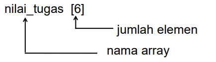
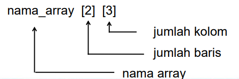
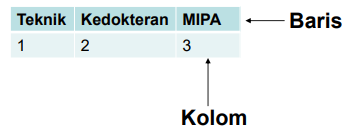
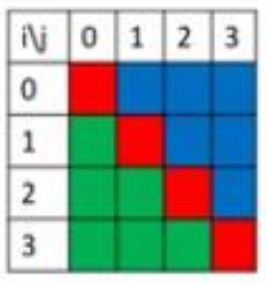
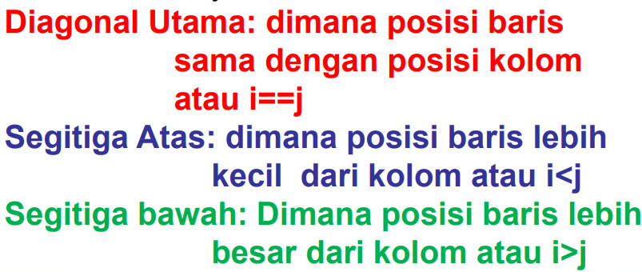

## Arrays

- An array is a type of variable that can be used to store a set of data of the same type (Kadir, 2017).
- An array is also called a table, vector, or list.

## Purpose of using Arrays:

You can easily loop or iterate through elements in an array and retrieve the required value just by specifying the index number.

Each element in an array is accessed by distinguishing its index/subscript.  
Example 1:  
A[1] = 3  
A[2] = 5  
A[3] = 10

Example 2:  
Array of integers [1, 2, 3, 4, 5], the index starts from 0 to (n-1), where n is the length of the array.

Program code to create and display an array:

```py
import numpy as np

a = np.array([[1, 2, 3, 4],
              [5, 6, 7, 8],
              [9, 10, 11, 12]])

print(a)

# Output
[[1  2  3  4]
 [5  6  7  8]
 [9 10 11 12]]
```

## Array Dimensions Consist of:

1. One-Dimensional Array
2. Two-Dimensional Array

### 1. One-Dimensional Array

A variable that stores a set of data of the same type and elements are accessed through only 1 index or subscript.

General Form:  
 `Array_name[number_of_elements]`  
Example:



\*\*Example of a 1-Dimensional Array Program:

```py
assignment_scores = [70, 80, 90, "Passed Remark"]
print("Assignment Scores:")
print(assignment_scores)

# Output
Assignment Scores:
[70, 80, 90, 'Passed Remark']
```

### 2. Two-Dimensional Array

- A two-dimensional array is also referred to as a nested array or nested list.
- A two-dimensional array consists of rows and columns.

General Form:  
`array_name[number_of_row_elements] [number_of_column_elements]`  
Example:



**Program Example:**

```py
array=[["Engineering","Medicine","Math & Science"],[1,2,3]]
print(array)

# Output
[['Engineering', 'Medicine', 'Math & Science'], [1, 2, 3]]
```

The two-dimensional array example shows a two-dimensional array with a size of 2x3 containing the order of faculties based on their difficulty level. The first row represents the names of the faculties and the second row represents the difficulty level.



# Matrix

- A matrix is a Data Presentation
- Matrix terms include: Order **(Matrix dimensions containing rows and columns)**, elements, rows, and columns.

Example: m = row, n = column  
m x n:  
a<sub>11</sub> a<sub>12</sub> a<sub>13</sub>.....a<sub>1n</sub>  
a<sub>21</sub> a<sub>22</sub> ......a<sub>2n</sub> -> elements  
a<sub>m1</sub> a<sub>m2</sub> ......a<sub>mn</sub>

2 1 2  
3 0 1 -> Order 3x3  
2 0 0

Result:

- a<sub>11</sub> = 2, a<sub>21</sub> = 3, a<sub>31</sub> = 2
- a<sub>12</sub> = 1, a<sub>22</sub> = 0, a<sub>32</sub> = 0
- a<sub>13</sub> = 2, a<sub>23</sub> = 1, a<sub>33</sub> = 0

## Matrix in Python Programming



Created just like a 2-dimensional array. Usually accessed in the form A[i][j] where:

- A = matrix name
- I = row index
- J = column index  
  There are 3 main parts in a square matrix (same order), namely:



### Two-Dimensional Array

Given matrix A as follows:  
1 1 1 1  
0 1 1 1  
0 0 1 1  
0 0 0 1  
The main command used to fill matrix A is:  
**A[i,j] = 1, if i <= j, A[i,j] = 0, if i > j**

Program:

```py
# 4x4 matrix declaration
matriks = [[0, 0, 0, 0], [0, 0, 0, 0], [0, 0, 0, 0], [0, 0, 0, 0]]

# Fill 4x4 matrix
for i in range(4):
    for j in range(4):
        if i == j:
            matriks[i][j] = 1
        if i < j:
            matriks[i][j] = 1
        if i > j:
            matriks[i][j] = 0

# Print matrix form
for i in range(4):
    print(matriks[i])
```

#### Exercises

1. Given matrix A as follows:  
   1 2 3 4  
   0 2 3 4  
   0 0 3 4  
   0 0 0 4  
   The main command used to fill matrix A is:

2. Given the following algorithm:

```py
nilai = [1, 2, 3, 4]

for i in range(len(nilai)):
    nilai[i] = 2 * i + 1
    print(nilai[i])
```

The algorithm above will produce the value..
