Graph merupakan cabang matematika yang dapat diterapkan dalam kehidupan sehari-hari, teori graph dapat memecahkan banyak masalah yang ada (Ramadhan et al., 2018).

Graph digunakan untuk bermacam-macam disiplin ilmu dan kehidupannya sehari-hari. Graph digunakan di berbagai bidang(kimia, ekologi, genetika, olahraga, transportasi, kartografi, dan jaringan komputer) untuk memodelkan masalah (Didiharyono& Soraya, 2018) dan (Rahadi, 2019).

Permasalahan yang bisa dipecahkan menggunakan data graph adalah:

1. Travelling Salesman
2. Permasalahan pencarian pohon rentang minimum (Minimum Spanning Tree Problem)
3. Permasalahan path minimum (Shortest path problem)
4. Coloring (Pewarnaan)

## 1. Travelling Salesman

Untuk menentukan waktu perjalanan seorang salesman seminimal mungkin.

#### Permasalahan:

Setiap minggu sekali, seorang petugas kantor telepon berkeliling untuk mengumpulkan coin-coin pada telepon umum yang dipasang diberbagai tempat. Berangkat dari kantornya, ia mendatangi satu demi satu telepon umum tersebut dan akhirnya kembali ke kantor lagi. Masalahnya ia menginginkan suatu rute perjalanan dengan waktu minimal.

### Medel Graph

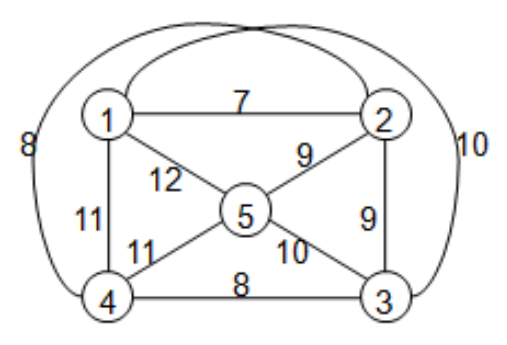

#### Misalnya

Kantor pusat adalah simpul 1 dan misalnya ada 4 telepon umum, yang kita nyatakan sebagai simpul 2, 3, 4 dan 5 dan bilangan pada tiap-tiap ruas menunjukan waktu ( dalam menit ) perjalanan antara 2 simpul.

#### Langkah penyelesaian:

1. Dimulai dari simpul yang diibaratkan sebagai kantor pusat yaitu simpul 1
2. Dari simpul 1 pilih ruas yang memiliki waktu yang minimal.
3. Lakukan terus pada simpul–simpul yang lainnya tepat satu kali yang nantinya Graph akan membentuk Graph tertutup karena perjalanan akan kembali ke kantor pusat.
4. Problema diatas menghasilkan waktu minimalnya adalah 45 menit dan diperoleh perjalanan sbb :

Problema diatas menghasilkan waktu minimalnya adalah **45** menit dan diperoleh perjalanan sebagai berikut :

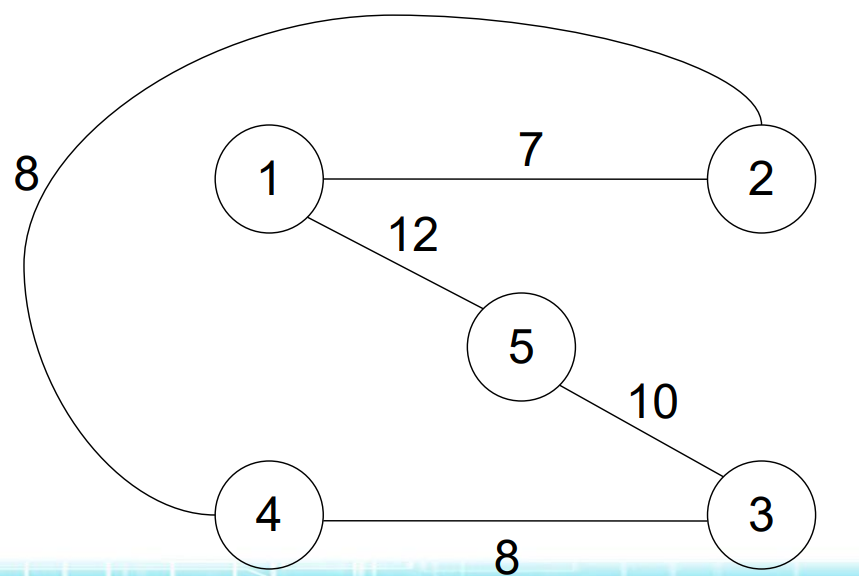

## 2. Minimum Spanning Tree

### Kasus MST Problem

Mencari minimum biaya (cost) spanning tree dari setiap ruas (edge) graph yang membentuk pohon (tree).

### Solusi dari permasalahan ini:

1. Dengan memilih ruas suatu graph yang memenuhi kriteria dari optimisasi yang menghasilkan biaya minimum.
2. Penambahan dari setiap ruas pada seluruh ruas yang membentuk graph akan menghasilkan nilai/biaya yang kecil (minimum cost).

### Kriteria dari Minimum Spanning Tree, yaitu :

1. Setiap ruas pada graph harus terhubung (connected)
2. Setiap ruas pada graph harus mempunyai nilai (label graph)
3. Setiap ruas pada graph tidak mempunyai arah (graph tidak berarah)

### Proses Total minimum cost terbentuknya graph dengan tahapan sebagai berikut:

- Dari graph yang terbentuk, apakah memenuhi kriteria MST.
- Lakukan secara urut dari simpul ruas awal s/d ruas akhir
- Pada setiap simpul ruas perhatikan nilai/cost dari tiap-tiap ruas
- Ambil nilai yang paling kecil (jarak tertpendek setiap ruas).
- Lanjutkan s/d semua simpul ruas tergambar pada spanning tree
- Jumlahkan nilai/cost yang dipilih tadi.

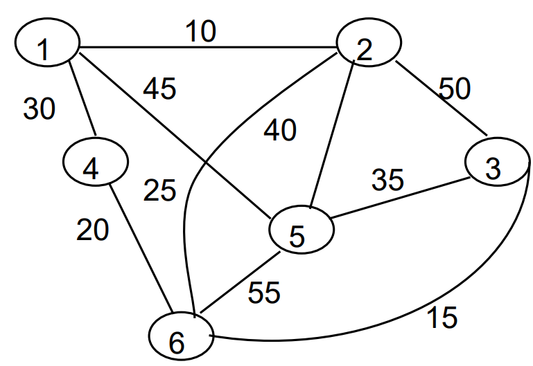

Kriteria :

√ graph terhubung 
√ graph tidak berarah 
√ graph mempunyai label

Tentukan nilai MST dari graph di atas serta tentukan ruas (edge) yang membentuk MST

### Penyelesaian MINIMUM SPANNING TREE Perhatikan Kriteria dari MST, yaitu:

1.Graph sudah merupakan graph terhubung
2.Graph merupakan graph yang tidak berarah
3.Masing-masing ruasnya mempunyai label

### Menghitung MST dari tiap-tiap ruas yang membentuk graph tersebut dengan cara:

a. Dilakukan secara urut dari ruas/edge pertama sampai dengan edge terakhir. 
b. Setiap ruas/edge harus digambarkan pada spanning tree yang terbentuk.

### Tahapan Proses Penyelesaian dari edge (ruas), Cost(biaya) dan spanning tree

| Edge (Ruas) | Cost (Biaya) |    Spanning Tree     |
| :---------: | :----------: | :------------------: |
|    (1,2)    |      10      | 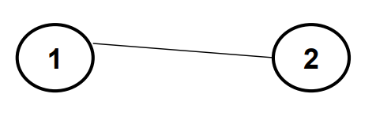 |
|    (2,6)    |     (25)     | 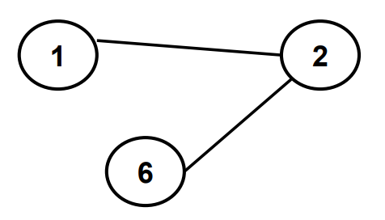 |
|    (3,6)    |      15      | 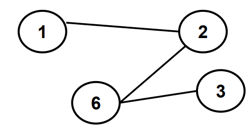 |
|    (4,6)    |      20      | 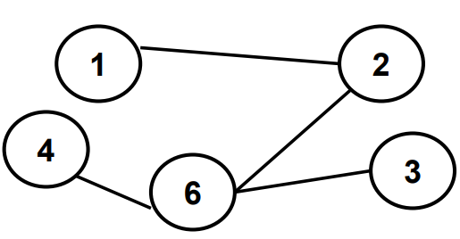 |
|    (3,5)    |      35      | 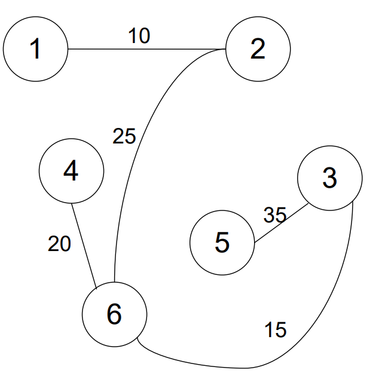 |
| Total Cost  |     105      |                      |

## 3. Shortest Path Problem

**Permasalahan:** Menghitung jalur terpendek dari sebuah graph berarah.

### Kriteria untuk permasalahan Shortest Path problem tersebut :

1. Setiap ruas pada graph harus mempunyai nilai (label graph)
2. Setiap ruas pada graph tidak harus terhubung (unconnected)
3. Setiap ruas pada graph tersebut harus **mempunyai** arah (graph berarah).

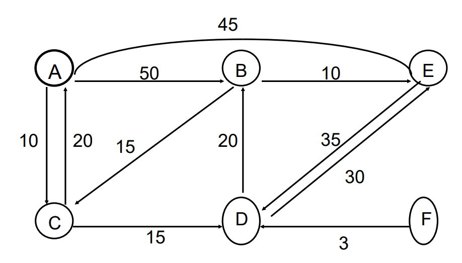

1. Hitung jarak satu per satu sesuai dengan arah yang ditunjukkan oleh tiap-tiap ruas.
2. Perhitungan dilakukan terhadap ruas graph yang memiliki jalur awal dan akhir.

#### Penyelesaian

- Pertama: Melihat proses simpul yang mempunyai awal dan akhir tujuan dari graph, yaitu: A – B, A – C, A – D, A – E
- Kedua: Mencari jalur terpendek dari tiap-tiap proses keempat jalur tersebut dengan menghitung panjang tiap-tiap jalur.

#### Langkah 1 Penyelesaian Jalur A - B

- A -B = 50
- A -C - D- B = 10 + 15 + 20 = 45
- A - E - D - B = 45 + 35 + 20 = 100

Jalur terpendek untuk simpul A tujuan B adalah:

A – C – D – B = 45

#### Langkah 2 Penyelesaian Jalur A - C

- A – C = 10
- A – B – C = 50 + 15 = 65
- A – B – E – D – B – C = 50 + 10 + 35 + 20 + 15 = 130
- A – E – D – B – C = 45 +35 +20 + 15 = 115

Jalur terpendek untuk simpul A tujuan C adalah:

A – C = 10

#### Langkah 3 Penyelesaian Jalur A - D

- A – C – D = 10 + 15 = 25
- A – B – E – D = 50 + 10 + 35 = 95
- A – B – C – D = 50 + 15 + 15 = 80
- A – E – D = 45 + 35 = 80

Jalur terpendek untuk simpul A tujuan D adalah:

A – C – D = 25

#### Langkah 4 Penyelesaian Jalur A - E

- A – E = 45
- A – B – E = 50 + 10 = 60
- A – C – D – B – E = 10 + 15 + 20 + 10 = 55
- A – C – D – E = 10 + 15 + 30 = 55

Jalur terpendek untuk simpul A tujuan E adalah

A – E = 45

#### Tabel Jalur SHORTEST PATH PROBLEM

| Jalur         | Panjang Jarak |
| ------------- | ------------- |
| A – C         | 10            |
| A – C – D     | 25            |
| A – C – D – B | 45            |
| A – E         | 45            |

## 4. Coloring (Pewarnaan)

### Permasalahan pada Pewarnaan (Coloring)

- Problema pemberian warna kepada semua simpul, sedemikian sehingga 2(dua) simpul yang berdampingan (ada ruas menghubungkan ke dua simpul tersebut) mempunyai warna yang berbeda.
- Banyak warna yang dipergunakan, diminta seminimal mungkin

### Contoh 1: Pola Lampu Lalu Lintas

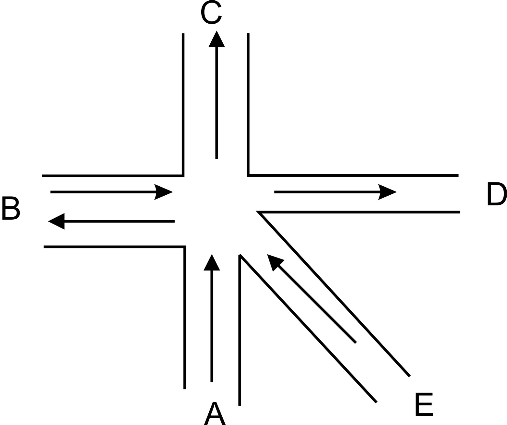

#### Permasalahan :

Menentukan pola lampu lalulintas dengan jumlah fase minimal, dan pada setiap fase tidak ada perjalanan yang saling melintas. Perjalanan yang diperbolehkan adalah :

A ke B, A ke C, A ke D, B ke C, B ke D, E ke B, E ke C dan E ke D

#### Langkah-langkah penyelesaian masalah

1. Tentukan simpul dari perjalanan yang diperbolehkan (untuk peletakan simpulnya bebas)
2. Tentukan ruas untuk menghubungkan 2 simpul yg menyatakan 2 perjalanan yg saling melintas

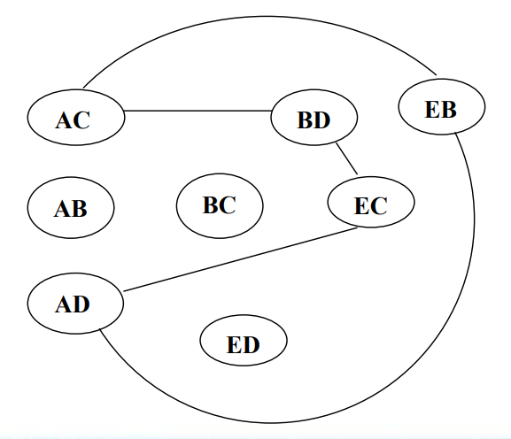

3. Beri warna pada setiap simpul dengan warna warna baru.

- Bila Simpul berdampingan maka berilah warna lain
- Bila simpul tidak bedampingan maka berilah warna yang sama

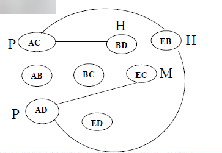

4. Kita lihat Bahwa simpul AB, BC dan ED tidak dihubungkan oleh suatu ruas jadi untuk simpul tersebut tidak pernah melintas perjalanan-perjalanan lain dan simpul tersebut selalu berlaku lampu hijau
5. Tentukan pembagian masing–masing simpul yang sudah diberikan warna.

Putih = ( AC, AD ) 
Hitam = ( BD, EB ) 
Merah = ( EC )

> Catatan : Pembagian simpul berdasarkan simpul yang tidak langsung berhubungan seminimal mungkin **(BISA DILAKUKAN DENGAN BEBERAPA KEMUNGKINAN)**

6. Dari langkah ke 5 diperoleh 3 fase, sehingga bisa kita simpulkan keseluruhan situasi dan hasilnya dapat dinyatakan dengan :

**Fase 1**
| Status Lampu | Jalur |
| :--- | :--- |
| HIJAU | AC, AD, AB, BC, ED |
| MERAH | BD, EB, EC |

**Fase 2**
| Status Lampu | Jalur |
| :--- | :--- |
| HIJAU | BD, EB, AB, BC, ED |
| MERAH | AC, AD, EC |

**Fase 3**
| Status Lampu | Jalur |
| :--- | :--- |
| HIJAU | EC, AB, BC, ED |
| MERAH | AC, AD, BD, EB |

### Contoh 2: Tabel Penjadwalan Ujian

| MHS |  A  |  B  |  C  |  D  |  E  |  F  |
| :-: | :-: | :-: | :-: | :-: | :-: | :-: |
|  1  |  0  |  1  |  0  |  0  |  1  |  0  |
|  2  |  0  |  0  |  1  |  1  |  0  |  0  |
|  3  |  1  |  0  |  0  |  0  |  1  |  0  |
|  4  |  1  |  0  |  0  |  0  |  0  |  1  |
|  5  |  0  |  1  |  0  |  1  |  0  |  0  |
|  6  |  0  |  1  |  1  |  0  |  0  |  0  |
|  7  |  1  |  0  |  0  |  0  |  0  |  1  |
|  8  |  0  |  0  |  1  |  1  |  0  |  0  |

Penjelasan Tabel Penjadwalan Ujian

- 6 kolom yang dilambangkan dengan huruf menunjukkan nama mata kuliah.
- 8 baris yang ditunjukkan dengan angka adalah mahasiswa.
- Angka “1” pada tabel menunjukkan tentang mata kuliah yang diambil.
- Angka “0” pada tabel, berarti mata kuliah yang tidak diambil.

#### Permasalahan Tabel Penjadwalan Ujian

- Ada mahasiswa yang mengambil dua mata kuliah sekaligus.
- Tim pembuat jadwal harus membuat jadwal ujian yang sesuai agar jadwal ujian mahasiswa tidak bentrok.
- **Syaratnya**: tidak boleh ada mahasiswa yang mengikuti dua ujian pada waktu yang bersamaan.

#### Penyelesaian Masalah Tabel Penjadwalan Ujian

- Menggambarkan Simpul yang menunjukan mata kuliah.
- Membuat ruas atau garis penghubung menyatakan ada mahasiswa yang memilih kedua mata kuliah itu.
- Memilih simpul yang berwarna sama, simpul yang berwarna sama menunjukan tidak ada mahasiswa yang mengambil mata kuliah tersebut secara bersamaan, berarti boleh dijadwalkan pada waktu yang sama.

#### Gambar Simpul Tabel Penjadwalan Ujian

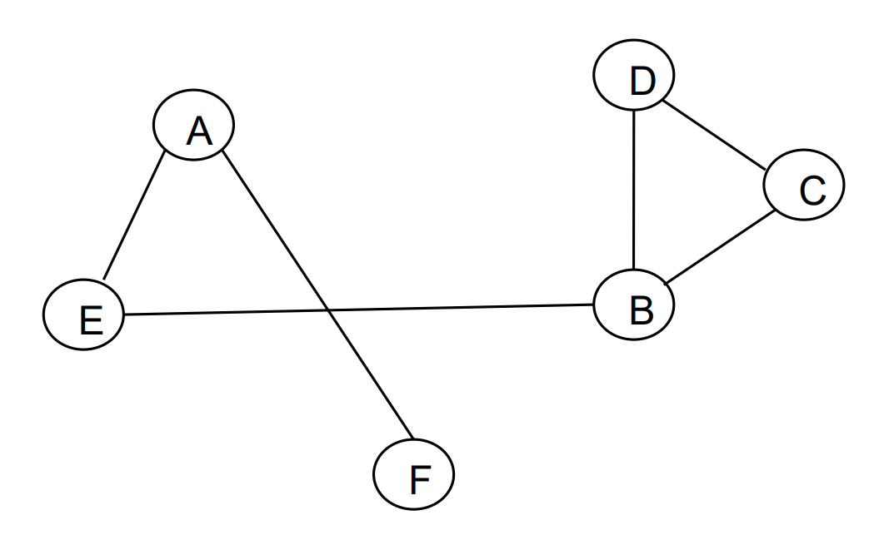

#### Penjelasan Graph Dari Tabel Penjadwalan Ujian

- Apabila terdapat dua buah simpul yang dihubungkan oleh ruas, maka ujian kedua mata kuliah tidak dapat dibuat pada waktu yang bersamaan.
- Beri Warna pada masing-masing simpul, apabila warna berbeda diberikan pada simpul yang menunjuk pada waktu ujiannya berbeda.
- Warna yang digunakan harus seminimal mungkin.
- **Catatan**: Simpul yang berdampingan tidak boleh berwarna sama.

#### Hasil Graph Dari Tabel Penjadwalan Ujian dengan Warna

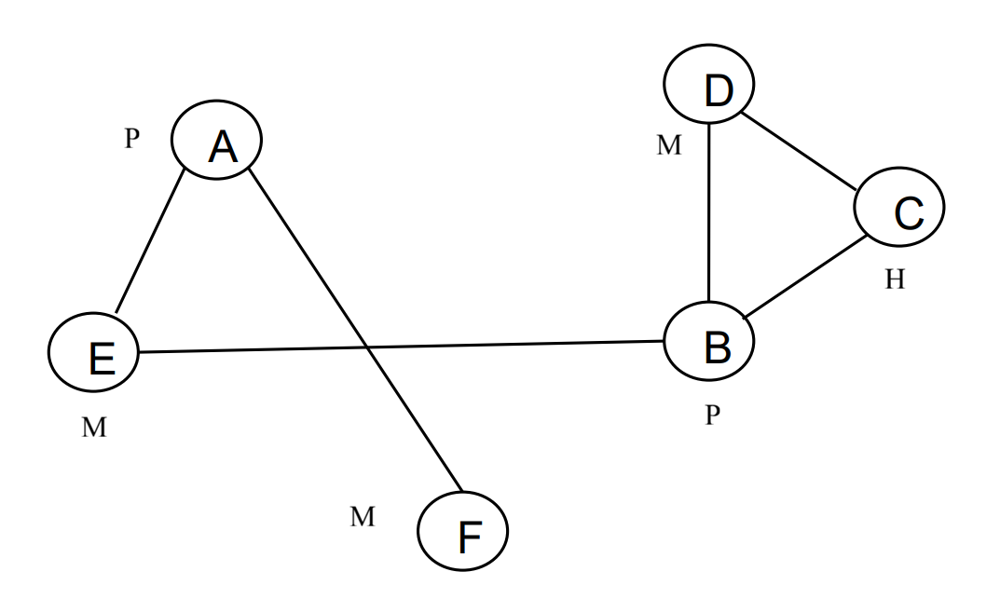

Keterangan:

P -> Putih 
M -> Merah 
H -> Hijau

#### Penjelasan Grap dengan Warna

- Warna Merah : untuk simpul F, E, D
- Warna Putih : untuk simpul A, B,
- Warna Hijau : untuk simpul C (dikarenakan berdampingan)
- Simpul C bertetangga dengan simpul B (warna putih), dan simpul D (warna merah) sehingga C harus diberi warna lain.

#### Penjelasan Graph Tabel Penjadwalan Ujian dengan Warna

Kelompokkan simpul yang berwarna sama, warna yang sama artinya bisa dijadwalkan untuk ujian sehingga diperoleh hasil, sebagi berikut:

- Simpul merah = F, E, D
- Simpul Putih = A, B
- Simpul hijau = C

**Catatan:**

- Untuk posisi peletakan Simpul Bisa Bebas
- Awal pemberian warna boleh bebas
- Warna yang digunakan Bebas
- Awal pemberian warna mempengaruhi susunan Jadwal
