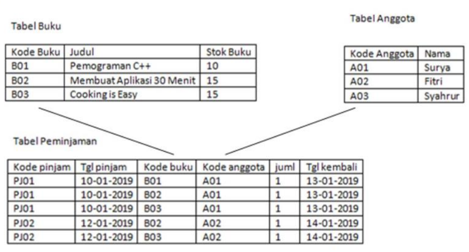
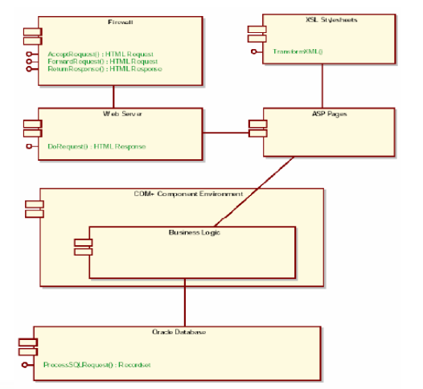
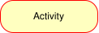
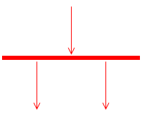
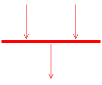
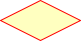
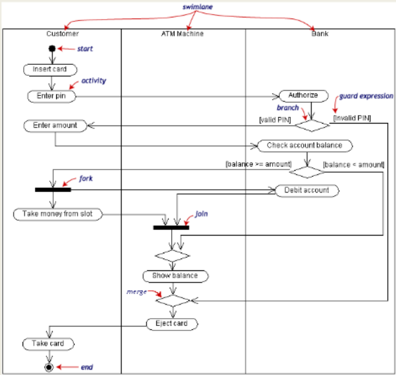
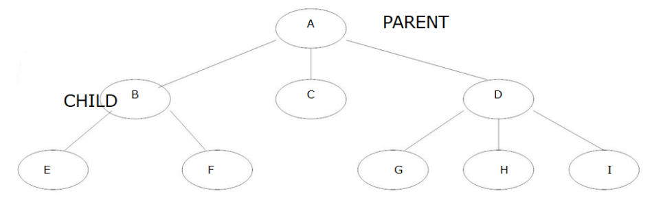
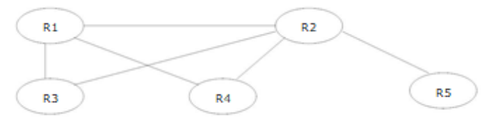

## Definition of Data Model

A set of concepts for describing data, the relationships between data, data meaning (semantics), and data constraints.

## Types of Data Models

A. Object-Based Data Models 
B. Record-Based Data Models

### A. Object-Based Data Models

Object-based data models use the concepts of entities, attributes, and relationships between entities.

They include:

1. Entity-Relationship Model
2. Object-Oriented Model
3. Semantic Data Model
4. Functional Data Model

The Entity-Relationship Model is the most popular model used in database design.

#### 1. Entity-Relationship Model

The model explains relationships between data in a database based on the perception that the real world consists of basic objects that have relationships among them.

The main components of the Entity-Relationship Model are: **Entity**, **Relation**. These components are further described by a number of **Attributes/Properties**.

|           |                                                                                                                         |
| --------- | ----------------------------------------------------------------------------------------------------------------------- |
| Attribute | book code, title, stock                                                                                                 |
| Entity    | B01, B02, B03, Programming C++, etc.                                                                                    |
| Relation  | the link between the book code in the book table and the book code in the loan table. The same applies to member codes. |

##### Entity-Relationship Diagram (E-R Diagram)

An Entity-Relationship model that contains sets of entities, relations, and attributes can be represented using an Entity-Relationship Diagram (E-R Diagram).

Basic symbols used:


flowchart LR
%% Pengaturan gaya untuk node teks agar tidak terlihat seperti kotak

    %% Baris 1: Persegi Panjang (id="3" & id="6")
    Bentuk1[ ] ~~~ Teks1[": Represents an entity set"]:::teks

    %% Baris 2: Belah Ketupat (id="2" & id="7")
    Bentuk2{ } ~~~ Teks2[": Represents a relationship set"]:::teks

    %% Baris 3: Elips (id="4" & id="8")
    Bentuk3([ ]) ~~~ Teks3[": Represents an attribute (key attributes are underlined)"]:::teks

    %% Baris 4: Garis Lurus (id="5" & id="9")
    %% Garis dibuat dengan menghubungkan dua node kosong
    TitikA(( )) ~~~ TitikB(( ))
    TitikA --- TitikB
    TitikB ~~~ Teks4[": Connector / Link"]:::teks

    %% Styling tambahan untuk merapikan garis lurus dan menyembunyikan titik bantu
    style TitikA fill:none,stroke:none
    style TitikB fill:none,stroke:none



In an E-R Diagram the most important rule is the relation cardinality / **Mapping Cardinalities**, which determines how many entities can be associated with other entities through a relationship set.

Types of Mapping Cardinalities:

- One-to-one
- One-to-many
- Many-to-many

Example: one-to-one relationship


erDiagram
%% Definisi Relasi
BUKU ||--o{ MEMINJAM : "1"
ANGGOTA ||--o{ MEMINJAM : "1"

    %% Entitas Buku
    BUKU {
        string Kode_buku PK
        string Judul
        int Stok
    }

    %% Entitas Anggota
    ANGGOTA {
        string Kode_anggota PK
        string nama
    }

    %% Entitas Relasi (Transaksi Meminjam)
    MEMINJAM {
        string Kode_buku FK
        string Kode_anggota FK
    }



Example: one-to-many relationship


erDiagram
%% Definisi Relasi (Kardinalitas 1 ke N direpresentasikan melalui tabel transaksi)
BUKU ||--o{ MEMINJAM : "N"
ANGGOTA ||--o{ MEMINJAM : "1"

    %% Struktur Tabel BUKU
    BUKU {
        string Kode_buku PK
        string Judul
        int Stok
    }

    %% Struktur Tabel ANGGOTA
    ANGGOTA {
        string Kode_anggota PK
        string nama
    }

    %% Struktur Tabel MEMINJAM (Tabel Relasi/Transaksi)
    MEMINJAM {
        string Kode_buku FK
        string Kode_anggota FK
        date Tgl_pinjam
        int Jml
        string dst
    }



Example: many-to-many relationship


erDiagram
%% Definisi Relasi (Penyelesaian Many-to-Many melalui tabel perantara)
BUKU ||--o{ MEMINJAM : "N"
ANGGOTA ||--o{ MEMINJAM : "N"

    %% Struktur Tabel BUKU
    BUKU {
        string Kode_buku PK
        string Judul
        int Stok
    }

    %% Struktur Tabel ANGGOTA
    ANGGOTA {
        string Kode_anggota PK
        string nama
    }

    %% Struktur Tabel MEMINJAM (Tabel Perantara / Transaksi)
    MEMINJAM {
        string Kode_buku FK
        string Kode_anggota FK
        date Tgl_pinjam
        int Jml
        string dst
    }



#### 2. Object-Oriented Model


flowchart TD

    %% Alur Kiri (Database)
    L1["Database declarations using Java"]
    L2["Object declarations using Java"]
    DB[("Database")]

    L1 --> L2
    L2 --> DB

    %% Alur Kanan (Application)
    R1["Application code written using Java"]
    R2["Java program compiler"]
    R3["Application executables generated"]
    EU(["End user"])

    R1 --> R2
    R2 --> R3
    R3 --> EU

    %% Interaksi antara kedua alur
    DB <-->|interaction| R3



Object-based models are often represented using UML. UML diagrams are divided into two main types:

1. Structural Diagrams
2. Behavioral Diagrams

_Detailed coverage of UML is available in the Object Modeling course._

#### Structural Diagrams

Structural diagrams include:

- Class Diagram
- Object Diagram
- Component Diagram
- Deployment Diagram

Class Diagram

A class diagram shows the structure of a system: classes, their attributes, and relationships between classes.

- Class Name

Used to distinguish one class from another, e.g., Person, Student.

- Attribute

Used to store state; in programming languages these are fields. Attributes describe what an object has, e.g., name, address, age, studentID.

Usage format: modifier attribute_name : data_type

Example:

- name : String — read as the attribute `name` has the modifier `private` and data type `String`.

- Method

Used to store behavior. Methods may return values (non-void) or not return a value (void). Examples: getName, getAddress, getAge.

Usage format:

modifier method_name([parameterName : parameterType]) : return_type

Example: + getName() : String — read as method `getName` is public, has no parameters, and returns a `String`.

- setName(name : String) : void — read as method `setName` is public, has one parameter `name` of type `String`, and returns no value.


classDiagram
%% Definisi Superclass & Subclass
class Person {
-lastname
-firstname
-address
-phone
-birthdate
-/ age
}

    class Employee {
    }

    class Patient {
        -amount
        -insurance carrier
        +make appointment()
        +calculate last visit()
        +change status()
        +provide medical history()
    }

    class Nurse {
    }

    class AdministrativeStaff["Administrative Staff"] {
    }

    class Doctor {
    }

    %% Definisi Kelas Pendukung
    class MedicalHistory["Medical History"] {
        -heart disease
        -high blood pressure
        -diabetes
        -allergies
    }

    class HealthTeam["Health Team"] {
    }

    class Bill {
        -date
        -amount
        -purpose
        +generate cancellation fee()
    }

    class Appointment {
        -time
        -date
        -reason
        +cancel without notice()
    }

    class Symptom {
        -name
    }

    class Illness {
        -description
    }

    class Treatment {
        -medication
        -instructions
        -symptom severity
    }

    %% Pewarisan (Generalization)
    Person <|-- Employee
    Person <|-- Patient
    Employee <|-- Nurse
    Employee <|-- AdministrativeStaff
    Employee <|-- Doctor

    %% Komposisi
    Patient "1" *-- "0..1" MedicalHistory : provides >

    %% Asosiasi Biasa
    Patient "1" -- "0..*" Appointment : schedules >
    Appointment "1" -- "0..*" Bill : leads to >
    Patient "1" -- "1..*" Symptom : suffer >
    Doctor "1..*" -- "0..*" Appointment : has scheduled >

    %% Asosiasi Refleksif
    Patient "1" -- "0..*" Patient : +primary insurance carrier

    %% Relasi Many-to-Many & Association Class (Treatment)
    Symptom "0..*" -- "0..*" Illness
    Symptom .. Treatment : Association Class
    Illness .. Treatment : Association Class

    %% Agregasi (Health Team memiliki Nurse, Admin, Doctor)
    HealthTeam "*" o-- "0..*" Nurse
    HealthTeam "*" o-- "0..1" AdministrativeStaff
    HealthTeam "*" o-- "1..*" Doctor



Object Diagram

An object diagram shows specific instances with attribute values and relationships at a certain point in time.


classDiagram
class Patient {
-amount
-insurance carrier
+make appointment()
+calculate last visit()
+change status()
+provide medical history()
}
class Appointment {
-time
-date
-reason
+cancel without notice()
}
class Doctor {
}
class Symptom {
-name
}

    Patient "1" -- "0..*" Appointment : schedules
    Appointment "0..*" -- "1..*" Doctor : has scheduled
    Patient "1" -- "1..*" Symptom : suffer
    Patient "0..*" -- "1" Patient : +primary insurance carrier




classDiagram
%% Menampilkan instansiasi objek dengan nilai nyata
class JohnDoePatient["John Doe: Patient"] {
lastname = "Doe"
firstname = "John"
address = "1000 Main Street"
phone = "555-555-5555"
birthdate = "01/01/72"
age = 32
amount = "$0.00"
insurance carrier = "JD Health Insurance"
}

    class Appt1Appointment["Appt1: Appointment"] {
        time = "3:00"
        date = "7/7/2004"
        reason = "pain in neck"
    }

    class DrSmithDoctor["Dr. Smith: Doctor"] {
        lastname = "Smith"
        firstname = "Jane"
        address = "Doctor's Clinic"
        phone = "999-555-5555"
        birthdate = "12/12/64"
        age = 39
    }

    class Symptom1Symptom["Symptom1: Symptom"] {
        name = "muscle pain"
    }

    %% Relasi antar objek (instansiasi relasi)
    JohnDoePatient -- Appt1Appointment
    Appt1Appointment -- DrSmithDoctor
    JohnDoePatient -- Symptom1Symptom



- Component Diagram

A component diagram illustrates the structure and relationships between software components, including dependencies. A software component can be a module containing source code or binary code, a library or an executable, and may appear at compile time, link time, or run time.

- Deployment Diagram

A deployment diagram maps software to processing nodes. It shows the configuration of processing elements at run time and the software deployed on them. This diagram is important during implementation and can be created before coding to determine available resources and execution constraints of the hardware.


graph TD
%% Definisi Node sebagai Deployment Nodes (menggunakan bentuk kotak 3D)
DB[("Database Server")]
Reg[Registration]
Dorm[Dorm]
Main[Main Building]
Lib[Library]

    %% Koneksi antar node
    Reg --- DB
    Dorm --- DB
    Main --- DB
    Lib --- DB



#### Behavioral Diagrams

Behavioral diagrams include:

- Use Case Diagram
- Sequence Diagram
- Collaboration Diagram
- Statechart (State) Diagram
- Activity Diagram

Use Case Diagram: explains how the system is used and is the starting point of UML modeling.

Use Case Diagram consists of:


graph LR
%% Pengaturan gaya agar label teks berada di sebelah kanan simbol
classDef teks fill:none,stroke:none;

    %% Baris 1: Use Case
    UC((Use Case)) ~~~ K1[": Use Case"]:::teks

    %% Baris 2: Actor
    A([Actor]) ~~~ K2[": Actors"]:::teks

    %% Baris 3: Relationship
    --- K3[": Relationship"]:::teks

    %% Baris 4: System Boundary Box
    B[System Boundary Box] ~~~ K4[": System Boundary Boxes"]:::teks



Sequence Diagram: shows interactions between objects inside and around the system (including users, displays/forms) as messages over time. Sequence diagrams have a vertical time axis and a horizontal object axis. They are commonly used to describe scenarios or the sequence of steps triggered by an event to produce a specific output.

Collaboration Diagram: - An alternative way to describe a system scenario. - Also models interactions between objects like sequence diagrams, but emphasizes the roles of each object rather than the timing of messages. - Each message has a sequence number. - A Collaboration Diagram contains: - Objects, shown as rectangles - Links between objects, shown as connecting lines - Messages, shown as labeled arrows

Collaboration vs Sequence Diagram

- Collaboration Diagram
  - Main focus: shows relationships among objects alongside their interactions.
  - Best for visualizing collaboration patterns.
  - Useful during brainstorming or early design phases.

- Sequence Diagram
  - Main focus: shows the explicit order of messages.
  - Better for visualizing the overall flow.
  - Useful for real-time or complex scenarios and analysis phases.

Statechart (State) Diagram documents the various states a class can be in and the events that cause transitions between those states.

For example, a television can be in the `On` or `Off` state; pressing the power button toggles the state.

Statechart Diagram


graph LR
%% Notasi State
S1[State1] --- Note1[State notation: depicts the condition of an entity using a rectangle with rounded corners]

    %% Notasi Transition
    T1 -- "trigger [guard] / activity" --> T2( )
    T1 --- Note2[Transition: a change in an object's state resulting from an event]

    %% Notasi Initial State
    I1(( )) --- Note3[Initial State: the object's initial condition before any changes occur]

    %% Notasi Final State
    F1((( ))) --- Note4[Final State: the object stops responding to events.]

    %% Styling
    classDef note stroke-dasharray: 5 5,text-align:left;
    class Note1,Note2,Note3,Note4 note



Activity Diagram - Describes business processes and the sequence of activities within a process. - Also used in business modeling to show the order of business activities. - Its structure is similar to a flowchart or Data Flow Diagram in structured design. - Useful for modeling a process in order to understand overall behavior. - Activity diagrams are often created from one or more use cases.

Activity Diagram Symbols

| Symbol                    | Description                                                                   |
| ------------------------- | ----------------------------------------------------------------------------- |
|        | Start Point                                                                   |
|            | End Point                                                                     |
|  | Activities                                                                    |
|          | Fork                                                                          |
|          | Join                                                                          |
|  | Decision                                                                      |
| Swimlane                  | A way to group activities by actor (grouping activities under the same actor) |

Example Activity Diagram

Withdrawing Cash from a Bank Account via ATM

#### 3. Semantic Model

Similar to the Entity-Relationship model, semantic models express relationships between basic objects using words (semantics) rather than symbols. For example, using the Bank X relationship from earlier, the semantic model would be represented as shown in the diagram above.

The notations used in the semantic model include:

- indicate a relationship
- indicate an attribute

Example Semantic Model


graph TD
%% Definisi Node Utama
Peminjaman((Peminjaman))
Anggota((Anggota))
Surya((Surya))

    %% Atribut
    Jml((jml))
    KodeAnggota1(("<u>Kode_anggota</u>"))
    KodeAnggota2(("<u>Kode_anggota</u>"))
    Nama((nama))

    %% Relasi antar Entitas
    Anggota -- "memiliki" --> Peminjaman
    Surya -- "adalah" --> Anggota

    %% Menghubungkan Atribut
    Peminjaman --- Jml
    Peminjaman --- KodeAnggota1
    Surya --- KodeAnggota2
    Surya --- Nama



### B. Record-Based Data Models

These models are based on records and are used to describe the logical relationships among data in a database.

DIFFERENCE FROM OBJECT-BASED MODELS

In record-based data models, besides describing the overall logical structure of a database, they are also used to describe implementation aspects of the database system (a higher-level description of implementation).

#### Relational Model

There are three main models in the record-based category:

1. Relational Model

In the relational model, data and relationships are represented by a set of tables, where each table consists of uniquely named columns. This model is based on set theory (relations).

Example: a seller database consisting of 3 tables:

- Supplier
- Spare_parts
- Shipment


erDiagram
%% Definisi Relasi antar Tabel
SUPPLIER ||--o{ PENGIRIMAN : "melakukan"
SUKU_CADANG ||--o{ PENGIRIMAN : "terdapat pada"

    %% Struktur Tabel SUPPLIER
    SUPPLIER {
        string No_supl PK
        string Nama_pen
        string Status
        string KOTA
    }

    %% Struktur Tabel PENGIRIMAN
    PENGIRIMAN {
        string NO_SUPL FK
        string NO_PART FK
        int JUML
    }

    %% Struktur Tabel SUKU CADANG
    SUKU_CADANG {
        string NO_PART PK
        string NAMA_PART
        string BAHAN_BAKU
        int BERAT
        string KOTA
    }




erDiagram
%% Definisi Relasi
POLIKLINIK ||--o{ JADWAL_DOKTER_TUGAS : "memiliki"
JADWAL ||--o{ JADWAL_DOKTER_TUGAS : "memiliki"
DOKTER ||--o{ JADWAL_DOKTER_TUGAS : "melakukan"

    %% Struktur Tabel
    POLIKLINIK {
        string Kd_Poli PK
        string Nm_poli
    }

    JADWAL {
        string Kd_jwl PK
        string Jam
        string Hari
    }

    DOKTER {
        string Kd_dokter PK
        string Nm_dokter
        string Alamat
        string Spesialis
    }

    JADWAL_DOKTER_TUGAS {
        string Kd_poli FK
        string Kd_dokter FK
        string Kd_jwl FK
        string Status_Tugas
    }



#### Hierarchical Model

2. Hierarchical Model

In this model, data and relationships are represented using records and links (pointers). Records are organized in a tree structure, where each node is a record or group of data elements and relationships have cardinalities of 1:1 or 1:M.


graph TD
%% Node Utama
Dosen[LECTURER BAYA]

    %% Node Mata Kuliah
    MK1[DATABASE SYSTEM]
    MK2[SISFO ANALYSIS AND PLANNING]

    %% Node Mahasiswa
    NINA[NINA]
    LENA[LENA]
    HAFIDZ1[HAFIDZ]
    NOVI[NOVI]
    HAFIDZ2[HAFIDZ]
    NAYA[NAYA]
    RAFA[RAFA]

    %% Hubungan Hierarki
    Dosen --> MK1
    Dosen --> MK2

    MK1 --> NINA
    MK1 --> LENA
    MK1 --> HAFIDZ1
    MK1 --> NOVI

    MK2 --> HAFIDZ2
    MK2 --> NAYA
    MK2 --> RAFA

    %% Penanda panah balik (untuk menunjukkan tanggung jawab/laporan)
    HAFIDZ1 -.-> MK1
    HAFIDZ2 -.-> MK2



#### Network Model

3. Network Model

Standardized in 1971 by the Database Task Group (DBTG), also called the CODASYL model (Conference on Data Systems Languages). It is similar to the hierarchical model in that data and relationships are represented with records and links. The difference is that the network model arranges records in a graph structure and supports cardinalities of 1:1, 1:M, and N:M.


graph TD
%% Node Utama
Dosen[LECTURER BAYA]

    %% Node Mata Kuliah
    MK1[DATABASE SYSTEM]
    MK2[SISFO ANALYSIS AND PLANNING]

    %% Hubungan Dosen ke Mata Kuliah
    Dosen --> MK1
    Dosen --> MK2

    %% Hubungan Mata Kuliah ke Mahasiswa
    MK1 --> NINA[NINA]
    MK1 --> LENA[LENA]
    MK1 --> NOVI[NOVI]
    MK1 --> HAFIDZ[HAFIDZ]

    MK2 --> HAFIDZ
    MK2 --> NAYA[NAYA]
    MK2 --> RAFA[RAFA]


