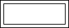
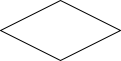
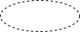
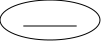
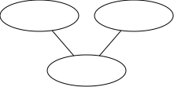
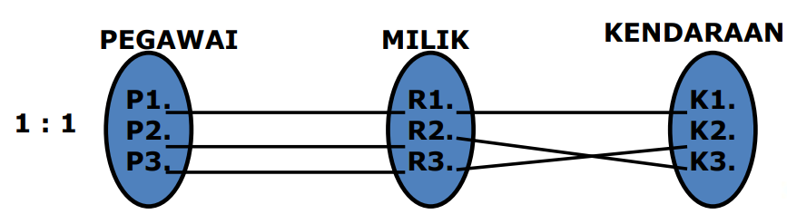
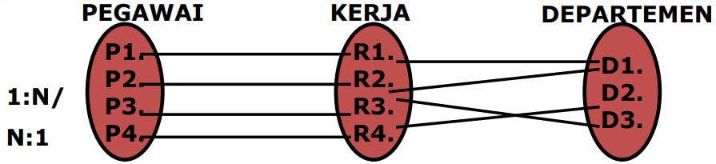
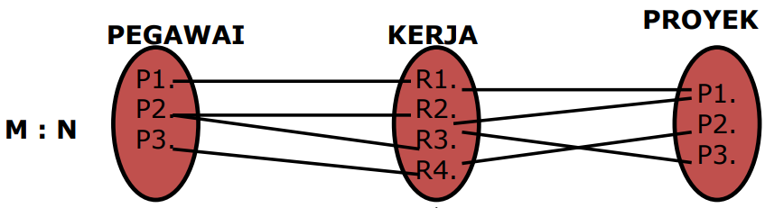
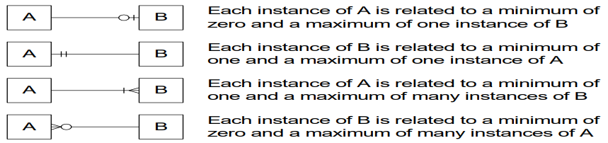

## Pengertian

Entity relationship Adalah jaringan yang menggunakan susunan data yang disimpan dari sistem secara abstrak. Entity-relationship dari model terdiri dari unsur-unsur entity dan relationship antara entity-entitiy tersebut.

## Simbol-simbol dalam E-R Diagram

| Notasi                                      | Arti                     |
| ------------------------------------------- | ------------------------ |
|                        | Entity                   |
|                | Weak Entity              |
|            | Relationship             |
|              | Identifying Relationship |
|    | Atribut Derivatif        |
|                      | Atribut                  |
|  | Atribut Primary Key      |
|  | Atribut Multivalue       |
|    | Atribut Composite        |

## Komponen E-R Diagram

1. Entitas yaitu suatu kumpulan object atau sesuatu yang dapat dibedakan atau dapat diidentifikasikan secara unik. Dan kumpulan entitas yang sejenis disebut dengan entity set.
2. Relationship yaitu hubungan yang terjadi antara satu entitas atau lebih.
3. Atribut, kumpulan elemen data yang membentuk suatu entitas.
4. Indicator tipe terbagi 2 yaitu :
   - Indicator tipe asosiatif object
   - Indicator tipe super tipe

## Entity Set

**Entity Set Terbagi Atas :**

1. **Strong entity set** yaitu entity set yang satu atau lebih atributnya digunakan oleh entity set lain sebagai key. Digambarkan dengan empat persegi panjang. 
   Misal : E adalah sebuah entity set dengan atribute-atribute a1, a2,..,an, maka entity set tersebut direpresentasikan dalam bentuk tabel E yang terdiri dari n kolom, dimana setiap kolom berkaitan dengan atribute-atributenya.
2. **Weak Entity set**, Entity set yang bergantung terhadap strong entity set. Digambarkan dengan empat persegi panjang bertumpuk. 
   Misal : A adalah weak entity set dari atribute-atribute a1, a2, .., ar dan B adalah strong entity set dengan atribute-atribute b1, b2,..,bs, dimana b1 adalah atribute primary key, maka weak entity set direpresentasikan berupa table A, dengan atribute-atribute {b1} u {a1,a2,.., ar}


graph LR
%% Atribut PEGAWAI
A1(["<u>NOPEG</u>"])
A2(["........"])

    %% Strong Entity
    E1["PEGAWAI"]

    %% Relasi (Identifying Relationship)
    R1{"MILIK"}

    %% Weak Entity (Menggunakan double-border / Subroutine shape)
    E2[["TANGGUNGAN"]]

    %% Atribut TANGGUNGAN (Partial Key dengan garis putus-putus)
    A3(["NAMA ╌╌╌╌╌"])
    A4(["........"])

    %% Penghubung Garis
    A1 --- E1
    A2 --- E1
    E1 --- R1

    %% Garis ganda (Total Participation) dari relasi ke entitas lemah
    R1 === E2

    E2 --- A3
    E2 --- A4



Contoh : Strong entity set

| NOPEG     | NAMA   |
| --------- | ------ |
| 200107340 | BILLY  |
| 200307569 | FUAD   |
| 200107341 | NINING |
| 200107486 | FINTRI |

Weak entity set transaction

| NOPEG     | TANGGUNGAN | TANGGAL LAHIR | JENIS KELAMIN |
| --------- | ---------- | ------------- | ------------- |
| 200107340 | HAFIDZ     | 22-03-2006    | LAKI-LAKI     |
| 200307569 | RENI       | 13-05-1999    | PEREMPUAN     |
| 200107341 | RAFFA      | 21-06-2006    | LAKI-LAKI     |
| 200107486 | NAIA       | 25-10-2006    | PEREMPUAN     |

## Jenis-Jenis Atribut

1. KEY -> atribut yang digunakan untuk menentukan suatu entity secara unik
2. ATRIBUT SIMPLE →atribut yang bernilai tunggal
3. ATRIBUT MULTI VALUE →atribut sekelompok nilai untuk setiap instan entity yang memiliki

Pada gambar dibawah ini, yang menjadi atribut key adalah NIP. Tgl Lahir dan Nama adalah atribut simple. Sedangkan Gelar merupakan contoh atribut multivalue.


graph BT
%% Definisi Atribut
A1(["TGL LAHIR"])
A2((("GELAR")))
A3(["<u>NIP</u>"])
A4(["NAMA"])

    %% Definisi Entitas
    E1["PEGAWAI"]

    %% Menghubungkan Entitas dengan Atribut (BT: Bottom to Top)
    A1 --- E1
    A2 --- E1
    A3 --- E1
    A4 --- E1



4. ATRIBUT COMPOSIT -> Suatu atribut yang terdiri dari beberapa atribut yang lebih kecil yang mempunyai arti tertentu contohnya adalah atribut nama pegawai yang terdiri dari nama depan, nama tengah dan nama belakang.


graph BT
%% Definisi Entitas
E1["PEGAWAI"]

    %% Definisi Atribut Komposit
    A1(["NAMA"])

    %% Definisi Sub-atribut (Simple Attributes)
    A11(["NAMA DEPAN"])
    A12(["NAMA TENGAH"])
    A13(["NAMA BLKNG"])

    %% Menghubungkan Entitas dengan Atribut (BT: Bottom to Top)
    A1 --- E1

    %% Menghubungkan Atribut Komposit dengan Sub-atributnya
    A11 --- A1
    A12 --- A1
    A13 --- A1



5. ATRIBUT DERIVATIF →Suatu atribut yg dihasilkan dari atribut yang lain. Sehingga umur yang merupakan hasil kalkulasi antara Tgl Lahir dan tanggal hari ini. Sehingga keberadaan atribut umur bergantung pada keberadaan atribut Tgl Lahir.


graph BT
%% Definisi Entitas
E1["PEGAWAI"]

    %% Definisi Atribut Dasar (Simple Attribute)
    A1(["TGL LAHIR"])

    %% Definisi Atribut Turunan (Derived Attribute)
    A2(["UMUR"])

    %% Menghubungkan Entitas dan Atribut
    A1 --- E1
    A2 --- A1

    %% Styling (Garis putus-putus untuk Derived Attribute)
    classDef derived stroke-dasharray: 2 2;

    class E1 entitas;
    class A1 atribut;
    class A2 derived;



## Mapping Cardinality

Banyaknya entity yang bersesuaian dengan entity yang lain melalui relationship

Jenis-Jenis Mapping :

1. One to one
2. Many to One atau One to many
3. Many to many

Representasi Dari Entity Set

Entity set direpresentasikan dalam bentuk tabel dan nama yang unique. Setiap tabel terdiri dari sejumlah kolom, dimana masing-masing kolom diberi nama yang unique pula

Cardinality Ratio Constraint : Menjelaskan batasan jml keterhubungan satu entity dgn entity lainnya Jenis Cardinality Ratio = 1:1 1:N/ N:1 M : N


graph LR
%% Definisi Entitas dan Relasi
E1["PEGAWAI"]
R1{"MILIK"}
E2["KENDARAAN"]

    %% Garis Penghubung beserta Kardinalitas (1 : 1)
    E1 ---|1| R1
    R1 ---|1| E2




graph LR
%% Definisi Entitas dan Relasi
E1["PEGAWAI"]
R1{"KERJA"}
E2["DEPARTEMEN"]

    %% Garis Penghubung beserta Kardinalitas (1 : 1)
    E1 ---|1| R1
    R1 ---|1| E2




graph LR
%% Definisi Entitas dan Relasi
E1["PEGAWAI"]
R1{"KERJA"}
E2["PROYEK"]

    %% Garis Penghubung beserta Kardinalitas (1 : 1)
    E1 ---|M| R1
    R1 ---|N| E2



Cardinality 1:1,1:M,M:N

One-To-One :

graph LR
%% Definisi Entitas
H[Husband]
W[Wife]

    %% Relasi Dua Arah (Double-headed arrow)
    H <--> W



One-To-Many :


graph TD
%% Definisi Entitas Utama
C[Customer]

    %% Definisi Entitas Anak (Sub-entitas)
    O1[Order 1]
    O2[Order 2]
    O3[Order 3]

    %% Garis Penghubung Relasi
    C --- O1
    C --- O2
    C --- O3



Many-To-Many :


graph TD
%% Definisi Entitas Kelas (Atas)
C1[CLASS 1]
C2[CLASS 2]

    %% Definisi Entitas Siswa (Bawah)
    SA[STUDENT A]
    SB[STUDENT B]
    SC[STUDENT C]

    %% Garis Penghubung Relasi (Banyak ke Banyak)
    C1 --- SA
    C1 --- SB
    C1 --- SC

    C2 --- SA
    C2 --- SB
    C2 --- SC



ORDER: #, DATE, PART #, QUANTITY

PART: #, DESCRIPTION, UNIT PRICE, SUPPLIER #

SUPPLIER: #, NAME, ADDRESS


graph TD
%% Definisi Entitas (Kotak)
E1["ORDER"]
E2["PART"]
E3["SUPPLIER"]

    %% Definisi Relasi (Belah Ketupat)
    R1{"CAN HAVE"}
    R2{"CAN HAVE"}

    %% Garis Penghubung dan Kardinalitas
    E1 ---|1| R1
    R1 ---|M| E2

    E2 ---|M| R2
    R2 ---|1| E3



## Participation Constraint

Menjelaskan apakah keberadaan suatu entity tergantung pada hubungannya dengan entity lain.

Terdapat dua macam participation constrain yaitu:

1. Total participation constrain yaitu: 
   Keberadaan suatu entity tergantung pada hubungannya dengan entity lain. Didalam diagram ER digambarkan dengan dua garis penghubung antar entity dan relationship.
2. Partial participation, yaitu 
   Keberadaan suatu entity tidak tergantung pada hubungan dengan entity lain. Didalam diagram ER digambarkan dengan satu garis penghubung.

### Contoh Participation Constraint

a. TOTAL PARTICIPATIONN


graph LR
%% Definisi Entitas dan Relasi
E1["PEGAWAI"]
R1{"PUNYA"}
E2["BAGIAN"]

    %% Garis Penghubung beserta Kardinalitas (1 : 1)
    E1 ---|N| R1
    R1 ---|1| E2



b. PARTIAL PARTICIPATION


graph LR
%% Definisi Entitas dan Relasi
E1["PEGAWAI"]
R1{"KERJA"}
E2["PROYEK"]

    %% Garis Penghubung beserta Kardinalitas (1 : 1)
    E1 ---|M| R1
    R1 ---|1| E2



## Indicator Tipe

Indicator tipe asosiatif object berfungsi sebagai suatu objek dan suatu relationship.


graph LR
%% Definisi Entitas dan Relasi
E1["SISWA"]
R1{"MENDAFTAR"}
E2["KURSUS"]

    %% Garis Penghubung beserta Kardinalitas (1 : 1)
    E1 --- R1
    R1 --- E2



Berubah menjadi


graph TD
%% Definisi Entitas (Kotak)
E1[SISWA]
E2[KURSUS]
E3[PENDAFTARAN]

    %% Definisi Relasi (Belah Ketupat Kosong)
    R1{" "}

    %% Garis Penghubung
    E1 --- R1
    E2 --- R1
    R1 --- E3



Indicator tipe super tipe, terdiri dari suatu object dan satu subkategori atau lebih yang dihubungkan dengan satu relationship yang tidak bernama.


graph TD
%% Entitas Supertype (Induk)
E1["PEGAWAI"]

    %% Simbol Relasi (IS-A)
    R1{" "}

    %% Entitas Subtype (Anak)
    E2["PEGAWAI HONORER"]
    E3["PEGAWAI TETAP"]

    %% Garis Penghubung
    E1 --- R1
    R1 --- E2
    R1 --- E3



## Tahapan Pembuatan ERD

1. Tahapan Pembuatan ERD Identifikasi dan tetapkan seluruh himpunan entitas yang akan terlibat
2. Tentukan atribut key dari masing-masing himpunan entitas
3. Identifikasi dan tetapkan seluruh himpunan relasi antar himpunan entitas yang ada beserta foreign key-nya
4. Tentukan derajat/kardinalitas relasi untuk setiap himpunan relasi
5. Lengkapi himpunan entitas dan himpunan relasi dengan atribut bukan kunci.

## Logical Record Structured (LRS)

**LRS** -> representasi dari struktur record-record pada tabel-tabel yang terbentuk dari hasil relasi antar himpunan entitas.

**Menentukan Kardinalitas, Jumlah Tabel dan Foreign Key (FK)**

One to One (1-1)


graph LR
%% Definisi Entitas dan Relasi
E1["Supir"]
R1{"Kemudi"}
E2["Taksi"]

    %% Garis Penghubung beserta Kardinalitas (1 : 1)
    E1 --- R1
    R1 --- E2



Gambar di atas menunujukan relasi dengan kardinalitas 1-1, karena:

**1 supir hanya bisa mengemudikan 1 taksi**, dan 
**1 taksi hanya bisa dikemudikan oleh 1 supir.**

Relasi 1-1 akan membentuk 2 tabel:

Tabel Supir (nosupir, nama, alamat) 
Tabel Taksi (notaksi, nopol, merk, tipe)

LRS yang terbentuk sebagai berikut:


erDiagram
%% Definisi Relasi (Primary Key ke Foreign Key)
SUPIR ||--o{ TAKSI : ""

    %% Struktur Tabel 1 (Kiri)
    SUPIR {
        string nosupir PK "Primary Key"
        string nama
        string alamat
    }

    %% Struktur Tabel 2 (Kanan)
    TAKSI {
        string notaksi PK "Primary Key"
        string nopol
        string merk
        string tipe
        string nosupir FK "Foreign Key"
    }



atau


erDiagram
%% Definisi Relasi (Primary Key ke Foreign Key)
TAKSI ||--o{ SUPIR : ""

    %% Struktur Tabel 1 (Kiri)
    TAKSI {
        string notaksi PK "Primary Key"
        string nopol
        string merk
        string tipe
    }

    %% Struktur Tabel 2 (Kanan)
    SUPIR {
        string nosupir PK "Primary Key"
        string nama
        string alamat
        string Notaksi FK "Foreign Key"
    }



**One to Many (1-M)**


graph LR
%% Definisi Entitas dan Relasi
E1["Dosen"]
R1{"Bimbing"}
E2["Kelas"]

    %% Garis Penghubung beserta Kardinalitas (1 : 1)
    E1 --- R1
    R1 --- E2



Gambar di atas menunujukan relasi dengan kardinalitas 1-M, karena:

**1 Dosen bisa membimbing banyak Kelas,** dan 
**1 Kelas hanya dibimbing oleh 1 Dosen.**

Relasi 1-M akan membentuk 2 tabel:

Tabel Dosen (nip, nama, alamat) 
Tabel Kelas (kelas, jurusan, semester, jmlmhs)


erDiagram
%% Definisi Relasi (Primary Key ke Foreign Key)
DOSEN ||--o{ KELAS : ""

    %% Struktur Tabel 1 (Kiri)
    DOSEN {
        string nip PK "Primary Key"
        string nama
        string alamat
    }

    %% Struktur Tabel 2 (Kanan)
    KELAS {
        string kelas PK "Primary Key"
        string jurusan
        string semester
        string jmlmhs
        string nip FK "Foreign Key"
    }



**Many to Many (M-M)**


graph LR
%% Definisi Entitas dan Relasi
E1["Mahasiswa"]
R1{"ajar"}
E2["Mkuliah"]

    %% Garis Penghubung beserta Kardinalitas (1 : 1)
    E1 --- R1
    R1 --- E2



Gambar di atas menunujukan relasi dengan kardinalitas M-M, karena:

**1 Mahasiswa bisa belajar banyak Mata Kuliah,** dan 
**1 Mata Kuliah bisa dipelajari oleh banyak Mahasiswa.**

Relasi M-M akan membentuk 3 tabel:

Tabel Mahasiswa (nim, nama, alamat) 
Tabel Mtkuliah (kdmk, nmmk, sks) 
Tabel Nilai (nim, kdmk, nilai) -> menggunakan super key/composite key

LRS yang terbentuk sebagai berikut:


erDiagram
%% Definisi Relasi (Primary Key ke Foreign Key)
Mahasiswa ||--o{ Nilai : ""
Mtkuliah ||--o{ Nilai : ""

    %% Struktur Tabel Mahasiswa
    Mahasiswa {
        string nim PK "Primary Key"
        string nama
        string alamat
    }

    %% Struktur Tabel Nilai (Junction Table)
    Nilai {
        string nim PK,FK "Composite PK"
        string kdmk PK,FK "Composite PK"
        string nilai
    }

    %% Struktur Tabel Mtkuliah
    Mtkuliah {
        string kdmk PK "Primary Key"
        string nmmk
        string sks
    }



## Contoh Kasus

Sebuah perusahaan mempunyai beberapa bagian. Masing-masing bagian mempunyai pengawas dan setidaknya satu pegawai. Pegawai harus ditugaskan pada paling tidak satu bagian, tetapi dapat pula beberapa bagian. Paling tidak satu pegawai mendapat tugas sebuah proyek. Namun, seorang pegawai dapat libur dan tidak mendapat tugas proyek.

### Penyelesaian

#### Langkah 1: Menentukan Entitas

Entitas yang dibutuhkan adalah: Bagian, Pegawai, Pengawas, dan Proyek

#### Langkah 2 :Menentukan Relasi dengan matriks relasi

|          | Bagian      | Pegawai       | Pengawas        | Proyek       |
| -------- | ----------- | ------------- | --------------- | ------------ |
| Bagian   |             | ditugaskan ke | dijalankan oleh |              |
| Pegawai  | milik       |               |                 | bekerja pada |
| Pengawas | menjalankan |               |                 |              |
| Proyek   |             | menggunakan   |                 |              |

#### Langkah 3 : Menggambar ERD Sementara


flowchart TD
%% Definisi Entitas (Kotak)
B[Bagian]
Pw[Pengawas]
Pg[Pegawai]
Pr[Proyek]

    %% Definisi Relasi (Belah Ketupat)
    R1{dijalankan oleh}
    R2{ditugaskan ke}
    R3{bekerja pada}

    %% Garis Penghubung (Sesuai Layout Gambar)
    B --- R1 --- Pw
    B --- R2 --- Pg
    Pg --- R3 --- Pr



Deskripsi Permasalahan :

- Masing-masing bagian hanya mempunyai satu pengawas
- Seorang pengawas hanya bertugas pada satu bagian
- Masing-masing bagian memiliki paling tidak satu pegawai
- Masing-masing pegawai bekerja paling tidak pada satu bagian
- Masing-masing proyek dikerjakan oleh paling tidak satu pegawai
- Seorang Pengawas bisa mendapat tugas 0 atau beberapa proyek

#### Langkah 4 : Mengisi Kardinalitas


flowchart TD
%% Definisi Entitas (Kotak)
B[Bagian]
Pw[Pengawas]
Pg[Pegawai]
Pr[Proyek]

    %% Definisi Relasi (Belah Ketupat)
    R1{dijalankan oleh}
    R2{ditugaskan ke}
    R3{bekerja pada}

    %% Garis Penghubung (Sesuai Layout Gambar)
    B ---|1| R1 ---|1| Pw
    B ---|M| R2 ---|M| Pg
    Pg ---|M| R3 ---|M| Pr



#### Langkah 5: Menentukan Kunci Utama

Kunci Utama : **Nama Bagian, Nomor Pengawas, Nomor Pegawai, Nomor Proyek.**

#### Langkah 6: Menggambarkan ERD berdasarkan kunci

Karena ada dua relasi many-to-many pada ERD sementara, yaitu antara Bagian dan Pegawai, serta Pegawai dan Proyek. Oleh karena itu dibuatkan entitas baru yaitu Bagian-Pegawai dan Pegawai-Proyek. Kunci utama Bagian-Pegawai adalah gabungan Nama Bagian dan Nomor Pegawai. Kunci utama Pegawai-Proyek adalah gabungan Nomor Pegawai dan Nomor Proyek

#### Langkah 7: Menentukan Atribut yang diperlukan


flowchart TB
%% Atribut (Bentuk Oval)
A_NamaBagian(["<u>Nama_Bagian</u>"])
A_NomPengawas(["<u>Nomor_Pengawas</u>"])
A_NamaPengawas(["Nama_Pengawas"])
A_NamaBagianBP(["<u>Nama_Bagian</u>"])
A_NomPegawaiBP(["<u>Nomor_Pegawai</u>"])
A_NomPegawai(["<u>Nomor_Pegawai</u>"])
A_NamaPegawai(["Nama_Pegawai"])
A_NomProyek(["<u>Nomor_Proyek</u>"])
A_NamaProyek(["Nama_Proyek"])
A_NomPegawaiPP(["<u>Nomor_Pegawai</u>"])
A_NomProyekPP(["<u>Nomor_Proyek</u>"])

    %% Entitas (Bentuk Persegi Panjang)
    E_Bagian["Bagian"]
    E_Pengawas["Pengawas"]
    E_BagianPengawas["Bagian-Pengawas"]
    E_Pegawai["Pegawai"]
    E_Proyek["Proyek"]
    E_PegawaiProyek["Pegawai-Proyek"]

    %% Relasi (Bentuk Belah Ketupat)
    R_dijalankan{"dijalankan oleh"}
    R_ditugaskan{"ditugaskan ke"}
    R_terlibat{"terlibat di"}
    R_bekerja1{"bekerja pada"}
    R_bekerja2{"bekerja pada"}

    %% Koneksi Entitas ke Atribut
    A_NamaBagian --- E_Bagian
    E_Pengawas --- A_NomPengawas
    E_Pengawas --- A_NamaPengawas
    E_BagianPengawas --- A_NamaBagianBP
    E_BagianPengawas --- A_NomPegawaiBP
    A_NomPegawai --- E_Pegawai
    A_NamaPegawai --- E_Pegawai
    A_NomProyek --- E_Proyek
    A_NamaProyek --- E_Proyek
    E_PegawaiProyek --- A_NomPegawaiPP
    E_PegawaiProyek --- A_NomProyekPP

    %% Koneksi Entitas ke Relasi beserta Kardinalitas
    E_Bagian ---|1| R_dijalankan ---|1| E_Pengawas
    E_Bagian ---|1| R_ditugaskan ---|M| E_BagianPengawas
    E_BagianPengawas ---|M| R_terlibat ---|1| E_Pegawai
    E_Pegawai ---|1| R_bekerja1 ---|M| E_PegawaiProyek
    E_Proyek ---|1| R_bekerja2 ---|M| E_PegawaiProyek



LRS yang terbentuk


classDiagram
direction LR

    class Bagian {
        Nama Bagian [PK1]
    }

    class Pengawas {
        Nomor Pengawas [PK1]
        Nama Pengawas
    }

    class `Bagian-Pegawai` {
        Nama Bagian [PK1][FK]
        Nomor Pegawai [PK1][FK]
    }

    class Pegawai {
        Nomor Pegawai [PK1]
        Nama Pegawai
    }

    class Proyek {
        Nomor Proyek [PK1]
        Nama Proyek
    }

    class `Pegawai-Proyek` {
        Nomor Pegawai [PK1][FK]
        Nomor Proyek [PK1][FK]
    }

    %% Definisi Relasi (Arah Panah)
    Pengawas --> Bagian
    Bagian --> `Bagian-Pegawai`
    Pegawai --> `Bagian-Pegawai`
    Proyek --> `Pegawai-Proyek`
    Pegawai --> `Pegawai-Proyek`


