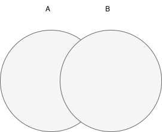
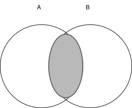
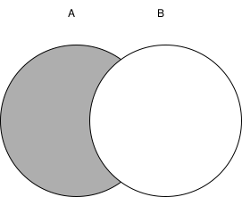

In Formal Query Language, there are two fundamental foundations of Query language formation, namely:

1. Relational Algebra
2. Relational Calculus

In this discussion, we will only discuss Relational Algebra because it is more commonly used as the basis for commonly used Query Languages.

## Relational Algebra

It is a collection of operations on relations, where each operation uses one or more relations to produce a new relation.

A Query Language based on operations in Relational Algebra is a procedural query language.

### Operators Used

#### A. Set Operators



1. Union or Union \((\cup)\)
    The union of relation A and B is expressed as
   \(A \cup B\)

   

2. Intersection or Intersection \(( \cap )\)
    The intersection of relation A and B is expressed as \(A \cap B\)

   

3. Difference
    The difference of relation A and B is expressed as A - B

   

4. Cartesian product
    The cartesian product of relation A and B is expressed as A X B

   example:
    A = { 1,2,3}
    B = { 5,7 }
    A X B = { ( 1,5), (1,7), ( 2,5), (2,7), (3,5),(3,7) }

#### B. Relational Operators

1. Restrict \( \sigma \) is Selection of tuple or record
2. Project \( \pi \) is selection of attribute or field
3. Divide \( \div \) is divide
4. Join \( \theta \) is combine

##### Relational Algebra

Operators in relational algebra are divided into 2 groups:

1. Basic operators for fundamental operations
2. Additional operators for additional operations

The table below is an example for performing Relational Algebra commands:

RELATION: COURSE

| COURSE_CODE | COURSE_NAME        | CREDITS | LECTURER_ID |
| :---------- | :----------------- | :------ | :---------- |
| 207         | LOGIC & ALGO       | 4       | 199910486   |
| 310         | DATA STRUCTURE     | 3       | 200109655   |
| 360         | DATABASE SYSTEM    | 3       | 200209817   |
| 545         | HCI                | 2       | 200209818   |
| 547         | APSI               | 4       | 200109601   |
| 305         | PASCAL PROGRAMMING | 4       | 200703073   |
| 544         | GRAPHIC DESIGN     | 2       | 200010490   |

RELATION: STUDENT

| STUDENT_ID | STUDENT_NAME | ADDRESS     | GENDER |
| :--------- | :----------- | :---------- | :----- |
| 1105090222 | HAFIDZ       | DEPOK       | MALE   |
| 1105091002 | RAFFA        | DEPOK       | MALE   |
| 1105095000 | NAIA         | DEPOK       | FEMALE |
| 1104030885 | ARIF         | P.LABU      | MALE   |
| 1206090501 | LENI         | KMP. MELAYU | FEMALE |
| 1206090582 | WAHYUNI      | TANGERANG   | FEMALE |
| 1205097589 | ARIS         | DEPOK       | MALE   |
| 1106094586 | YANI         | CILEDUG     | FEMALE |
| 110709     | BAMBANG      | SALEMBA     | MALE   |

RELATION: REGISTRATION

| COURSE_CODE | STUDENT_ID |
| :---------: | :--------: |
|     360     | 1105090222 |
|     545     | 1206090501 |
|     547     | 1105095000 |

RELATION: LECTURER

| LECTURER_ID | LECTURER_NAME | SALARY  |
| :---------- | :------------ | :------ |
| 199910486   | BILLY         | 3500000 |
| 200109655   | MARDIANA      | 4000000 |
| 200209817   | INDRIYANI     | 4500000 |
| 200209818   | SURYANI       | 4250000 |
| 200109601   | DWINITA       | 3500000 |
| 200703073   | MALAU         | 2750000 |
| 200010490   | IRFIANI       | 3500000 |

#### Basic Operators

Consists of 2 types:

1. Union Operation -> Operation that uses 1 relation

**a. Selection (\(\sigma\))**: to select rows from a relation

- \(\sigma\) predicate (R) selection operation works on 1 relation R and defines the relation that contains only tuples of R that satisfy the condition (predicate).
- For more complex predicates, logical operators can be used ^(and), v(or) and ~(not)

Contoh :

- Find tuples from STUDENT that have male gender, Relational algebra expression: \(\sigma\) GENDER="MALE" (STUDENT)
- Display course data that has code 360 or that has credits 4 \(\sigma\) COURSE_CODE="360" V CREDITS=4 (COURSE)

\(\sigma\)J_KEL=“LAKI-LAKI” (MAHASISWA)

| NIM        | NAMA_MHS | ALAMAT  | J_KEL     |
| :--------- | :------- | :------ | :-------- |
| 1105090222 | HAFIDZ   | DEPOK   | LAKI-LAKI |
| 1105091002 | RAFFA    | DEPOK   | LAKI-LAKI |
| 1104030885 | ARIF     | P.LABU  | LAKI-LAKI |
| 1205097589 | ARIS     | DEPOK   | LAKI-LAKI |
| 110709     | BAMBANG  | SALEMBA | LAKI-LAKI |

\(\sigma\)COURSE_CODE="360" V CREDITS=4 (COURSE)

| COURSE_CODE | COURSE_NAME        | CREDITS | LECTURER_ID |
| :---------- | :----------------- | :------ | :---------- |
| 207         | LOGIC & ALGO       | 4       | 199910486   |
| 360         | DATABASE SYSTEM    | 3       | 200209817   |
| 547         | APSI               | 4       | 200109601   |
| 305         | PASCAL PROGRAMMING | 4       | 200703073   |

**b. Projection (\(\pi\))**: used to detail **columns**

- \(\pi\) a1…an (R) projection operation works on 1 relation R and defines the relation that contains a vertical subset of R displaying values for certain attributes and eliminating duplicate attribute values.

Contoh :
Display lecturer name along with salary
 \(\pi\) lecturer_name,salary (LECTURER)

| LECTURER_NAME | SALARY  |
| :------------ | :------ |
| BILLY         | 3500000 |
| MARDIANA      | 4000000 |
| INDRIYANI     | 4500000 |
| SURYANI       | 4250000 |
| DWINITA       | 3500000 |
| MALAU         | 2750000 |
| IRFIANI       | 3500000 |

2. Binary Operation -> Operation that uses 2 or a pair of relations
   1. Cartesian product ( X ): An operator with two relations to produce a table that is the result of a cartesian product. In cartesian product there are duplicate values in some tuples/records so it is improved with **join condition**: namely by providing a specific condition/requirement.

Example: Display lecturer_id, lecturer_name (from Lecturer relation), course_name (from Course relation), academic_year, semester, day, class_time, time, class (from Teaching relation) where the teaching semester is on semester '1'.

**\(\pi\) lecturer_id, lecturer_name, course_name( \(\sigma\) lecturer.lecturer_id = course.lecturer_id \(\wedge\) course.credits=3 \((\text{Lecturer} \times \text{Course}\)) )**

Lecturer x Course

| LECTURER_ID | LECTURER_NAME | COURSE_NAME        |
| :---------- | :------------ | :----------------- |
| 199910486   | BILLY         | LOGIC & ALGO       |
| 199910487   | BILLY         | DATA STRUCTURE     |
| 199910488   | BILLY         | DATABASE SYSTEM    |
| 199910489   | BILLY         | HCI                |
| 199910490   | BILLY         | APSI               |
| 199910491   | BILLY         | PASCAL PROGRAMMING |
| 199910492   | BILLY         | GRAPHIC DESIGN     |
| 200109655   | MARDIANA      | LOGIC & ALGO       |
| 200109656   | MARDIANA      | DATA STRUCTURE     |
| 200109657   | MARDIANA      | DATABASE SYSTEM    |
| 200109658   | MARDIANA      | HCI                |
| 200109659   | MARDIANA      | APSI               |
| 200109660   | MARDIANA      | PASCAL PROGRAMMING |
| 200109661   | MARDIANA      | GRAPHIC DESIGN     |
| 200209817   | INDRIYANI     | LOGIC & ALGO       |
| 200209818   | INDRIYANI     | DATA STRUCTURE     |
| 200209819   | INDRIYANI     | DATABASE SYSTEM    |
| 200209820   | INDRIYANI     | HCI                |
| 200209821   | INDRIYANI     | APSI               |
| 200209822   | INDRIYANI     | PASCAL PROGRAMMING |
| 200209823   | INDRIYANI     | GRAPHIC DESIGN     |
| 200209818   | SURYANI       | LOGIC & ALGO       |
| 200209819   | SURYANI       | DATA STRUCTURE     |
| 200209820   | SURYANI       | DATABASE SYSTEM    |
| 200209821   | SURYANI       | HCI                |
| 200209822   | SURYANI       | APSI               |
| 200209823   | SURYANI       | PASCAL PROGRAMMING |
| 200209824   | SURYANI       | GRAPHIC DESIGN     |
| 200109601   | DWINITA       | LOGIC & ALGO       |
| 200109602   | DWINITA       | DATA STRUCTURE     |
| 200109603   | DWINITA       | DATABASE SYSTEM    |
| 200109604   | DWINITA       | HCI                |
| 200109605   | DWINITA       | APSI               |
| 200109606   | DWINITA       | PASCAL PROGRAMMING |
| 200109607   | DWINITA       | GRAPHIC DESIGN     |
| 200703073   | MALAU         | LOGIC & ALGO       |
| 200703074   | MALAU         | DATA STRUCTURE     |
| 200703075   | MALAU         | DATABASE SYSTEM    |
| 200703076   | MALAU         | HCI                |
| 200703077   | MALAU         | APSI               |
| 200703078   | MALAU         | PASCAL PROGRAMMING |
| 200703079   | MALAU         | GRAPHIC DESIGN     |
| 200010490   | IRFIANI       | LOGIC & ALGO       |
| 200010491   | IRFIANI       | DATA STRUCTURE     |
| 200010492   | IRFIANI       | DATABASE SYSTEM    |
| 200010493   | IRFIANI       | HCI                |
| 200010494   | IRFIANI       | APSI               |
| 200010495   | IRFIANI       | PASCAL PROGRAMMING |
| 200010496   | IRFIANI       | GRAPHIC DESIGN     |

**Lecturer x Course (lecturer.lecturer_id = course.lecturer_id \(\wedge\) credits=3)**

| LECTURER_ID | LECTURER_NAME | COURSE_NAME     |
| :---------- | :------------ | :-------------- |
| 200109656   | MARDIANA      | DATA STRUCTURE  |
| 200209819   | INDRIYANI     | DATABASE SYSTEM |

2.  Union \( (\cup) \)
     Operation to produce a union of tables with the condition that both tables have the same attributes, i.e., the domain of the i-th attribute of each table must be the same. Eliminate duplicate attribute values.

    RUS={ X I X E R or X E S}

Example: \(\pi \text{ student \_id(student1)} \cup \pi \text{ student \_id(student2)}\)

STUDENT1

| STUDENT_ID | STUDENT_NAME | ADDRESS | GENDER |
| :--------- | :----------- | :------ | :----- |
| 1105090222 | HAFIDZ       | DEPOK   | MALE   |
| 1105091002 | RAFFA        | DEPOK   | MALE   |
| 1104030885 | ARIF         | P.LABU  | MALE   |
| 1205097589 | ARIS         | DEPOK   | MALE   |
| 110709     | BAMBANG      | SALEMBA | MALE   |

STUDENT2

| STUDENT_ID | STUDENT_NAME | ADDRESS     | GENDER |
| :--------- | :----------- | :---------- | :----- |
| 1105095000 | NAIA         | DEPOK       | FEMALE |
| 1206090501 | LENI         | KMP. MELAYU | FEMALE |
| 1206090582 | WAHYUNI      | TANGERANG   | FEMALE |
| 1106094586 | YANI         | CILEDUG     | FEMALE |

| STUDENT_ID |
| :--------: |
| 1105090222 |
| 1105091002 |
| 1104030885 |
| 1205097589 |
|   110709   |
| 1105095000 |
| 1206090501 |
| 1206090582 |
| 1106094586 |

Result: \(\pi \text{ student \_id(student1)} \cup \pi \text{ student \_id(student2)}\)

3.  Set Difference ( - )
     Operation to get tables in one relation but not in another relation.

R – S = { X I X E R and X E S }

Example: Display names of students who live in Depok but are not female

Query I: display names of those living in Depok
 \(\pi\) student_name(\(\sigma\) address="DEPOK" (STUDENT))

Query II: display names of those with female gender
 \(\pi\) name(\(\sigma\) gender ="FEMALE")

Display query I minus query II:
 \(\pi\) student_name(\(\sigma\) address="DEPOK"(STUDENT)) - \(\pi\) name(\(\sigma\) gender="FEMALE")

Query I ( R ): \(\pi\) student_name(\(\sigma\) address="DEPOK" (STUDENT))

| STUDENT_NAME |
| :----------- |
| HAFIDZ       |
| RAFFA        |
| NAIA         |
| ARIS         |

Query II (S): \(\pi\) name(\(\sigma\) gender ="FEMALE")

| STUDENT_NAME |
| :----------- |
| NAIA         |
| LENI         |
| WAHYUNI      |
| YANI         |

\(\pi\) student_name(\(\sigma\) address="DEPOK"(STUDENT)) - \(\pi\) name(\(\sigma\) gender="FEMALE")

| STUDENT_NAME |
| :----------- |
| HAFIDZ       |
| RAFFA        |
| ARIS         |

4.  SET INTERSECTION \( (\cap) \)
     Operation to produce an intersection of two tables with the condition that both tables have the same attributes, the domain of the i-th attribute of both tables is the same.

Example: \(\pi\) student_name(\(\sigma\) address="DEPOK"(STUDENT)) \( \cap \) \(\pi\) name(\(\sigma\) gender="FEMALE")

| STUDENT_NAME |
| :----------- |
| NAIA         |

Additional Operators
 The condition of duplicate values in cartesian product is improved by join condition, consisting of:

1. THETA JOIN
    Operation that combines cartesian product operation with selection operation with a certain criteria. Theta Join notation R►◄FS. Predicate F can be a comparison operator <,≤,>,≥,≠,=

student.►◄student.student_id=registration.student_id registration

| STUDENT_ID | STUDENT_NAME | ADDRESS     | GENDER | COURSE_CODE | STUDENT_ID |
| :--------- | :----------- | :---------- | :----- | :---------: | :--------- |
| 1105090222 | HAFIDZ       | DEPOK       | MALE   |     360     | 1105090222 |
| 1105095000 | NAIA         | DEPOK       | FEMALE |     547     | 1105095000 |
| 1206090501 | LENI         | KMP. MELAYU | FEMALE |     545     | 1206090501 |

2. NATURAL JOIN
    Operation that combines selection and cartesian product operations with a certain criteria on the same column, where each attribute appears 1 x. Natural Join notation R►◄S.

| STUDENT_ID | STUDENT_NAME | ADDRESS     | GENDER | COURSE_CODE |
| :--------- | :----------- | :---------- | :----- | :---------: |
| 1105090222 | HAFIDZ       | DEPOK       | MALE   |     360     |
| 1105095000 | NAIA         | DEPOK       | FEMALE |     547     |
| 1206090501 | LENI         | KMP. MELAYU | FEMALE |     545     |

3. DIVISION
    Operation that divides tuples from 2 relations. Notation R:S

A

| STUDENT_ID | COURSE_CODE |
| :--------- | :---------- |
| 1105090222 | 360         |
| 1105090222 | 545         |
| 1105090222 | 547         |
| 1105091002 | 360         |
| 1105091002 | 545         |
| 1105091002 | 547         |
| 1105095000 | 360         |
| 1105095000 | 545         |

B

| COURSE_CODE |
| :---------: |
|     360     |

A/B

| STUDENT_ID |
| :--------: |
| 1105090222 |
| 1105091002 |
| 1105095000 |
| 1104030885 |
