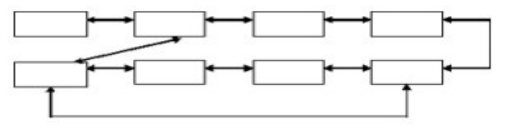
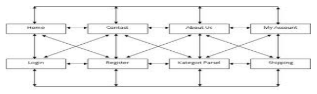
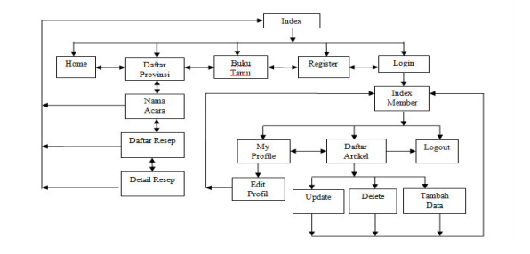

Discusses the basic concepts of web programming, terms in web programming, using text editors, knowing and implementing navigation structures

## Basics of a Website

### Internet

Internet is "short for the word 'internetwork', which means a series of computers connected into several network series". Computer systems are connected globally and use TCP/IP as a protocol.
In general, the internet can be interpreted as the exchange of information and communication. All information can be obtained easily and freely on the internet without any limits.

There are several terms that are often used when you work with the internet, including:

1. World Wide Web (WWW) 
   WWW is a collection of web servers worldwide that can provide data and information to be used massively.
2. Website 
   A website or web site is a specific address on the WWW that provides specific information. To open a website, you can use a browser.
3. Web Pages (Halaman Web) 
   Web pages or web pages are part of a website. If a website is likened to a book, then web pages are the sheets of paper that make up the book.
4. Home Page (Halaman Muka) 
   A homepage is the front page of a website, or like the front cover of a book. The homepage is usually an outline of the content of the website concerned.
5. Browser 
   A browser is an application used to surf the internet world. A browser can guide internet users to move between websites easily.
6. URL (Universal Resource Locator) 
   URL is an address that points to a specific page on the internet. An example of a URL is: http://www.google.com
7. HTTP (Hypertext Transfer Protocol) 
   HTTP is part of a URL that identifies a web location, and is used in the HTML protocol.
8. DNS (Domain Name System) 
   DNS is a distributed database system that is not much affected by the addition of databases. DNS ensures the latest host information will be distributed to the network when needed.
9. TCP/IP (Transmission Control Protocol / Internet Protocol) 
   TCP/IP (Transmission Control Protocol/Internet Protocol) is the methods used to contact the server. TCP/IP is the standardization language for the internet.
10. IP (Internet Protocol) 
    IP (Internet Protocol) is a protocol used in the internet, technically meaning a form of filling and addressing data and information to be sent via the internet.
11. Hyperlink 
    Hyperlink or simply link is a facility that plays a major role in popularizing internet users, because it is able to reference a text or image to another address on the internet.
12. Web Browser 
    Using a web browser is easy, all you need is a web address to open. This address is commonly referred to as a Uniform Resource Locator (URL). In your Windows operating system, there is also a built-in web browser program, namely Internet Explorer. However, outside there are many alternative web browser programs, most of which are free, such as Netscape, Firefox, Opera, Avant Browser, and so on.

### Web Server Software

A Web Server is server software that functions to receive HTTP or HTTPS requests from Clients known as web browsers and sends back the results in the form of web pages which are generally in the form of HTML documents. Well-known web servers include:

a. Apache, a cross-platform web server

1.  XAMPP
2.  PHPTriad; discontinued
3.  Apache2Triad

b. Internet Information Service (IIS), can only run on MS Windows operating systems

## Navigation Structure

Navigation Structure is "The arrangement of menus or hierarchy of a site that describes the content of each page and links or navigation of each page on a website". Navigation Structure can be said to be an illustrator of the relationship or workflow of all elements that will be used in the application.

Navigation Structure can be classified according to the need for objects, ease of use, interactivity, and ease of making it which affects the time of making a website. In its depiction, the Navigation Structure is divided into 4 different structures, namely: Linear, Non-Linear, Hierarchical (Hierarchy) and Composite (Mixed).

There are 4 basic forms of navigation maps commonly used in the process of creating web applications, namely:

### Linear Navigation Structure

A linear navigation structure only has one sequential storyline, which displays one by one screen displays sequentially according to their order. The display that can be shown in this type of structure is one page before or one page after, it cannot be two pages before or two pages after.


flowchart LR
%% Mendefinisikan kotak kosong dengan spasi agar lebarnya pas
A["&nbsp;&nbsp;&nbsp;&nbsp;&nbsp;&nbsp;&nbsp;&nbsp;"]
B["&nbsp;&nbsp;&nbsp;&nbsp;&nbsp;&nbsp;&nbsp;&nbsp;"]
C["&nbsp;&nbsp;&nbsp;&nbsp;&nbsp;&nbsp;&nbsp;&nbsp;"]
D["&nbsp;&nbsp;&nbsp;&nbsp;&nbsp;&nbsp;&nbsp;&nbsp;"]

    %% Alur panah dua arah
    A <--> B
    B <--> C
    C <--> D



Example :


flowchart TD
%% Node Atas
Login["Login User"]

    %% Membuat blok khusus agar barisan bawah menyamping
    subgraph BarisHorizontal [" "]
        direction LR

        N1["Input Info"]
        N2["Upload File"]
        N3["Input Data Student"]
        N4["Logout"]
        N5["Input Data Teacher"]
        N6["Upload gallery photo"]
        N7["Upload banner"]

        %% Alur panah dua arah menyamping
        N1 <--> N2
        N2 <--> N3
        N3 <--> N4
        N4 <--> N5
        N5 <--> N6
        N6 <--> N7

        %% Panah panjang yang kembali dari ujung kanan ke ujung kiri
        N7 --> N1
    end

    %% Hubungan bolak-balik vertikal dari Login ke Logout
    Login <--> N4

    %% Menghilangkan kotak border dan background dari subgraph
    style BarisHorizontal fill:none,stroke:none



## Hierarchical Navigation Structure

Hierarchical navigation structure, commonly called branched structure, is a structure that relies on branching to display data based on certain criteria. The display on the first menu will be referred to as the Master Page (first main page), this main page has a branch page called the Slave Page (supporting page). If one of the supporting pages is selected or activated, then the display will be named Master Page (second main page), and so on. In this navigation structure, linear display is not allowed.


flowchart TD
%% Level 1 (Akar/Root)
N1["&nbsp;&nbsp;&nbsp;&nbsp;&nbsp;&nbsp;&nbsp;&nbsp;&nbsp;&nbsp;"]

    %% Level 2 (Cabang)
    N2_1["&nbsp;&nbsp;&nbsp;&nbsp;&nbsp;&nbsp;&nbsp;&nbsp;&nbsp;&nbsp;"]
    N2_2["&nbsp;&nbsp;&nbsp;&nbsp;&nbsp;&nbsp;&nbsp;&nbsp;&nbsp;&nbsp;"]

    %% Level 3 (Daun/Leaf)
    N3_1["&nbsp;&nbsp;&nbsp;&nbsp;&nbsp;&nbsp;&nbsp;&nbsp;&nbsp;&nbsp;"]
    N3_2["&nbsp;&nbsp;&nbsp;&nbsp;&nbsp;&nbsp;&nbsp;&nbsp;&nbsp;&nbsp;"]
    N3_3["&nbsp;&nbsp;&nbsp;&nbsp;&nbsp;&nbsp;&nbsp;&nbsp;&nbsp;&nbsp;"]
    N3_4["&nbsp;&nbsp;&nbsp;&nbsp;&nbsp;&nbsp;&nbsp;&nbsp;&nbsp;&nbsp;"]

    %% --- Alur panah dua arah (bolak-balik) ---
    N1 <--> N2_1
    N1 <--> N2_2

    N2_1 <--> N3_1
    N2_1 <--> N3_2

    N2_2 <--> N3_3
    N2_2 <--> N3_4



Example :


flowchart TD
%% Node Utama (Root)
Menu["MENU"]

    %% Node Cabang Utama
    Tentang["About"]
    Mulai["START"]
    Keluar["Exit"]

    %% Node Sub-Menu
    Pilih["Choose Animal"]
    Suara["Animal Sound"]

    %% --- Alur Garis ---
    Menu --> Tentang
    Menu --> Mulai
    Menu --> Keluar

    Mulai --> Pilih
    Pilih --> Suara

    %% Alur perulangan (kembali ke pilihan hewan)
    Suara --> Pilih



## Non-Linear Navigation Structure

Non-linear navigation structure or unordered structure is a development of a linear navigation structure. In this structure, it is allowed to make branching navigation. The branching made in this non-linear structure is different from the branching in the hierarchical structure, because in this non-linear branching, even though there is branching, each display has the same position, which means there is no Master Page and Slave Page.

Example :

## Mixed Navigation Structure

A mixed navigation structure is a combination of the previous three structures, namely linear, non-linear, and hierarchical. This navigation structure is also commonly referred to as a free navigation structure. This navigation structure is widely used in creating websites because this structure can provide higher interactivity.


flowchart TD
%% Level 1 (Root)
N1["&nbsp;&nbsp;&nbsp;&nbsp;&nbsp;&nbsp;&nbsp;&nbsp;&nbsp;&nbsp;&nbsp;&nbsp;"]

    %% Level 2
    N2_1["&nbsp;&nbsp;&nbsp;&nbsp;&nbsp;&nbsp;&nbsp;&nbsp;&nbsp;&nbsp;&nbsp;&nbsp;"]
    N2_2["&nbsp;&nbsp;&nbsp;&nbsp;&nbsp;&nbsp;&nbsp;&nbsp;&nbsp;&nbsp;&nbsp;&nbsp;"]

    %% Level 3
    N3_1["&nbsp;&nbsp;&nbsp;&nbsp;&nbsp;&nbsp;&nbsp;&nbsp;&nbsp;&nbsp;&nbsp;&nbsp;"]
    N3_2["&nbsp;&nbsp;&nbsp;&nbsp;&nbsp;&nbsp;&nbsp;&nbsp;&nbsp;&nbsp;&nbsp;&nbsp;"]
    N3_3["&nbsp;&nbsp;&nbsp;&nbsp;&nbsp;&nbsp;&nbsp;&nbsp;&nbsp;&nbsp;&nbsp;&nbsp;"]
    N3_4["&nbsp;&nbsp;&nbsp;&nbsp;&nbsp;&nbsp;&nbsp;&nbsp;&nbsp;&nbsp;&nbsp;&nbsp;"]

    %% Node tambahan di ujung kanan Level 3
    N3_5["&nbsp;&nbsp;&nbsp;&nbsp;&nbsp;&nbsp;&nbsp;&nbsp;&nbsp;&nbsp;&nbsp;&nbsp;"]

    %% --- Alur Pohon (Panah Bolak-balik) ---
    N1 <--> N2_1
    N1 <--> N2_2

    N2_1 <--> N3_1
    N2_1 <--> N3_2

    N2_2 <--> N3_3
    N2_2 <--> N3_4

    %% --- Alur Unik di Bagian Kanan Bawah ---
    %% Panah horizontal bolak-balik
    N3_4 <--> N3_5

    %% Panah dari bawah yang melompati satu node
    N3_3 --> N3_5



Example :

