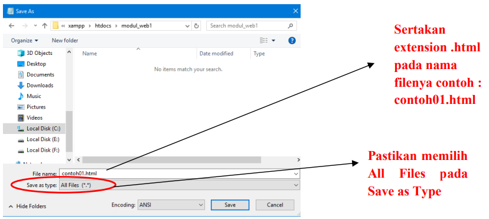
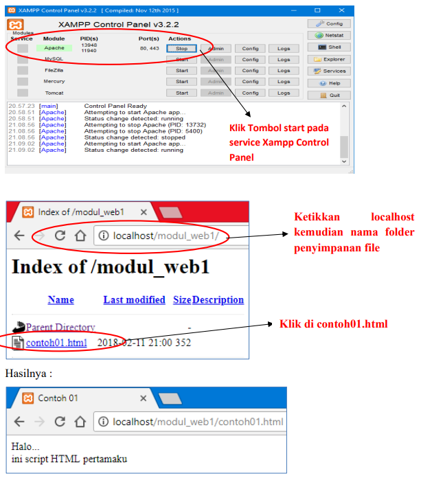
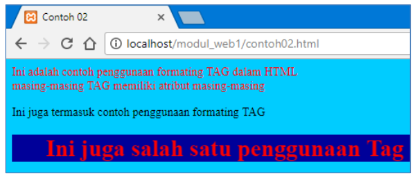
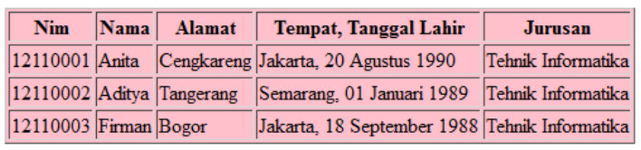
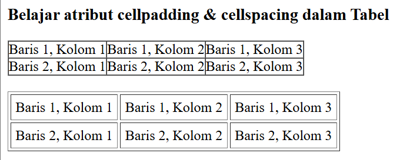
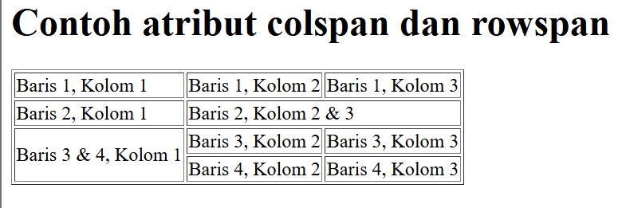

Able to recognize HTML scripts, use various tags and declare tables and their attributes, able to write scripts in HTML

## Understanding HTML (Hypertext Markup Language)

**Hypertext Markup Language (HTML)** is a language for displaying content on the web. HTML itself is a free programming language, meaning it is not owned by anyone, its development is carried out by many people in many countries and can be said to be a language that is developed jointly globally.

An HTML document itself is a text document that can be edited by any text editor. An HTML document has several elements surrounded by text tags that start with the `<` symbol and end with a `>` symbol.

The text editor used by the author is Notepad and XAMPP Version 1.8.1 for its web server with the PHP Version 5 programming language.

## Basic Structure of HTML

HTML elements start with a start tag, followed by the element content and an end tag. End tags include the `/` symbol followed by the element type, for example `</HEAD>`. An HTML element can be nested inside other elements. A standard HTML document looks like this:

```html
<!DOCTYPE html>
<html lang="en">
  <head>
    <meta charset="UTF-8" />
    <meta name="viewport" content="width=device-width, initial-scale=1.0" />
    <title>Web Page Title</title>
  </head>
  <body></body>
</html>
```

Description :

1. HTML tags by default start with `<HTML>` and end with `</HTML>`.
2. The `<HEAD>`… `</HEAD>` tag is the head tag before the body. This head tag will first be executed before the body tag. Inside this tag contains the `<META>` and `<TITLE>` tags. The `<META>` tag is information or a header of an HTML document. The attributes owned by this tag include:

   a. HTTP_EQUIV, this attribute serves to display HTML documents automatically within a certain period of time.

   b. CONTENT, this attribute contains information about the contents of the HTML document to be called.

   c. NAME, this attribute is an identification of the meta itself. The `<META>` tag in an HTML document may or may not exist.

3. The `<TITLE>` … `</TITLE>` tag is the title tag. Preferably every web page has a title, and the title is written in `<TITLE>` … `</TITLE>`. This title will appear in the titlebar of the browser.
4. The `<BODY>` … `</BODY>` tag is a tag containing the content of a web page. **Example of HTML script usage** Create a new sheet in Notepad, then type the command below. Save it with the name **Contoh01.php**

```html
<!DOCTYPE html>
<html lang="en">
  <head>
    <meta charset="UTF-8" />
    <meta name="viewport" content="width=device-width, initial-scale=1.0" />
    <!-- Web Title -->
    <title>Example 01</title>
  </head>
  <body>
    <!-- Commands created between -->
    <!-- <body> and </body> -->
    Hello <br />
    this is my first HTML script
  </body>
</html>
```

Then save the file above in the folder c:\XAMPP\htdocs\ create a new folder to save the file inside the htdocs folder. Save the file with the name contoh01.html. Naming the file when saving must end with the extension ".html"

**How to save with Notepad, pay attention to the following method:**



To see the results of the file above, you can use the Mozilla browser, Google Chrome, Internet Explorer or other types of browsers. Type in the address bar "Localhost\Storage Folder Name\", then select the file contoh01.html

Before typing the file address, make sure you have run the Apache Module on the Xampp Control Panel.

See the picture below:



Codes in HTML are usually called **TAGS**. Tags are things used to mark elements in an HTML document. Tags in HTML consist of a less than sign ( < ), a greater than sign ( > ), and a slash ( / ). Usually, Tags are written in pairs, for example `<h1>` and `</h1>`. Tags that do not use a slash ( / ) are the opening or starting tags of the element. While Tags containing a slash ( / ) are the closing elements or the end of the elements. However, there are also Tags that are not paired in their usage, including:

1. Tag to change paragraph, namely `<p>`
2. Tag to change lines or line break, namely `<br>`
3. Tag for horizontal line, namely `<hr>`
4. Tag list item, namely `<li>`

For the unpaired tags above, they should still be written using their pair. This is done to anticipate future HTML standard recommendations. Writing for all Tags is free, meaning we can use uppercase, lowercase, even mixed (not case sensitive). But to anticipate the standard writing of Tags, we should use all lowercase letters.

Types of tags in HTML :

### Formatting Tags

| Start Tag | Use                                      |
| :-------- | :--------------------------------------- |
| `<b>`     | Definition of bolded text                |
| `<big>`   | Definition of large sized text           |
| `<em>`    | Definition of emphasized text            |
| `<i>`     | Definition of italicized text ( italic ) |
| `<small>` | Definition of small sized text           |
| `<u>`     | Definition of underlined text            |
| `<sub>`   | Definition of subscripted text           |
| `<sup>`   | Definition of superscripted text         |
| `<ins>`   | Definition of inserted text              |
| `<del>`   | Definition of deleted text               |

### Computer Output Tags

| Start Tag | Use                                |
| :-------- | :--------------------------------- |
| `<code>`  | Definition of computer code text   |
| `<kbd>`   | Definition of keyboard text        |
| `<samp>`  | Definition of sample computer code |
| `<tt>`    | Definition of teletype text        |
| `<var>`   | Definition of a variable           |
| `<pre>`   | Definition of preformatted text    |

### Citation, Quotation, Definition Tags

| Start Tag      | Use                             |
| :------------- | :------------------------------ |
| `<abbr>`       | Definition of an abbreviation   |
| `<acronym>`    | Definition of an acronym        |
| `<address>`    | Definition of address writing   |
| `<bdo>`        | Definition of writing direction |
| `<blockquote>` | Definition of long quotation    |
| `<q>`          | Definition of short quotation   |
| `<cite>`       | Definition of a citation        |
| `<dfn>`        | Definition of a term            |

### Link Tags

| Start Tag | Use            |
| :-------- | :------------- |
| `<a>`     | Defines a link |

### Image Tags

| Start Tag | Use                                   |
| :-------- | :------------------------------------ |
| ``   | Definition of an image in a document  |
| `<map>`   | Definition of an image map            |
| `<area>`  | Definition of an area in an image map |

### List Tags

| Start Tag | Use                                 |
| :-------- | :---------------------------------- |
| `<ol>`    | Defines an ordered list             |
| `<ul>`    | Defines an unordered list           |
| `<li>`    | Defines an item in a list           |
| `<dl>`    | Defines a definition list           |
| `<dt>`    | Defines a term in a definition list |

**Example script of using HTML Tags**

Create a new sheet in Notepad, then type the command below. Save it with the name **Contoh02.html**

```html
<!DOCTYPE html>
<html lang="en">
  <head>
    <meta charset="UTF-8" />
    <meta name="viewport" content="width=device-width, initial-scale=1.0" />
    <title>Contoh 02</title>
  </head>
  <body bgcolor="#00CCFF" text="#FF0000">
    <p>
      ini adaalah contoh pengunaan formating TAG dalam HTML <br />
      masing-masing TAG memiliki atribut masing-masing<br />
    </p>
    <font color="#000000"
      >Ini juga termasuk contoh penggunaan formating TAG<br
    /></font>
    <h1>
      <marquee width="50%" bgcolor="#000099">
        Ini uga salah satu penggunaan Tag
      </marquee>
    </h1>
  </body>
</html>
```

Result Display



## Creating Tables Using HTML

Tables play an important role in Web pages, besides displaying text or images in rows and columns format, you can also use tables to help layout the page view

A table is a box consisting of rows and columns. To create a table, you use the `<table>` tag and close it with the `</table>` tag. You can also add other attributes in the opening `<table>` tag. For example, specifying color, border, and so on.

Inside the `<table>` tag, there are several other tags that need to be understood, namely:

1. `<tr>` tag

   Meaning tag to write a regular row in the table. TR stands for Table Row.

2. `<td>` tag

   Meaning tag to write a box inside a row, so the `<td>` tag is inside the `<tr>` tag. TD stands for Table Data.

3. `<th>` tag

   Meaning tag to write a regular box like `<td>`, but for the table header. TH stands for Table Header.

## Merging cells

Table cells normally have the same width and height. If we want to make a cell have a different width or height from other cells, then the only way we can do it is by merging several cells into one. This method is called merging cells.

To merge table cells, we need the rowspan or colspan attributes. The rowspan attribute is used to merge table cells in the same column. The colspan attribute is to merge table cells in the same row.

Here is an example of merging both types:

1. Vertically (Rowspan)<br>
   In the table with the HTML code below, the first column cells will be merged:

```html
<table>
  <tr>
    <td>...</td>
    <td>...</td>
  </tr>
  <tr>
    <td>...</td>
    <td>...</td>
  </tr>
  <tr>
    <td>...</td>
    <td>...</td>
  </tr>
</table>
```

<table>
    <tr>
        <td>...</td>
        <td>...</td>
    </tr>
    <tr>
        <td>...</td>
        <td>...</td>
    </tr>
    <tr>
        <td>...</td>
        <td>...</td>
    </tr>
</table>

After merging, the HTML code condition becomes as follows:

```html
<table>
  <tr>
    <td rowspan="3">...</td>
    <td>...</td>
  </tr>
  <tr>
    <td>...</td>
  </tr>
  <tr>
    <td>...</td>
  </tr>
</table>
```

<table>
  <tr>
    <td rowspan="3">...</td>
    <td>...</td>
  </tr>
  <tr>
    <td>...</td>
  </tr>
  <tr>
    <td>...</td>
  </tr>
</table>

2. Horizontally (Colspan)<br>
   In the table with the HTML code below, the first row cells will be merged:

```html
<table>
  <tr>
    <td>...</td>
    <td>...</td>
  </tr>
  <tr>
    <td>...</td>
    <td>...</td>
  </tr>
  <tr>
    <td>...</td>
    <td>...</td>
  </tr>
</table>
```

<table>
    <tr>
        <td>...</td>
        <td>...</td>
    </tr>
    <tr>
        <td>...</td>
        <td>...</td>
    </tr>
    <tr>
        <td>...</td>
        <td>...</td>
    </tr>
</table>

After merging, the HTML code condition becomes as follows:

```html
<table>
  <tr>
    <td colspan="2">...</td>
  </tr>
  <tr>
    <td>...</td>
    <td>...</td>
  </tr>
  <tr>
    <td>...</td>
    <td>...</td>
  </tr>
</table>
```

<table>
    <tr>
        <td colspan="2">...</td>
    </tr>
    <tr>
        <td>...</td>
        <td>...</td>
    </tr>
    <tr>
        <td>...</td>
        <td>...</td>
    </tr>
</table>

**Example of table creation script**<br>
Create a new sheet in Notepad, then type the command below. Save it with the name **Contoh03.html**

```html
<html>
  <head>
    <title>Contoh 03</title>
  </head>
  <body>
    <h1>Tabel Data Siswa</h1>
    <table border="1" bgcolor="black">
      <tr>
        <th>Nim</th>
        <th>Nama</th>
        <th>Alamat</th>
        <th>Tempat, Tanggal Lahir</th>
        <th>Jurusan</th>
      </tr>
      <tr>
        <td>12110001</td>
        <td>Anita</td>
        <td>Cengkareng</td>
        <td>Jakarta, 20 Agustus 1990</td>
        <td>Tehnik Informatika</td>
      </tr>
      <tr>
        <td>12110002</td>
        <td>Aditya</td>
        <td>Tangerang</td>
        <td>Semarang, 01 Januari 1989</td>
        <td>Tehnik Informatika</td>
      </tr>
      <tr>
        <td>12110003</td>
        <td>Firman</td>
        <td>Bogor</td>
        <td>Jakarta, 18 September 1988</td>
        <td>Tehnik Informatika</td>
      </tr>
    </table>
  </body>
</html>
```

If viewed in a browser, it looks like the following:



## Using Cellpadding and cellspacing

Create a new sheet in Notepad, then type the command below. Save it with the name **tabelcell.html**

```html
<!DOCTYPE html>
<html>
  <head>
    <title>Penggunaan atribut Cellpadding dan cellspacing dalam Tabel</title>
  </head>
  <body>
    <h3>Belajar atribut cellpadding & cellspacing dalam Tabel</h3>

    <table border="1" cellspacing="0" cellpadding="0">
      <tr>
        <td>Baris 1, Kolom 1</td>
        <td>Baris 1, Kolom 2</td>
        <td>Baris 1, Kolom 3</td>
      </tr>
      <tr>
        <td>Baris 2, Kolom 1</td>
        <td>Baris 2, Kolom 2</td>
        <td>Baris 2, Kolom 3</td>
      </tr>
    </table>

    <br />

    <table border="1" cellspacing="3" cellpadding="5">
      <tr>
        <td>Baris 1, Kolom 1</td>
        <td>Baris 1, Kolom 2</td>
        <td>Baris 1, Kolom 3</td>
      </tr>
      <tr>
        <td>Baris 2, Kolom 1</td>
        <td>Baris 2, Kolom 2</td>
        <td>Baris 2, Kolom 3</td>
      </tr>
    </table>
  </body>
</html>
```

Result Display:



## Using Rowspan and colspan

Create a new sheet in Notepad, then type the command below. Save it with the name **tabelspan.html**

```html
<html>
  <head>
    <title>Contoh Penggunaan Atribut Colspan dan Rowspan Tag Tabel</title>
  </head>
  <body>
    <h1>Contoh atribut colspan dan rowspan</h1>
    <table border="1">
      <tr>
        <td>Baris 1, Kolom 1</td>
        <td>Baris 1, Kolom 2</td>
        <td>Baris 1, Kolom 3</td>
      </tr>
      <tr>
        <td>Baris 2, Kolom 1</td>
        <td colspan="2">Baris 2, Kolom 2 & 3</td>
      </tr>
      <tr>
        <td rowspan="2">Baris 3 & 4, Kolom 1</td>
        <td>Baris 3, Kolom 2</td>
        <td>Baris 3, Kolom 3</td>
      </tr>
      <tr>
        <td>Baris 4, Kolom 2</td>
        <td>Baris 4, Kolom 3</td>
      </tr>
    </table>
  </body>
</html>
```

Result Display:


