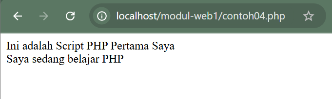
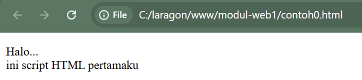
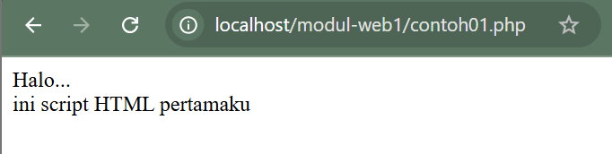
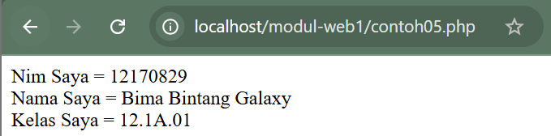
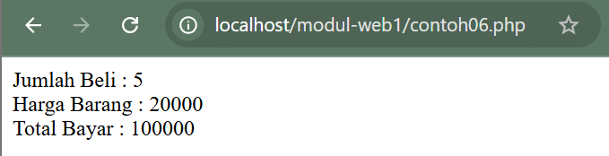
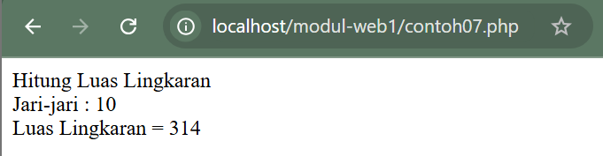

Mampu memahami arsitektur bahasa PHP, Pendeklarasian Variabel, Konstanta, Tipe Data dan komentar dalam PHP

## Pengertian PHP Hypertext Preprocessor (PHP)

PHP atau PHP Hypertext Prepocessor adalah sebuah bahasa script berbasis server (server-side) yang mampu mem-parsing kode php dari kode web dengan ekstensi .php, sehingga menghasilkan tampilan website yang dinamis di sisi client (browser). Dengan PHP, anda bisa menjadikan halaman HTML menjadi lebih powerful dan bisa dipakai sebagai aplikasi lengkap, misalnya untuk beragam aplikasi cloud computing.

PHP adalah bahasa script yang sangat cocok untuk pengembangan web dan dapat dimasukkan ke dalam HTML. PHP awalnya dikembangkan oleh seorang programmer bernama Rasmus Lerdrof pada tahun 1995, namun semenjak itu selalu dikembangkan oleh kelompokindependen yang disebut Group PHP dan Kelompok ini juga yang mendefinisikan standar de facto untuk PHP karena tidak ada spesifikasi formal. Saat ini pengembangannya dipimpin oleh duo maut, Andi Gutmans dan Zeev Suraski.

Yang menyebabkan PHP banyak dipakai oleh banyak orang adalah karena PHP adalah perangkat lunak bebas (Open Source) yang dirilis di bawah lisensi PHP. Artinya untuk menggunakan bahasa pemrograman ini gratis, bebas, dan tidak terbuka.

## Memasukkan Kode PHP

Tidak seperti halaman HTML biasa, kode PHP tidak akan diberikan oleh server secara langsung ketika ada permintaan dari client (browser), namun melalui pemrosesan dari sisi server, makanya PHP disebut skrip server-side.

Kode PHP dimasukkan ke dalam kode HTML dengan cara menyelipkannya di dalam kode HTML. Untuk membedakan kode PHP dengan kode HTML, di depan kode PHP tersebut diberi tag pembuka dan diakhir kode PHP diberi tag penutup.

Dengan adanya kode PHP, sebuah halaman web bisa melakukan banyak hal yang dinamis, seperti mengakses database, membuat gambar, membaca dan menulis file, dan sebagainya. Hasil akhir pengolahan kode PHP akan dikembalikan lagi dalam bentuk kode HTML untuk ditampilkan di browser. Ada 4 jenis tag yang bisa digunakan untuk memasukkan kode PHP.

**Jenis-jenis Tag PHP**

| Jenis Tag   | Tag Pembuka               | Tag Penutup |
| :---------- | :------------------------ | :---------- |
| Tag Standar | `<?php`                   | `?>`        |
| Tag Pendek  | `<?`                      | `?>`        |
| Tag ASP     | `<%`                      | `%>`        |
| Tag Script  | `<script language="php">` | `</script>` |

Yang dapat langsung diterapkan disemua platform adalah tag standard dan tag script. Di dalam modul ini bahasa pemrograman yang digunakan adalah PHP Versi 5 sehingga jenis tag yang harus digunakan adalah tag standar. Untuk tag lainnya perlu penyetingan di server oleh administrator server.

### Contoh Script PHP

Buka file baru di Notepad. Kemudian ketikkan script seperti di bawah ini :

```php
<?php
echo "Ini adalah Script PHP Pertama Saya <br>";
echo "Saya sedang belajar PHP";
?>
```

Simpan file dengan nama **contoh04.php**<br>
Untuk melihat hasilnya buka browser masuk ke dalam localhost dan folder penyimpanan. Pilih file contoh04.php maka akan tampil hasilnya :



Contoh04.php merupakan contoh script php yang berdiri sendiri tanpa ada tambahan script yang lain. Perintah echo merupakan perintah yang digunakan untuk mencetak. Script PHP bisa juga digabung dalam tag HTML.

## Perbedaan HTML dengan PHP

- HTML dapat diakses langsung tanpa melalui akses server saat ada permintaan dari client(browser)
- PHP harus di akses melalui server saat ada permintaan dari client(browser)





Dari 2 gambar di atas dapatkah anda melihat perbedaannya, tanpa melihat extension nama filenya?

Ya, untuk file dengan extension html, kita dapat melihat hasilnya langsung di browser, tanpa harus menjalankan akses server. Namun, untuk file dengan extension php, kita harus menjalankannya melalui akses server, yaitu localhost, dan penyimpanan filenya pun, disimpan pada htdocs yang ada di folder xampp

## Variabel

Variabel merupakan sebuah istilah yang menyatakan sebuah tempat yang menampung nilai-nilai tertentu di mana nilai di dalamnya bisa diubah-ubah. Variable penting karena tanpa adanya variable tidak bisa menyimpan nilai tertentu untuk diolah.

Variabel ditandai dengan adanya tanda dolar ($) yang kemudian bisa diikuti dengan angka, huruf, dan underscore. Namun variable tidak bisa mengandung spasi. Berikut ini contoh pendefinisian variable. Untuk mendefinisikan variable, hanya perlu menuliskannya maka otomatis variable dikenali oleh PHP.

`$nama`<br>
`$no_telp`<br>
`$_pekerjaan`

Variable merupakan tempat untuk menyimpan data dalam tipe tertentu, variable bisa berupa null (belum ada isinya), angka, string, objek, array, Boolean, dan isinya bisa diubah-ubah nantinya

**Contoh05.php**

```php
<html>

<head>
    <title> Contoh Script PHP</title>
</head>
<?php

$nim = "12170829";
$nama = "Bima Bintang Galaxy";
$kelas = "12.1A.01";

echo "Nim Saya = $nim<br>";
echo "Nama Saya = $nama<br>";
echo "Kelas Saya = $kelas<br>";

?>
</body>

</html>
```

Hasil:



## Tipe Data

Berbeda dengan bahasa pemrograman lain, variable di PHP lebih fleksibel. Kita tidak perlu mendefinisikan jenisnya ketika mendefinisikan pertama kali. Ada 6 Tipe data dasar yang dapat diakomodasi di PHP, seperti terlihat di tabel.

### Jenis-jenis Tipe Data

| Tipe    | Contoh | Penjelasan                       |
| :------ | :----- | :------------------------------- |
| Integer | 134    | Semua angka bukan pecahan        |
| Double  | 5.1234 | Nilai pecahan                    |
| String  | "asep" | Kumpulan karakter                |
| Boolean | False  | Salah satu nilai True atau False |
| Object  |        | Sebuah instance dari class       |
| Array   |        | Larik                            |

Untuk mengetahui tipe data sebuah variable, kita bisa menggunakan perintah gettype, misalnya :<br>
`print gettype ($nama_variabel);`

Anda juga bisa mengubah jenis variable tertentu dengan perintah :<br>
`(jenis_variabel) $nama_variabel;`

Misalnya untuk mengubah variable menjadi string, kita dapat menggunakan perintah:<br>
`$var_string = (string) $angka;`

**Contoh06.php**

```php
<html>
<head>
        <title>Contoh 06</title>
</head>
<body>
<?php
        $jumlah=5;
        $harga=20000;
        $total=$harga*$jumlah;

echo "Jumlah Beli : $jumlah<br>";
echo "Harga Barang : $harga<br>";
echo "Total Bayar : $total<br>";
?>
</body>
</html>
```

Hasil:



## Konstanta

Selain variable, sebuah program umumnya juga memungkinkan adanya konstanta. Konstanta fungsinya sama seperti variable namun nilainya statis/konstan dan tidak bisa berubah. Cara untuk mendefinisikan konstanta adalah :<br>
`Define (“NAMA_KONSTANTA”, nilai_konstanta);`

Setelah didefinisikan, kita dapat langsung menggunakannya dengan mengetikkan nama konstanta tersebut. Nama konstanta umumnya diketik menggunakan huruf besar

## Komentar

Program merupakan kegiatan menuliskan bahasa yang dipahami oleh mesin. Walaupun bahasa yang digunakan adalah bahasa tingkat tinggi, namun tent masih tidak semudah dipahami oleh bahasa biasa. Untuk itu kita bisa menggunakan komentar. Berikut ini contoh pembuatan komentar di php.

```php
//komentar satu baris
#ini juga komentar satu baris
/*komentar
Banyak baris
Kode di sini tidak
Dieksekus oleh parser */
```

**Contoh script konstanta & komentar.**<br>
**Contoh07.php**

```php
<html>
<head>
    <title> Menghitung Luas Lingkaran</title>
</head>
<body>
<?php
//konstanta untuk nilai judul
define("Judul","Hitung Luas Lingkaran");

//konstanta untuk nilai phi
define("PHI",3.14);

echo Judul;
$r = 10;
echo "<br> Jari-jari : $r <br>";
$luas = PHI*$r*$r;
echo "Luas Lingkaran = $luas";
?>
</body>
</html>
```

Hasil:


