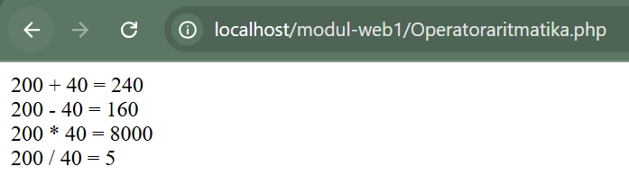
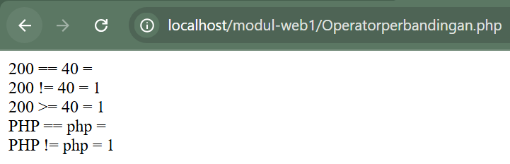
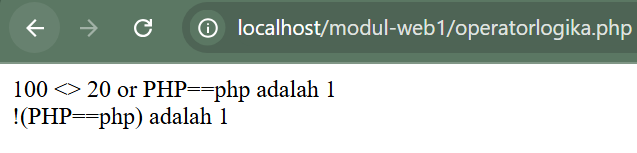
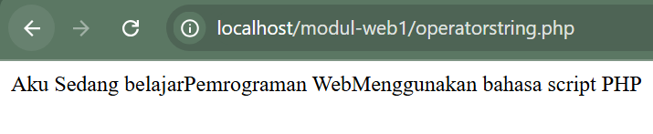

## Mengenal Operator

Sebuah bahasa pemrograman juga wajib untuk mampu mengolah nilai operand (variable atau konstanta yang dioperasikan) menggunakan operator, seperti menjumlah, membagi, dan sebagainya.

Operator merupakan symbol yang berfungsi untuk melakukan aksi / operasi tertentu terhadap nilai operand yang pada umumnya dari hasil operasi tersebut menghasilkan nilai baru. Sementara operand adalah nilai yang dilibatkan dalam operasi oleh operator.

## Jenis-Jenis Operator

1. Operator Aritmatika
   Operator ini digunakan untuk melakukan perhitungan matematika, sebagian

berikut :

| Operator | Nama           | Contoh   | Hasil |
| :------: | :------------- | :------- | :---: |
|    +     | Penambahan     | 1+4      |   5   |
|    -     | Pengurangan    | 1-4      |  -3   |
|    /     | Pembagian      | 1/4      | 0.25  |
|    \*    | Perkalian      | 1\*4     |   4   |
|    %     | Sisa Pembagian | 5%2      |   1   |
|    ++    | Inkremen       | X=5; X++ |  X=6  |
|    -     | Dekremen       | X=5; X-  |  X=4  |

Contoh script :

**Operatoraritmatika.php**

```php
<?php
$bil1=200;
$bil2=40;
$hasil = $bil1+$bil2;
echo "$bil1 + $bil2 = $hasil<br>";
$hasil = $bil1-$bil2;
echo "$bil1 - $bil2 = $hasil<br>";
$hasil = $bil1*$bil2;
echo "$bil1 * $bil2 = $hasil<br>";
$hasil = $bil1/$bil2;
echo "$bil1 / $bil2 = $hasil<br>";
?>
```

Hasil:



2. Operator Perbandingan
   Operator perbandingan digunakan untuk menghasilkan 2 nilai yang hasil akhirnya adalah nilai Boolean true dan false. Operator ini sangat berguna dalam pemrograman karena bisa menentukan arah pemrograman. Operator perbandingan di PHP adalah :

| Operator | Nama                         | Contoh | Hasil |
| :------: | :--------------------------- | :----: | :---: |
|    ==    | Sama dengan                  | 6 == 6 | False |
|    !=    | Tidak sama dengan            |  3!=3  | False |
|    >     | Lebih besar                  |  1>5   | False |
|    >=    | Lebih besar atau sama dengan |  3>=4  | False |
|    <     | Lebih kecil                  |  2<4   | True  |
|    <=    | Lebih kecil atau sams dengan |  5<=4  | False |

**Opertorperbandingan.php**

```php
<?php
$bil1 = 200;
$bil2 = 40;
$teks1 = "PHP";
$teks2 = "php";

$hasil = $bil1 == $bil2;
echo "$bil1 == $bil2 = $hasil<br>";

$hasil = $bil1 != $bil2;
echo "$bil1 != $bil2 = $hasil<br>";

$hasil = $bil1 >= $bil2;
echo "$bil1 >= $bil2 = $hasil<br>";

$hasil = $teks1 == $teks2;
echo "$teks1 == $teks2 = $hasil<br>";

$hasil = $teks1 != $teks2;
echo "$teks1 != $teks2 = $hasil<br>";
?>
```

Hasil:


3. Operator Logika
   Operator untuk menyusun kalimat ekspresi/ungkapan logika. Hasil operasi ini akan didapatkan nilai satu jika benar dan nol jika salah.

|   Operator   | Fungsi                       |
| :----------: | :--------------------------- |
| AND atau &&  | Operasi logika AND           |
| OR atau \|\| | Operasi logika OR            |
|     XOR      | Operasi logika eksklusife OR |
|      !       | Ingkaran/negasi              |

**Operatorlogika.php**

```php
<?php
$bil1 = 100;
$bil2 = 20;
$teks1 = "PHP";
$teks2 = "php";

$hasil = ($bil1 <> $bil2) or ($teks1 == $teks2);
echo "$bil1 <> $bil2 or $teks1==$teks2 adalah $hasil<br>";

$hasil = !($teks1 == $teks2);
echo "!($teks1==$teks2) adalah $hasil";
?>
```

Hasil:



4. Operator String
   Dalam PHP juga tersedia operator string, yaitu digunakan untuk operasi penggabungan teks. Adapun symbol yang digunakan yaitu berupa karakter titik (.).

**Operatorstring.php**

```php
<?php

$teks1 = "Aku Sedang belajar";
$teks2 = "Pemrograman Web";
$teks3 = "Menggunakan bahasa script PHP";
$hasil = $teks1 . $teks2 . $teks3;

echo "$hasil ";
?>
```

Hasil:


