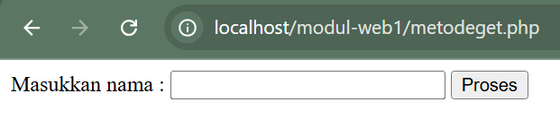
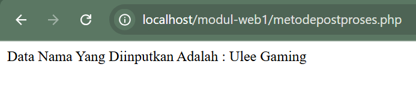

## Form Components

A dynamic website often requires interaction between the client browser and the server, which can be in the form of text input, numbers, or file uploads to be processed by the server. To accommodate data sent by a client browser, an HTML FORM is needed. Forms are used for membership registration, entering credit card codes, user login, shopping transactions, and file uploads.

In an HTML FORM there are several components that can be used, including:

### a. Form

`<FORM ACTION=action METHOD=method ENCTYPE=media type> </FORM>`

### b. Text Box

<INPUT TYPE=TEXT NAME=”nama_variabel” VALUE="textbox">

Text box: for inputting string data or numbers.

`<INPUT TYPE=TEXT NAME=”nama_variabel” VALUE=”value”>`

### c. Text Area

<textarea rows=” ” cols=” ” name=”nama_variabel”> </textarea>

Text area: for inputting strings or numbers consisting of multiple lines.

`<textarea rows=” ” cols=” ” name=”nama_variabel”> </textarea>`

### d. Radio Button

<input type="radio" id="laki-laki" name="nama_variabel" value="Laki-laki">
<label for="laki-laki">Laki-laki</label><br>
<input type="radio" id="perempuan" name="nama_variabel" value="Perempuan">
<label for="perempuan">Perempuan</label><br>

Radio button: to choose one statement from several statements provided.

`<input type=”radio” name=”nama_variabel” value=” ”>Isi_Radio_Button`

### e. Combo Box

Combo box to display a list of data.

```html
<select name="”nama_variabel”" value="”" “>
  <option>Combo1</option>
  <option>Combo2</option>
</select>
```

### f. Check Box

Check box to choose one or more statements from several statements provided.

`<input type=”checkbox” name=”nama_variabel” value=”ON” checked>`

### g. Submit

Submit to send all variable data in the existing form components.

`<input type=”submit” name=”submit” value=”submit”>`

### h. Reset

Reset to cancel all inputs that have been written.

`<input type=”reset” name=”reset” value=”reset”>`

## Processing Data From Forms

Forms in HTML are known by the tag `<FORM>` and closed with the tag `</FORM>`. Inside the opening tag `<FORM>` it is followed by action and method attributes. Action describes the page used to process input, while method is used to manage how content is parsed.

The web receives input from a user or visitor using GET and POST methods. GET will send data together with the URL, while POST will send it separately. The user sends input data by filling in text or choices on the HTML form attributes.

Form Processing using GET Method.
File **metodeget.php**

```php
<html>
<head>
        <title>FORM METODE GET</title>
</head>
<body>
<form action="metodegetproses.php" method="get">
Masukkan nama : <input type="text" name="nama" size="25">
<input type="submit" value="Proses">
</form>
</body>
</html>
```

Result:


Create a file to process the variable given by the metodeget.php file, name the file: **metodegetproses.php**

```php
<html>
<head>
        <title>Method Get Proses</title>
</head>
<body>
Data Nama Yang Diinputkan Adalah : <?php echo $_GET["nama"]; ?>
</body>
</html>
```

Result:


**Form Processing using method : POST**

To create an input, and name the file: **metodepost.php**

```php
<html>
<head>
        <title>FORM METODE POST</title>
</head>
<body>
<form action="metodepostproses.php" method="post">
Masukkan nama : <input type="text" name="nama" size="25">
<input type="submit" value="Proses">
</form>
</body>
</html>
```

Result:


Create a file to process the variable given by the metodepost.php file, name the file: **metodepostproses.php**

```php
<html>
<head>
        <title>Method Post Proses</title>
</head>
<body>
Data Nama Yang Diinputkan Adalah : <?php echo $_POST["nama"]; ?>
</body>
</html>
```

Result:

