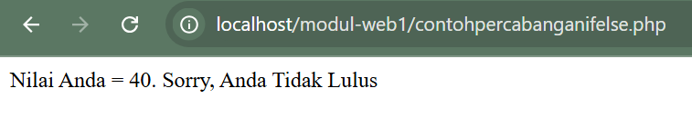
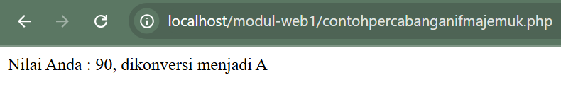
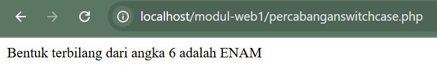

Membahas konsep percabangan dalam bahasa pemrograman web

## Pernyataan Seleksi

Sebagian besar bahasa pemrograman mengandung pernyataan seleksi. Pada dasarnya pernyataan seleksi adalah suatu mekanisme yang menjelaskan apakah pernyataan akan dikerjakan atau tidak, hal ini tergantung kondisi yang dirumuskan. Dalam bahasa pemrograman PHP pernyataan seleksi diterapkan dengan menggunakan statement IF dan Switch Case.

### 1. Statement IF

#### a. If Tunggal

Statement IF merupakan statement yang penting dan pasti terdapat di semua bahasa pemrograman. Statement ini berguna untuk membuat percabangan berdasarkan kondisi tertentu yang harus dipenuhi.

Bentuk umum Statement IF adalah sebagai berikut :

```php
if (kondisi) {
   statement;
}
else {
   statement;
}
```

Prinsip kerjanya adalah perintah di atas akan dikerjakan apabila kondisi bernilai TRUE atau benar, sedangkan jika kondisi salah / FALSE maka statement di atas tidak akan dikerjakan

#### b. Pernyataan IF dan Else

Pernyataan ELSE merupakan bagian dari pernyataan if. Else digunakan untuk memberikan alternative perintah apabila kondisi bernilai salah / FALSE.

Bentuk umum :

````php
if (kondisi) {
   statement_1;
}
else {
   statement_2;
}

**Contoh: contohpercabanganifelse.php**

```php
<html>

<head>
    <title> Contoh IF ELSE</title>
</head>
<?php

$nilai = 40;
if ($nilai >= 60) {
    echo "Nilai Anda = $nilai. Selamat, Anda Lulus";
} else {
    echo "Nilai Anda = $nilai. Sorry, Anda Tidak Lulus";
}

?>
</body>

</html>
````

Hasil:



#### c. Pernyataan IF Majemuk

Jika pernyataan else memberikan alternative pilihan kedua, maka untuk pernyataan ElseIf dapat digunakan untuk meumuskan banyak alternative pilihan (lebih dari dua pilihan).

Bentuk umum :

```php
if ( kondisi_1 )
{
Statement_1;
}
elseif ( kondis_2)
{
Statement_2;
}
elseif ( kondisi_3)
{
Statement_3;
}
else
{
Statement_n;
}
```

**Contoh : contohpercabanganifmajemuk.php**

```php
<html>
<head>
        <title> Contoh IF Majemuk</title>
</head>
<?php
    $nilai = 90;
    if (($nilai >= 0)&&($nilai < 50))
    { $grade ="E";}
    elseif(($nilai >= 50)&&($nilai < 60))
    { $grade ="D";}
    elseif(($nilai >= 60)&&($nilai < 75))
    { $grade ="C";}
    elseif(($nilai >= 75)&&($nilai < 85))
    { $grade ="B";}
    elseif(($nilai >= 85)&&($nilai < 100))
    { $grade ="A";}
    else
    { $grade = "Nilai anda di luar jangkauan"; }
    echo "Nilai Anda : $nilai, dikonversi menjadi $grade";
?>
</body>
</html>
```

Hasil:



## Statement Switch

Statement untuk pengatur alur program berikutnya adalah switch. Salah satu keuntungan switch adalah ada bisa langsung mengevaluasi satu statement dan memerintahkan aksi dalam jumlah yang lebih banyak.

Bentuk umum :

```php
Switch ( nilai_ekspresi ){
Case nilai_1 : statement_1; break;
Case nilai_2 : statement_2; brea;
Default: statement_n;}
```

**Contoh:**

```php
<?php
$angka = 6;
switch ($angka){
case 0: $terbilang = "NOL"; break;
case 1: $terbilang = "SATU"; break;
case 2: $terbilang = "DUA"; break;
case 3: $terbilang = "TIGA"; break;
case 4: $terbilang = "EMPAT"; break;
case 5: $terbilang = "LIMA"; break;
case 6: $terbilang = "ENAM"; break;
case 7: $terbilang = "TUJUH"; break;
case 8: $terbilang = "DELAPAN"; break;
case 9: $terbilang = "SEMBILAN"; break;
default: $terbilang = "Nilai diluar jangkuan!!";
}
echo "Bentuk terbilang dari angka  $angka adalah  $terbilang";
?>
```

Hasil:


