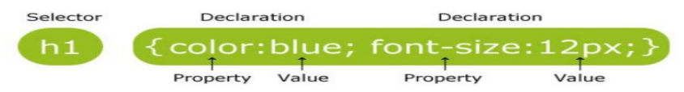
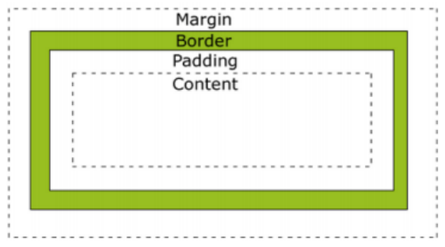

CSS is a language used to format the presentation of a document written in a markup language. When discussed in the context of the web, it can be interpreted as a language used to format the layout/design of an HTML page.

## Understanding CSS

CSS = Cascading Style Sheets. CSS is a language used to format the presentation of a document written in a markup language. If we speak in the context of the web, it can be loosely translated as: CSS is a language used to format the layout/design of an HTML page.

## Some things that can be done with CSS.

- Designing text layout can be done by defining fonts, colors, margins, background, font sizes, and others. Elements such as colors, fonts, sizes, and spacing are also called "styles".
- Cascading Style Sheets can also mean placing different styles on different layers.

### There are 3 ways to apply CSS to an HTML document, namely:

- External Style Sheet<br>
  CSS rules are saved in a file so they are separate from the HTML document. Then add the code to call the CSS file in the HTML document. The CSS file extension is .css

The CSS file (for example style.css) contains:

```css
p {
  text-align: justify;
}
```

The HTML document contains:

```html
<head>
  <title>External CSS</title>
  <link rel="stylesheet" type="text/css" href="style.css" />
</head>
<body>
  <p>This paragraph is styled externally with CSS</p>
</body>
```

- Internal Style Sheet<br>
  CSS rules are written in the HEAD section of the HTML document using the `<style>` tag

```html
<head>
  <title>Internal CSS</title>
  <style type="text/css">
    P {
      text-align: justify;
    }
  </style>
</head>
<body>
  <p>This paragraph is styled internally with CSS</p>
</body>
```

- Inline Style Sheet<br>
  CSS rules are written directly on the HTML tag whose appearance is to be styled using the style attribute:

```html
<p style="text-align:justify;">This paragraph is styled inline with CSS</p>
```

## Units in CSS

1. Static

- in -- inches
- cm -- centimeters
- mm -- millimeters
- pt -- points (1 point = 1/72 inch)
- pc -- picas (1 pica = 12 points)
- px -- pixels (the smallest picture dot on a monitor screen)

2. Relative

- % -- percentage
- em -- or ems (1em = the font size currently in the element)
- ex -- 1ex = x-height of a font (x-height is usually half the font size)

## Writing CSS

### The CSS writing syntax is as follows:



**Explanation:**

CSS rules consist of 2 parts:

- Selector

  Usually in the form of an HTML tag, id, or class. ID uses a # sign in front of the selector name, class uses a dot in front of the selector name.

example :
h1 { color : blue ; } ➔ HTML tag h1<br>
#text { color :green; } ➔ id<br>
.color { color : red; } ➔ class

- Declaration

  Contains css rules consisting of properties and their values separated by a colon. Every css rule must end with a semicolon.

### ID and Class Selectors in CSS

For the id selector in css, it is marked with a # (hash) sign, an example of writing is as follows:

```css
#text {
  color: blue;
  font-family: Calibri;
}
```

Its usage in HTML script:

```html
<body>
  <p id="text">TEST</p>
</body>
```

Things to note when using the id selector:

- An HTML element can only have 1 id
- Each page can only have 1 element with that id
- Can be used as a page marker for links
- Also used for javascript
- Should not be used for css (it's better to use class)

For the class selector in css, it is marked with a . (dot) sign, an example of writing is as follows:

```css
.color {
  background-color: lightgreen;
}
```

Its usage in HTML script:

```html
<body class="color"></body>
```

### CSS Properties

There are very many CSS properties, here are a few of them:

| Property             | Function              | Value                                                                                  | Example                             |
| :------------------- | :-------------------- | :------------------------------------------------------------------------------------- | :---------------------------------- |
| **color**            | Sets text color       | Color name, hex color code (#ffffff:white, #000000:black, #ff0000:red), rgb(0,250,100) | `color:#ff5590;`                    |
| **Background-color** | Sets background color | Color name, hex color code, rgb(200,200,200)                                           | `background-color:rgb(200,0,55);`   |
| **Background-image** | Sets background image | Image file name                                                                        | `background-image:url(banner.jpg);` |
| **Text-align**       | Sets text alignment   | Left, right, center, justify                                                           | `text-align:justify;`               |
| **Text-decoration**  | Sets text decoration  | Underline, none                                                                        | `text-decoration:underline;`        |
| **Line-height**      | Sets line height      | Pixels, percentage, em                                                                 | `line-height:120%;`                 |
| **Font-family**      | Sets font family      | "times new roman", arial, georgia                                                      | `font-family:arial;`                |
| **Font-size**        | Sets character size   | Pixels, percentage, em, pt                                                             | `font-size:12pt;`                   |
| **Margin**           |                       |                                                                                        |                                     |
| **Padding**          |                       |                                                                                        |                                     |
| **Border-width**     | Sets border width     | Pixels, percentage, thin, thick                                                        | `border-width:1px;`                 |
| **Border-style**     | Sets border style     | Solid, dotted, dashed, double, none                                                    | `border-style:solid;`               |
| **float**            | Sets object to float  | Left, right, none                                                                      | `float:left;`                       |
| **clear**            | Clears float          | Left, right, both, none                                                                | `clear:both;`                       |

### Pseudo-Class

It is a pseudo-class possessed by HTML elements, which allows us to define styles under certain conditions of the element. Pseudo-classes are divided into several types, as follows:

1. Related to links

- : link<br>
  The default style of a link (an 'a' tag that has an href)
- : hover<br>
  The style when the mouse cursor is over a link / element
- : active<br>
  The style when a link is clicked (active state)
- : visited<br>
  The style when a link has been visited before (using the same browser)

2. Related to element position (available in css 3)

- : first-child<br>
  Selects the first element of a parent (its wrapper element)
- : last-child<br>
  Selects the last element of a parent (its wrapper element)
- : nth-child(n)<br>
  Selects the nth element of a parent (its wrapper element) n can mean the sequence 1,2,3,….. or pattern (2n),(3n+2), or odd and even, even & odd
- : first-of-type<br>
  Selects the first element of a certain type / tag
- : last-of-type<br>
  Selects the last element of a certain type / tag

## Padding, Margin, and Border

In CSS, there is a term called the 'Box Model'. Look at the following image:



- Padding : Determines the distance of the body component to the border or the size of the inner spacing
- Border : Is the edge line of the component
- Margin : Is the size of the outer spacing or the size of the distance after the Border

CSS uses this concept in styling HTML tags. In the image, imagine the 'Content' area is, for example, a paragraph. This paragraph object will be considered by CSS to have padding, border, and margin areas around it.

The presence of these areas is useful for layout management. For example, if we want to arrange 2 images next to each other so they are not too close, we can increase the width of the margin area so that the distance between the images is wider.

### Padding

Written with CSS padding:5px 5px 5px 5px; the sequence of number values is top, right, bottom and left, or you can use

- padding-left:5px; ➔ this is to style the left padding
- padding-right:5px; ➔ this is to style the right padding
- padding-top:5px; ➔ for the top part and
- padding-bottom:5px; ➔ for the bottom part. Remember you can change the px (pixels) unit to other appropriate units.

### Border

Written with CSS border:1px dotted #000000; ➔ the order of use is border width, border style and border color, or you can use

- border-width:1px; ➔ this is the border thickness
- border-style:dotted; ➔ this is the border style, you can change it to dashed, solid, double, groove, ridge, inset, outset and others
- border-color:#FFFFFF; ➔ this is the color of the border.. you can change the color code (www.colorschemer.com/online)

### Margin

Written with CSS margin:5px 5px 5px 5px; ➔ the sequence is top, right, bottom and left, or you can use it like padding above

- margin-left:5px;
- margin-right:5px;
- margin-top:5px;
- margin-bottom:5px;
